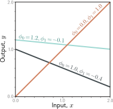
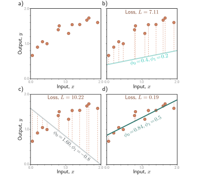
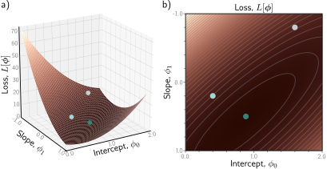
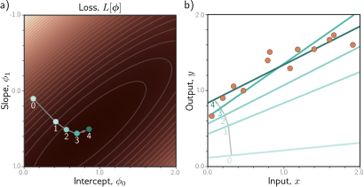

# 第二章
# 监督学习

**监督学习模型** (supervised learning model) 定义了从一个或多个输入到一个或多个输出的映射。例如，输入可以是一辆二手丰田普锐斯的车龄和里程，而输出则是这辆车的估值（以美元计）。

模型本质上是一个数学函数（即一个方程）；当输入通过这个函数时，它会计算出输出，这个过程称为**推理** (inference)。模型的方程中也包含**参数** (parameters)。不同的参数值会改变计算的结果；模型的方程描述了一个输入与输出之间可能关系的全集（或称为“族”），而参数则指定了这个关系族中的某个具体关系。

当我们**训练** (train) 或**学习** (learn) 一个模型时，我们实际上是在寻找能够描述输入与输出之间真实关系的参数。学习算法会接收一个由输入/输出对组成的**训练集** (training set)，然后不断调整参数，直到模型能够尽可能准确地为训练集中的输入预测出其对应的输出。如果模型在这些训练样本上表现良好，我们则希望它对于那些真实输出未知的**新输入**，也能做出准确的预测。

本章的目标是更深入地探讨这些概念。首先，我们将更正式地描述这个框架并引入一些记号。然后，我们将通过一个简单的例子，用一条直线来描述输入与输出之间的关系。这个**线性模型** (linear model) 不仅我们都很熟悉，而且易于可视化，但它却能很好地阐释监督学习的所有核心思想。

## 2.1 监督学习概述

在监督学习中，我们的目标是构建一个模型，该模型接收一个输入 $\mathbf{x}$ 并输出一个预测值 $\mathbf{y}$。为简化起见，我们假设输入 $\mathbf{x}$ 和输出 $\mathbf{y}$ 都是预定固定大小的向量，并且每个向量中元素的顺序是固定的。在前面提到的普锐斯的例子中，输入 $\mathbf{x}$ 会始终按照“车龄”和“里程”的顺序包含这两个值。这种数据被称为**结构化数据** (structured data) 或**表格数据** (tabular data)。

为了进行预测，我们需要一个模型 $f[\cdot]$，它接收输入 $\mathbf{x}$ 并返回 $\mathbf{y}$，即：

$$
\mathbf{y} = f[\mathbf{x}].
\tag{2.1}
$$

当我们根据输入 $\mathbf{x}$ 计算预测值 $\mathbf{y}$ 时，我们称之为**推理** (inference)。

模型本身只是一个形式固定的数学方程，它代表了输入和输出之间一系列可能的关系。模型中还包含参数 $\boldsymbol{\phi}$。参数的选择决定了输入和输出之间的具体关系，所以我们应该更严谨地写成：

$$
\mathbf{y} = f[\mathbf{x}, \boldsymbol{\phi}].
\tag{2.2}
$$

当我们谈论**学习** (learning) 或**训练** (training) 模型时，我们的意思是试图找到使模型能够根据输入做出合理输出预测的参数 $\boldsymbol{\phi}$。我们使用一个包含 $I$ 个输入和输出样本对的**训练数据集** (training dataset) $\{\mathbf{x}_i, y_i\}$ 来学习这些参数。我们的目标是选择一组参数，使得每个训练输入所映射到的输出能与其对应的真实输出尽可能地接近。我们用**损失** (loss) $L$ 来量化这种映射的失配程度。损失是一个标量值，它概括了在参数为 $\boldsymbol{\phi}$ 的情况下，模型对训练输出的预测有多差。

我们可以将损失视为这些参数的函数 $L[\boldsymbol{\phi}]$。当我们训练模型时，我们寻求的是能够最小化这个损失函数的参数 $\hat{\boldsymbol{\phi}}$：参考：附录 A Argmin 函数

$$
\hat{\boldsymbol{\phi}} = \underset{\boldsymbol{\phi}}{\mathrm{argmin}} \ [L[\boldsymbol{\phi}]].
\tag{2.3}
$$

如果在最小化之后损失值很小，那么我们就找到了能够从训练输入 $\mathbf{x}_i$ 准确预测训练输出 $y_i$ 的模型参数。

模型训练完成后，我们必须评估其性能；我们在一个独立的**测试数据** (test data) 上运行模型，看它对于在训练期间未曾见过的样本的**泛化** (generalizes) 能力如何。如果性能足够好，我们就可以部署这个模型了。

> ¹更确切地说，损失函数也依赖于训练数据 $\{\mathbf{x}_i, y_i\}$，所以我们应该写成 $L[\{\mathbf{x}_i, y_i\}, \boldsymbol{\phi}]$，但这会显得有些繁琐。

## 2.2 线性回归示例

现在，让我们通过一个简单的例子来具体化这些概念。我们考虑一个模型 $y = f[x, \boldsymbol{\phi}]$，它根据单个输入 $x$ 预测单个输出 $y$。然后，我们会构建一个损失函数，并最终讨论模型的训练过程。

### 2.2.1 一维线性回归模型

一维线性回归模型用一条直线来描述输入 $x$ 和输出 $y$ 之间的关系：

$$
\begin{aligned}
y &= f[x, \boldsymbol{\phi}] \\
  &= \phi_0 + \phi_1 x.
\end{aligned}
\tag{2.4}
$$

这个模型有两个参数 $\boldsymbol{\phi} = [\phi_0, \phi_1]$，其中 $\phi_0$ 是直线的 y 轴截距，$\phi_1$ 是斜率。y 轴截距和斜率的不同选择会带来输入和输出之间不同的关系（图 2.1）。因此，方程 2.4 定义了一个可能输入输出关系的全集（即所有可能的直线），而参数的选择则确定了这个集合中的具体成员（即某条特定的直线）。

---

**图 2.1 线性回归模型**
对于给定的参数选择 $\boldsymbol{\phi} = [\phi_0, \phi_1]$，模型会根据输入（x 轴）对输出（y 轴）做出预测。y 轴截距 $\phi_0$ 和斜率 $\phi_1$ 的不同选择会改变这些预测（如青色、橙色和灰色线所示）。线性回归模型（方程 2.4）定义了一个输入/输出关系的全集（即所有可能的直线），而参数则确定了这个全集中的某个成员（即某条特定的直线）。(交互式图表)

---

### 2.2.2 损失函数

对于这个模型，训练数据集（图 2.2a）由 $I$ 个输入/输出对 $\{x_i, y_i\}$ 组成。图 2.2b-d 展示了由三组不同参数定义的三条直线。图 2.2d 中的绿线比另外两条线更准确地描述了数据，因为它离数据点更近。然而，我们需要一种有原则的方法来判断哪组参数更好。为此，我们为每组参数赋予一个数值，用以量化模型与数据之间的不匹配程度。我们称这个值为**损失** (loss)；损失越小，意味着拟合得越好。

这种不匹配程度可以通过模型预测值 $f[x_i, \boldsymbol{\phi}]$（即直线在 $x_i$ 处的高度）与真实输出值 $y_i$ 之间的偏差来捕捉。这些偏差在图 2.2b-d 中用橙色虚线表示。我们将所有 $I$ 个训练样本偏差的平方和定义为总不匹配程度，也称为**训练误差** (training error) 或**损失**：

$$
\begin{aligned}
L[\boldsymbol{\phi}] &= \sum_{i=1}^{I} (f[x_i, \boldsymbol{\phi}] - y_i)^2 \\
&= \sum_{i=1}^{I} (\phi_0 + \phi_1 x_i - y_i)^2.
\end{aligned}
\tag{2.5}
$$

由于最佳参数是为了最小化这个表达式，我们称之为**最小二乘损失** (least-squares loss)。平方操作意味着偏差的方向（即直线在数据点的上方还是下方）无关紧要。选择这种形式还有一些理论上的原因，我们将在第五章再作探讨。

损失 $L$ 是参数 $\boldsymbol{\phi}$ 的函数；当模型拟合较差时（图 2.2b,c），损失值会较大，而当模型拟合良好时（图 2.2d），损失值会较小。从这个角度来看，我们称 $L[\boldsymbol{\phi}]$ 为**损失函数** (loss function) 或**代价函数** (cost function)。我们的目标是找到能使这个量最小化的参数 $\hat{\boldsymbol{\phi}}$：

$$
\begin{aligned}
\hat{\boldsymbol{\phi}} &= \underset{\boldsymbol{\phi}}{\mathrm{argmin}} \ [L[\boldsymbol{\phi}]] \\
&= \underset{\boldsymbol{\phi}}{\mathrm{argmin}} \left[ \sum_{i=1}^{I} (f[x_i, \boldsymbol{\phi}] - y_i)^2 \right] \\
&= \underset{\boldsymbol{\phi}}{\mathrm{argmin}} \left[ \sum_{i=1}^{I} (\phi_0 + \phi_1 x_i - y_i)^2 \right].
\end{aligned}
\tag{2.6}
$$

由于模型只有两个参数（y 轴截距 $\phi_0$ 和斜率 $\phi_1$），我们可以计算出每种参数组合下的损失，并将损失函数可视化为一个曲面（图 2.3）。“最佳”参数就位于这个曲面的最低点。参考：Notebook 2.1 Supervised learning, Problems 2.1-2.2

---

**图 2.2 线性回归的训练数据、模型与损失**
a) 训练数据（橙色点）由 $I=12$ 个输入/输出对 $\{x_i, y_i\}$ 组成。b-d) 每个子图都展示了使用不同参数的线性回归模型。根据 y 轴截距和斜率参数 $\boldsymbol{\phi} = [\phi_0, \phi_1]$ 的选择，模型误差（橙色虚线）可大可小。损失 $L$ 是这些误差的平方和。在子图 (b) 和 (c) 中，定义直线的参数导致了较大的损失（$L=7.07$ 和 $L=10.28$），因为模型拟合效果很差。子图 (d) 中的损失 $L=0.20$ 较小，因为模型拟合得很好；事实上，这条线在所有可能的直线中损失最小，因此这些参数是最佳参数。(交互式图表)

**图 2.3 线性回归模型的损失函数（数据集见图 2.2a）**
a) 每组参数 $\boldsymbol{\phi} = [\phi_0, \phi_1]$ 都有一个与之关联的损失值。由此产生的损失函数 $L[\boldsymbol{\phi}]$ 可以可视化为一个曲面。三个圆圈代表了图 2.2b-d 中三条直线的参数。b) 损失也可以用热力图的形式来可视化，其中较亮的区域代表较大的损失；这里我们是从 (a) 图的正上方俯视曲面，灰色的椭圆代表等高线。拟合效果最好的直线（图 2.2d）所对应的参数具有最小的损失（绿色圆圈）。

---

### 2.2.3 训练

寻找最小化损失的参数的过程被称为**模型拟合** (model fitting)、**训练** (training) 或**学习** (learning)。基本方法是随机选择初始参数，然后通过沿着损失函数“下山”的方式来逐步改善它们，直到我们到达底部（图 2.4）。实现这一目标的一种方法是，在当前位置测量曲面的**梯度** (gradient)，然后朝着最陡峭的下坡方向迈出一步。然后我们重复这个过程，直到梯度变得平坦，无法再进一步改善为止。²

### 2.2.4 测试

模型训练好之后，我们想知道它在真实世界中的表现如何。我们可以通过在一个独立的**测试数据集** (test data) 上计算其损失来做到这一点。预测准确性在多大程度上可以泛化到测试数据，部分取决于训练数据的代表性和完整性。然而，这也取决于模型的**表达能力** (expressive) 有多强。像直线这样简单的模型可能无法捕捉输入和输出之间的真实关系，这种情况被称为**欠拟合** (underfitting)。相反，一个表达能力非常强的模型可能会描述出训练数据中那些非典型的统计特性，从而导致异常的预测，这种情况被称为**过拟合** (overfitting)。

> ² 这种迭代方法对于线性回归模型来说并非必需。在这里，我们可以找到参数的封闭解表达式。然而，这种**梯度下降** (gradient descent) 方法适用于更复杂的模型，这些模型没有封闭解，并且参数太多，无法对每一种组合都进行损失评估。

## 2.3 总结

监督学习模型是一个函数 $\mathbf{y} = f[\mathbf{x}, \boldsymbol{\phi}]$，它将输入 $\mathbf{x}$ 与输出 $\mathbf{y}$ 联系起来。它们之间的具体关系由参数 $\boldsymbol{\phi}$ 决定。为了训练模型，我们基于一个训练数据集 $\{\mathbf{x}_i, y_i\}$ 定义一个损失函数 $L[\boldsymbol{\phi}]$。这个函数量化了作为参数 $\boldsymbol{\phi}$ 的函数，模型预测值 $f[\mathbf{x}_i, \boldsymbol{\phi}]$ 与观测输出值 $y_i$ 之间的不匹配程度。然后我们搜索能够最小化损失的参数。最后，我们在一个不同的测试数据集上评估模型，看它对新输入的泛化能力如何。

第 3 至 9 章将对这些思想进行扩展。首先，我们来探讨模型本身；一维线性回归有一个明显的缺点，即它只能描述输入和输出之间的直线关系。**浅层神经网络**（第 3 章）只比线性回归稍微复杂一些，但能描述更大范围的输入/输出关系。**深度神经网络**（第 4 章）具有同等的表达能力，但能用更少的参数描述复杂的函数，并在实践中表现更好。

第 5 章研究了用于不同任务的损失函数，并揭示了最小二乘损失的理论基础。第 6 章和第 7 章讨论了训练过程。第 8 章讨论了如何衡量模型的性能。第 9 章考虑了**正则化** (regularization) 技术，旨在提高模型性能。

---

**图 2.4 线性回归的训练过程**
目标是找到对应最小损失的 y 轴截距和斜率参数。a) 迭代训练算法会随机初始化参数，然后通过“下山”的方式逐步改进，直到无法取得进一步的改善。在这里，我们从位置 0 开始，朝着下山方向（垂直于等高线）移动一定距离到达位置 1。然后我们重新计算下山方向并移动到位置 2。最终，我们到达了函数的最小值点（位置 4）。b) 图 (a) 中的每个位置 0-4 都对应着不同的 y 轴截距和斜率，因此也代表了不同的直线。随着损失的减小，直线能更好地拟合数据。(交互式图表)

---

### 注释

**损失函数 vs. 代价函数**: 在机器学习领域以及本书中，术语“损失函数” (loss function) 和“代价函数” (cost function) 通常可以互换使用。然而，更严谨地说，损失函数是与单个数据点相关联的项（即方程 2.5 右侧的每个平方项），而代价函数是需要最小化的整体量（即方程 2.5 的整个右侧）。一个代价函数可以包含与单个数据点无关的附加项（见 9.1 节）。更一般地，**目标函数** (objective function) 是任何需要被最大化或最小化的函数。

**生成模型 vs. 判别模型**: 本章中的模型 $\mathbf{y} = f[\mathbf{x}, \boldsymbol{\phi}]$ 属于**判别模型** (discriminative models)。它们根据真实世界的测量值 $\mathbf{x}$ 来预测输出 $\mathbf{y}$。另一种方法是构建一个**生成模型** (generative model) $\mathbf{x} = g[\mathbf{y}, \boldsymbol{\phi}]$，其中真实世界的测量值 $\mathbf{x}$ 是作为输出 $\mathbf{y}$ 的函数来计算的。

生成方法的缺点在于它不能直接预测 $\mathbf{y}$。为了进行推理，我们必须对生成方程求逆，即 $\mathbf{y} = g^{-1}[\mathbf{x}, \boldsymbol{\phi}]$，这可能会很困难。然而，生成模型的优点在于我们可以将关于数据是如何产生的先验知识融入其中。例如，如果我们想要预测图像 $\mathbf{x}$ 中一辆汽车的三维位置和朝向 $\mathbf{y}$，我们可以将关于汽车形状、三维几何和光线传播的知识构建到函数 $\mathbf{x} = g[\mathbf{y}, \boldsymbol{\phi}]$ 中。参考：Problem 2.3

这听起来是个好主意，但事实上，判别模型在现代机器学习中占据主导地位；利用大量训练数据来学习非常灵活的判别模型所带来的优势，通常会胜过在生成模型中利用先验知识所获得的优势。

***

### 习题

**问题 2.1** 为了在损失函数（方程 2.5）上“下山”，我们需要测量它关于参数 $\phi_0$ 和 $\phi_1$ 的梯度。请计算斜率 $\partial L / \partial \phi_0$ 和 $\partial L / \partial \phi_1$ 的表达式。

**思路与解答：**

损失函数为 $L[\boldsymbol{\phi}] = \sum_{i=1}^{I} (\phi_0 + \phi_1 x_i - y_i)^2$。我们使用链式法则对 $\phi_0$ 和 $\phi_1$ 分别求偏导数。

1.  对 $\phi_0$ 求偏导：
    $$
    \frac{\partial L}{\partial \phi_0} = \sum_{i=1}^{I} \frac{\partial}{\partial \phi_0} (\phi_0 + \phi_1 x_i - y_i)^2 = \sum_{i=1}^{I} 2(\phi_0 + \phi_1 x_i - y_i) \cdot 1 = 2 \sum_{i=1}^{I} (\phi_0 + \phi_1 x_i - y_i)
    $$

2.  对 $\phi_1$ 求偏导：
    $$
    \frac{\partial L}{\partial \phi_1} = \sum_{i=1}^{I} \frac{\partial}{\partial \phi_1} (\phi_0 + \phi_1 x_i - y_i)^2 = \sum_{i=1}^{I} 2(\phi_0 + \phi_1 x_i - y_i) \cdot x_i = 2 \sum_{i=1}^{I} x_i(\phi_0 + \phi_1 x_i - y_i)
    $$

**问题 2.2** 证明我们可以通过将问题 2.1 中的导数表达式设为零，然后求解 $\phi_0$ 和 $\phi_1$，从而以封闭形式找到损失函数的最小值。请注意，这种方法对线性回归有效，但对更复杂的模型则无效；这就是为什么我们通常使用像梯度下降这样的迭代模型拟合方法（图 2.4）。

**思路与解答：**

为了找到损失函数的最小值，我们将梯度（即偏导数）设为零，然后解出 $\phi_0$ 和 $\phi_1$。

1.  令 $\frac{\partial L}{\partial \phi_0} = 0$:
    $$
    \sum_{i=1}^{I} (\phi_0 + \phi_1 x_i - y_i) = 0 \implies I\phi_0 + \phi_1 \sum_{i=1}^{I} x_i = \sum_{i=1}^{I} y_i
    $$

2.  令 $\frac{\partial L}{\partial \phi_1} = 0$:
    $$
    \sum_{i=1}^{I} x_i(\phi_0 + \phi_1 x_i - y_i) = 0 \implies \phi_0 \sum_{i=1}^{I} x_i + \phi_1 \sum_{i=1}^{I} x_i^2 = \sum_{i=1}^{I} x_i y_i
    $$

我们得到了一个关于 $\phi_0$ 和 $\phi_1$ 的二元一次方程组。从第一个方程，我们可以解出 $\phi_0$：
$$
\phi_0 = \frac{1}{I} \left( \sum_{i=1}^{I} y_i - \phi_1 \sum_{i=1}^{I} x_i \right) = \bar{y} - \phi_1 \bar{x}
$$
其中 $\bar{x}$ 和 $\bar{y}$ 分别是 $x_i$ 和 $y_i$ 的均值。

将这个 $\phi_0$ 的表达式代入第二个方程，就可以解出 $\phi_1$：
$$
(\bar{y} - \phi_1 \bar{x}) \sum_{i=1}^{I} x_i + \phi_1 \sum_{i=1}^{I} x_i^2 = \sum_{i=1}^{I} x_i y_i
$$
整理后可得 $\phi_1$ 的解：
$$
\phi_1 = \frac{\sum_{i=1}^{I} (x_i - \bar{x})(y_i - \bar{y})}{\sum_{i=1}^{I} (x_i - \bar{x})^2}
$$
由于 $\phi_1$ 和 $\phi_0$ 都可以用训练数据 $\{x_i, y_i\}$ 的统计量（如和、均值）直接计算出来，这证明了存在一个封闭形式的解。

**问题 2.3*** 考虑将线性回归重新表述为一个生成模型，即我们有 $x = g[y, \boldsymbol{\phi}] = \phi_0 + \phi_1 y$。新的损失函数是什么？请找出用于执行推理的逆函数 $y = g^{-1}[x, \boldsymbol{\phi}]$ 的表达式。对于给定的训练数据集 $\{x_i, y_i\}$，这个模型会做出与判别式版本相同的预测吗？要确定这一点，一种方法是编写代码，用两种方法拟合三个数据点，看看结果是否相同。

**思路与解答：**

1.  **新的损失函数**: 在这个生成模型中，我们试图用 $y$ 来预测 $x$。因此，损失函数将量化预测值 $g[y_i, \boldsymbol{\phi}]$ 与真实值 $x_i$ 之间的不匹配程度。采用最小二乘法，新的损失函数 $L'[\boldsymbol{\phi}]$ 是：
    $$
    L'[\boldsymbol{\phi}] = \sum_{i=1}^{I} (g[y_i, \boldsymbol{\phi}] - x_i)^2 = \sum_{i=1}^{I} (\phi_0 + \phi_1 y_i - x_i)^2
    $$
    这个损失函数最小化的是数据点到回归直线的**水平距离**的平方和，而标准的判别式线性回归最小化的是**垂直距离**的平方和。

2.  **逆函数**: 为了从输入 $x$ 预测输出 $y$（即推理），我们需要对生成模型求逆。
    从 $x = \phi_0 + \phi_1 y$ 解出 $y$：
    $$
    y = \frac{x - \phi_0}{\phi_1}
    $$
    这就是逆函数 $y = g^{-1}[x, \boldsymbol{\phi}]$。

3.  **预测是否相同**: **不会**。两个模型会做出不同的预测。原因在于它们优化的目标不同。
    *   **判别模型** (regressing y on x) 找到的直线 $\hat{y} = \phi_{0,d} + \phi_{1,d} x$ 是为了最小化垂直方向的误差 $\sum (y_i - \hat{y}_i)^2$。
    *   **生成模型** (regressing x on y) 找到的直线 $\hat{x} = \phi_{0,g} + \phi_{1,g} y$ 是为了最小化水平方向的误差 $\sum (x_i - \hat{x}_i)^2$。

    除非所有数据点完美地共线，否则这两条优化准则会产生不同的直线参数（即 $(\phi_{0,d}, \phi_{1,d}) \neq (\phi_{0,g}, \phi_{1,g})$）。因此，使用生成模型训练参数后，通过其逆函数做出的预测 $y_{pred} = (x - \phi_{0,g}) / \phi_{1,g}$ 将不同于判别模型直接做出的预测 $y_{pred} = \phi_{0,d} + \phi_{1,d} x$。
