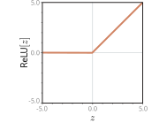
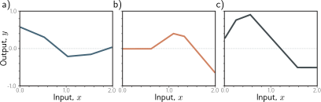
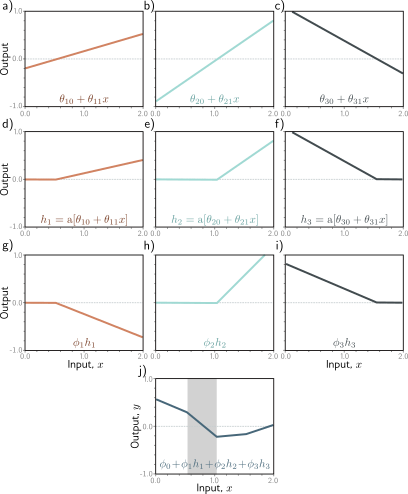
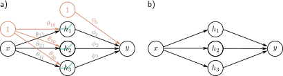
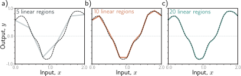
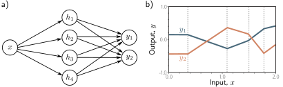
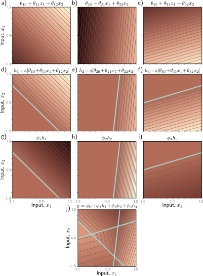
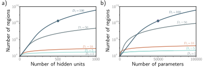
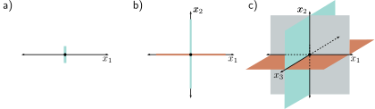
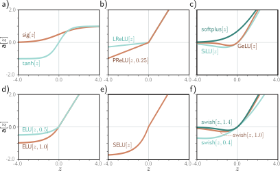

# 第三章
# 浅层神经网络

第二章介绍了一维线性回归的监督学习。然而，该模型只能将输入/输出关系描述为一条直线。本章将介绍**浅层神经网络** (shallow neural networks)。这类模型可以描述**分段线性函数** (piecewise linear functions)，并且具有足够的表达能力，能够逼近多维输入和输出之间任意复杂的关系。

## 3.1 神经网络示例

浅层神经网络是函数 $\mathbf{y} = \mathbf{f}[\mathbf{x}, \boldsymbol{\phi}]$，其参数为 $\boldsymbol{\phi}$，可将多变量输入 $\mathbf{x}$ 映射到多变量输出 $\mathbf{y}$。我们将完整定义推迟到 3.4 节，先通过一个示例网络 $\mathbf{f}[\mathbf{x}, \boldsymbol{\phi}]$ 来介绍主要思想。该网络将标量输入 $x$ 映射到标量输出 $y$，并包含十个参数 $\boldsymbol{\phi} = \{\phi_0, \phi_1, \phi_2, \phi_3, \theta_{10}, \theta_{11}, \theta_{20}, \theta_{21}, \theta_{30}, \theta_{31}\}$：

$$
\begin{aligned}
y &= f[x, \boldsymbol{\phi}] \\
  &= \phi_0 + \phi_1 a[\theta_{10} + \theta_{11}x] + \phi_2 a[\theta_{20} + \theta_{21}x] + \phi_3 a[\theta_{30} + \theta_{31}x].
\end{aligned}
\tag{3.1}
$$

我们可以将这个计算分解为三个部分：首先，我们计算输入数据的三个线性函数（$\theta_{10} + \theta_{11}x$，$\theta_{20} + \theta_{21}x$ 和 $\theta_{30} + \theta_{31}x$）。其次，我们将这三个结果通过一个**激活函数** (activation function) $a[\cdot]$。最后，我们将得到的三个激活值分别用 $\phi_1, \phi_2$ 和 $\phi_3$ 进行加权，求和，再加上一个偏置项 $\phi_0$。

为了完成描述，我们必须定义激活函数 $a[\cdot]$。激活函数有很多种可能性，但最常见的选择是**修正线性单元** (rectified linear unit) 或简称 **ReLU**:

$$
a[z] = \text{ReLU}[z] = \begin{cases} 0 & z < 0 \\ z & z \ge 0 \end{cases}.
\tag{3.2}
$$

这个函数在输入为正时返回输入本身，否则返回零（图 3.1）。

方程 3.1 所代表的输入/输出关系族可能并不直观。尽管如此，前一章中的所有思想都适用。方程 3.1 代表了一族函数，其中具体的族成员由这十个参数 $\boldsymbol{\phi}$ 决定。如果我们知道这些参数，就可以通过代入给定的输入 $x$ 来执行**推理**（预测 $y$）。给定一个训练数据集 $\{x_i, y_i\}_{i=1}^I$，我们可以定义一个最小二乘损失函数 $L[\boldsymbol{\phi}]$，并用它来衡量对于任意给定的参数值 $\boldsymbol{\phi}$，模型描述该数据集的有效性。为了训练模型，我们搜索能使这个损失最小化的参数值 $\hat{\boldsymbol{\phi}}$。

---

**图 3.1 修正线性单元 (ReLU)**
这个激活函数在输入小于零时返回零，否则返回输入本身。换句话说，它将负值截断为零。请注意，激活函数还有许多其他可能的选择（见图 3.13），但 ReLU 是最常用且最容易理解的一种。

**图 3.2 由方程 3.1 定义的函数族**
a-c) 针对十个参数 $\boldsymbol{\phi}$ 的三种不同选择所对应的函数。在每种情况下，输入/输出关系都是分段线性的。然而，拐点的位置、它们之间线性区域的斜率以及整体的高度都各不相同。

---

### 3.1.1 神经网络的直观理解

实际上，方程 3.1 代表了一族连续的分段线性函数（图 3.2），最多有四个线性区域。我们现在来分解方程 3.1，并说明它为什么能描述这样的函数族。为了更容易理解，我们将函数分为两部分。首先，我们引入中间量：

$$
\begin{aligned}
h_1 &= a[\theta_{10} + \theta_{11}x] \\
h_2 &= a[\theta_{20} + \theta_{21}x] \\
h_3 &= a[\theta_{30} + \theta_{31}x],
\end{aligned}
\tag{3.3}
$$

我们称 $h_1, h_2$ 和 $h_3$ 为**隐藏单元** (hidden units)。其次，我们通过将这些隐藏单元进行线性组合¹来计算输出：

$$
y = \phi_0 + \phi_1 h_1 + \phi_2 h_2 + \phi_3 h_3.
\tag{3.4}
$$

图 3.3 展示了创建图 3.2a 中函数的计算流程。每个隐藏单元都包含一个输入的线性函数 $\theta_{\cdot 0} + \theta_{\cdot 1}x$，该直线被 ReLU 函数 $a[\cdot]$ 在零以下的部分截断。这三条直线与零相交的位置，成为了最终输出中的三个“**拐点** (joints)”。这三条被截断的直线随后分别被 $\phi_1, \phi_2$ 和 $\phi_3$ 加权。最后，加上偏置项 $\phi_0$，它控制了整个函数的整体高度。

图 3.3j 中的每个线性区域都对应于隐藏单元中一种不同的**激活模式** (activation pattern)。当一个单元被截断时，我们称之为**非激活的** (inactive)，而当它未被截断时，我们称之为**激活的** (active)。例如，阴影区域的贡献来自于 $h_1$ 和 $h_3$（它们是激活的），而没有 $h_2$ 的贡献（它是非激活的）。每个线性区域的斜率由该区域中激活输入的原始斜率 $\theta_{\cdot 1}$ 和随后施加的权重 $\phi_{\cdot}$ 共同决定。例如，阴影区域的斜率是 $\theta_{11}\phi_1 + \theta_{31}\phi_3$（见问题 3.3），其中第一项是子图 (g) 中的斜率，第二项是子图 (i) 中的斜率。

每个隐藏单元为函数贡献一个“拐点”，因此有三个隐藏单元，就可以有四个线性区域。然而，这些区域中只有三个的斜率是独立的；第四个区域的斜率要么是零（如果该区域所有隐藏单元都处于非激活状态），要么是其他区域斜率的某种组合。参考：Problems 3.1-3.8, Notebook 3.1 Shallow networks I, Problem 3.9

> ¹在本书中，线性函数的形式为 $z' = \phi_0 + \sum_i \phi_i z_i$。任何其他类型的函数都是非线性的。例如，ReLU 函数（方程 3.2）和包含它的示例神经网络（方程 3.1）都是非线性的。详见本章末尾的注释。

---

**图 3.3 图 3.2a 中函数的计算过程**
a-c) 输入 $x$ 通过三个线性函数，每个函数具有不同的 y 轴截距 $\theta_{\cdot 0}$ 和斜率 $\theta_{\cdot 1}$。d-f) 每条直线都通过 ReLU 激活函数，该函数将负值截断为零。g-i) 这三条被截断的直线随后分别被 $\phi_1, \phi_2$ 和 $\phi_3$ 加权（缩放）。j) 最后，这些被截断并加权的函数被加在一起，并加上一个控制高度的偏置项 $\phi_0$。四个线性区域中的每一个都对应于隐藏单元中一种不同的激活模式。在阴影区域，$h_2$ 是非激活的（被截断），但 $h_1$ 和 $h_3$ 都是激活的。([交互式图表](https://udlbook.github.io/udlfigures/))

---

### 3.1.2 神经网络的图示

我们一直在讨论一个带有一个输入、一个输出和三个隐藏单元的神经网络。我们在图 3.4a 中将其可视化。输入在左侧，隐藏单元在中间，输出在右侧。每个连接代表十个参数中的一个。为了简化表示，我们通常不画出截距参数，因此这个网络通常被描绘成图 3.4b 的样子。

---

**图 3.4 神经网络的图示**
a) 输入 $x$ 在左侧，隐藏单元 $h_1, h_2, h_3$ 在中间，输出 $y$ 在右侧。计算从左到右进行。输入用于计算隐藏单元，隐藏单元再被组合以创建输出。十个箭头中的每一个都代表一个参数（橙色为截距，黑色为斜率）。每个参数乘以其源头，并将结果加到其目标上。例如，我们将参数 $\phi_1$ 与源 $h_1$ 相乘，并将其加到 $y$ 上。我们引入包含 1 的附加节点（橙色圆圈）以便将偏置项也纳入此组合，因此我们将 $\phi_0$ 乘以 1（无效果）并将其加到 $y$ 上。ReLU 函数作用于隐藏单元。b) 通常情况下，截距、ReLU 函数和参数名称会被省略；这个更简单的图示代表的是同一个网络。

---

## 3.2 通用近似定理

在上一节中，我们介绍了一个带有一个输入、一个输出、ReLU 激活函数和三个隐藏单元的神经网络示例。现在让我们稍微推广一下，考虑有 $D$ 个隐藏单元的情况，其中第 $d$ 个隐藏单元是：

$$
h_d = a[\theta_{d0} + \theta_{d1}x],
\tag{3.5}
$$

然后这些隐藏单元被线性组合以创建输出：

$$
y = \phi_0 + \sum_{d=1}^{D} \phi_d h_d.
\tag{3.6}
$$

浅层网络中隐藏单元的数量是衡量网络**容量** (capacity) 的一个指标。对于 ReLU 激活函数，一个有 $D$ 个隐藏单元的网络的输出最多有 $D$ 个拐点，因此它是一个最多有 $D+1$ 个线性区域的分段线性函数。随着我们增加更多的隐藏单元，模型可以逼近更复杂的函数。

实际上，只要有足够的容量（隐藏单元），一个浅层网络可以以任意精度描述定义在实线上的紧凑子集上的任何连续一维函数。要理解这一点，可以考虑每次我们增加一个隐藏单元，就为函数增加了一个线性区域。当这些区域变得越来越多时，它们代表了函数中越来越小的部分，这些部分可以越来越好地被一条直线所逼近（图 3.5）。**通用近似定理** (universal approximation theorem) 证明了对于任何连续函数，都存在一个浅层网络，可以将其逼近到任何指定的精度。参考：Problem 3.10

---

**图 3.5 用分段线性模型逼近一维函数（虚线）**
a-c) 随着区域数量的增加，模型越来越接近连续函数。一个带有标量输入的神经网络，每增加一个隐藏单元就会多创建一个线性区域。这个思想可以推广到 $D_i$ 维的函数。通用近似定理证明，只要有足够的隐藏单元，就存在一个浅层神经网络，可以以任意精度描述定义在 $\mathbb{R}^{D_i}$ 的紧凑子集上的任何给定的连续函数。

---

## 3.3 多变量输入和输出

在上面的例子中，网络只有一个标量输入 $x$ 和一个标量输出 $y$。然而，通用近似定理也适用于更一般的情况，即网络将多变量输入 $\mathbf{x} = [x_1, x_2, \ldots, x_{D_i}]^T$ 映射到多变量输出预测 $\mathbf{y} = [y_1, y_2, \ldots, y_{D_o}]^T$。我们首先探讨如何扩展模型以预测多变量输出，然后我们考虑多变量输入。最后，在 3.4 节中，我们将给出一个浅层神经网络的一般定义。

### 3.3.1 可视化多变量输出

要将网络扩展到多变量输出 $\mathbf{y}$，我们只需为每个输出使用一个不同的隐藏单元线性函数。因此，一个带有一个标量输入 $x$，四个隐藏单元 $h_1, h_2, h_3, h_4$，以及一个二维多变量输出 $\mathbf{y} = [y_1, y_2]^T$ 的网络可以定义为：

$$
\begin{aligned}
h_1 &= a[\theta_{10} + \theta_{11}x] \\
h_2 &= a[\theta_{20} + \theta_{21}x] \\
h_3 &= a[\theta_{30} + \theta_{31}x] \\
h_4 &= a[\theta_{40} + \theta_{41}x],
\end{aligned}
\tag{3.7}
$$

以及

$$
\begin{aligned}
y_1 &= \phi_{10} + \phi_{11}h_1 + \phi_{12}h_2 + \phi_{13}h_3 + \phi_{14}h_4 \\
y_2 &= \phi_{20} + \phi_{21}h_1 + \phi_{22}h_2 + \phi_{23}h_3 + \phi_{24}h_4.
\end{aligned}
\tag{3.8}
$$

这两个输出是隐藏单元的两个不同线性函数。

正如我们在图 3.3 中看到的，分段函数中的“拐点”取决于初始线性函数 $\theta_{\cdot 0} + \theta_{\cdot 1}x$ 在隐藏单元处被 ReLU 函数 $a[\cdot]$ 截断的位置。由于输出 $y_1$ 和 $y_2$ 都是相同四个隐藏单元的不同线性函数，它们各自的四个“拐点”必须出现在相同的位置。然而，线性区域的斜率和整体的垂直偏移量可以不同（图 3.6）。参考：Problem 3.11

---

**图 3.6 具有一个输入，四个隐藏单元和两个输出的网络**
a) 网络结构的可视化。b) 该网络产生两个分段线性函数 $y_1[x]$ 和 $y_2[x]$。这两个函数的四个“拐点”（在垂直虚线处）被约束在相同的位置，因为它们共享相同的隐藏单元，但是斜率和整体高度可能不同。

---

### 3.3.2 可视化多变量输入

为了处理多变量输入 $\mathbf{x}$，我们扩展了输入和隐藏单元之间的线性关系。因此，一个带有两个输入 $\mathbf{x} = [x_1, x_2]^T$ 和一个标量输出 $y$ 的网络（图 3.7）可能有三个隐藏单元，定义如下：

$$
\begin{aligned}
h_1 &= a[\theta_{10} + \theta_{11}x_1 + \theta_{12}x_2] \\
h_2 &= a[\theta_{20} + \theta_{21}x_1 + \theta_{22}x_2] \\
h_3 &= a[\theta_{30} + \theta_{31}x_1 + \theta_{32}x_2],
\end{aligned}
\tag{3.9}
$$

其中每个输入都有一个斜率参数。这些隐藏单元以通常的方式组合形成输出：

$$
y = \phi_0 + \phi_1 h_1 + \phi_2 h_2 + \phi_3 h_3.
\tag{3.10}
$$

图 3.8 说明了这个网络的处理过程。每个隐藏单元接收两个输入的线性组合，这在三维输入/输出空间中形成一个定向平面。激活函数将这些平面的负值截断为零。然后，这些被截断的平面在第二个线性函数（方程 3.10）中重新组合，以创建一个由**凸多边形区域** (convex polygonal regions) 组成的连续分段线性曲面（图 3.8j）。每个区域对应于一个不同的激活模式。例如，在中心的三角形区域，第一个和第三个隐藏单元是激活的，而第二个是失活的。

当模型有两个以上的输入时，就很难进行可视化。然而，解释是相似的。输出将是输入的一个连续分段线性函数，其中线性区域现在是多维输入空间中的**凸多胞体** (convex polytopes)。参考：Problems 3.12-3.13, Notebook 3.2 Shallow networks II, Appendix B.1.2 Convex region

请注意，随着输入维数的增加，线性区域的数量会迅速增长（图 3.9）。为了感受这种增长速度，可以考虑每个隐藏单元定义了一个**超平面** (hyperplane)，该超平面划分了该单元激活和不激活的空间部分（图 3.8d-f 中的青色线）。如果我们拥有的隐藏单元数量与输入维度 $D_i$ 相同，我们可以将每个超平面与一个坐标轴对齐（图 3.10）。对于两个输入维度，这将把空间划分为四个象限。对于三个维度，这将创建八个卦限，而对于 $D_i$ 维度，这将创建 $2^{D_i}$ 个**正卦体** (orthants)。浅层神经网络的隐藏单元数通常比输入维度多，因此它们通常会创建超过 $2^{D_i}$ 个线性区域。参考：Notebook 3.3 Shallow network regions

---

**图 3.7 具有二维多变量输入 $\mathbf{x} = [x_1, x_2]^T$ 和标量输出 $y$ 的神经网络的可视化。**

**图 3.8 具有两个输入 $\mathbf{x}=[x_1, x_2]^T$，三个隐藏单元 $h_1, h_2, h_3$ 和一个输出 $y$ 的网络中的处理过程**
a-c) 每个隐藏单元的输入是两个输入的线性函数，对应于一个定向平面。亮度表示函数输出。例如，在图(a)中，亮度代表 $\theta_{10} + \theta_{11}x_1 + \theta_{12}x_2$。细线是等高线。d-f) 每个平面都被 ReLU 激活函数截断（青色线相当于图 3.3d-f 中的“拐点”）。g-i) 被截断的平面然后被加权，并在 j) 中与一个决定曲面整体高度的偏置项相加。结果是一个由凸的分段线性多边形区域组成的连续曲面。([交互式图表](https://udlbook.github.io/udlfigures/))

**图 3.9 线性区域数与隐藏单元数的关系**
a) 对于五个不同的输入维度 $D_i = \{1, 5, 10, 50, 100\}$，最大可能区域数作为隐藏单元数的函数。在高维空间中，区域数迅速增加；对于 $D=500$ 个单元和输入大小 $D_i=100$，可以有超过 $10^{107}$ 个区域（实心圆）。b) 相同的数据绘制为参数数量的函数。实心圆代表与图(a)中相同的模型，具有 $D=500$ 个隐藏单元。该网络有 51,001 个参数，在现代标准下被认为非常小。

**图 3.10 线性区域数与输入维度的关系**
a) 对于单个输入维度，一个带有一个隐藏单元的模型会创建一个拐点，将坐标轴分为两个线性区域。b) 对于两个输入维度，一个带有两个隐藏单元的模型可以用两条线（这里与坐标轴对齐）来划分输入空间，从而创建四个区域。c) 对于三个输入维度，一个带有三个隐藏单元的模型可以用三个平面（同样与坐标轴对齐）来划分输入空间，从而创建八个区域。以此类推，一个具有 $D_i$ 个输入维度和 $D_i$ 个隐藏单元的模型可以用 $D_i$ 个超平面划分输入空间，从而创建 $2^{D_i}$ 个线性区域。

---

## 3.4 浅层神经网络：一般情况

我们已经描述了几个浅层网络的例子，以帮助建立关于它们如何工作的直观认识。现在我们为一个浅层神经网络 $\mathbf{y} = \mathbf{f}[\mathbf{x}, \boldsymbol{\phi}]$ 定义一个通用方程，它将一个多维输入 $\mathbf{x} \in \mathbb{R}^{D_i}$ 映射到一个多维输出 $\mathbf{y} \in \mathbb{R}^{D_o}$，并使用 $\mathbf{h} \in \mathbb{R}^{D}$ 个隐藏单元。每个隐藏单元的计算方式如下：

$$
h_d = a\left[\theta_{d0} + \sum_{i=1}^{D_i} \theta_{di}x_i\right],
\tag{3.11}
$$

然后这些隐藏单元被线性地组合以创建输出：

$$
y_j = \phi_{j0} + \sum_{d=1}^{D} \phi_{jd}h_d,
\tag{3.12}
$$

其中 $a[\cdot]$ 是一个非线性激活函数。该模型的参数为 $\boldsymbol{\phi} = \{\boldsymbol{\theta}_{\cdot\cdot}, \boldsymbol{\phi}_{\cdot\cdot}\}$。图 3.11 展示了一个有三个输入、三个隐藏单元和两个输出的例子。

激活函数允许模型描述输入和输出之间的非线性关系，因此它本身必须是非线性的；如果没有激活函数，或者使用线性激活函数，那么从输入到输出的整体映射将被限制为线性的。人们已经尝试过许多不同的激活函数（见图 3.13），但最常见的选择是 ReLU（图 3.1），它具有易于解释的优点。使用 ReLU 激活时，网络将输入空间划分为由 ReLU 函数中“拐点”计算出的超平面交集所定义的凸多胞体。每个凸多胞体包含一个不同的线性函数。对于每个输出，这些多胞体是相同的，但它们包含的线性函数可能不同。参考：Problems 3.14-3.17, Notebook 3.4 Activation functions

---

**图 3.11 具有三个输入和两个输出的神经网络的可视化**
该网络有二十个参数。有十五个斜率（由箭头表示）和五个偏置（未显示）。

---

## 3.5 术语

我们通过介绍一些术语来结束本章。遗憾的是，神经网络有很多相关的行话。它们通常用**层** (layers) 来描述。图 3.12 的左边是**输入层** (input layer)，中间是**隐藏层** (hidden layer)，右边是**输出层** (output layer)。我们会说图 3.12 中的网络有一个包含四个隐藏单元的隐藏层。隐藏单元本身有时被称为**神经元** (neurons)。当我们将数据通过网络时，隐藏层的输入值（即在应用 ReLU 函数之前）被称为**激活前**的值 (pre-activations)。在隐藏层的值（即在应用 ReLU 函数之后）被称为**激活值** (activations)。

出于历史原因，任何至少有一个隐藏层的神经网络也被称为**多层感知器** (multi-layer perceptron)，或简称 **MLP**。只有一个隐藏层的网络（如本章所述）有时被称为**浅层神经网络** (shallow neural networks)。具有多个隐藏层的网络（如下一章所述）被称为**深度神经网络** (deep neural networks)。连接形成一个无环图（即没有环路的图，如本章所有例子）的神经网络被称为**前馈网络** (feed-forward networks)。如果一层中的每个元素都连接到下一层中的每个元素（如本章所有例子），则该网络是**全连接的** (fully connected)。这些连接代表了基础方程中的斜率参数，并被称为网络**权重** (weights)。偏置参数（图 3.12 中未显示）被称为**偏置** (biases)。

---

**图 3.12 术语**
一个浅层网络由一个输入层、一个隐藏层和一个输出层组成。每一层都通过前向连接（箭头）与下一层相连。因此，这些模型被称为前馈网络。当一层中的每个变量都连接到下一层中的每个变量时，我们称之为全连接网络。每个连接代表基础方程中的一个斜率参数，这些参数被称为权重。隐藏层中的变量被称为神经元或隐藏单元。输入到隐藏单元的值被称为激活前的值，而隐藏单元处的值（即在应用 ReLU 函数后）被称为激活值。

---

## 3.6 总结

浅层神经网络有一个隐藏层。它们 (i) 计算输入的多个线性函数，(ii) 将每个结果通过一个激活函数，然后 (iii) 对这些激活值进行线性组合以形成输出。浅层神经网络通过将输入空间划分为一个由分段线性区域组成的连续曲面来基于输入 $\mathbf{x}$ 做出预测 $\mathbf{y}$。只要有足够的隐藏单元（神经元），浅层神经网络就可以以任意精度逼近任何连续函数。

第四章讨论了深度神经网络，它通过增加更多的隐藏层来扩展本章的模型。第五至七章描述了如何训练这些模型。

### 注释

**“神经”网络**: 如果本章中的模型只是函数，为什么它们被称为“神经网络”？不幸的是，这种联系很牵强。像图 3.12 这样的可视化图由相互密集连接的节点（输入、隐藏单元和输出）组成。这与哺乳动物大脑中的神经元有表面的相似之处，后者也具有密集的连接。然而，几乎没有证据表明大脑计算与神经网络的工作方式相同，从生物学的角度来思考是没有帮助的。

---

**图 3.13 激活函数**
a) Logistic sigmoid 和 tanh 函数。b) Leaky ReLU 和参数为 0.25 的 parametric ReLU。c) SoftPlus、高斯误差线性单元和 sigmoid 线性单元。d) 参数为 0.5 和 1.0 的指数线性单元。e) 缩放指数线性单元。f) 参数为 0.4、1.0 和 1.4 的 Swish 函数。

---

**神经网络的历史**: McCulloch & Pitts (1943) 首次提出了人工神经元的概念，它结合输入产生输出，但这个模型没有一个实用的学习算法。Rosenblatt (1958) 开发了**感知器** (perceptron)，它线性地组合输入，然后对其进行阈值处理以做出是/否的决定。他还提供了一种从数据中学习权重的算法。Minsky & Papert (1969) 指出，线性函数不足以解决一般的分类问题，但增加带有非线性激活函数的隐藏层（因此有了“多层感知器”这个术语）可以学习更一般的输入/输出关系。然而，他们得出结论，Rosenblatt 的算法无法学习这类模型的参数。直到 1980 年代，一个实用的算法（**反向传播**，见第七章）才被开发出来，神经网络的重要工作得以恢复。神经网络的历史由 Kurenkov (2020), Sejnowski (2018), 和 Schmidhuber (2022) 记录。

**激活函数**: ReLU 函数最早可以追溯到 Fukushima (1969) 的工作。然而，在神经网络的早期，更常用的是 logistic sigmoid 或 tanh 激活函数（图 3.13a）。ReLU 由 Jarrett et al. (2009), Nair & Hinton (2010), 和 Glorot et al. (2011) 重新推广，并且是现代神经网络成功故事的重要组成部分。它的一个很好的特性是，对于大于零的输入，输出对输入的导数始终为一。这有助于训练的稳定性和效率（见第七章），与 sigmoid 激活函数的导数形成对比，后者在输入为大的正数和大的负数时会饱和（变得接近于零）。

然而，ReLU 函数的缺点是它对负输入的导数为零。如果在训练过程中，所有训练样本对给定的 ReLU 函数都产生负输入，那么我们就无法在训练中改进输入到这个 ReLU 的参数。相对于输入权重的梯度局部是平坦的，所以我们无法“下山”。这被称为**ReLU 死亡问题** (dying ReLU problem)。为了解决这个问题，人们提出了许多 ReLU 的变体（图 3.13b），包括 (i) **leaky ReLU** (Maas et al., 2013)，它对负值也有一个线性输出，但斜率较小，为 0.1；(ii) **parametric ReLU** (He et al., 2015)，它将负值部分的斜率视为一个未知参数；以及 (iii) **concatenated ReLU** (Shang et al., 2016)，它产生两个输出，其中一个在零以下截断（即像一个典型的 ReLU），另一个在零以上截断。

人们也研究了各种平滑函数（图 3.13c-d），包括 **softplus** 函数 (Glorot et al., 2011)，**高斯误差线性单元** (Hendrycks & Gimpel, 2016)，**sigmoid 线性单元** (Hendrycks & Gimpel, 2016)，以及**指数线性单元** (Clevert et al., 2015)。这些大多是试图在限制负值梯度的情况下避免 ReLU 死亡问题。Klambauer et al. (2017) 引入了**缩放指数线性单元**（图 3.13e），它特别有趣，因为它在输入方差有限的范围内有助于稳定激活值的方差（见 7.5 节）。Ramachandran et al. (2017) 采用了一种经验方法来选择激活函数。他们在可能的函数空间中进行搜索，以找到在各种监督学习任务中表现最好的那个。最优函数被发现是 $a[z] = z \cdot \text{sigmoid}[\beta z]$，其中 $\beta$ 是一个学习参数（图 3.13f）。他们将这个函数命名为 **Swish**。有趣的是，这是对 Hendrycks & Gimpel (2016) 和 Elfwing et al. (2018) 先前提出的激活函数的重新发现。Howard et al. (2019) 用 **HardSwish** 函数逼近 Swish，它的形状非常相似但计算速度更快：

$$
\text{HardSwish}[z] = \begin{cases} 0 & z < -3 \\ z(z+3)/6 & -3 \le z \le 3 \\ z & z > 3 \end{cases}
\tag{3.13}
$$

关于这些激活函数中哪一个在经验上更优，没有明确的答案。然而，leaky ReLU、参数化 ReLU 和许多连续函数在特定情况下都显示出比 ReLU 略微的性能提升。在本书的其余部分，我们仅关注使用基本 ReLU 函数的神经网络，因为它们创建的函数在线性区域数量方面很容易表征。

**通用近似定理**: 该定理的**宽度版本** (width version) 指出，存在一个带有一个隐藏层且包含有限数量隐藏单元的网络，可以在 $\mathbb{R}^n$ 的紧凑子集上以任意精度逼近任何指定的连续函数。这最初由 Cybenko (1989) 针对一类 sigmoid 激活函数证明，后来被证明对更大范围的非线性激活函数也成立 (Hornik, 1991)。

**线性区域的数量**: 考虑一个具有 $D_i \ge 2$ 维输入和 $D$ 个隐藏单元的浅层网络。线性区域的数量由 ReLU 函数中“拐点”创建的 $D$ 个超平面的交点决定（例如，图 3.8d-f）。每个区域由 ReLU 函数对输入进行截断或不截断的不同组合创建。Zaslavsky (1975) 证明，在 $D_i < D$ 维输入空间中由 $D$ 个超平面创建的区域数量最多为 $\sum_{k=0}^{D_i} \binom{D}{k}$（即二项式系数的和）。根据经验，浅层神经网络的隐藏单元数 $D$ 几乎总是大于输入维度 $D_i$，并且创建的线性区域数介于 $2^{D_i}$ 和 $2^D$ 之间。参考：Appendix B.2 Binomial coefficient, Problem 3.18

**线性、仿射和非线性函数**: 从技术上讲，一个线性变换 $f[\cdot]$ 是任何遵循叠加原理的函数，即 $f[\mathbf{a}+\mathbf{b}] = f[\mathbf{a}]+f[\mathbf{b}]$。这个定义意味着 $f[2\mathbf{a}] = 2f[\mathbf{a}]$。加权和 $f[h_1, h_2, h_3] = \phi_1 h_1 + \phi_2 h_2 + \phi_3 h_3$ 是线性的，但一旦加上偏置项 $f[h_1, h_2, h_3] = \phi_0 + \phi_1 h_1 + \phi_2 h_2 + \phi_3 h_3$，它就不再是线性的了。要看到这一点，可以考虑当我们把前一个函数的参数加倍时，输出也会加倍。对于后一个函数，情况并非如此，它更恰当地被称为**仿射函数** (affine function)。然而，在机器学习中，混用这些术语是很常见的。在本书中，我们遵循这一惯例，将两者都称为线性的。我们将遇到的所有其他函数都是非线性的。

***

### 习题

**问题 3.1** 如果方程 3.1 中的激活函数是线性的，即 $a[z] = \psi_0 + \psi_1 z$，会创建什么样的输入到输出的映射？如果移除激活函数，即 $a[z] = z$，又会创建什么样的映射？

**思路与解答：**

1.  **线性激活函数**: 如果 $a[z] = \psi_0 + \psi_1 z$，我们将它代入原方程：
    $y = \phi_0 + \sum_{j=1}^3 \phi_j a[\theta_{j0} + \theta_{j1}x] = \phi_0 + \sum_{j=1}^3 \phi_j (\psi_0 + \psi_1(\theta_{j0} + \theta_{j1}x))$
    展开并重新整理关于 $x$ 的项：
    $y = (\phi_0 + \psi_0 \sum \phi_j + \psi_1 \sum \phi_j \theta_{j0}) + (\psi_1 \sum \phi_j \theta_{j1})x$
    这可以写成 $y = C_0 + C_1 x$ 的形式，其中 $C_0$ 和 $C_1$ 是由模型参数构成的常数。因此，整个输入到输出的映射仍然是一个**线性函数**（或更准确地说是仿射函数）。

2.  **移除激活函数** ($a[z]=z$): 这其实是第一种情况的一个特例，其中 $\psi_0=0, \psi_1=1$。因此，结果同样是一个**线性函数**。
    **结论**: 神经网络的非线性表达能力完全来自于**非线性激活函数**。如果没有它，无论网络结构多复杂，最终都等价于一个简单的线性模型。

**问题 3.2** 对于图 3.3j 中的四个线性区域，请指出哪些隐藏单元是非激活的，哪些是激活的（即，哪些截断了输入，哪些没有）。

**思路与解答：**

观察图 3.3d-f，每个隐藏单元的输出 $h_j = a[\theta_{j0} + \theta_{j1}x]$ 在 $\theta_{j0} + \theta_{j1}x < 0$ 时为零（非激活），否则为正（激活）。拐点发生在 $\theta_{j0} + \theta_{j1}x = 0$ 处。
从左到右标记四个区域为 1, 2, 3, 4。
*   **区域 1 (最左侧)**: $h_3$ 为激活，而 $h_1, h_2$ 非激活。
*   **区域 2**: $h_1, h_3$ 激活，$h_2$ 非激活。
*   **区域 3**: $h_1, h_2, h_3$ **全部激活**。
*   **区域 4 (最右侧)**: $h_3$ 为非激活，而 $h_1, h_2$ 激活。

**问题 3.3*** 推导图 3.3j 中函数“拐点”位置的表达式（用十个参数 $\boldsymbol{\phi}$ 和输入 $x$ 表示）。并推导四个线性区域斜率的表达式。

**思路与解答：**
略

**问题 3.4** 假设第三个隐藏单元的 y-截距和斜率变为图 3.14c 所示。假设其余参数不变，请绘制一个新版本的图 3.3。

**思路与解答：**
略

**问题 3.5** 证明对于 $\alpha \in \mathbb{R}^+$，以下性质成立：$\text{ReLU}[\alpha \cdot z] = \alpha \cdot \text{ReLU}[z]$。这被称为 ReLU 函数的非负同质性。

**思路与解答：**

我们需要分情况讨论 $z$ 的值。
*   **情况 1: $z \ge 0$**:
    *   左边：$\text{ReLU}[\alpha \cdot z]$。因为 $\alpha > 0$ 且 $z \ge 0$，所以 $\alpha z \ge 0$。因此，$\text{ReLU}[\alpha z] = \alpha z$。
    *   右边：$\alpha \cdot \text{ReLU}[z]$。因为 $z \ge 0$，所以 $\text{ReLU}[z] = z$。因此，$\alpha \cdot \text{ReLU}[z] = \alpha z$。
    *   左边 = 右边。
*   **情况 2: $z < 0$**:
    *   左边：$\text{ReLU}[\alpha \cdot z]$。因为 $\alpha > 0$ 且 $z < 0$，所以 $\alpha z < 0$。因此，$\text{ReLU}[\alpha z] = 0$。
    *   右边：$\alpha \cdot \text{ReLU}[z]$。因为 $z < 0$，所以 $\text{ReLU}[z] = 0$。因此，$\alpha \cdot \text{ReLU}[z] = \alpha \cdot 0 = 0$。
    *   左边 = 右边。
两种情况下等式都成立，证明完毕。

**问题 3.6** 接续问题 3.5，当我们将参数 $\theta_{10}$ 和 $\theta_{11}$ 乘以一个正常数 $\alpha$，同时将斜率 $\phi_1$ 除以同一个参数 $\alpha$ 时，方程 3.3 和 3.4 中定义的浅层网络会发生什么？如果 $\alpha$ 是负数呢？

**思路与解答：**

1.  **当 $\alpha > 0$ 时**:
    新的隐藏单元 $h'_1 = a[\alpha\theta_{10} + \alpha\theta_{11}x] = a[\alpha(\theta_{10} + \theta_{11}x)]$。
    利用问题 3.5 的性质， $h'_1 = \alpha \cdot a[\theta_{10} + \theta_{11}x] = \alpha h_1$。
    新的输出 $y' = \phi_0 + (\phi_1/\alpha)h'_1 + \phi_2 h_2 + \phi_3 h_3 = \phi_0 + (\phi_1/\alpha)(\alpha h_1) + \phi_2 h_2 + \phi_3 h_3 = \phi_0 + \phi_1 h_1 + \phi_2 h_2 + \phi_3 h_3 = y$。
    **结论**: 整个网络的函数**完全没有变化**。

2.  **当 $\alpha < 0$ 时**:
    非负同质性不适用。令 $\alpha = -|\alpha|$。
    $h'_1 = a[-|\alpha|(\theta_{10} + \theta_{11}x)]$。
    这个函数与原来的 $h_1$ 完全不同。例如，原来在 $\theta_{10}+\theta_{11}x > 0$ 时激活，现在则是在 $\theta_{10}+\theta_{11}x < 0$ 时激活。它的斜率也变号了。
    **结论**: 网络的函数会发生**根本性的改变**。

**问题 3.7** 考虑使用最小二乘损失函数来拟合方程 3.1 中的模型。这个损失函数是否有唯一的最小值？也就是说，是否存在唯一的一组“最佳”参数？

**思路与解答：**

**没有唯一的最小值**。
从问题 3.6 的结果可知，我们可以找到多组不同的参数（例如，将 $\theta_{10}, \theta_{11}$ 乘以 $\alpha$ 并将 $\phi_1$ 除以 $\alpha$）来产生完全相同的网络函数。既然函数相同，那么对于任何数据集，它们的损失值也必然相同。因此，如果存在一个最小损失值，那么至少会有一整个连续的参数集都能达到这个最小值。所以，最佳参数集不是唯一的。这种现象被称为模型的**不可辨识性** (unidentifiability)。

**问题 3.8** 考虑将 ReLU 激活函数替换为 (i) Heaviside 阶跃函数 heaviside[z]，(ii) 双曲正切函数 tanh[z]，和 (iii) 矩形函数 rect[z]。请为每个函数重绘一个版本的图 3.3。原始参数为 $\boldsymbol{\phi} = \{-0.23, -1.3, 1.3, 0.66, -0.2, 0.4, -0.9, 0.9, 1.1, -0.7\}$。并对每种激活函数下，由单输入、三隐藏单元、单输出构成的神经网络所能创建的函数族进行非正式描述。

**思路与解答：**

这里只做描述，不绘图。

1.  **Heaviside 阶跃函数**: $a[z]$ 在 $z<0$ 时为 0，在 $z \ge 0$ 时为 1。
    *   **隐藏单元输出 (图 3.3d-f)**: 会变成在拐点处从 0 跳到 1 的阶跃函数。
    *   **最终输出 (图 3.3j)**: 会是这些阶跃函数的加权和，再加上一个偏置。结果是一个**阶梯函数** (step function)，在每个隐藏单元的拐点处发生跳跃。函数族是所有可能的三级阶梯函数。

2.  **双曲正切函数 (tanh)**: $a[z]$ 是一个平滑的 S 形曲线，值域为 $(-1, 1)$。
    *   **隐藏单元输出**: 会是平滑的 S 形曲线。
    *   **最终输出**: 会是三个不同位置和尺度的 S 形曲线的加权和。结果是一个**平滑的非线性函数**。这个函数族非常灵活，可以拟合各种平滑曲线。

3.  **矩形函数 (rect)**: $a[z]$ 在 $0 \le z \le 1$ 时为 1，否则为 0。
    *   **隐藏单元输出**: 隐藏单元的线性输入 $\theta_{j0}+\theta_{j1}x$ 只有在一个区间内时，输出才为 1。所以每个隐藏单元的输出是一个**脉冲函数** (pulse function) 或“门”函数。
    *   **最终输出**: 会是这些脉冲函数的加权和。结果是一个由**多个矩形脉冲叠加**构成的函数。函数族是所有由最多三个矩形块叠加而成的函数。

**问题 3.9*** 证明图 3.3 中第三个线性区域的斜率是第一个和第四个线性区域斜率之和。

**思路与解答：**
略

**问题 3.10** 考虑一个单输入、单输出、三隐藏单元的神经网络。图 3.3 的构建过程展示了它如何创建四个线性区域。在什么情况下，这个网络会产生少于四个线性区域的函数？

**思路与解答：**

当某些“拐点”没有实际效果时，区域数量会减少。
1.  **拐点重合**: 如果两个或多个隐藏单元的拐点位置相同，即 $-\theta_{j0}/\theta_{j1} = -\theta_{k0}/\theta_{k1}$，那么这两个拐点会合并成一个，减少一个区域。
2.  **拐点在有效区域之外**: 如果一个拐点的位置远在数据或我们关心的输入范围之外，那么它实际上不会产生分段效果。
3.  **权重为零**: 如果某个隐藏单元的输出权重 $\phi_j=0$，那么这个隐藏单元虽然有拐点，但对最终输出没有贡献，其激活状态的改变不会影响输出函数的斜率，相当于少了一个区域。
4.  **斜率为零**: 如果某个隐藏单元的输入权重 $\theta_{j1}=0$，那么这个单元的激活状态只取决于偏置 $\theta_{j0}$，与输入 $x$ 无关。它要么对所有 $x$ 都激活，要么都不激活，不会产生拐点。

**问题 3.11*** 图 3.6 中的模型有多少个参数？

**思路与解答：**

模型有 1 个输入，4 个隐藏单元，2 个输出。
*   **输入到隐藏层**: 每个隐藏单元 $h_d$ ($d=1..4$) 由 $h_d = a[\theta_{d0} + \theta_{d1}x]$ 计算。这里有 4 个斜率 $\theta_{d1}$ 和 4 个偏置 $\theta_{d0}$。共 $4 \times (1+1) = 8$ 个参数。
*   **隐藏层到输出层**: 每个输出 $y_j$ ($j=1,2$) 由 $y_j = \phi_{j0} + \sum_{d=1}^4 \phi_{jd}h_d$ 计算。这里有 2 个输出，每个输出有 4 个权重 $\phi_{jd}$ 和 1 个偏置 $\phi_{j0}$。共 $2 \times (4+1) = 10$ 个参数。
*   **总计**: $8 + 10 = 18$ 个参数。

**问题 3.12** 图 3.7 中的模型有多少个参数？

**思路与解答：**

模型有 2 个输入 ($x_1, x_2$)，3 个隐藏单元，1 个输出。
*   **输入到隐藏层**: 每个隐藏单元 $h_d$ ($d=1..3$) 由 $h_d=a[\theta_{d0} + \theta_{d1}x_1 + \theta_{d2}x_2]$ 计算。这里有 3 个隐藏单元，每个有 2 个斜率和 1 个偏置。共 $3 \times (2+1) = 9$ 个参数。
*   **隐藏层到输出层**: 输出 $y = \phi_0 + \sum_{d=1}^3 \phi_d h_d$。这里有 3 个权重 $\phi_d$ 和 1 个偏置 $\phi_0$。共 $3+1 = 4$ 个参数。
*   **总计**: $9 + 4 = 13$ 个参数。

**问题 3.13** 图 3.8 中七个区域各自的激活模式是什么？换句话说，在每个区域中，哪些隐藏单元是激活的（传递输入），哪些是非激活的（截断输入）？

**思路与解答：**

我们从图 3.8d-f 中三条青色分界线的位置来判断。每条线代表一个隐藏单元的激活边界。
将区域编号，例如从左上角开始逆时针：
1.  **左上角区域**: $h_1$ 非激活, $h_2$ 激活, $h_3$ 激活。
2.  **左中区域**: $h_1$ 非激活, $h_2$ 非激活, $h_3$ 激活。
3.  **左下角区域**: 全部非激活。
4.  **下中区域**: $h_1$ 激活, $h_2$ 非激活, $h_3$ 非激活。
5.  **右下角区域**: $h_1$ 激活, $h_2$ 激活, $h_3$ 非激活。
6.  **右上角区域**: 全部激活。
7.  **中心三角区域**: $h_1$ 激活, $h_2$ 非激活, $h_3$ 激活。

**问题 3.14** 写出定义图 3.11 中网络的方程。应该有三个方程用于从输入计算三个隐藏单元，以及两个方程用于从隐藏单元计算输出。

**思路与解答：**

网络有 3 个输入 $\mathbf{x}=[x_1, x_2, x_3]^T$，3 个隐藏单元 $\mathbf{h}=[h_1, h_2, h_3]^T$，2 个输出 $\mathbf{y}=[y_1, y_2]^T$。
*   **隐藏单元方程**:
    $h_1 = a[\theta_{10} + \theta_{11}x_1 + \theta_{12}x_2 + \theta_{13}x_3]$
    $h_2 = a[\theta_{20} + \theta_{21}x_1 + \theta_{22}x_2 + \theta_{23}x_3]$
    $h_3 = a[\theta_{30} + \theta_{31}x_1 + \theta_{32}x_2 + \theta_{33}x_3]$
*   **输出方程**:
    $y_1 = \phi_{10} + \phi_{11}h_1 + \phi_{12}h_2 + \phi_{13}h_3$
    $y_2 = \phi_{20} + \phi_{21}h_1 + \phi_{22}h_2 + \phi_{23}h_3$

**问题 3.15*** 图 3.11 中的网络最多可以创建多少个三维线性区域？

**思路与解答：**

该网络有 $D_i=3$ 维输入和 $D=3$ 个隐藏单元。每个隐藏单元定义一个超平面（在此例中是平面）。我们需要计算 3 个平面最多能将三维空间分割成多少个区域。
使用 Zaslavsky 的公式：区域数 $R(D, D_i) = \sum_{k=0}^{D_i} \binom{D}{k}$。
这里 $D_i=3, D=3$。
$R(3, 3) = \binom{3}{0} + \binom{3}{1} + \binom{3}{2} + \binom{3}{3} = 1 + 3 + 3 + 1 = 8$。
最多可以创建 **8** 个区域。

**问题 3.16** 写出一个有2个输入，4个隐藏单元和3个输出的网络的方程。并以图 3.11 的风格画出这个模型。

**思路与解答：**

*   **方程**:
    输入 $\mathbf{x}=[x_1, x_2]^T$，隐藏单元 $\mathbf{h}=[h_1, h_2, h_3, h_4]^T$，输出 $\mathbf{y}=[y_1, y_2, y_3]^T$。
    *   **隐藏层**: 对于 $d=1, \dots, 4$: $h_d = a[\theta_{d0} + \theta_{d1}x_1 + \theta_{d2}x_2]$
    *   **输出层**: 对于 $j=1, \dots, 3$: $y_j = \phi_{j0} + \sum_{d=1}^4 \phi_{jd}h_d$

*   **模型图**:
    (无法绘图) 描述如下：左侧有两个输入节点 ($x_1, x_2$)。中间是包含四个隐藏单元节点 ($h_1, h_2, h_3, h_4$) 的隐藏层。右侧是包含三个输出节点 ($y_1, y_2, y_3$) 的输出层。这是一个全连接网络，所以：
    *   每个输入节点都有一条边连接到每个隐藏节点。
    *   每个隐藏节点都有一条边连接到每个输出节点。

**问题 3.17*** 方程 3.11 和 3.12 定义了一个通用的神经网络，它有 $D_i$ 个输入，一个包含 $D$ 个隐藏单元的隐藏层，以及 $D_o$ 个输出。请找出该模型中参数数量的表达式（用 $D_i, D, D_o$ 表示）。

**思路与解答：**

1.  **输入层到隐藏层的参数**:
    有 $D$ 个隐藏单元。每个隐藏单元接收 $D_i$ 个输入。因此有 $D \times D_i$ 个权重（斜率参数）。
    每个隐藏单元还有一个偏置项。因此有 $D$ 个偏置。
    总计：$D \times D_i + D = D(D_i + 1)$。

2.  **隐藏层到输出层的参数**:
    有 $D_o$ 个输出单元。每个输出单元接收 $D$ 个隐藏单元的输入。因此有 $D_o \times D$ 个权重。
    每个输出单元还有一个偏置项。因此有 $D_o$ 个偏置。
    总计：$D_o \times D + D_o = D_o(D + 1)$。

3.  **总参数数量**:
    $N_{params} = D(D_i + 1) + D_o(D + 1)$。

**问题 3.18*** 证明一个具有 $D_i=2$ 维输入，$D_o=1$ 维输出，以及 $D=3$ 个隐藏单元的浅层网络所创建的最大区域数为 7，如图 3.8j 所示。使用 Zaslavsky (1975) 的结果，即由 $D$ 个超平面划分 $D_i$ 维空间所创建的最大区域数为 $\sum_{k=0}^{D_i} \binom{D}{k}$。如果我们将该模型增加两个隐藏单元，即 $D=5$，最大区域数是多少？

**思路与解答：**

1.  **证明 $D=3, D_i=2$ 时区域数为 7**:
    使用公式 $R(D, D_i) = \sum_{k=0}^{D_i} \binom{D}{k}$。
    代入 $D=3, D_i=2$：
    $R(3, 2) = \sum_{k=0}^{2} \binom{3}{k} = \binom{3}{0} + \binom{3}{1} + \binom{3}{2} = 1 + 3 + 3 = 7$。
    这与图 3.8j 中的区域数相符，证明完毕。

2.  **计算 $D=5, D_i=2$ 时的最大区域数**:
    输入维度不变 ($D_i=2$)，隐藏单元数增加到 $D=5$。
    $R(5, 2) = \sum_{k=0}^{2} \binom{5}{k} = \binom{5}{0} + \binom{5}{1} + \binom{5}{2} = 1 + 5 + \frac{5 \times 4}{2} = 1 + 5 + 10 = 16$。
    最大区域数将是 **16**。
