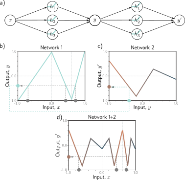
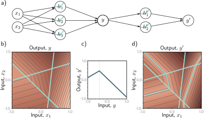
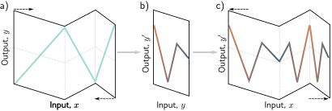
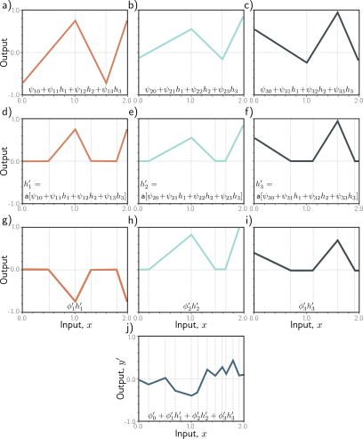
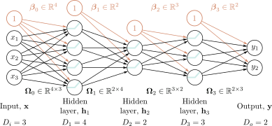
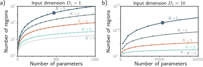

# 第四章
# 深度神经网络

上一章描述了只有一个隐藏层的浅层神经网络。本章将介绍拥有一个以上隐藏层的**深度神经网络** (deep neural networks)。在使用 ReLU 激活函数时，无论是浅层网络还是深度网络，描述的都是从输入到输出的**分段线性** (piecewise linear) 映射。

随着隐藏单元数量的增加，浅层神经网络的描述能力也会增强。实际上，只要有足够多的隐藏单元，浅层网络就能描述高维空间中任意复杂的函数。然而，事实证明，对于某些函数，所需的隐藏单元数量会大到不切实际。在给定参数数量的情况下，深度网络能产生的线性区域比浅层网络多得多。因此，从实践的角度来看，它们可以用来描述一个更广泛的函数族。

## 4.1 复合神经网络

为了深入了解深度神经网络的行为，我们首先考虑将两个浅层网络复合起来，即第一个网络的输出成为第二个网络的输入。设想两个各有三个隐藏单元的浅层网络（图 4.1a）。第一个网络接收一个输入 $x$ 并返回输出 $y$，其定义如下：

$$
\begin{aligned}
h_1 &= a[\theta_{10} + \theta_{11}x] \\
h_2 &= a[\theta_{20} + \theta_{21}x] \\
h_3 &= a[\theta_{30} + \theta_{31}x],
\end{aligned}
\tag{4.1}
$$

以及

$$
y = \phi_0 + \phi_1 h_1 + \phi_2 h_2 + \phi_3 h_3.
\tag{4.2}
$$

第二个网络接收 $y$ 作为输入并返回 $y'$，其定义如下：

$$
\begin{aligned}
h'_1 &= a[\theta'_{10} + \theta'_{11}y] \\
h'_2 &= a[\theta'_{20} + \theta'_{21}y] \\
h'_3 &= a[\theta'_{30} + \theta'_{31}y],
\end{aligned}
\tag{4.3}
$$

以及

$$
y' = \phi'_0 + \phi'_1 h'_1 + \phi'_2 h'_2 + \phi'_3 h'_3.
\tag{4.4}
$$

在使用 ReLU 激活函数时，这个复合模型同样描述了一个分段线性函数族。然而，其线性区域的数量可能比一个拥有六个隐藏单元的浅层网络要多。要理解这一点，可以考虑我们选择第一个网络来产生三个斜率正负交替的区域（图 4.1b）。这意味着三个不同的 $x$ 值范围被映射到了同一个输出范围 $y \in [-1, 1]$，而从这个 $y$ 值范围到 $y'$ 的后续映射被应用了三次。最终的整体效果是，第二个网络定义的函数被复制了三次，从而创造出九个线性区域。同样的原理也适用于更高维度的情况（图 4.2）。

另一种理解网络复合的方式是，第一个网络将输入空间 $x$ “**折叠** (folds)”到自身之上，使得多个输入产生相同的输出。然后，第二个网络应用一个函数，这个函数在所有被折叠在一起的点上被**复制** (replicated)（图 4.3）。参考：Problem 4.1, Notebook 4.1 Composing networks

---

**图 4.1 复合两个各含三个隐藏单元的单层网络**
a) 第一个网络的输出 $y$ 构成了第二个网络的输入。b) 第一个网络使用一个包含三个线性区域的函数将输入 $x \in [-1, 1]$ 映射到输出 $y \in [-1, 1]$，这些区域被特意选择成斜率正负交替（第四个线性区域在图示范围之外）。现在，多个输入 $x$（灰色圆圈）被映射到同一个输出 $y$（青色圆圈）。c) 第二个网络定义了一个包含三个线性区域的函数，它接收 $y$ 并返回 $y'$（即，青色圆圈被映射到棕色圆圈）。d) 当这两个函数复合时，其综合效果是 (i) 三个不同的输入 $x$ 被第一个网络映射到任意给定的 $y$ 值，并且 (ii) 它们被第二个网络以同样的方式处理；结果是，在(c)中由第二个网络定义的函数被复制了三次，并根据(b)中各区域的斜率进行了不同程度的翻转和缩放。([交互式图表](https://udlbook.github.io/udlfigures/))

**图 4.2 用二维输入复合神经网络**
a) 第一个网络（来自图 3.8）有三个隐藏单元，接收两个输入 $x_1$ 和 $x_2$，并返回一个标量输出 $y$。这个输出被送入第二个有两个隐藏单元的网络，以产生 $y'$。b) 第一个网络产生一个由七个线性区域组成的函数，其中一个是平坦的。c) 第二个网络在 $y \in [-1, 1]$ 上定义了一个包含两个线性区域的函数。d) 当这些网络复合时，第一个网络中的六个非平坦区域中的每一个都被第二个网络分割成两个新的区域，从而总共创建出 13 个线性区域。

**图 4.3 将深度网络视为折叠输入空间**
a) 理解图 4.1 中第一个网络的一种方式是，它将输入空间“折叠”回自身之上。b) 第二个网络将其函数应用于这个被折叠的空间。c) 最终的输出通过再次“展开”来呈现。

---

## 4.2 从复合网络到深度网络

上一节展示了我们可以通过将一个浅层神经网络的输出传递给第二个网络来创建复杂的函数。现在我们证明，这其实是一个拥有两个隐藏层的深度网络的特例。

第一个网络的输出 ($y = \phi_0 + \phi_1 h_1 + \phi_2 h_2 + \phi_3 h_3$) 是其隐藏单元激活值的线性组合。第二个网络的初始运算（方程 4.3 中我们计算 $\theta'_{10} + \theta'_{11}y$, $\theta'_{20} + \theta'_{21}y$ 和 $\theta'_{30} + \theta'_{31}y$）是第一个网络输出的线性函数。将一个线性函数应用于另一个线性函数会产生又一个线性函数。将 $y$ 的表达式代入方程 4.3 得到：

$$
\begin{aligned}
h'_1 = a[\theta'_{10} + \theta'_{11}y] &= a[\theta'_{10} + \theta'_{11}\phi_0 + \theta'_{11}\phi_1 h_1 + \theta'_{11}\phi_2 h_2 + \theta'_{11}\phi_3 h_3] \\
h'_2 = a[\theta'_{20} + \theta'_{21}y] &= a[\theta'_{20} + \theta'_{21}\phi_0 + \theta'_{21}\phi_1 h_1 + \theta'_{21}\phi_2 h_2 + \theta'_{21}\phi_3 h_3] \\
h'_3 = a[\theta'_{30} + \theta'_{31}y] &= a[\theta'_{30} + \theta'_{31}\phi_0 + \theta'_{31}\phi_1 h_1 + \theta'_{31}\phi_2 h_2 + \theta'_{31}\phi_3 h_3],
\end{aligned}
\tag{4.5}
$$

我们可以将其重写为：

$$
\begin{aligned}
h'_1 &= a[\psi_{10} + \psi_{11}h_1 + \psi_{12}h_2 + \psi_{13}h_3] \\
h'_2 &= a[\psi_{20} + \psi_{21}h_1 + \psi_{22}h_2 + \psi_{23}h_3] \\
h'_3 &= a[\psi_{30} + \psi_{31}h_1 + \psi_{32}h_2 + \psi_{33}h_3],
\end{aligned}
\tag{4.6}
$$

其中 $\psi_{10} = \theta'_{10} + \theta'_{11}\phi_0, \psi_{11} = \theta'_{11}\phi_1, \psi_{12} = \theta'_{11}\phi_2$ 等等。其结果是一个拥有两个隐藏层的网络（图 4.4）。

由此可见，一个两层网络可以表示将一个单层网络的输出传递给另一个网络所创建的函数族。实际上，它代表了一个更广泛的函数族，因为在方程 4.6 中，九个斜率参数 $\psi_{11}, \psi_{21}, \dots, \psi_{33}$ 可以取任意值，而在方程 4.5 中，这些参数被约束为外积 $[\theta'_{11}, \theta'_{21}, \theta'_{31}]^T [\phi_1, \phi_2, \phi_3]$。

## 4.3 深度神经网络

在上一节中，我们展示了复合两个浅层网络会得到一个两层深度网络的特例。现在我们考虑一个两层深度网络的一般情况，每层包含三个隐藏单元（图 4.4）。
第一层定义为：
$$
\begin{aligned}
h_1 &= a[\theta_{10} + \theta_{11}x] \\
h_2 &= a[\theta_{20} + \theta_{21}x] \\
h_3 &= a[\theta_{30} + \theta_{31}x],
\end{aligned}
\tag{4.7}
$$
第二层定义为：
$$
\begin{aligned}
h'_1 &= a[\psi_{10} + \psi_{11}h_1 + \psi_{12}h_2 + \psi_{13}h_3] \\
h'_2 &= a[\psi_{20} + \psi_{21}h_1 + \psi_{22}h_2 + \psi_{23}h_3] \\
h'_3 &= a[\psi_{30} + \psi_{31}h_1 + \psi_{32}h_2 + \psi_{33}h_3],
\end{aligned}
\tag{4.8}
$$
输出则由下式给出：
$$
y' = \phi'_0 + \phi'_1 h'_1 + \phi'_2 h'_2 + \phi'_3 h'_3.
\tag{4.9}
$$

---

**图 4.4 具有一个输入、一个输出和两个隐藏层（每层包含三个隐藏单元）的神经网络。**

---

审视这些方程，我们可以从另一个角度来理解网络是如何构建一个日益复杂的函数的（图 4.5）：

1.  第一层的三个隐藏单元 $h_1, h_2, h_3$ 按常规方式计算，即对输入进行线性变换，然后通过 ReLU 激活函数（方程 4.7）。
2.  第二层的**激活前**值是通过对这些隐藏单元进行三种新的线性变换来计算的（方程 4.8 中激活函数的参数）。在这一步，我们实际上得到了一个有三个输出的浅层网络；我们计算出了三个分段线性函数，它们的线性区域之间的“拐点”位于相同的位置（见图 3.6）。
3.  在第二个隐藏层，另一个 ReLU 函数 $a[\cdot]$ 被应用于每个函数（方程 4.8），将它们进行截断并为每个函数增加新的“拐点”。
4.  最终的输出是这些隐藏单元的线性组合（方程 4.9）。

总而言之，我们可以将每一层看作是在“折叠”输入空间，或者是在创建新的函数，这些函数被截断（从而创建新区域）然后再重新组合。前一种观点强调了输出函数中的依赖关系，但没有说明截断如何创建新的拐点，而后一种观点则侧重于后者。最终，这两种描述都只是对深度神经网络如何运作的部分洞察。无论如何，重要的是不要忘记，这仍然只是一个关联输入 $x$ 和输出 $y'$ 的方程。实际上，我们可以将方程 4.7-4.9 合并成一个表达式：

$$
\begin{aligned}
y' = \phi'_0 &+ \phi'_1 a[\psi_{10} + \psi_{11}a[\theta_{10} + \theta_{11}x] + \psi_{12}a[\theta_{20} + \theta_{21}x] + \psi_{13}a[\theta_{30} + \theta_{31}x]] \\
&+ \phi'_2 a[\psi_{20} + \psi_{21}a[\theta_{10} + \theta_{11}x] + \psi_{22}a[\theta_{20} + \theta_{21}x] + \psi_{23}a[\theta_{30} + \theta_{31}x]] \\
&+ \phi'_3 a[\psi_{30} + \psi_{31}a[\theta_{10} + \theta_{11}x] + \psi_{32}a[\theta_{20} + \theta_{21}x] + \psi_{33}a[\theta_{30} + \theta_{31}x]],
\end{aligned}
\tag{4.10}
$$

尽管这个表达式确实很难理解。参考：Notebook 4.2 Clipping functions

---

**图 4.5 图 4.4 中深度网络的计算过程**
a-c) 第二个隐藏层的输入（即激活前值）是三个分段线性函数，它们的线性区域之间的“拐点”位置相同（见图 3.6）。d-f) 每个分段线性函数都被 ReLU 激活函数截断为零。g-i) 这些被截断的函数分别用参数 $\phi'_1, \phi'_2, \phi'_3$ 进行加权。j) 最后，这些被截断并加权的函数被加在一起，并加上一个控制整体高度的偏置项 $\phi'_0$。([交互式图表](https://udlbook.github.io/udlfigures/))

---

### 4.3.1 超参数

我们可以将深度网络的构建扩展到两个以上的隐藏层；现代网络可能有一百多层，每层有数千个隐藏单元。每层中隐藏单元的数量被称为网络的**宽度** (width)，隐藏层的数量被称为**深度** (depth)。隐藏单元的总数是网络**容量** (capacity) 的一个度量。

我们将层的数量表示为 $K$，每层隐藏单元的数量表示为 $D_1, D_2, \dots, D_K$。这些都是**超参数** (hyperparameters) 的例子。它们是在我们学习模型参数（即斜率和截距项）之前就选定的量。对于固定的超参数（例如，$K=2$ 层，每层 $D_k=3$ 个隐藏单元），模型描述了一个函数族，而参数则确定了具体的函数。因此，当我们也考虑超参数时，我们可以将神经网络看作是代表了一个关联输入和输出的函数族的族。参考：Problem 4.2

## 4.4 矩阵表示法

我们已经看到，深度神经网络由线性变换与激活函数交替组成。我们可以等效地用**矩阵表示法** (matrix notation) 来描述方程 4.7-4.9：参考：Appendix B.3 Matrices

$$
\begin{bmatrix} h_1 \\ h_2 \\ h_3 \end{bmatrix} = a\left[ \begin{bmatrix} \theta_{10} \\ \theta_{20} \\ \theta_{30} \end{bmatrix} + \begin{bmatrix} \theta_{11} \\ \theta_{21} \\ \theta_{31} \end{bmatrix} x \right],
\tag{4.11}
$$

$$
\begin{bmatrix} h'_1 \\ h'_2 \\ h'_3 \end{bmatrix} = a\left[ \begin{bmatrix} \psi_{10} \\ \psi_{20} \\ \psi_{30} \end{bmatrix} + \begin{bmatrix} \psi_{11} & \psi_{12} & \psi_{13} \\ \psi_{21} & \psi_{22} & \psi_{23} \\ \psi_{31} & \psi_{32} & \psi_{33} \end{bmatrix} \begin{bmatrix} h_1 \\ h_2 \\ h_3 \end{bmatrix} \right],
\tag{4.12}
$$

以及

$$
y' = \phi'_0 + \begin{bmatrix} \phi'_1 & \phi'_2 & \phi'_3 \end{bmatrix} \begin{bmatrix} h'_1 \\ h'_2 \\ h'_3 \end{bmatrix},
\tag{4.13}
$$

或者用更紧凑的矩阵表示法：

$$
\begin{aligned}
\mathbf{h} &= a[\boldsymbol{\theta}_0 + \boldsymbol{\theta}x] \\
\mathbf{h}' &= a[\boldsymbol{\psi}_0 + \boldsymbol{\Psi}\mathbf{h}] \\
y' &= \phi'_0 + \boldsymbol{\phi}'^T \mathbf{h}',
\end{aligned}
\tag{4.14}
$$

在每种情况下，函数 $a[\cdot]$ 都分别应用于其向量输入的每个元素。

### 4.4.1 通用公式

对于有很多层的网络，这种表示法变得很笨重。因此，从现在开始，我们将第 $k$ 层的隐藏单元向量描述为 $\mathbf{h}_k$，贡献给第 $k+1$ 层的偏置（截距）向量描述为 $\boldsymbol{\beta}_k$，应用于第 $k$ 层并贡献给第 $(k+1)$ 层的权重（斜率）描述为 $\mathbf{\Omega}_k$。一个具有 $K$ 层的通用深度网络 $\mathbf{y} = \mathbf{f}[\mathbf{x}, \boldsymbol{\phi}]$ 现在可以写成：

$$
\begin{aligned}
\mathbf{h}_1 &= a[\boldsymbol{\beta}_0 + \mathbf{\Omega}_0\mathbf{x}] \\
\mathbf{h}_2 &= a[\boldsymbol{\beta}_1 + \mathbf{\Omega}_1\mathbf{h}_1] \\
\mathbf{h}_3 &= a[\boldsymbol{\beta}_2 + \mathbf{\Omega}_2\mathbf{h}_2] \\
&\vdots \\
\mathbf{h}_K &= a[\boldsymbol{\beta}_{K-1} + \mathbf{\Omega}_{K-1}\mathbf{h}_{K-1}] \\
\mathbf{y} &= \boldsymbol{\beta}_K + \mathbf{\Omega}_K\mathbf{h}_K.
\end{aligned}
\tag{4.15}
$$

这个模型的参数 $\boldsymbol{\phi}$ 包括所有这些权重矩阵和偏置向量 $\boldsymbol{\phi} = \{\boldsymbol{\beta}_k, \mathbf{\Omega}_k\}_{k=0}^K$。
如果第 $k$ 层有 $D_k$ 个隐藏单元，那么偏置向量 $\boldsymbol{\beta}_{k-1}$ 的大小为 $D_k$。最后一个偏置向量 $\boldsymbol{\beta}_K$ 的大小为输出的维度 $D_o$。第一个权重矩阵 $\mathbf{\Omega}_0$ 的大小为 $D_1 \times D_i$，其中 $D_i$ 是输入的维度。最后一个权重矩阵 $\mathbf{\Omega}_K$ 的大小为 $D_o \times D_K$，其余的矩阵 $\mathbf{\Omega}_k$ 的大小为 $D_{k+1} \times D_k$（图 4.6）。

我们也可以等效地将网络写成一个单一的函数：

$$
\mathbf{y} = \boldsymbol{\beta}_K + \mathbf{\Omega}_K a[\boldsymbol{\beta}_{K-1} + \mathbf{\Omega}_{K-1} a[\dots \boldsymbol{\beta}_2 + \mathbf{\Omega}_2 a[\boldsymbol{\beta}_1 + \mathbf{\Omega}_1 a[\boldsymbol{\beta}_0 + \mathbf{\Omega}_0\mathbf{x}]]\dots]].
\tag{4.16}
$$

---

**图 4.6 网络的矩阵表示法**
该网络有 $D_i=3$ 维输入 $\mathbf{x}$，$D_o=2$ 维输出 $\mathbf{y}$，以及 $K=3$ 个隐藏层 $\mathbf{h}_1, \mathbf{h}_2, \mathbf{h}_3$，其维度分别为 $D_1=4, D_2=2, D_3=3$。权重存储在矩阵 $\mathbf{\Omega}_k$ 中，该矩阵乘以来自前一层的激活值，以创建后续层的激活前值。例如，计算从 $\mathbf{h}_1$ 的激活值到 $\mathbf{h}_2$ 的激活前值的权重矩阵 $\mathbf{\Omega}_1$ 的维度为 $2 \times 4$。它被应用于第一层的四个隐藏单元，并为第二层的两个隐藏单元创建输入。偏置存储在向量 $\boldsymbol{\beta}_k$ 中，其维度与其所馈入的层的维度相同。例如，偏置向量 $\boldsymbol{\beta}_2$ 的长度为 3，因为层 $\mathbf{h}_3$ 包含三个隐藏单元。参考：Notebook 4.3 Deep networks, Problems 4.3-4.6

---

## 4.5 浅层与深度神经网络

第三章讨论了浅层网络（只有一个隐藏层），而本章我们描述了深度网络（有多个隐藏层）。现在我们来比较这两种模型。

### 4.5.1 逼近不同函数的能力

在 3.2 节中，我们论证了具有足够容量（隐藏单元）的浅层神经网络可以任意地逼近任何连续函数。在本章中，我们看到一个有两层的深度网络可以表示两个浅层网络的复合。如果这两个网络中的第二个计算的是恒等函数，那么这个深度网络就复制了一个单一的浅层网络。因此，只要给予足够的容量，它也可以任意地逼近任何连续函数。参考：Problem 4.7

### 4.5.2 每个参数的线性区域数量

一个单输入、单输出、且有 $D > 2$ 个隐藏单元的浅层网络最多可以创建 $D+1$ 个线性区域，并由 $3D+1$ 个参数定义。一个单输入、单输出、有 $K$ 层、每层 $D>2$ 个隐藏单元的深度网络最多可以创建一个具有 $(D+1)^K$ 个线性区域的函数，使用的参数数量为 $3D+1 + (K-1)D(D+1)$。参考：Problems 4.8-4.11

图 4.7a 展示了对于映射标量输入 $x$ 到标量输出 $y$ 的网络，最大线性区域数如何作为参数数量的函数而增加。对于固定的参数预算，深度网络能创建比浅层网络复杂得多的函数。当输入维度 $D_i$ 增加时，这种效应会更加显著（图 4.7b），尽管计算最大区域数不那么直接。

这看起来很有吸引力，但这些函数的灵活性仍然受到参数数量的限制。深度网络可以创建数量极多的线性区域，但这些区域包含复杂的依赖关系和对称性。我们在将深度网络视为“折叠”输入空间时看到了一些这样的例子（图 4.3）。因此，尚不清楚更多的区域数是否是一种优势，除非 (i) 我们希望逼近的真实世界函数中存在类似的对称性，或者 (ii) 我们有理由相信从输入到输出的映射确实涉及更简单函数的复合。

### 4.5.3 深度效率

深度和浅层网络都可以建模任意函数，但某些函数可以用深度网络更有效地逼近。已经发现存在一些函数，它们需要一个隐藏单元数量呈指数级增长的浅层网络，才能达到与某个深度网络等效的逼近效果。这种现象被称为神经网络的**深度效率** (depth efficiency)。这个特性也很有吸引力，但我们想要逼近的真实世界函数是否属于这一类，目前尚不清楚。

### 4.5.4 大型结构化输入

我们已经讨论了全连接网络，其中每一层的每个元素都对下一层的每个元素有贡献。然而，对于像图像这样的大型结构化输入（输入可能包含约 $10^6$ 个像素），这种网络是不切实际的。参数数量会大得惊人，而且，我们希望图像的不同部分能被类似地处理；没有必要为了识别图像中每个可能位置的同一个物体而独立学习。

解决方案是并行处理局部图像区域，然后逐渐整合来自越来越大区域的信息。这种从局部到全局的处理方式，如果不使用多层结构是很难实现的（见第十章）。

### 4.5.5 训练与泛化

深度网络相对于浅层网络的另一个可能优势是它们更容易拟合；训练中等深度的网络通常比训练浅层网络更容易（见图 20.2）。这可能是因为**过参数化** (over-parameterized) 的深度模型（即参数比训练样本还多的模型）有大量大致等效的解，这些解很容易找到。然而，随着我们增加更多的隐藏层，训练又会变得更加困难。人们已经开发了许多方法来缓解这个问题（见第十一章）。

深度神经网络似乎也比浅层网络更好地**泛化** (generalize) 到新数据。在实践中，大多数任务的最佳结果都是使用具有数十甚至数百层的网络实现的。这两种现象都还没有被很好地理解，我们将在第二十章再回到这些问题。

---

**图 4.7 神经网络的最大线性区域数随网络深度迅速增加**
a) 输入维度 $D_i=1$ 的网络。每条曲线代表固定的隐藏层数 $K$，我们改变每层的隐藏单元数 $D$。对于固定的参数预算（水平位置），更深的网络能产生比更浅的网络更多的线性区域。一个有 $K=5$ 层、每层 $D=10$ 个隐藏单元的网络有 471 个参数（高亮显示的点），可以产生 161,051 个区域。b) 输入维度 $D_i=10$ 的网络。曲线上每个后续点代表增加十个隐藏单元。这里，一个有 $K=5$ 层、每层 $D=50$ 个隐藏单元的模型有 10,801 个参数（高亮显示的点），可以创建超过 $10^{40}$ 个线性区域。

---

## 4.6 总结

在本章中，我们首先探讨了复合两个浅层网络时会发生什么。我们论证了第一个网络“折叠”了输入空间，然后第二个网络应用一个分段线性函数。第二个网络的效果在输入空间被折叠到自身上的地方被复制。

然后我们证明了这种浅层网络的复合是具有两层的深度网络的一个特例。我们将每层中的 ReLU 函数解释为在多个位置裁剪输入函数，并在输出函数中创建更多的“拐点”。我们引入了超参数的概念，对于我们目前所见的网络，它包括隐藏层的数量和每层隐藏单元的数量。

最后，我们比较了浅层和深度网络。我们看到 (i) 两种网络在有足够容量的情况下都可以逼近任何函数，(ii) 在每个参数的基础上，深度网络能产生更多的线性区域，(iii) 某些函数可以被深度网络更有效地逼近，(iv) 像图像这样的大型结构化输入最好分多个阶段处理，以及 (v) 在实践中，大多数任务的最佳结果都是使用具有许多层的深度网络实现的。

现在我们理解了深度和浅层网络模型，我们将注意力转向训练它们。在下一章中，我们将讨论损失函数。对于任何给定的参数值 $\boldsymbol{\phi}$，损失函数返回一个单一的数字，该数字表示模型输出与训练数据集的真实预测之间的不匹配程度。在第六章和第七章中，我们将处理训练过程本身，在其中我们寻求最小化这个损失的参数值。

### 注释

**深度学习**: 人们早就知道可以通过复合浅层神经网络或开发具有多个隐藏层的网络来构建更复杂的函数。实际上，“深度学习”这个术语最早由 Dechter (1986) 使用。然而，由于实际问题的考虑，人们的兴趣有限；当时无法很好地训练这样的网络。深度学习的现代时代是由 Krizhevsky et al. (2012) 报告的图像分类的显著改进所开启的。这一突然的进展可以说是四个因素共同作用的结果：更大的训练数据集、用于训练的改进处理能力、ReLU 激活函数的使用，以及随机梯度下降的使用（见第六章）。LeCun et al. (2015) 概述了深度学习现代早期的进展。

**线性区域的数量**: 对于使用总共 $D$ 个隐藏单元和 ReLU 激活的深度网络，区域数量的上限是 $2^D$ (Montúfar et al., 2014)。同一作者表明，一个具有 $D_i$ 维输入和 $K$ 层，每层包含 $D > D_i$ 个隐藏单元的深度 ReLU 网络，具有 $O((D/D_i)^{(K-1)D_i} D^{D_i})$ 个线性区域。Montúfar (2017), Arora et al. (2016) 和 Serra et al. (2018) 都提供了更紧的上限，考虑了每层隐藏单元数可能不同的情况。Serra et al. (2018) 提供了一种计算神经网络中线性区域数量的算法，尽管它只对非常小的网络实用。
如果 $K$ 层中每层的隐藏单元数 $D$ 相同，并且 $D$ 是输入维度 $D_i$ 的整数倍，那么最大线性区域数 $N_r$ 可以精确计算为：

$$
N_r = \left(\frac{D}{D_i} + 1\right)^{D_i(K-1)} \sum_{j=0}^{D_i} \binom{D}{j}
\tag{4.17}
$$

该表达式中的第一项对应于网络的前 $K-1$ 层，可以被认为是重复折叠输入空间。然而，我们现在需要将每 $D/D_i$ 个隐藏单元专门用于每个输入维度以创建这些折叠。该方程中的最后一项（二项式系数的和）是一个浅层网络可以创建的区域数量，可归因于最后一层。更多信息，请参阅 Montúfar et al. (2014), Pascanu et al. (2013), 和 Montúfar (2017)。参考：Appendix B.2 Binomial coefficient

**通用近似定理**: 我们在 4.5.1 节中论证，如果深度网络的各层有足够多的隐藏单元，那么普遍近似定理的宽度版本就适用：存在一个网络，可以在 $\mathbb{R}^{D_i}$ 的紧凑子集上以任意精度逼近任何给定的连续函数。Lu et al. (2017) 证明，存在一个使用 ReLU 激活函数且每层至少有 $D_i+4$ 个隐藏单元的网络，只要层数足够，就可以以任意精度逼近任何指定的 $D_i$ 维勒贝格可积函数。这被称为通用近似定理的**深度版本** (depth version)。

**深度效率**: 一些结果表明，存在一些可以由深度网络实现但不能由任何容量呈指数级有界的浅层网络实现的函数。换句话说，需要一个隐藏单元数量呈指数级增长的浅层网络才能准确地描述这些函数。这被称为神经网络的**深度效率**。
Telgarsky (2016) 表明，对于任何整数 $k$，都可以构建具有一个输入、一个输出和 $O[k^3]$ 个常数宽度层的网络，而这些网络无法用 $O[k]$ 层和少于 $2^k$ 个宽度的网络来实现。也许令人惊讶的是，Eldan & Shamir (2016) 表明，当存在多变量输入时，存在一个三层网络，如果容量在输入维度上是次指数的，则任何两层网络都无法实现。Cohen et al. (2016), Safran & Shamir (2017), 和 Poggio et al. (2017) 也展示了深度网络可以有效逼近但浅层网络不能的函数。Liang & Srikant (2016) 表明，对于包括单变量函数在内的一大类函数，浅层网络需要比深度网络多指数级的隐藏单元才能达到给定的逼近误差上限。

**宽度效率**: Lu et al. (2017) 研究是否存在宽的浅层网络（即有很多隐藏单元的浅层网络）不能被深度不显著增加的窄网络实现。他们表明，存在只能用多项式深度的窄网络来表达的宽浅层网络类。这被称为神经网络的**宽度效率** (width efficiency)。这个关于宽度的多项式下界比关于深度的指数下界限制性小，这表明深度更重要。Vardi et al. (2022) 随后表明，对于使用 ReLU 激活的网络，将宽度变小的代价仅仅是网络深度的线性增加。

***

### 习题

**问题 4.1*** 考虑复合图 4.8 中的两个神经网络。请绘制输入 $x$ 和输出 $y'$ 之间在 $x \in [-1, 1]$ 范围内的关系图。

**思路与解答：**

1.  **第一个网络 (b)**：它将输入 $x \in [-1, 1]$ 映射到一个锯齿波，输出 $y$ 在 $[-1, 1]$ 之间振荡两次。
2.  **第二个网络 (c)**：它将输入 $y \in [-1, 1]$ 映射到一个 V 形函数。
3.  **复合效果**：当 $x$ 从 -1 增加到 0 时，第一个网络的输出 $y$ 从 -1 线性增加到 1。在这个过程中，第二个网络会完整地输出一次它的 V 形函数。当 $x$ 从 0 增加到 1 时，第一个网络的输出 $y$ 从 1 线性减小到 -1。在这个过程中，第二个网络会反向地输出一次它的 V 形函数。
4.  **最终图形**：结果将是两个 V 形背靠背。当 $x$ 从 -1 到 0 时，我们得到一个 V 形。当 $x$ 从 0 到 1 时，我们得到一个镜像的 V 形。整体看起来像一个 **W** 形状。

**问题 4.2** 找出图 4.6 中的四个超参数。

**思路与解答：**

超参数是定义网络结构的参数，在训练前确定。
1.  **输入维度** $D_i = 3$。
2.  **输出维度** $D_o = 2$。
3.  **隐藏层数量** $K = 3$。
4.  **各隐藏层的宽度**（单元数）：$D_1 = 4, D_2 = 2, D_3 = 3$。

**问题 4.3** 使用 ReLU 函数的非负同质性（见问题 3.5），证明：

$$
\text{ReLU}[\boldsymbol{\beta}'_1 + \lambda_1 \mathbf{\Omega}_1 \text{ReLU}[\boldsymbol{\beta}_0 + \lambda_0 \mathbf{\Omega}_0 \mathbf{x}]] = \lambda_0 \lambda_1 \text{ReLU}\left[\frac{1}{\lambda_0 \lambda_1}\boldsymbol{\beta}'_1 + \frac{1}{\lambda_0}\mathbf{\Omega}_1 \text{ReLU}\left[\frac{1}{\lambda_0}\boldsymbol{\beta}_0 + \mathbf{\Omega}_0 \mathbf{x}\right]\right]
$$

其中 $\lambda_0$ 和 $\lambda_1$ 是非负标量。由此可见，权重矩阵可以被任意幅度缩放，只要偏置也相应调整，并且缩放因子可以在网络末端重新应用。

**思路与解答：**

我们从右边开始推导。
1.  首先，对内部的 ReLU 应用非负同质性：
    $\frac{1}{\lambda_0}\mathbf{\Omega}_1 \text{ReLU}\left[\frac{1}{\lambda_0}\boldsymbol{\beta}_0 + \mathbf{\Omega}_0 \mathbf{x}\right] = \mathbf{\Omega}_1 \left( \frac{1}{\lambda_0} \text{ReLU}\left[\frac{1}{\lambda_0}\boldsymbol{\beta}_0 + \mathbf{\Omega}_0 \mathbf{x}\right] \right) = \mathbf{\Omega}_1 \text{ReLU}\left[\frac{1}{\lambda_0}\left(\frac{1}{\lambda_0}\boldsymbol{\beta}_0 + \mathbf{\Omega}_0 \mathbf{x}\right)\right]$ 这是错误的。
    正确的步骤是：
    $\frac{1}{\lambda_0}\mathbf{\Omega}_1 \text{ReLU}[\dots]$。我们无法将 $\frac{1}{\lambda_0}$ 移入。

让我们从左边开始。
1.  令 $\mathbf{z}_0 = \boldsymbol{\beta}_0 + \lambda_0 \mathbf{\Omega}_0 \mathbf{x}$。
    左边 = $\text{ReLU}[\boldsymbol{\beta}'_1 + \lambda_1 \mathbf{\Omega}_1 \text{ReLU}[\mathbf{z}_0]]$
2.  利用 $\text{ReLU}(\lambda \mathbf{u}) = \lambda \text{ReLU}(\mathbf{u})$ for $\lambda > 0$。
    $\text{ReLU}[\mathbf{z}_0] = \text{ReLU}[\boldsymbol{\beta}_0 + \lambda_0 \mathbf{\Omega}_0 \mathbf{x}] = \text{ReLU}[\lambda_0 (\frac{1}{\lambda_0}\boldsymbol{\beta}_0 + \mathbf{\Omega}_0 \mathbf{x})] = \lambda_0 \text{ReLU}[\frac{1}{\lambda_0}\boldsymbol{\beta}_0 + \mathbf{\Omega}_0 \mathbf{x}]$
3.  将此结果代入原式：
    左边 = $\text{ReLU}[\boldsymbol{\beta}'_1 + \lambda_1 \mathbf{\Omega}_1 (\lambda_0 \text{ReLU}[\frac{1}{\lambda_0}\boldsymbol{\beta}_0 + \mathbf{\Omega}_0 \mathbf{x}])]$
    左边 = $\text{ReLU}[\boldsymbol{\beta}'_1 + \lambda_0 \lambda_1 \mathbf{\Omega}_1 \text{ReLU}[\frac{1}{\lambda_0}\boldsymbol{\beta}_0 + \mathbf{\Omega}_0 \mathbf{x}]]$
4.  再次利用非负同质性，将 $\lambda_0\lambda_1$ 因子提出来：
    左边 = $\text{ReLU}[\lambda_0\lambda_1 (\frac{1}{\lambda_0\lambda_1}\boldsymbol{\beta}'_1 + \mathbf{\Omega}_1 \text{ReLU}[\frac{1}{\lambda_0}\boldsymbol{\beta}_0 + \mathbf{\Omega}_0 \mathbf{x}])]$
    左边 = $\lambda_0\lambda_1 \text{ReLU}[\frac{1}{\lambda_0\lambda_1}\boldsymbol{\beta}'_1 + \mathbf{\Omega}_1 \text{ReLU}[\frac{1}{\lambda_0}\boldsymbol{\beta}_0 + \mathbf{\Omega}_0 \mathbf{x}]]$
    题目中的公式似乎有误，$\mathbf{\Omega}_1$ 前面不应该有 $1/\lambda_0$。如果题目是：
    $\text{ReLU}[\dots] = \lambda_0 \lambda_1 \text{ReLU}\left[\frac{1}{\lambda_0 \lambda_1}\boldsymbol{\beta}'_1 + \mathbf{\Omega}_1 \text{ReLU}\left[\frac{1}{\lambda_0}\boldsymbol{\beta}_0 + \mathbf{\Omega}_0 \mathbf{x}\right]\right]$
    那么我的证明是成立的。

**问题 4.4** 写出一个深度神经网络的方程，该网络有 $D_i=5$ 个输入，$D_o=4$ 个输出，以及三个大小分别为 $D_1=20, D_2=10, D_3=7$ 的隐藏层。方程需要同时以方程 4.15 和 4.16 的形式给出。每个权重矩阵 $\mathbf{\Omega}_\cdot$ 和偏置向量 $\boldsymbol{\beta}_\cdot$ 的大小是多少？

**思路与解答：**

$K=3$ 个隐藏层。
*   **矩阵和向量大小**:
    *   $\mathbf{\Omega}_0: D_1 \times D_i = 20 \times 5$
    *   $\boldsymbol{\beta}_0: D_1 = 20$
    *   $\mathbf{\Omega}_1: D_2 \times D_1 = 10 \times 20$
    *   $\boldsymbol{\beta}_1: D_2 = 10$
    *   $\mathbf{\Omega}_2: D_3 \times D_2 = 7 \times 10$
    *   $\boldsymbol{\beta}_2: D_3 = 7$
    *   $\mathbf{\Omega}_3: D_o \times D_3 = 4 \times 7$
    *   $\boldsymbol{\beta}_3: D_o = 4$

*   **方程 4.15 形式**:
    $\mathbf{h}_1 = a[\boldsymbol{\beta}_0 + \mathbf{\Omega}_0 \mathbf{x}]$
    $\mathbf{h}_2 = a[\boldsymbol{\beta}_1 + \mathbf{\Omega}_1 \mathbf{h}_1]$
    $\mathbf{h}_3 = a[\boldsymbol{\beta}_2 + \mathbf{\Omega}_2 \mathbf{h}_2]$
    $\mathbf{y} = \boldsymbol{\beta}_3 + \mathbf{\Omega}_3 \mathbf{h}_3$

*   **方程 4.16 形式**:
    $\mathbf{y} = \boldsymbol{\beta}_3 + \mathbf{\Omega}_3 a[\boldsymbol{\beta}_2 + \mathbf{\Omega}_2 a[\boldsymbol{\beta}_1 + \mathbf{\Omega}_1 a[\boldsymbol{\beta}_0 + \mathbf{\Omega}_0 \mathbf{x}]]]$

**问题 4.5** 考虑一个深度神经网络，它有 $D_i=5$ 个输入，$D_o=1$ 个输出，以及 $K=20$ 个隐藏层，每层包含 $D=30$ 个隐藏单元。这个网络的深度是多少？宽度是多少？

**思路与解答：**

*   **深度**: 网络的深度是隐藏层的数量。深度 = **20**。
*   **宽度**: 网络的宽度是每层隐藏单元的数量。由于每层都是 30 个，宽度 = **30**。

**问题 4.6** 考虑一个网络，它有 $D_i=1$ 个输入，$D_o=1$ 个输出，$K=10$ 个层，每层 $D=10$ 个隐藏单元。如果我们增加一层的深度或增加一层的宽度，哪种方式会使权重数量增加得更多？请说明你的理由。

**思路与解答：**

我们只考虑权重（斜率参数），不考虑偏置。
*   **原始权重数**:
    *   第一层: $D \times D_i = 10 \times 1 = 10$
    *   中间 $K-1=9$ 层: $9 \times (D \times D) = 9 \times 10 \times 10 = 900$
    *   最后一层: $D_o \times D = 1 \times 10 = 10$
    *   总计: $10 + 900 + 10 = 920$ 个权重。

*   **方案1：增加深度 (K=11, D=10)**
    增加了一个 $D \times D$ 的中间层。
    权重增加量 = $D \times D = 10 \times 10 = \mathbf{100}$。

*   **方案2：增加宽度 (K=10, D=11)**
    *   新第一层: $11 \times 1 = 11$ (增 1)
    *   新中间 9 层: $9 \times (11 \times 11) = 9 \times 121 = 1089$ (增 189)
    *   新最后一层: $1 \times 11 = 11$ (增 1)
    *   权重增加量 = $(11-10) + (1089-900) + (11-10) = 1 + 189 + 1 = \mathbf{191}$。

**结论**: 增加一层的宽度（从 10 到 11）比增加一层的深度（从 10 到 11）会增加更多的权重。
**理由**: 增加宽度会影响到**每一层**的连接数，而增加深度只在网络中增加了一个新的连接块。在这个例子中，宽度的增加对 9 个中间层都产生了 $D^2 \to (D+1)^2$ 的影响，其总效应超过了增加一个 $D \times D$ 权重矩阵的影响。
