# 第五章

# 损失函数

前三章描述了线性回归、浅层神经网络和深度神经网络。它们各自代表了一个将输入映射到输出的函数族，其中函数族的特定成员由模型参数 $\boldsymbol{\phi}$ 决定。当我们训练这些模型时，我们寻求的是能为当前任务产生从输入到输出的最佳可能映射的参数。本章将定义何为“最佳可能”的映射。参考：附录 A 集合

这个定义需要一个由输入/输出对组成的训练数据集 $\{\mathbf{x}_i, \mathbf{y}_i\}$。**损失函数**（loss function）或**成本函数**（cost function）$L[\boldsymbol{\phi}]$ 会返回一个单一数值，用以描述模型预测值 $f[\mathbf{x}_i, \boldsymbol{\phi}]$ 与其对应的真实输出值 $\mathbf{y}_i$ 之间的不匹配程度。在训练过程中，我们寻求能最小化损失的参数值 $\boldsymbol{\phi}$，从而使训练输入尽可能精确地映射到其输出。我们在第二章中见到了一个损失函数的例子：最小二乘损失函数，它适用于目标是实数 $y \in \mathbb{R}$ 的单变量回归问题。它计算的是模型预测值 $f[\mathbf{x}_i, \boldsymbol{\phi}]$ 与真实值 $\mathbf{y}_i$ 之间偏差的平方和。

本章提供了一个框架，它不仅为实值输出选择最小二乘准则提供了理论依据，也让我们能够为其他预测类型构建损失函数。我们将考虑**二元分类**（binary classification），其中预测值 $y \in \{0, 1\}$ 是两个类别之一；**多类分类**（multiclass classification），其中预测值 $y \in \{1, 2, \dots, K\}$ 是 $K$ 个类别之一；以及更复杂的情况。在接下来的两章中，我们将探讨模型训练，其目标是找到最小化这些损失函数的参数值。

### 5.1 最大似然

在本节中，我们为构建损失函数提供一种范式。考虑一个带有参数 $\boldsymbol{\phi}$ 的模型 $f[\mathbf{x}, \boldsymbol{\phi}]$，它从输入 $\mathbf{x}$ 计算一个输出。到目前为止，我们都认为模型是直接计算一个预测值 $\mathbf{y}$。现在我们转换视角，将模型看作是计算在给定输入 $\mathbf{x}$ 的条件下，关于可能输出 $\mathbf{y}$ 的**条件概率分布**（conditional probability distribution）$\mathrm{Pr}(\mathbf{y} | \mathbf{x})$。损失函数会促使每个训练输出 $\mathbf{y}_i$ 在由相应输入 $\mathbf{x}_i$ 计算出的分布 $\mathrm{Pr}(\mathbf{y}_i | \mathbf{x}_i)$ 下具有高概率（图5.1）。参考：附录 C.1.3 条件概率

---
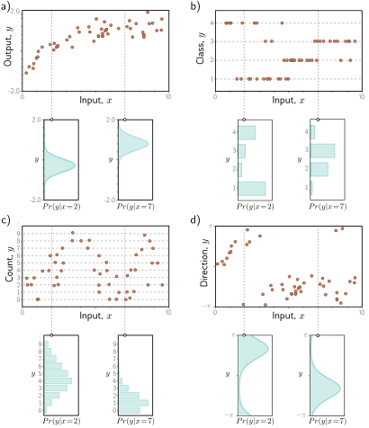

> **图 5.1 预测输出的分布。** a) 回归任务，目标是基于训练数据 $\{\mathbf{x}_i, \mathbf{y}_i\}$（橙色点）从输入 $x$ 预测一个实值输出 $y$。对于每个输入值 $x$，机器学习模型预测一个关于输出 $y \in \mathbb{R}$ 的分布 $\mathrm{Pr}(y|x)$（青色曲线显示了 $x=2.0$ 和 $x=7.0$ 时的分布）。最小化损失函数对应于最大化训练输出 $\mathbf{y}_i$ 在由相应输入 $\mathbf{x}_i$ 预测出的分布下的概率。b) 在一个分类任务中，为了预测离散类别 $y \in \{1, 2, 3, 4\}$，我们使用一个离散概率分布，因此模型为每个 $x_i$ 值预测一个关于四个可能 $y_i$ 值的不同直方图。c) 为了预测计数 $y \in \{0, 1, 2, \dots\}$ 以及 d) 方向 $y \in (-\pi, \pi]$，我们分别使用定义在正整数上和圆形域上的分布。
---

#### 5.1.1 计算输出的分布

这种视角的转变引出了一个问题：一个模型 $f[\mathbf{x}, \boldsymbol{\phi}]$ 究竟如何被改造以计算概率分布。解决方案很简单。首先，我们选择一个定义在输出域 $\mathbf{y}$ 上的参数化分布 $\mathrm{Pr}(\mathbf{y} | \boldsymbol{\theta})$。然后，我们使用网络来计算该分布的一个或多个参数 $\boldsymbol{\theta}$。

例如，假设预测域是实数集，即 $y \in \mathbb{R}$。这里，我们可以选择单变量正态分布，它定义在 $\mathbb{R}$上。该分布由均值 $\mu$ 和方差 $\sigma^2$ 定义，因此 $\boldsymbol{\theta} = \{\mu, \sigma^2\}$。机器学习模型可以预测均值 $\mu$，而方差 $\sigma^2$ 可以被视为一个未知的常数。

#### 5.1.2 最大似然准则

现在，模型为每个训练输入 $\mathbf{x}_i$ 计算出不同的分布参数 $\boldsymbol{\theta}_i = f[\mathbf{x}_i, \boldsymbol{\phi}]$。每个观测到的训练输出 $\mathbf{y}_i$ 在其对应的分布 $\mathrm{Pr}(\mathbf{y}_i | \boldsymbol{\theta}_i)$ 下都应具有高概率。因此，我们选择模型参数 $\boldsymbol{\phi}$，使它们在所有 $I$ 个训练样本上的联合概率最大化：

$$
\begin{aligned}
\hat{\boldsymbol{\phi}} &= \underset{\boldsymbol{\phi}}{\mathrm{argmax}} \left[ \prod_{i=1}^I \mathrm{Pr}(\mathbf{y}_i | \mathbf{x}_i) \right] \\
&= \underset{\boldsymbol{\phi}}{\mathrm{argmax}} \left[ \prod_{i=1}^I \mathrm{Pr}(\mathbf{y}_i | \boldsymbol{\theta}_i) \right] \\
&= \underset{\boldsymbol{\phi}}{\mathrm{argmax}} \left[ \prod_{i=1}^I \mathrm{Pr}(\mathbf{y}_i | f[\mathbf{x}_i, \boldsymbol{\phi}]) \right]
\end{aligned} \tag{5.1}
$$

这个联合概率项是参数的**似然**（likelihood），因此方程5.1被称为**最大似然准则**（maximum likelihood criterion）。¹

这里我们隐含地作了两个假设。首先，我们假设数据是**同分布的**（identically distributed），即每个数据点的输出 $\mathbf{y}_i$ 的概率分布形式是相同的。其次，我们假设给定输入的输出的条件分布 $\mathrm{Pr}(\mathbf{y}_i | \mathbf{x}_i)$ 是**独立的**（independent），因此训练数据的总似然可以分解为：参考：附录 C.1.5 独立性

$$
\mathrm{Pr}(\mathbf{y}_1, \mathbf{y}_2, \dots, \mathbf{y}_I | \mathbf{x}_1, \mathbf{x}_2, \dots, \mathbf{x}_I) = \prod_{i=1}^I \mathrm{Pr}(\mathbf{y}_i | \mathbf{x}_i) \tag{5.2}
$$

换言之，我们假设数据是**独立同分布的**（independent and identically distributed, i.i.d.）。

---
¹ 一个条件概率 $\mathrm{Pr}(z|\psi)$ 可以从两个角度看待。作为 $z$ 的函数，它是一个总和为1的概率分布。作为 $\psi$ 的函数，它被称为**似然**，通常总和不为1。

#### 5.1.3 最大化对数似然

最大似然准则（方程5.1）并不十分实用。每一项 $\mathrm{Pr}(\mathbf{y}_i | f[\mathbf{x}_i, \boldsymbol{\phi}])$ 可能很小，因此许多这样的项的乘积可能会变得极小。用有限精度的算术来表示这个量可能会很困难。幸运的是，我们可以等价地最大化似然的对数：

$$
\begin{aligned}
\hat{\boldsymbol{\phi}} &= \underset{\boldsymbol{\phi}}{\mathrm{argmax}} \left[ \prod_{i=1}^I \mathrm{Pr}(\mathbf{y}_i | f[\mathbf{x}_i, \boldsymbol{\phi}]) \right] \\
&= \underset{\boldsymbol{\phi}}{\mathrm{argmax}} \left[ \log \left[ \prod_{i=1}^I \mathrm{Pr}(\mathbf{y}_i | f[\mathbf{x}_i, \boldsymbol{\phi}]) \right] \right] \\
&= \underset{\boldsymbol{\phi}}{\mathrm{argmax}} \left[ \sum_{i=1}^I \log \left[ \mathrm{Pr}(\mathbf{y}_i | f[\mathbf{x}_i, \boldsymbol{\phi}]) \right] \right]
\end{aligned} \tag{5.3}
$$

这个**对数似然**（log-likelihood）准则是等价的，因为对数是一个单调递增函数：如果 $z > z'$，那么 $\log[z] > \log[z']$，反之亦然（图5.2）。由此可见，当我们改变模型参数 $\boldsymbol{\phi}$ 以改进对数似然准则时，我们也在改进原始的最大似然准则。同样可以得出，两个准则的全局最大值必定在同一位置，因此两种情况下最佳的模型参数 $\hat{\boldsymbol{\phi}}$ 是相同的。然而，对数似然准则具有使用项的和而非积的实际优势，因此用有限精度表示它不成问题。

---
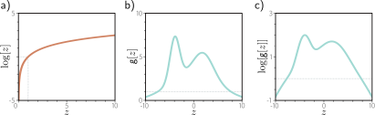

> **图 5.2 对数变换。** a) 对数函数是单调递增的。如果 $z > z'$，那么 $\log[z] > \log[z']$。因此，任何函数 $g[z]$ 的最大值将与 $\log[g[z]]$ 的最大值处于相同的位置。b) 一个函数 $g[z]$。c) 该函数的对数 $\log[g[z]]$。$g[z]$ 上所有斜率为正的位置在对数变换后仍然保持正斜率，而斜率为负的位置仍然保持负斜率。最大值的位置保持不变。
---

#### 5.1.4 最小化负对数似然

最后，我们注意到，按照惯例，模型拟合问题被表述为最小化一个损失。为了将最大对数似然准则转换为一个最小化问题，我们乘以负一，这便得到了**负对数似然**（negative log-likelihood）准则：

$$
\begin{aligned}
\hat{\boldsymbol{\phi}} &= \underset{\boldsymbol{\phi}}{\mathrm{argmin}} \left[ -\sum_{i=1}^I \log[\mathrm{Pr}(\mathbf{y}_i | f[\mathbf{x}_i, \boldsymbol{\phi}])] \right] \\
&= \underset{\boldsymbol{\phi}}{\mathrm{argmin}} \left[ L[\boldsymbol{\phi}] \right]
\end{aligned} \tag{5.4}
$$

这便构成了最终的损失函数 $L[\boldsymbol{\phi}]$。

#### 5.1.5 推理

网络不再直接预测输出 $\mathbf{y}$，而是确定一个关于 $\mathbf{y}$ 的概率分布。当我们执行推理时，我们通常想要一个点估计而不是一个分布，所以我们返回分布的最大值：

$$
\hat{\mathbf{y}} = \underset{\mathbf{y}}{\mathrm{argmax}} [\mathrm{Pr}(\mathbf{y} | f[\mathbf{x}, \hat{\boldsymbol{\phi}}])] \tag{5.5}
$$

通常可以根据模型预测的分布参数 $\boldsymbol{\theta}$ 找到这个最大值的表达式。例如，在单变量正态分布中，最大值出现在均值 $\mu$ 处。

### 5.2 构建损失函数的范式

因此，使用最大似然方法为训练数据 $\{\mathbf{x}_i, \mathbf{y}_i\}$ 构建损失函数的范式如下：
1.  选择一个定义在预测值 $\mathbf{y}$ 的域上、带有分布参数 $\boldsymbol{\theta}$ 的合适概率分布 $\mathrm{Pr}(\mathbf{y} | \boldsymbol{\theta})$。
2.  设置机器学习模型 $f[\mathbf{x}, \boldsymbol{\phi}]$ 来预测这些参数中的一个或多个，因此 $\boldsymbol{\theta} = f[\mathbf{x}, \boldsymbol{\phi}]$ 且 $\mathrm{Pr}(\mathbf{y} | \boldsymbol{\theta}) = \mathrm{Pr}(\mathbf{y} | f[\mathbf{x}, \boldsymbol{\phi}])$。
3.  为了训练模型，找到能最小化在训练数据集对 $\{\mathbf{x}_i, \mathbf{y}_i\}$ 上的负对数似然损失函数的网络参数 $\hat{\boldsymbol{\phi}}$：
    $$
    \hat{\boldsymbol{\phi}} = \underset{\boldsymbol{\phi}}{\mathrm{argmin}} \left[ L[\boldsymbol{\phi}] \right] = \underset{\boldsymbol{\phi}}{\mathrm{argmin}} \left[ -\sum_{i=1}^I \log[\mathrm{Pr}(\mathbf{y}_i | f[\mathbf{x}_i, \boldsymbol{\phi}])] \right] \tag{5.6}
    $$
4.  为了对新的测试样本 $\mathbf{x}$ 进行推理，返回完整的分布 $\mathrm{Pr}(\mathbf{y} | f[\mathbf{x}, \hat{\boldsymbol{\phi}}])$ 或该分布最大化的值。

本章余下的大部分内容将致力于使用这个范式为常见的预测类型构建损失函数。

### 5.3 示例1：单变量回归

我们从考虑单变量回归模型开始。这里的目标是使用带有参数 $\boldsymbol{\phi}$ 的模型 $f[\mathbf{x}, \boldsymbol{\phi}]$，从输入 $\mathbf{x}$ 预测单个标量输出 $y \in \mathbb{R}$。遵循上述范式，我们在输出域 $y$ 上选择一个概率分布。我们选择单变量正态分布（图5.3），它定义在 $y \in \mathbb{R}$ 上。它有两个参数（均值 $\mu$ 和方差 $\sigma^2$），其概率密度函数为：
$$
\mathrm{Pr}(y | \mu, \sigma^2) = \frac{1}{\sqrt{2\pi\sigma^2}} \exp\left[-\frac{(y-\mu)^2}{2\sigma^2}\right] \tag{5.7}
$$

其次，我们设置机器学习模型 $f[\mathbf{x}, \boldsymbol{\phi}]$ 来计算该分布的一个或多个参数。这里，我们只计算均值，所以 $\mu = f[\mathbf{x}, \boldsymbol{\phi}]$：
$$
\mathrm{Pr}(y | f[\mathbf{x}, \boldsymbol{\phi}], \sigma^2) = \frac{1}{\sqrt{2\pi\sigma^2}} \exp\left[-\frac{(y-f[\mathbf{x}, \boldsymbol{\phi}])^2}{2\sigma^2}\right] \tag{5.8}
$$

我们的目标是找到参数 $\boldsymbol{\phi}$，使得训练数据 $\{\mathbf{x}_i, y_i\}$ 在此分布下最有可能出现（图5.4）。为实现这一目标，我们选择一个基于负对数似然的损失函数 $L[\boldsymbol{\phi}]$：
$$
\begin{aligned}
L[\boldsymbol{\phi}] &= -\sum_{i=1}^I \log[\mathrm{Pr}(y_i | f[\mathbf{x}_i, \boldsymbol{\phi}], \sigma^2)] \\
&= -\sum_{i=1}^I \log\left[\frac{1}{\sqrt{2\pi\sigma^2}}\exp\left[-\frac{(y_i - f[\mathbf{x}_i, \boldsymbol{\phi}])^2}{2\sigma^2}\right]\right]
\end{aligned} \tag{5.9}
$$

当我们训练模型时，我们寻求最小化此损失的参数 $\boldsymbol{\phi}$。

---
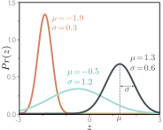

> **图 5.3 单变量正态分布**（也称为高斯分布）定义在实线 $z \in \mathbb{R}$ 上，并具有参数 $\mu$ 和 $\sigma^2$。均值 $\mu$ 决定了峰值的位置。方差 $\sigma^2$ 的正平方根（标准差）决定了分布的宽度。由于总概率密度加和为一，随着方差减小，峰值变高，分布变窄。
---

#### 5.3.1 最小二乘损失函数

现在让我们对损失函数进行一些代数操作。我们寻求：
$$
\begin{aligned}
\hat{\boldsymbol{\phi}} &= \underset{\boldsymbol{\phi}}{\mathrm{argmin}}\left[-\sum_{i=1}^I \log\left[\frac{1}{\sqrt{2\pi\sigma^2}}\exp\left[-\frac{(y_i-f[\mathbf{x}_i, \boldsymbol{\phi}])^2}{2\sigma^2}\right]\right]\right] \\
&= \underset{\boldsymbol{\phi}}{\mathrm{argmin}}\left[-\sum_{i=1}^I \left(\log\left[\frac{1}{\sqrt{2\pi\sigma^2}}\right] - \frac{(y_i-f[\mathbf{x}_i, \boldsymbol{\phi}])^2}{2\sigma^2}\right)\right] \\
&= \underset{\boldsymbol{\phi}}{\mathrm{argmin}}\left[-\sum_{i=1}^I -\frac{(y_i-f[\mathbf{x}_i, \boldsymbol{\phi}])^2}{2\sigma^2}\right] \\
&= \underset{\boldsymbol{\phi}}{\mathrm{argmin}}\left[\sum_{i=1}^I (y_i-f[\mathbf{x}_i, \boldsymbol{\phi}])^2\right]
\end{aligned} \tag{5.10}
$$

在第二行和第三行之间，我们移除了第一项，因为它不依赖于 $\boldsymbol{\phi}$。在第三行和第四行之间，我们移除了分母，因为它只是一个不影响最小值位置的正常数缩放因子。
这些操作的结果就是我们最初在第二章讨论线性回归时引入的最小二乘损失函数：
$$
L[\boldsymbol{\phi}] = \sum_{i=1}^I (y_i - f[\mathbf{x}_i, \boldsymbol{\phi}])^2 \tag{5.11}
$$

我们看到，最小二乘损失函数是基于以下假设自然得出的：预测是 (i) 独立的，并且 (ii) 来自均值为 $\mu = f[\mathbf{x}_i, \boldsymbol{\phi}]$ 的正态分布（图5.4）。参考：笔记本项目 5.1 最小二乘损失

---
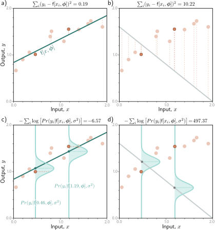

> **图 5.4 最小二乘与正态分布最大似然损失的等价性。** a) 考虑图2.2的线性模型。最小二乘准则最小化模型预测 $f[\mathbf{x}_i, \boldsymbol{\phi}]$（绿线）与真实输出值 $y_i$（橙色点）之间偏差（虚线）的平方和。此处拟合良好，因此这些偏差很小（例如，对于两个高亮点）。b) 对于这些参数，拟合效果差，平方偏差大。c) 最小二乘准则源于模型预测输出的正态分布均值并最大化其概率的假设。在第一种情况下，模型拟合良好，因此数据的概率 $\mathrm{Pr}(y_i | \mathbf{x}_i)$（水平橙色虚线）很大（且负对数概率很小）。d) 在第二种情况下，模型拟合差，因此概率很小，负对数概率很大。
---

#### 5.3.2 推理

网络不再直接预测 $y$，而是预测 $y$ 的正态分布的均值 $\mu = f[\mathbf{x}, \boldsymbol{\phi}]$。当执行推理时，我们通常想要一个单一的“最佳”点估计 $\hat{y}$，所以我们取预测分布的最大值：
$$
\hat{y} = \underset{y}{\mathrm{argmax}} [\mathrm{Pr}(y | f[\mathbf{x}, \hat{\boldsymbol{\phi}}], \sigma^2)] \tag{5.12}
$$

对于单变量正态分布，最大值位置由均值参数 $\mu$ 决定（图5.3）。这正是模型计算得出的，所以 $\hat{y} = f[\mathbf{x}, \hat{\boldsymbol{\phi}}]$。

#### 5.3.3 估计方差

为了推导最小二乘损失函数，我们假设网络预测了正态分布的均值。最终的表达式（方程5.11）出人意料地并不依赖于方差 $\sigma^2$。然而，我们完全可以将 $\sigma^2$ 视为一个学习的参数，并相对于模型参数 $\boldsymbol{\phi}$ 和分布方差 $\sigma^2$ 最小化方程5.9：
$$
\hat{\boldsymbol{\phi}}, \hat{\sigma}^2 = \underset{\boldsymbol{\phi}, \sigma^2}{\mathrm{argmin}}\left[-\sum_{i=1}^I \log\left[\frac{1}{\sqrt{2\pi\sigma^2}}\exp\left[-\frac{(y_i - f[\mathbf{x}_i, \boldsymbol{\phi}])^2}{2\sigma^2}\right]\right]\right] \tag{5.13}
$$

在推理时，模型从输入预测均值 $\mu = f[\mathbf{x}, \hat{\boldsymbol{\phi}}]$，而我们在训练过程中学习了方差 $\hat{\sigma}^2$。前者是最佳预测，后者告诉我们关于预测的不确定性。

#### 5.3.4 异方差回归

上述模型假设数据的方差在任何地方都是恒定的。然而，这可能不切实际。当模型的不确定性随输入数据变化时，我们称之为**异方差**（heteroscedastic）（相对于不确定性恒定的**同方差**（homoscedastic））。

对这种情况建模的一个简单方法是训练一个神经网络 $f[\mathbf{x}, \boldsymbol{\phi}]$，它同时计算均值和方差。例如，考虑一个具有两个输出的浅层网络。我们将第一个输出记为 $f_1[\mathbf{x}, \boldsymbol{\phi}]$，用它来预测均值；我们将第二个输出记为 $f_2[\mathbf{x}, \boldsymbol{\phi}]$，用它来预测方差。

这里有一个复杂之处：方差必须为正，但我们不能保证网络总是产生正输出。为确计算出的方差为正，我们将第二个网络输出通过一个将任意值映射到正值的函数。一个合适的选择是平方函数，得到：
$$
\begin{aligned}
\mu &= f_1[\mathbf{x}, \boldsymbol{\phi}] \\
\sigma^2 &= (f_2[\mathbf{x}, \boldsymbol{\phi}])^2
\end{aligned} \tag{5.14}
$$

这导致损失函数为：
$$
\hat{\boldsymbol{\phi}} = \underset{\boldsymbol{\phi}}{\mathrm{argmin}}\left[-\sum_{i=1}^I \log\left[\frac{1}{\sqrt{2\pi(f_2[\mathbf{x}_i, \boldsymbol{\phi}])^2}}\exp\left[-\frac{(y_i - f_1[\mathbf{x}_i, \boldsymbol{\phi}])^2}{2(f_2[\mathbf{x}_i, \boldsymbol{\phi}])^2}\right]\right]\right] \tag{5.15}
$$

同方差和异方差模型在图5.5中进行了比较。

---
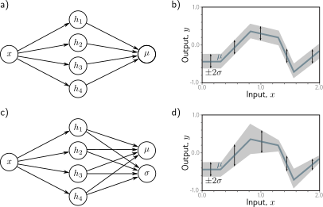

> **图 5.5 同方差与异方差回归。** a) 用于同方差回归的浅层神经网络仅从输入 $x$ 预测输出分布的均值 $\mu$。b) 结果是，虽然均值（蓝线）是输入 $x$ 的分段线性函数，但方差在各处都是恒定的（箭头和灰色区域显示 $\pm 2$ 标准差）。c) 用于异方差回归的浅层神经网络还预测方差 $\sigma^2$（或者更准确地说，计算其平方根，然后我们再平方）。d) 现在，标准差也成为输入 $x$ 的分段线性函数。
---

### 5.4 示例2：二元分类

在**二元分类**中，目标是将数据 $\mathbf{x}$ 分配到两个离散类别 $y \in \{0, 1\}$ 中的一个。在这种情况下，我们将 $y$ 称为**标签**（label）。二元分类的例子包括 (i) 根据文本数据 $\mathbf{x}$ 预测餐馆评论是正面的 ($y=1$) 还是负面的 ($y=0$)，以及 (ii) 根据MRI扫描 $\mathbf{x}$ 预测肿瘤是否存在 ($y=1$) 或不存在 ($y=0$)。

我们再次遵循5.2节的范式来构建损失函数。首先，我们在输出空间 $y \in \{0, 1\}$ 上选择一个概率分布。一个合适的选择是**伯努利分布**（Bernoulli distribution），它定义在域 $\{0, 1\}$ 上。它有一个单一参数 $\lambda \in [0, 1]$，表示 $y$ 取值为1的概率（图5.6）：
$$
\mathrm{Pr}(y | \lambda) = \begin{cases} 1-\lambda & y=0 \\ \lambda & y=1 \end{cases} \tag{5.16}
$$

这可以等价地写成：
$$
\mathrm{Pr}(y | \lambda) = (1-\lambda)^{1-y} \cdot \lambda^y \tag{5.17}
$$

其次，我们设置机器学习模型 $f[\mathbf{x}, \boldsymbol{\phi}]$ 来预测这个单一的分布参数 $\lambda$。然而，$\lambda$ 只能取 $[0, 1]$ 范围内的值，我们不能保证网络输出会落在这个范围内。因此，我们将网络输出通过一个将实数 $\mathbb{R}$ 映射到 $[0, 1]$ 的函数。一个合适的函数是**logistic sigmoid**（图5.7）：参考：问题 5.1
$$
\mathrm{sig}[z] = \frac{1}{1+\exp[-z]} \tag{5.18}
$$

因此，我们预测分布参数为 $\lambda = \mathrm{sig}[f[\mathbf{x}, \boldsymbol{\phi}]]$。现在的似然是：
$$
\mathrm{Pr}(y | \mathbf{x}) = (1-\mathrm{sig}[f[\mathbf{x}, \boldsymbol{\phi}]])^{1-y} \cdot \mathrm{sig}[f[\mathbf{x}, \boldsymbol{\phi}]]^y \tag{5.19}
$$

这在图5.8中为一个浅层神经网络模型所描绘。损失函数是训练集的负对数似然：
$$
L[\boldsymbol{\phi}] = \sum_{i=1}^I -(1-y_i)\log[1-\mathrm{sig}[f[\mathbf{x}_i, \boldsymbol{\phi}]]] - y_i\log[\mathrm{sig}[f[\mathbf{x}_i, \boldsymbol{\phi}]]] \tag{5.20}
$$

由于将在5.7节中解释的原因，这被称为**二元交叉熵损失**（binary cross-entropy loss）。

变换后的模型输出 $\mathrm{sig}[f[\mathbf{x}, \boldsymbol{\phi}]]$ 预测了伯努利分布的参数 $\lambda$。这代表了 $y=1$ 的概率，因此 $1-\lambda$ 代表了 $y=0$ 的概率。当执行推理时，我们可能想要一个 $y$ 的点估计，所以如果 $\lambda > 0.5$ 我们设 $\hat{y}=1$，否则设 $\hat{y}=0$。参考：笔记本项目 5.2 二元交叉熵损失，问题 5.2

---
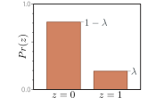

> **图 5.6 伯努利分布。** 伯努利分布定义在域 $z \in \{0, 1\}$ 上，并有一个单一参数 $\lambda$，表示观测到 $z=1$ 的概率。因此，观测到 $z=0$ 的概率是 $1-\lambda$。
---
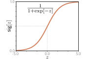

> **图 5.7 Logistic sigmoid函数。** 该函数将实线 $z \in \mathbb{R}$ 映射到0和1之间的数字，因此 $\mathrm{sig}[z] \in [0, 1]$。输入0被映射到0.5。负输入被映射到小于0.5的数，正输入被映射到大于0.5的数。
---
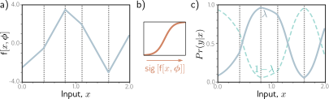

> **图 5.8 二元分类模型。** a) 网络输出是一个可以取任意实值的分段线性函数。b) 这被logistic sigmoid函数转换，将这些值压缩到范围 $[0, 1]$。c) 转换后的输出预测了 $y=1$ 的概率 $\lambda$（实线）。$y=0$ 的概率因此是 $1-\lambda$（虚线）。对于任何固定的 $x$（垂直切片），我们得到一个与图5.6类似的伯努利分布的两个值。损失函数偏好那些在与正例 $y_i=1$ 相关的位置 $x_i$ 处产生大的 $\lambda$ 值、在与负例 $y_i=0$ 相关的位置处产生小的 $\lambda$ 值的模型参数。
---

### 5.5 示例3：多类分类

**多类分类**的目标是将一个输入数据样本 $\mathbf{x}$ 分配到 $K > 2$ 个类别中的一个，因此 $y \in \{1, 2, \dots, K\}$。现实世界的例子包括 (i) 预测手写数字图像 $\mathbf{x}$ 中存在 $K=10$ 个数字中的哪一个 $y$，以及 (ii) 预测一个不完整句子 $\mathbf{x}$ 后面跟着 $K$ 个可能词中的哪一个 $y$。

我们再次遵循5.2节的范式。我们首先在预测空间 $y$ 上选择一个分布。在这种情况下，我们有 $y \in \{1, 2, \dots, K\}$，所以我们选择**分类分布**（categorical distribution）（图5.9），它定义在这个域上。这有 $K$ 个参数 $\lambda_1, \lambda_2, \dots, \lambda_K$，它们决定了每个类别的概率：
$$
\mathrm{Pr}(y=k) = \lambda_k \tag{5.21}
$$

这些参数被约束为取值在0和1之间，并且它们必须总和为一来确保这是一个有效的概率分布。

然后我们使用一个有 $K$ 个输出的网络 $f[\mathbf{x}, \boldsymbol{\phi}]$ 从输入 $\mathbf{x}$ 计算这 $K$ 个参数。不幸的是，网络的输出不一定遵守上述约束。因此，我们将网络的 $K$ 个输出通过一个确保这些约束得到满足的函数。一个合适的选择是 **softmax 函数**（图5.10）。它接受一个任意长度为 $K$ 的向量，并返回一个相同长度的向量，但现在元素都在范围 $[0, 1]$ 内并且总和为一。softmax 函数的第 $k$ 个输出是：
$$
\mathrm{softmax}_k[\mathbf{z}] = \frac{\exp[z_k]}{\sum_{k'=1}^K \exp[z_{k'}]} \tag{5.22}
$$

其中**指数函数**确保了正性，而分母中的和确保了这 $K$ 个数总和为一。参考：附录 B.1.3 指数函数

因此，输入 $\mathbf{x}$ 具有标签 $y=k$ 的似然（图5.10）是：
$$
\mathrm{Pr}(y=k | \mathbf{x}) = \mathrm{softmax}_k[f[\mathbf{x}, \boldsymbol{\phi}]] \tag{5.23}
$$

损失函数是训练数据的负对数似然：
$$
\begin{aligned}
L[\boldsymbol{\phi}] &= -\sum_{i=1}^I \log[\mathrm{softmax}_{y_i}[f[\mathbf{x}_i, \boldsymbol{\phi}]]] \\
&= -\sum_{i=1}^I \left( f_{y_i}[\mathbf{x}_i, \boldsymbol{\phi}] - \log\left[\sum_{k'=1}^K \exp[f_{k'}[\mathbf{x}_i, \boldsymbol{\phi}]]\right] \right)
\end{aligned} \tag{5.24}
$$

其中 $f_{y_i}[\mathbf{x}, \boldsymbol{\phi}]$ 和 $f_{k'}[\mathbf{x}, \boldsymbol{\phi}]$ 分别表示网络的第 $y_i$ 个和第 $k'$ 个输出。由于将在5.7节中解释的原因，这被称为**多类交叉熵损失**（multiclass cross-entropy loss）。

变换后的模型输出代表了关于可能类别 $y \in \{1, 2, \dots, K\}$ 的分类分布。对于一个点估计，我们取最可能的类别 $\hat{y} = \mathrm{argmax}_k [\mathrm{Pr}(y=k | f[\mathbf{x}, \hat{\boldsymbol{\phi}}])]$。这对应于图5.10中该 $x$ 值处最高的曲线。参考：笔记本项目 5.3 多类交叉熵损失

---
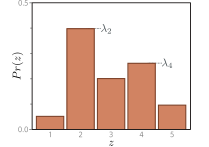

> **图 5.9 分类分布。** 分类分布为 $K>2$ 个类别分配概率，具有相关的概率 $\lambda_1, \lambda_2, \dots, \lambda_K$。这里有五个类别，所以 $K=5$。为确保这是一个有效的概率分布，每个参数 $\lambda_k$ 必须在 $[0, 1]$ 范围内，并且所有 $K$ 个参数必须总和为一。
---
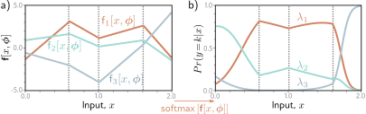

> **图 5.10 $K=3$ 类的多类分类。** a) 网络有三个分段线性输出，可以取任意值。b) 经过softmax函数后，这些输出被约束为非负且总和为一。因此，对于给定的输入 $x$，我们计算了分类分布的有效参数：此图的任何垂直切片都会产生三个总和为一的值，它们将构成一个类似于图5.9的分类分布中条形的高度。
---

#### 5.5.1 预测其他数据类型

在本章中，我们专注于回归和分类，因为这些问题非常普遍。然而，要进行不同类型的预测，我们只需在该域上选择一个合适的分布，并应用5.2节中的范式。图5.11列举了一系列概率分布及其预测域。其中一些在本章末尾的问题中进行了探讨。参考：问题 5.3-5.6

---
> **图 5.11 用于不同预测类型的损失函数的分布。**
>
> | 数据类型 | 域 | 分布 | 用途 |
> | :--- | :--- | :--- | :--- |
> | 单变量，连续，无界 | $y \in \mathbb{R}$ | 单变量正态 | 回归 |
> | 单变量，连续，无界 | $y \in \mathbb{R}$ | 拉普拉斯或t分布 | 稳健回归 |
> | 单变量，连续，无界 | $y \in \mathbb{R}$ | 高斯混合 | 多峰回归 |
> | 单变量，连续，下有界 | $y \in \mathbb{R}^+$ | 指数或伽马 | 预测量级 |
> | 单变量，连续，有界 | $y \in [0, 1]$ | Beta | 预测比例 |
> | 多变量，连续，无界 | $\mathbf{y} \in \mathbb{R}^K$ | 多变量正态 | 多变量回归 |
> | 单变量，连续，圆形 | $y \in (-\pi, \pi]$ | von Mises | 预测方向 |
> | 单变量，离散，二元 | $y \in \{0, 1\}$ | 伯努利 | 二元分类 |
> | 单变量，离散，有界 | $y \in \{1, 2, \dots, K\}$ | 分类 | 多类分类 |
> | 单变量，离散，下有界 | $y \in \{0, 1, 2, 3, \dots\}$ | 泊松 | 预测事件计数 |
> | 多变量，离散，排列 | $\mathbf{y} \in \text{Perm}[1, 2, \dots, K]$ | Plackett-Luce | 排序 |
---

### 5.6 多重输出

通常，我们希望用同一个模型做出多个预测，因此目标输出 $\mathbf{y}$ 是一个向量。例如，我们可能想预测一个分子的熔点和沸点（一个多变量回归问题，图1.2b），或者图像中每个点的对象类别（一个多变量分类问题，图1.4a）。虽然可以定义多变量概率分布并使用神经网络来建模其参数作为输入的函数，但更常见的做法是**将每个预测视为独立的**。

**独立性**意味着我们将概率 $\mathrm{Pr}(\mathbf{y} | f[\mathbf{x}, \boldsymbol{\phi}])$ 视为每个元素 $y_d \in \mathbf{y}$ 的单变量项的乘积：参考：附录 C.1.5 独立性
$$
\mathrm{Pr}(\mathbf{y} | f[\mathbf{x}, \boldsymbol{\phi}]) = \prod_d \mathrm{Pr}(y_d | f_d[\mathbf{x}, \boldsymbol{\phi}]) \tag{5.25}
$$

其中 $f_d[\mathbf{x}, \boldsymbol{\phi}]$ 是网络的第 $d$ 组输出，它们描述了关于 $y_d$ 的分布参数。例如，要预测多个连续变量 $y_d \in \mathbb{R}$，我们为每个 $y_d$ 使用一个正态分布，网络的输出 $f_d[\mathbf{x}, \boldsymbol{\phi}]$ 预测这些分布的均值。要预测多个离散变量 $y_d \in \{1, 2, \dots, K\}$，我们为每个 $y_d$ 使用一个分类分布。在这里，每组网络输出 $f_d[\mathbf{x}, \boldsymbol{\phi}]$ 预测了有助于 $y_d$ 分类分布的 $K$ 个值。

当我们最小化负对数概率时，这个乘积变成了一个项的和：
$$
L[\boldsymbol{\phi}] = -\sum_{i=1}^I \log[\mathrm{Pr}(\mathbf{y}_i | f[\mathbf{x}_i, \boldsymbol{\phi}])] = -\sum_{i=1}^I \sum_d \log[\mathrm{Pr}(y_{id} | f_d[\mathbf{x}_i, \boldsymbol{\phi}])] \tag{5.26}
$$

其中 $y_{id}$ 是第 $i$ 个训练样本的第 $d$ 个输出。

要同时进行两种或更多类型的预测，我们类似地假设每种预测中的误差是独立的。例如，要预测风向和风速，我们可以为方向选择von Mises分布（定义在圆形域上），为强度选择指数分布（定义在正实数上）。独立性假设意味着这两个预测的联合似然是单个似然的乘积。当我们计算负对数似然时，这些项将变为可加的。参考：问题 5.7-5.10

### 5.7 交叉熵损失

在本章中，我们开发了最小化负对数似然的损失函数。然而，术语**交叉熵损失**（cross-entropy loss）也很常见。在本节中，我们描述交叉熵损失，并证明它等价于使用负对数似然。

交叉熵损失基于找到参数 $\boldsymbol{\theta}$ 的思想，这些参数最小化了观测数据 $\mathbf{y}$ 的**经验分布**（empirical distribution）$q(\mathbf{y})$ 与模型分布 $\mathrm{Pr}(\mathbf{y} | \boldsymbol{\theta})$ 之间的距离（图5.12）。两个概率分布 $q(z)$ 和 $p(z)$ 之间的距离可以用**Kullback-Leibler (KL) 散度**来评估：参考：附录 C.5.1 KL散度
$$
D_{KL}[q || p] = \int_{-\infty}^{\infty} q(z)\log[q(z)]dz - \int_{-\infty}^{\infty} q(z)\log[p(z)]dz \tag{5.27}
$$

现在考虑我们在点 $\{y_i\}_{i=1}^I$ 处观测到一个经验数据分布。我们可以将其描述为点质量的加权和：
$$
q(y) = \frac{1}{I} \sum_{i=1}^I \delta[y-y_i] \tag{5.28}
$$

其中 $\delta[\cdot]$ 是**狄拉克δ函数**（Dirac delta function）。我们想要最小化模型分布 $\mathrm{Pr}(y|\boldsymbol{\theta})$ 和这个经验分布之间的KL散度：参考：附录 B.1.3 狄拉克δ函数
$$
\begin{aligned}
\hat{\boldsymbol{\theta}} &= \underset{\boldsymbol{\theta}}{\mathrm{argmin}} \left[ \int_{-\infty}^{\infty} q(y)\log[q(y)]dy - \int_{-\infty}^{\infty} q(y)\log[\mathrm{Pr}(y|\boldsymbol{\theta})]dy \right] \\
&= \underset{\boldsymbol{\theta}}{\mathrm{argmin}} \left[ -\int_{-\infty}^{\infty} q(y)\log[\mathrm{Pr}(y|\boldsymbol{\theta})]dy \right]
\end{aligned} \tag{5.29}
$$

---
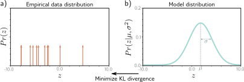

> **图 5.12 交叉熵方法。** a) 训练样本的经验分布（箭头表示狄拉克δ函数）。b) 模型分布（一个参数为 $\boldsymbol{\theta}=\{\mu, \sigma^2\}$ 的正态分布）。在交叉熵方法中，我们最小化这两个分布之间的距离（KL散度），并将其作为模型参数 $\boldsymbol{\theta}$ 的函数。
---

其中第一项消失了，因为它不依赖于 $\boldsymbol{\theta}$。剩下的第二项被称为**交叉熵**。它可以被解释为在考虑了我们从另一个分布中已经知道的信息后，一个分布中剩余的不确定性量。现在，我们代入方程5.28中 $q(y)$ 的定义：
$$
\begin{aligned}
\hat{\boldsymbol{\theta}} &= \underset{\boldsymbol{\theta}}{\mathrm{argmin}} \left[ -\int_{-\infty}^{\infty} \left( \frac{1}{I}\sum_{i=1}^I \delta[y-y_i] \right) \log[\mathrm{Pr}(y|\boldsymbol{\theta})] dy \right] \\
&= \underset{\boldsymbol{\theta}}{\mathrm{argmin}} \left[ \frac{1}{I} \sum_{i=1}^I \log[\mathrm{Pr}(y_i|\boldsymbol{\theta})] \right] \\
&= \underset{\boldsymbol{\theta}}{\mathrm{argmin}} \left[ -\sum_{i=1}^I \log[\mathrm{Pr}(y_i|\boldsymbol{\theta})] \right]
\end{aligned} \tag{5.30}
$$

第一行中两个项的乘积对应于将图5.12a中的点质量与图5.12b中分布的对数进行逐点相乘。我们最终得到一个以数据点为中心的加权概率质量的有限集合。在最后一行，我们消除了常数缩放因子 $1/I$，因为它不影响最小值的位置。

在机器学习中，分布参数 $\boldsymbol{\theta}$ 是由模型 $f[\mathbf{x}_i, \boldsymbol{\phi}]$ 计算的，所以我们有：
$$
\hat{\boldsymbol{\phi}} = \underset{\boldsymbol{\phi}}{\mathrm{argmin}} \left[ -\sum_{i=1}^I \log[\mathrm{Pr}(\mathbf{y}_i | f[\mathbf{x}_i, \boldsymbol{\phi}])] \right] \tag{5.31}
$$

这恰好是5.2节范式中的负对数似然准则。

因此，负对数似然准则（来自最大化数据似然）和交叉熵准则（来自最小化模型和经验数据分布之间的距离）是等价的。

### 5.8 总结

我们之前将神经网络视为直接从数据 $\mathbf{x}$ 预测输出 $\mathbf{y}$。在本章中，我们转变了视角，将神经网络视为计算关于输出空间的概率分布 $\mathrm{Pr}(\mathbf{y} | \boldsymbol{\theta})$ 的参数 $\boldsymbol{\theta}$。这引出了一种构建损失函数的原则性方法。我们选择能最大化在这些分布下观测数据似然的模型参数 $\boldsymbol{\phi}$。我们看到这等价于最小化负对数似然。

回归的最小二乘准则是这种方法的自然推论；它源于假设 $\mathbf{y}$ 是正态分布的，并且我们正在预测其均值。我们还看到了回归模型如何被 (i) 扩展以估计预测的不确定性，以及 (ii) 扩展以使该不确定性依赖于输入（异方差模型）。我们将相同的方法应用于二元和多类分类，并为每种情况推导了损失函数。我们讨论了如何处理更复杂的数据类型以及如何处理多个输出。最后，我们论证了交叉熵是思考模型拟合的等价方式。

在前面的章节中，我们开发了神经网络模型。在本章中，我们为决定一个模型对于给定的一组参数描述训练数据的效果有多好开发了损失函数。下一章将考虑模型训练，我们的目标是找到最小化该损失的模型参数。

### 注释

**基于正态分布的损失：** Nix & Weigend (1994) 和 Williams (1996) 研究了异方差非线性回归，其中输出的均值和方差都是输入的函数。在无监督学习的背景下，Burda et al. (2016) 使用基于具有对角协方差的多元正态分布的损失函数，而 Dorta et al. (2018) 使用基于具有完整协方差的正态分布的损失函数。

**稳健回归：** Qi et al. (2020) 研究了最小化平均绝对误差而非均方误差的回归模型的性质。这种损失函数源于假设输出服从拉普拉斯分布，并且它估计的是给定输入的**中位数**输出，而不是均值。Barron (2019) 提出了一种参数化稳健性程度的损失函数。在概率背景下解释时，它产生了一系列单变量概率分布，其中包括正态分布和柯西分布作为特例。

**估计分位数：** 有时，在回归任务中我们可能不想估计均值或中位数，而是想预测一个**分位数**。例如，这对于风险模型很有用，我们想知道真实值有90%的时间会低于预测值。这被称为**分位数回归** (Koenker & Hallock, 2001)。这可以通过拟合一个异方差回归模型然后基于预测的正态分布来估计分位数来完成。或者，可以直接使用**分位数损失**（也称为**弹球损失** pinball loss）来估计分位数。在实践中，这最小化了数据与模型的绝对偏差，但对一个方向的偏差给予比另一个方向更大的权重。最近的工作研究了同时预测多个分位数以了解整体分布形状 (Rodrigues & Pereira, 2020)。

**类别不平衡和焦点损失：** Lin et al. (2017c) 解决了分类问题中的数据不平衡问题。如果某些类别的样本数量远大于其他类别，那么标准的最大似然损失效果不佳；模型可能会专注于对来自主导类别的已正确分类的样本变得更加自信，而对代表性不足的类别分类得很差。Lin et al. (2017c) 引入了**焦点损失** (focal loss)，它增加了一个额外的参数，以降低已正确分类样本的影响，从而提高性能。

**学习排序：** Cao et al. (2007)、Xia et al. (2008) 和 Chen et al. (2009) 都在损失函数中使用了Plackett-Luce模型来学习对数据进行排序。这是学习排序的**列表方法** (listwise approach)，因为模型一次性接收整个待排序的对象列表。替代方法是**逐点方法** (pointwise approach)，其中模型接收单个对象；以及**成对方法** (pairwise approach)，其中模型接收成对的对象。Chen et al. (2009) 总结了不同的学习排序方法。

**其他数据类型：** Fan et al. (2020) 使用基于beta分布的损失来预测介于0和1之间的值。Jacobs et al. (1991) 和 Bishop (1994) 研究了用于多峰数据的**混合密度网络**。这些模型将输出建模为高斯分布的混合。

---
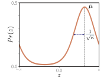

> **图 5.13 von Mises分布** 定义在圆形域 $(-\pi, \pi]$ 上。它有两个参数。均值 $\mu$ 决定了峰值的位置。集中度 $\kappa > 0$ 的作用类似于方差的倒数。因此 $1/\sqrt{\kappa}$ 大致等价于正态分布中的标准差。
---
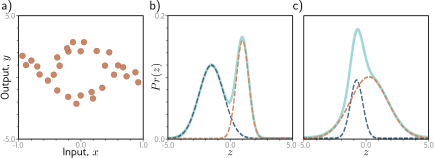

> **图 5.14 多峰数据和高斯混合密度。** a) 示例训练数据，对于中间的输入 $x$ 值，相应的输出 $y$ 遵循两条路径之一。例如，在 $x=0$ 处，输出 $y$ 可能大约是-2或+3，但不太可能介于两者之间。b) 高斯混合是适合此类数据的概率模型。顾名思义，该模型是具有不同均值和方差的两个或多个正态分布的加权和（实线青色曲线）（此处为两个正态分布，虚线蓝色和橙色曲线）。当均值相距很远时，这形成一个多峰分布。c) 当均值接近时，混合模型可以模拟单峰但非正态的密度。
---
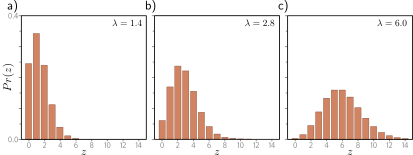

> **图 5.15 泊松分布。** 这个离散分布定义在非负整数 $z \in \{0, 1, 2, \dots\}$ 上。它有一个单一参数 $\lambda \in \mathbb{R}^+$，被称为**率**，并且是分布的均值。a-c) 分别是率为1.4, 2.8和6.0的泊松分布。
---

（见图5.14），这是条件于输入的。Prokudin et al. (2018) 使用von Mises分布来预测方向（见图5.13）。Fallah et al. (2009) 使用泊松分布为预测计数构建了损失函数（见图5.15）。Ng et al. (2017) 使用基于伽马分布的损失函数来预测持续时间。

**非概率方法：** 并非必须采用本章讨论的概率方法，但这已成为近年来的默认方法；任何旨在减少模型输出与训练输出之间距离的损失函数都足够了，并且距离可以用任何看似合理的方式定义。有几个著名的非概率机器学习分类模型，包括使用**合页损失** (hinge loss) 的**支持向量机** (Vapnik, 1995; Cristianini & Shawe-Taylor, 2000)，以及使用**指数损失** (exponential loss) 的**AdaBoost** (Freund & Schapire, 1997)。

### 习题

**问题 5.1** 证明 logistic sigmoid 函数 $\mathrm{sig}[z]$ 在 $z \to -\infty$ 时变为0，在 $z=0$ 时为0.5，在 $z \to \infty$ 时变为1，其中：
$$
\mathrm{sig}[z] = \frac{1}{1 + \exp[-z]} \tag{5.32}
$$

**思路与解答：**
1.  当 $z \to -\infty$, $\exp[-z] \to \infty$, 因此分母 $1+\exp[-z] \to \infty$, 故 $\mathrm{sig}[z] \to 0$。
2.  当 $z = 0$, $\exp[-0] = 1$, 因此 $\mathrm{sig}[z] = 1/(1+1) = 0.5$。
3.  当 $z \to \infty$, $\exp[-z] \to 0$, 因此分母 $1+\exp[-z] \to 1$, 故 $\mathrm{sig}[z] \to 1$。

**问题 5.2** 对于单个训练对 $\{\mathbf{x}, y\}$，二元分类的损失 $L$ 是：
$$
L = -(1-y)\log[1-\mathrm{sig}[f[\mathbf{x}, \boldsymbol{\phi}]]] - y\log[\mathrm{sig}[f[\mathbf{x}, \boldsymbol{\phi}]]] \tag{5.33}
$$
其中 $\mathrm{sig}[\cdot]$ 在方程5.32中定义。将这个损失绘制成变换后的网络输出 $\mathrm{sig}[f[\mathbf{x}, \boldsymbol{\phi}]] \in [0, 1]$ 的函数，(i) 当训练标签 $y=0$ 时，以及 (ii) 当 $y=1$ 时。

**思路与解答：**
令 $p = \mathrm{sig}[f[\mathbf{x}, \boldsymbol{\phi}]]$。
(i) 当 $y=0$ 时，损失为 $L = -\log[1-p]$。当 $p$ 从0接近1时，$\log[1-p]$ 从0趋向负无穷，因此 $-\log[1-p]$ 从0趋向正无穷。损失在 $p=0$ 处最小化。
(ii) 当 $y=1$ 时，损失为 $L = -\log[p]$。当 $p$ 从0接近1时，$\log[p]$ 从负无穷趋向0，因此 $-\log[p]$ 从正无穷趋向0。损失在 $p=1$ 处最小化。
这两个图表显示，损失函数会惩罚那些与真实标签不符的预测概率。

**问题 5.3*** 假设我们想建立一个模型，根据当地气压测量值 $\mathbf{x}$ 预测盛行风的方向 $y$（以弧度为单位）。一个适合圆形域的分布是von Mises分布（图5.13）：
$$
\mathrm{Pr}(y | \mu, \kappa) = \frac{\exp[\kappa\cos[y-\mu]]}{2\pi \cdot \mathrm{I_0}[\kappa]} \tag{5.34}
$$
其中 $\mu$ 是平均方向的度量，$\kappa$ 是集中度的度量（即方差的倒数）。$\mathrm{I_0}[\kappa]$ 是零阶的第一类修正贝塞尔函数。使用5.2节的范式，为学习模型 $f[\mathbf{x}, \boldsymbol{\phi}]$ 的参数 $\mu$ 以预测最可能的风向开发一个损失函数。你的解答应将集中度 $\kappa$ 视为常数。你将如何执行推理？

**思路与解答：**
1.  **选择分布：** von Mises 分布 $\mathrm{Pr}(y | \mu, \kappa)$。
2.  **模型预测：** 模型预测参数 $\mu$，即 $\mu = f[\mathbf{x}, \boldsymbol{\phi}]$。$\kappa$ 是常数。
3.  **损失函数：** 损失是负对数似然。对于单个数据点，
    $L_i = -\log[\mathrm{Pr}(y_i | \mu_i, \kappa)] = - \log\left[\frac{\exp[\kappa\cos[y_i-f[\mathbf{x}_i, \boldsymbol{\phi}]]]}{2\pi \mathrm{I_0}[\kappa]}\right]$
    $L_i = -\kappa\cos[y_i-f[\mathbf{x}_i, \boldsymbol{\phi}]] + \log[2\pi \mathrm{I_0}[\kappa]]$。
    由于 $\kappa$, $2\pi$, $\mathrm{I_0}[\kappa]$ 都是与 $\boldsymbol{\phi}$ 无关的常数，最小化总损失 $L = \sum_i L_i$ 等价于最小化 $L = -\sum_i \cos[y_i - f[\mathbf{x}_i, \boldsymbol{\phi}]]$。
4.  **推理：** 我们要找到使 $\mathrm{Pr}(y | \mu, \kappa)$ 最大化的 $y$。这发生在 $\cos[y-\mu]$ 最大化时，即 $y-\mu=0$，所以 $\hat{y} = \mu = f[\mathbf{x}, \hat{\boldsymbol{\phi}}]$。推理就是直接使用网络的输出。

**问题 5.4*** 有时，输入 $\mathbf{x}$ 的输出 $y$ 是多峰的（图5.14a）；对于给定的输入，存在多个有效的预测。这里，我们可以使用正态分量的加权和作为输出的分布。这被称为**高斯混合模型**。例如，两个高斯的混合模型有参数 $\boldsymbol{\theta} = \{\lambda, \mu_1, \sigma_1^2, \mu_2, \sigma_2^2\}$：
$$
\mathrm{Pr}(y|\lambda, \mu_1, \mu_2, \sigma_1^2, \sigma_2^2) = \frac{\lambda}{\sqrt{2\pi\sigma_1^2}}\exp\left[-\frac{(y-\mu_1)^2}{2\sigma_1^2}\right] + \frac{1-\lambda}{\sqrt{2\pi\sigma_2^2}}\exp\left[-\frac{(y-\mu_2)^2}{2\sigma_2^2}\right] \tag{5.35}
$$
其中 $\lambda \in [0,1]$ 控制了两个分量的相对权重，它们的均值分别为 $\mu_1, \mu_2$，方差分别为 $\sigma_1^2, \sigma_2^2$。该模型可以表示具有两个峰值的分布（图5.14b）或具有一个峰值但形状更复杂的分布（图5.14c）。
使用5.2节的范式，构建一个用于训练模型 $f[\mathbf{x}, \boldsymbol{\phi}]$ 的损失函数，该模型接收输入 $\mathbf{x}$，具有参数 $\boldsymbol{\phi}$，并预测两个高斯的混合。损失应基于 $I$ 个训练数据对 $\{\mathbf{x}_i, y_i\}$。你预见在执行推理时会遇到什么问题？

**思路与解答：**
1.  **选择分布：** 高斯混合模型 $\mathrm{Pr}(y|\boldsymbol{\theta})$。
2.  **模型预测：** 模型 $f[\mathbf{x}, \boldsymbol{\phi}]$ 必须预测参数 $\boldsymbol{\theta} = \{\lambda, \mu_1, \mu_2, \sigma_1^2, \sigma_2^2\}$。因此，网络需要5个输出。为确保参数有效，我们必须转换它们：
    - 混合权重 $\lambda_i = \mathrm{sig}[f_1[\mathbf{x}_i, \boldsymbol{\phi}]]$ （使其在 [0,1] 之间）
    - 均值 $\mu_{1,i} = f_2[\mathbf{x}_i, \boldsymbol{\phi}]$ 和 $\mu_{2,i} = f_3[\mathbf{x}_i, \boldsymbol{\phi}]$
    - 方差 $\sigma_{1,i}^2 = \exp[f_4[\mathbf{x}_i, \boldsymbol{\phi}]]$ 和 $\sigma_{2,i}^2 = \exp[f_5[\mathbf{x}_i, \boldsymbol{\phi}]]$ （使其为正）
3.  **损失函数：** 总损失是所有训练样本的负对数似然之和：
    $L[\boldsymbol{\phi}] = -\sum_{i=1}^I \log[\mathrm{Pr}(y_i | \lambda_i, \mu_{1,i}, \sigma_{1,i}^2, \mu_{2,i}, \sigma_{2,i}^2)]$。
4.  **推理问题：** 推理的目标是找到使概率最大化的 $\hat{y}$。对于多峰分布，可能有多个局部最大值（模式）。返回单个点估计（如全局最大值）可能会丢失重要信息，因为它忽略了其他可能性。例如，如果两个峰值高度相近，只返回一个就具有误导性。一种解决方案是返回所有模式，或者返回整个预测分布，让用户决定如何使用它。

**问题 5.5** 考虑将问题5.3的模型扩展为使用两个von Mises分布的混合来预测风向。为该模型写出似然 $\mathrm{Pr}(y|\boldsymbol{\theta})$ 的表达式。网络需要产生多少个输出来？

**思路与解答：**
- **似然表达式：** 两个von Mises分布的混合模型的似然为：
  $\mathrm{Pr}(y|\boldsymbol{\theta}) = \lambda \cdot \mathrm{Pr}(y|\mu_1, \kappa_1) + (1-\lambda) \cdot \mathrm{Pr}(y|\mu_2, \kappa_2)$，其中 $\mathrm{Pr}(y|\mu, \kappa)$ 是von Mises的PDF。参数集为 $\boldsymbol{\theta} = \{\lambda, \mu_1, \kappa_1, \mu_2, \kappa_2\}$。
- **网络输出数量：** 网络需要预测这5个参数。因此，网络需要5个输出。与问题5.4类似，需要对这些输出进行转换以确保其有效性（$\lambda \in [0,1], \kappa_1 > 0, \kappa_2 > 0$）。

**问题 5.6** 考虑建立一个模型，根据包含一天中的时间、经纬度和社区类型的数据 $\mathbf{x}$，预测接下来一分钟内经过某给定点的行人数量 $y \in \{0, 1, 2, \dots\}$。一个适合建模计数的分布是泊松分布（图5.15）。它有一个单一参数 $\lambda > 0$，称为率，代表分布的均值。其概率密度函数为：
$$
\mathrm{Pr}(y=k) = \frac{\lambda^k e^{-\lambda}}{k!} \tag{5.36}
$$
假设我们有 $I$ 个训练对 $\{\mathbf{x}_i, y_i\}$，为该模型设计一个损失函数。

**思路与解答：**
1.  **选择分布：** 泊松分布 $\mathrm{Pr}(y=k|\lambda)$。
2.  **模型预测：** 模型预测率参数 $\lambda$。由于 $\lambda$ 必须为正，我们将网络输出通过一个保证正值的函数，例如指数函数：$\lambda = \exp[f[\mathbf{x}, \boldsymbol{\phi}]]$。
3.  **损失函数：** 单个数据点的负对数似然为：
    $L_i = -\log[\mathrm{Pr}(y_i | \lambda_i)] = -\log\left[\frac{\lambda_i^{y_i} e^{-\lambda_i}}{y_i!}\right] = - (y_i\log[\lambda_i] - \lambda_i - \log[y_i!])$。
    总损失为 $L[\boldsymbol{\phi}] = \sum_{i=1}^I L_i$。在最小化时，可以忽略与 $\boldsymbol{\phi}$ 无关的项 $\log[y_i!]$。因此，损失函数可以简化为 $L[\boldsymbol{\phi}] = \sum_{i=1}^I (\lambda_i - y_i\log[\lambda_i])$，其中 $\lambda_i = \exp[f[\mathbf{x}_i, \boldsymbol{\phi}]]$。

**问题 5.7** 考虑一个多变量回归问题，我们预测十个输出，即 $\mathbf{y} \in \mathbb{R}^{10}$，并用一个独立的、均值 $\mu_d$ 由网络预测、方差 $\sigma^2$ 为常数的正态分布对每个输出进行建模。写出似然 $\mathrm{Pr}(\mathbf{y}|f[\mathbf{x}, \boldsymbol{\phi}])$ 的表达式。证明如果不对方差 $\sigma^2$ 进行估计，最小化该模型的负对数似然仍然等价于最小化平方项的和。

**思路与解答：**
- **似然表达式：** 由于独立性，$\mathrm{Pr}(\mathbf{y}|f[\mathbf{x}, \boldsymbol{\phi}]) = \prod_{d=1}^{10} \mathrm{Pr}(y_d|f_d[\mathbf{x}, \boldsymbol{\phi}], \sigma^2)$。
- **等价性证明：** 负对数似然为 $L = -\sum_{i=1}^I \log[\prod_{d=1}^{10} \mathrm{Pr}(y_{id}|f_d[\mathbf{x}_i, \boldsymbol{\phi}], \sigma^2)] = -\sum_{i=1}^I \sum_{d=1}^{10} \log[\mathrm{Pr}(y_{id}|f_d[\mathbf{x}_i, \boldsymbol{\phi}], \sigma^2)]$。
  根据单变量回归的推导（方程5.10），每一项 $-\log[\mathrm{Pr}(y_{id}|...)]$ 在去掉与 $\boldsymbol{\phi}$ 无关的常数项后，与 $(y_{id} - f_d[\mathbf{x}_i, \boldsymbol{\phi}])^2$ 成正比。因此，总损失与 $\sum_{i=1}^I \sum_{d=1}^{10} (y_{id} - f_d[\mathbf{x}_i, \boldsymbol{\phi}])^2$ 等价。这正是所有维度上所有数据点误差的平方和。

**问题 5.8*** 为进行多变量预测 $\mathbf{y} \in \mathbb{R}^{D_o}$ 构建一个损失函数，该函数基于每个维度具有不同方差 $\sigma_d^2$ 的独立正态分布。假设一个异方差模型，即均值 $\mu_d$ 和方差 $\sigma_d^2$ 都作为数据的函数而变化。

**思路与解答：**
模型需要为每个维度 $d$ 预测均值 $\mu_d$ 和方差 $\sigma_d^2$。因此，网络需要 $2D_o$ 个输出。令 $f_d^{(1)}[\mathbf{x}, \boldsymbol{\phi}]$ 预测 $\mu_d$，令 $\exp(f_d^{(2)}[\mathbf{x}, \boldsymbol{\phi}])$ 预测 $\sigma_d^2$。
负对数似然为 $L[\boldsymbol{\phi}] = -\sum_{i=1}^I \sum_{d=1}^{D_o} \log[\mathrm{Pr}(y_{id}|\mu_{id}, \sigma_{id}^2)]$。
代入正态分布的PDF并化简，忽略常数项 $\log(2\pi)$：
$L[\boldsymbol{\phi}] = \frac{1}{2} \sum_{i=1}^I \sum_{d=1}^{D_o} \left(\log[\sigma_{id}^2] + \frac{(y_{id}-\mu_{id})^2}{\sigma_{id}^2}\right)$。
将 $\mu_{id}$ 和 $\sigma_{id}^2$ 替换为网络的输出，即可得到最终的损失函数。

**问题 5.9*** 考虑一个多变量回归问题，我们根据数据 $\mathbf{x}$ 预测一个人的身高（米）和体重（公斤）。这里，单位的取值范围差异很大。你认为这会导致什么问题？提出两种解决方案。

**思路与解答：**
- **问题：** 身高值在1-2米左右，而体重在50-100公斤左右。在使用最小二乘损失时，权重的误差平方值（例如，$(10 \text{kg})^2=100$）会远大于身高的误差平方值（例如，$(0.1 \text{m})^2=0.01$）。因此，损失函数会被体重误差主导，模型会优先优化对体重的拟合，而可能忽略对身高的拟合。
- **解决方案1：特征归一化。** 在计算损失之前，对输出目标（身高和体重）进行标准化处理，例如将它们分别缩放到均值为0、方差为1的范围。模型学习预测这些归一化后的值。在推理时，再将预测值反归一化回原始单位。
- **解决方案2：异方差建模。** 使用问题5.8中的异方差模型。让网络为身高和体重分别学习不同的方差 $\sigma_h^2$ 和 $\sigma_w^2$。损失函数中的 $\log[\sigma^2]$ 和 $1/\sigma^2$ 项会自适应地平衡不同尺度的误差。如果体重的误差较大，模型可以通过学习一个较大的 $\sigma_w^2$ 来降低该项在总损失中的权重，从而防止它主导整个优化过程。

**问题 5.10** 将问题5.3的模型扩展为同时预测风向和风速，并定义相关的损失函数。

**思路与解答：**
这是一个具有两个不同类型输出的多重输出问题。
1.  **为每个输出选择分布：**
    *   风向（$y_{dir} \in (-\pi, \pi]$）：使用von Mises分布，如问题5.3。
    *   风速（$y_{spd} \in \mathbb{R}^+$）：使用一个定义在正实数上的分布，例如指数分布 $\mathrm{Pr}(y_{spd}|\lambda) = \lambda e^{-\lambda y_{spd}}$。
2.  **模型预测：** 网络需要预测两个分布的参数。
    *   $f_1[\mathbf{x}, \boldsymbol{\phi}]$ 预测von Mises的均值 $\mu$。
    *   $f_2[\mathbf{x}, \boldsymbol{\phi}]$ 预测指数分布的率 $\lambda$。为保证 $\lambda > 0$，我们使用 $\lambda = \exp[f_2[\mathbf{x}, \boldsymbol{\phi}]]$。
3.  **损失函数：** 假设两个预测误差是独立的，总似然是各似然的乘积。因此，总损失是各损失的和：$L_{total} = L_{dir} + L_{spd}$。
    *   $L_{dir} = -\sum_i \log[\mathrm{Pr}(y_{i,dir}|f_1[\mathbf{x}_i, \boldsymbol{\phi}])]$
    *   $L_{spd} = -\sum_i \log[\mathrm{Pr}(y_{i,spd}|\exp[f_2[\mathbf{x}_i, \boldsymbol{\phi}]])]$
    将各自的PDF代入即可得到完整的损失函数。