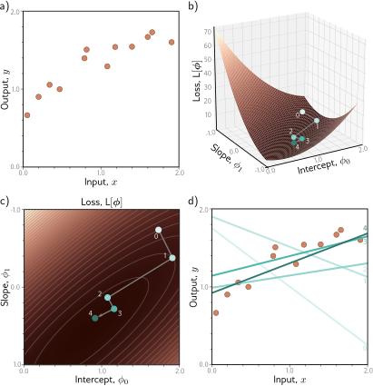
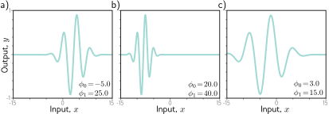
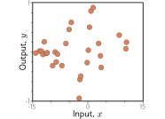
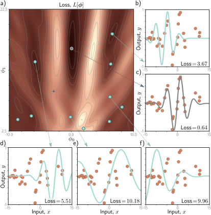
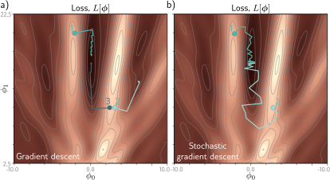
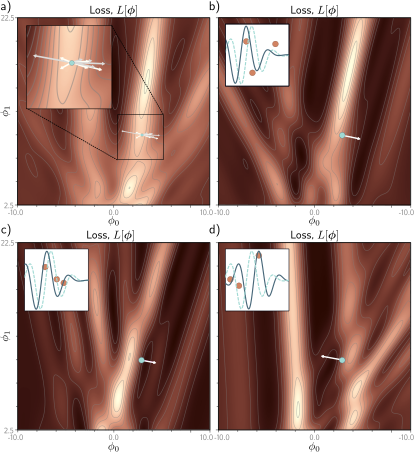
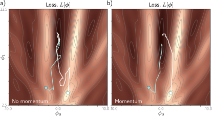
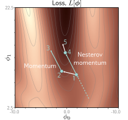
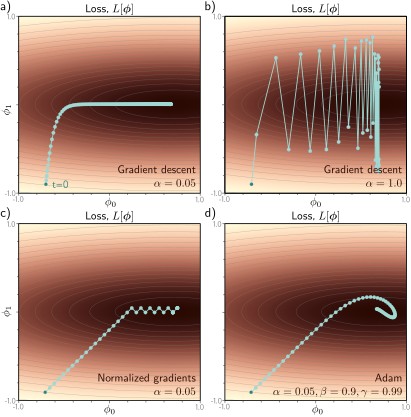
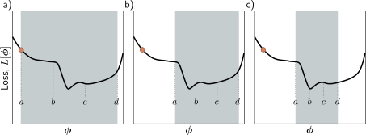

# 第六章

# 模型拟合

第三章和第四章描述了浅层与深度神经网络。它们代表了分段线性函数族，其中的具体函数由参数决定。第五章引入了损失——一个表示网络预测与训练集真实值之间不匹配程度的单一数值。

损失取决于网络参数，本章将探讨如何找到使该损失最小化的参数值。这个过程被称为**学习网络参数**，或者简称为**训练**或**拟合**模型。该过程首先选择初始参数值，然后迭代以下两个步骤：(i) 计算损失相对于参数的导数（梯度），以及 (ii) 基于梯度调整参数以减小损失。经过多次迭代，我们希望能达到损失函数的全局最小值。

本章将处理这些步骤中的第二步；我们考虑调整参数以减小损失的算法。第七章将讨论如何初始化参数以及如何计算神经网络的梯度。

### 6.1 梯度下降

为了拟合一个模型，我们需要一个由输入/输出对组成的训练集 $\{\mathbf{x}_i, \mathbf{y}_i\}$。我们寻求模型 $f[\mathbf{x}_i, \boldsymbol{\phi}]$ 的参数 $\boldsymbol{\phi}$，以使输入 $\mathbf{x}_i$ 尽可能精确地映射到输出 $\mathbf{y}_i$。为此，我们定义一个损失函数 $L[\boldsymbol{\phi}]$，它返回一个单一数值，量化了这种映射中的不匹配程度。一个**优化算法**的目标是找到能最小化该损失的参数 $\hat{\boldsymbol{\phi}}$：

$$
\hat{\boldsymbol{\phi}} = \underset{\boldsymbol{\phi}}{\mathrm{argmin}}[L[\boldsymbol{\phi}]] \tag{6.1}
$$

优化算法有很多族系，但训练神经网络的标准方法是迭代式的。这些算法启发式地初始化参数，然后以减小损失的方式反复调整它们。

这类方法中最简单的是**梯度下降法**（gradient descent）。它从初始参数 $\boldsymbol{\phi} = [\phi_0, \phi_1, \dots, \phi_N]^T$ 开始，并迭代以下两个步骤：

**第一步** 计算损失相对于参数的导数：

$$
\frac{\partial L}{\partial \boldsymbol{\phi}} = \begin{bmatrix} \frac{\partial L}{\partial \phi_0} \\ \frac{\partial L}{\partial \phi_1} \\ \vdots \\ \frac{\partial L}{\partial \phi_N} \end{bmatrix} \tag{6.2}
$$

**第二步** 根据以下规则更新参数：

$$
\boldsymbol{\phi} \leftarrow \boldsymbol{\phi} - \alpha \cdot \frac{\partial L}{\partial \boldsymbol{\phi}} \tag{6.3}
$$

其中正常数 $\alpha$ 决定了变化的大小。

第一步计算损失函数在当前位置的梯度。这决定了损失函数的**上坡**方向。第二步则沿着**下坡**方向移动一小段距离 $\alpha$（因此有负号）。参数 $\alpha$ 可能是固定的（在这种情况下，我们称之为**学习率**），或者我们可以执行**线搜索**（line search），尝试多个 $\alpha$ 值，以找到使损失下降最多的那一个。参考：笔记本项目 6.1 线搜索

在损失函数的最小值处，曲面必须是平坦的（否则我们可以通过下坡来进一步改进）。因此，梯度将为零，参数将停止变化。在实践中，我们监控梯度的大小，并在其变得过小时终止算法。

#### 6.1.1 线性回归示例

考虑将梯度下降法应用于第二章的一维线性回归模型。模型 $f[x, \boldsymbol{\phi}]$ 将标量输入 $x$ 映射到标量输出 $y$，并有两个参数 $\boldsymbol{\phi} = [\phi_0, \phi_1]^T$，分别代表y轴截距和斜率：

$$
\begin{aligned}
y &= f[x, \boldsymbol{\phi}] \\
&= \phi_0 + \phi_1 x
\end{aligned} \tag{6.4}
$$

给定一个包含 $I$ 个输入/输出对的数据集 $\{\mathbf{x}_i, \mathbf{y}_i\}$，我们选择最小二乘损失函数：

$$
\begin{aligned}
L[\boldsymbol{\phi}] = \sum_{i=1}^I l_i &= \sum_{i=1}^I (f[x_i, \boldsymbol{\phi}] - y_i)^2 \\
&= \sum_{i=1}^I (\phi_0 + \phi_1 x_i - y_i)^2
\end{aligned} \tag{6.5}
$$

其中项 $l_i = (\phi_0 + \phi_1 x_i - y_i)^2$ 是第 $i$ 个训练样本对损失的个体贡献。

损失函数相对于参数的导数可以分解为各个贡献的导数之和：

$$
\frac{\partial L}{\partial \boldsymbol{\phi}} = \frac{\partial}{\partial \boldsymbol{\phi}} \sum_{i=1}^I l_i = \sum_{i=1}^I \frac{\partial l_i}{\partial \boldsymbol{\phi}} \tag{6.6}
$$

其中这些导数由下式给出：参考：问题 6.1

$$
\frac{\partial l_i}{\partial \boldsymbol{\phi}} = \begin{bmatrix} \frac{\partial l_i}{\partial \phi_0} \\ \frac{\partial l_i}{\partial \phi_1} \end{bmatrix} = \begin{bmatrix} 2(\phi_0 + \phi_1 x_i - y_i) \\ 2x_i(\phi_0 + \phi_1 x_i - y_i) \end{bmatrix} \tag{6.7}
$$

图6.1展示了当我们根据方程6.6和6.7迭代计算导数，然后使用方程6.3中的规则更新参数时，该算法的进展。在这种情况下，我们使用了线搜索程序来找到每次迭代中使损失下降最多的 $\alpha$ 值。参考：笔记本项目 6.2 梯度下降

---

> **图 6.1 线性回归模型的梯度下降。** a) $I=12$ 个输入/输出对 $\{x_i, y_i\}$ 的训练集。b) 显示梯度下降迭代过程的损失函数。我们从点0开始，沿最陡的下坡方向移动，直到无法再改进为止，到达点1。然后我们重复此过程。我们在点1处测量梯度，并沿下坡方向移动到点2，依此类推。c) 这可以更好地通过热力图来可视化，其中亮度代表损失。仅仅四次迭代后，我们就已经接近最小值了。d) 参数在点0处的模型（最浅的线）对数据的描述非常糟糕，但每次后续迭代都改善了拟合。参数在点4处的模型（最深的线）已经能够合理地描述训练数据了。
---

#### 6.1.2 Gabor模型示例

线性回归问题的损失函数（图6.1c）总是有一个明确的全局最小值。更形式化地说，它们是**凸**的，这意味着每条弦（曲面上两点之间的线段）都位于函数之上并且不与之相交。凸性意味着无论我们在哪里初始化参数，只要我们一直下坡，就必定能达到最小值；训练过程不会失败。参考：问题 6.2

不幸的是，大多数非线性模型（包括浅层和深度网络）的损失函数都是**非凸**的。由于参数数量众多，可视化神经网络的损失函数具有挑战性。因此，我们首先探索一个更简单的、带两个参数的非线性模型，以洞察非凸损失函数的性质：参考：问题 6.3-6.5

$$
f[x, \boldsymbol{\phi}] = \sin[\phi_0 + 0.06 \cdot \phi_1 x] \cdot \exp\left(-\frac{(\phi_0 + 0.06 \cdot \phi_1 x)^2}{32.0}\right) \tag{6.8}
$$

这个 **Gabor 模型** 将标量输入 $x$ 映射到标量输出 $y$，它由一个正弦分量（产生振荡函数）乘以一个负指数分量（导致振幅随离中心距离的增加而减小）组成。它有两个参数 $\boldsymbol{\phi} = [\phi_0, \phi_1]^T$，其中 $\phi_0 \in \mathbb{R}$ 决定了函数的中心位置，$\phi_1 \in \mathbb{R}^+$ 则沿x轴拉伸或压缩函数（图6.2）。

考虑一个包含 $I$ 个样本的训练集 $\{x_i, y_i\}$（图6.3）。对于 $I$ 个训练样本，最小二乘损失函数定义为：

$$
L[\boldsymbol{\phi}] = \sum_{i=1}^I (f[x_i, \boldsymbol{\phi}] - y_i)^2 \tag{6.9}
$$

我们的目标仍然是找到最小化该损失的参数 $\hat{\boldsymbol{\phi}}$。

---

> **图 6.2 Gabor模型。** 这个非线性模型将标量输入 $x$ 映射到标量输出 $y$，并有两个参数 $\boldsymbol{\phi} = [\phi_0, \phi_1]^T$。它描述了一个振幅随离中心距离减小的正弦函数。参数 $\phi_0 \in \mathbb{R}$ 决定了中心的位置。随着 $\phi_0$ 的增加，函数向左移动。参数 $\phi_1 \in \mathbb{R}^+$ 相对于中心沿x轴压缩函数。随着 $\phi_1$ 的增加，函数变窄。a-c) 不同参数下的模型。（交互式图示）
---

> **图 6.3 用于拟合Gabor模型的训练数据。** 训练数据集包含28个输入/输出样本 $\{x_i, y_i\}$。这些数据是通过在 $[-15, 15]$ 区间内均匀采样 $x_i$，将样本通过参数为 $\boldsymbol{\phi} = [0.0, 16.6]^T$ 的Gabor模型，并添加正态分布噪声而创建的。
---

#### 6.1.3 局部最小值和鞍点

图6.4描绘了与该数据集的Gabor模型相关联的损失函数。存在多个**局部最小值**（青色圆圈）。在这里，梯度为零，如果我们向任何方向移动，损失都会增加，但我们并**不**处于函数的整体最小值。损失最低的点被称为**全局最小值**，并由灰色圆圈表示。参考：问题 6.6

如果我们从一个随机位置开始，并使用梯度下降法下坡，我们无法保证最终会到达全局最小值并找到最佳参数（图6.5a）。算法最终停在某个局部最小值的可能性同样大，甚至更大。此外，我们无法知道是否存在更好的解决方案。参考：问题 6.7-6.8

---

> **图 6.4 Gabor模型的损失函数。** a) 损失函数是非凸的，除了全局最小值（灰色圆圈）外，还有多个局部最小值（青色圆圈）。它还包含鞍点，即梯度局部为零，但函数在一个方向上增加，在另一个方向上减少。蓝色十字是一个鞍点的例子；当我们水平移动时函数减小，但当我们垂直移动时函数增加。b-f) 与不同最小值相关的模型。在每种情况下，都没有微小的变化可以减少损失。面板(c)显示了全局最小值，其损失为0.64。（交互式图示）
---

此外，损失函数还包含**鞍点**（例如，图6.4中的蓝色十字）。在这里，梯度为零，但函数在某些方向上增加，在其他方向上减少。如果当前参数不恰好在鞍点上，那么梯度下降可以通过下坡来逃逸。然而，鞍点附近的曲面是平坦的，因此很难确定训练是否已经收敛；如果我们在梯度很小时终止算法，我们可能会错误地停在鞍点附近。

### 6.2 随机梯度下降

Gabor模型只有两个参数，所以我们可以通过 (i) 穷举搜索参数空间或 (ii) 从不同位置重复启动梯度下降并选择损失最低的结果来找到全局最小值。然而，神经网络模型可能有数百万个参数，因此这两种方法都不实用。简而言之，使用梯度下降法寻找高维损失函数的全局最优解是具有挑战性的。我们可以找到一个最小值，但无法判断这是否是全局最小值，甚至是否是一个好的解。

一个主要问题是，梯度下降算法的最终目的地完全由其起点决定。**随机梯度下降**（Stochastic gradient descent, SGD）试图通过在每一步向梯度中添加一些噪声来解决这个问题。解在平均意义上仍然是下坡移动，但在任何给定的迭代中，选择的方向不一定是最陡的下坡方向。实际上，它甚至可能根本不是下坡。SGD算法有可能暂时上坡，从而从一个损失函数的“山谷”跳到另一个（图6.5b）。

---

> **图 6.5 梯度下降与随机梯度下降。** a) 带线搜索的梯度下降。只要梯度下降算法在损失函数的正确“山谷”中初始化（例如，点1和3），参数估计就会稳步地朝全局最小值移动。然而，如果它在该山谷之外初始化（例如，点2），它将下降到其中一个局部最小值。b) 随机梯度下降为优化过程增加了噪声，因此有可能逃离错误的山谷（例如，点2）并仍然达到全局最小值。
---

#### 6.2.1 批次和周期

引入随机性的机制很简单。在每次迭代中，算法选择训练数据的一个随机子集，并仅从这些样本中计算梯度。这个子集被称为**小批量**（minibatch）或简称**批次**（batch）。在迭代 $t$ 时，模型参数 $\boldsymbol{\phi}_t$ 的更新规则因此是：

$$
\boldsymbol{\phi}_{t+1} \leftarrow \boldsymbol{\phi}_t - \alpha \cdot \sum_{i \in \mathcal{B}_t} \frac{\partial l_i[\boldsymbol{\phi}_t]}{\partial \boldsymbol{\phi}} \tag{6.10}
$$

其中 $\mathcal{B}_t$ 是一个包含当前批次中输入/输出对索引的集合，并且如前所述，$l_i$ 是由于第 $i$ 对造成的损失。项 $\alpha$ 是学习率，它与梯度大小共同决定了每次迭代移动的距离。学习率在程序开始时选择，并且不依赖于函数的局部性质。参考：笔记本项目 6.3 随机梯度下降

批次通常是从数据集中**无放回抽样**的。算法会遍历训练样本，直到用完所有数据，此时它会再次从完整的训练数据集中开始采样。对整个训练数据集的单次完整遍历被称为一个**周期**（epoch）。一个批次可以小到一个样本，也可以大到整个数据集。后一种情况被称为**全批量梯度下降**，与常规（非随机）梯度下降相同。参考：问题 6.9

---

> **图 6.6 SGD的另一种视图，用于批次大小为3的Gabor模型。** a) 整个训练数据集的损失函数。在每次迭代中，都存在一个可能的参数变化概率分布（插图显示样本）。这些对应于三个批次元素的不同选择。b) 一种可能的批次的损失函数。SGD算法在此函数上沿下坡方向移动一段距离，该距离由学习率和局部梯度大小决定。当前模型（插图中的虚线函数）发生变化以更好地拟合批次数据（实线函数）。c) 不同的批次会产生不同的损失函数（形式相同但路径不同），并导致不同的更新。d) 对于这个批次，算法相对于批次损失函数是下坡移动，但相对于面板(a)中的全局损失函数却是上坡移动。这就是SGD如何能够逃离局部最小值。
---

对SGD的另一种解释是，它在每次迭代中都计算一个不同损失函数的梯度（损失函数既包含函数形式又包含曲面与梯度等实际行为）；损失函数既依赖于模型也依赖于训练数据，因此对于每个随机选择的批次都会有所不同。在这种观点下，SGD在不断变化的损失函数上执行确定性的梯度下降（图6.6）。然而，尽管存在这种可变性，任何点的**期望损失**和**期望梯度**都与梯度下降中的保持相同。

#### 6.2.2 随机梯度下降的性质

SGD有几个吸引人的特点。首先，尽管它为轨迹增加了噪声，但它在每次迭代中仍然改进了对数据子集的拟合。因此，即使更新不是最优的，它们也倾向于是合理的。其次，因为它无放回地抽取训练样本并遍历数据集，所以所有训练样本的贡献仍然是均等的。第三，计算一个子集的梯度在计算上比计算整个数据集的梯度要便宜得多。第四，它（原则上）可以逃离局部最小值。第五，它降低了被困在鞍点附近的机会；在损失函数上的任何一点，至少有一些可能的批次会产生显著的梯度。最后，有一些证据表明，SGD找到的神经网络参数在实践中能很好地泛化到新数据（见第9.2节）。

SGD不一定在传统意义上“收敛”。然而，我们希望当接近全局最小值时，所有数据点都会被模型很好地描述。因此，无论选择哪个批次，梯度都会很小，参数也就不再有大的变化。在实践中，SGD通常与**学习率调度**（learning rate schedule）一起应用。学习率 $\alpha$ 开始时值较高，每 $N$ 个周期就按一个常数因子减小。其逻辑是，在训练的早期阶段，我们希望算法探索参数空间，从一个山谷跳到另一个山谷以找到一个合理的区域。在后期阶段，我们大致在正确的位置，更关心的是微调参数，所以我们减小 $\alpha$ 以进行更小的改动。

### 6.3 动量

对随机梯度下降的一个常见修改是添加一个**动量**（momentum）项。我们用当前批次计算的梯度和上一步移动方向的加权组合来更新参数：

$$
\begin{aligned}
\mathbf{m}_{t+1} &\leftarrow \beta \cdot \mathbf{m}_t + (1-\beta) \sum_{i \in \mathcal{B}_t} \frac{\partial l_i[\boldsymbol{\phi}_t]}{\partial \boldsymbol{\phi}} \\
\boldsymbol{\phi}_{t+1} &\leftarrow \boldsymbol{\phi}_t - \alpha \cdot \mathbf{m}_{t+1}
\end{aligned} \tag{6.11}
$$

其中 $\mathbf{m}_t$ 是动量（驱动迭代 $t$ 的更新），$\beta \in [0,1)$ 控制了梯度随时间平滑的程度，$\alpha$ 是学习率。参考：问题 6.10

动量计算的递归形式意味着梯度步长是所有先前梯度的无限加权和，权重随着时间回溯而变小。如果所有这些梯度在多次迭代中都对齐，有效学习率会增加；但如果梯度方向反复变化，有效学习率会减小，因为和里面的项会相互抵消。总体效果是轨迹更平滑，并且在山谷中的振荡行为减少（图6.7）。

---

> **图 6.7 带动量的随机梯度下降。** a) 常规的随机梯度下降朝着最小值走了一条非常曲折的路径。b) 使用动量项时，当前步骤的变化是先前变化和从批次中计算出的梯度的加权组合。这平滑了轨迹并提高了收敛速度。
---

#### 6.3.1 Nesterov加速动量

动量项可以被看作是SGD算法下一步将要移动位置的一个粗略预测。**Nesterov加速动量**（图6.8）在这个预测点而不是当前点计算梯度：

$$
\begin{aligned}
\mathbf{m}_{t+1} &\leftarrow \beta \cdot \mathbf{m}_t + (1-\beta) \sum_{i \in \mathcal{B}_t} \frac{\partial l_i[\boldsymbol{\phi}_t - \alpha \beta \cdot \mathbf{m}_t]}{\partial \boldsymbol{\phi}} \\
\boldsymbol{\phi}_{t+1} &\leftarrow \boldsymbol{\phi}_t - \alpha \cdot \mathbf{m}_{t+1}
\end{aligned} \tag{6.12}
$$

其中现在的梯度是在 $\boldsymbol{\phi}_t - \alpha \beta \cdot \mathbf{m}_t$ 处评估的。可以这样理解，梯度项现在修正了仅由动量提供的路径。参考：笔记本项目 6.4 动量

---

> **图 6.8 Nesterov加速动量。** 解沿着虚线轨迹到达点1。一个传统的动量更新在点1测量梯度，沿此方向移动一段距离到点2，然后加上前一次迭代的动量项（即与虚线方向相同），到达点3。Nesterov动量更新首先应用动量项（从点1移动到点4），然后测量梯度并应用更新，到达点5。
---

### 6.4 Adam

具有固定步长的梯度下降有以下不受欢迎的特性：它对与大梯度相关的参数进行大调整（也许我们应该更谨慎），而对与小梯度相关的参数进行小调整（也许我们应该进一步探索）。当损失曲面在一个方向上比另一个方向陡峭得多时，很难选择一个既能在两个方向上都取得良好进展又保持稳定的学习率（图6.9a-b）。

一个直接的方法是归一化梯度，以便我们在每个方向上移动固定的距离（由学习率决定）。为此，我们首先测量梯度 $\mathbf{m}_{t+1}$ 和逐点平方梯度 $\mathbf{v}_{t+1}$：

$$
\begin{aligned}
\mathbf{m}_{t+1} &\leftarrow \frac{\partial L[\boldsymbol{\phi}_t]}{\partial \boldsymbol{\phi}} \\
\mathbf{v}_{t+1} &\leftarrow \left( \frac{\partial L[\boldsymbol{\phi}_t]}{\partial \boldsymbol{\phi}} \right)^2
\end{aligned} \tag{6.13}
$$

然后我们应用更新规则：

$$
\boldsymbol{\phi}_{t+1} \leftarrow \boldsymbol{\phi}_t - \alpha \frac{\mathbf{m}_{t+1}}{\sqrt{\mathbf{v}_{t+1}} + \epsilon} \tag{6.14}
$$

其中平方根和除法都是逐点进行的，$\alpha$ 是学习率，$\epsilon$ 是一个小的常数，防止在梯度大小为零时除以零。项 $\mathbf{v}_{t+1}$ 是平方梯度，其正根用于归一化梯度本身，因此在每个坐标方向上只剩下符号。结果是算法沿每个坐标轴移动固定的距离 $\alpha$，方向由哪个方向是下坡决定（图6.9c）。这个简单的算法在两个方向上都取得了良好的进展，但除非它恰好落在最小值上，否则不会收敛。相反，它会在最小值附近来回反弹。

**自适应矩估计**（Adaptive moment estimation），或简称**Adam**，采纳了这个思想，并为梯度估计和平方梯度都添加了动量：

$$
\begin{aligned}
\mathbf{m}_{t+1} &\leftarrow \beta \cdot \mathbf{m}_t + (1-\beta) \frac{\partial L[\boldsymbol{\phi}_t]}{\partial \boldsymbol{\phi}} \\
\mathbf{v}_{t+1} &\leftarrow \gamma \cdot \mathbf{v}_t + (1-\gamma) \left( \frac{\partial L[\boldsymbol{\phi}_t]}{\partial \boldsymbol{\phi}} \right)^2
\end{aligned} \tag{6.15}
$$

其中 $\beta$ 和 $\gamma$ 是这两个统计量的动量系数。

使用动量等同于对这些统计量各自的历史进行加权平均。在程序开始时，所有先前的测量值实际上都是零，导致不切实际的小估计。因此，我们使用以下规则修改这些统计量：

$$
\begin{aligned}
\hat{\mathbf{m}}_{t+1} &\leftarrow \frac{\mathbf{m}_{t+1}}{1-\beta^{t+1}} \\
\hat{\mathbf{v}}_{t+1} &\leftarrow \frac{\mathbf{v}_{t+1}}{1-\gamma^{t+1}}
\end{aligned} \tag{6.16}
$$

由于 $\beta$ 和 $\gamma$ 在 $[0, 1)$ 范围内，带有指数 $t+1$ 的项随着每个时间步变小，分母趋近于1，这种修正的效果会减弱。

最后，我们像以前一样更新参数，但使用修正后的项：

$$
\boldsymbol{\phi}_{t+1} \leftarrow \boldsymbol{\phi}_t - \alpha \frac{\hat{\mathbf{m}}_{t+1}}{\sqrt{\hat{\mathbf{v}}_{t+1}} + \epsilon} \tag{6.17}
$$

结果是一个可以收敛到全局最小值，并且在参数空间的每个方向上都取得良好进展的算法。请注意，Adam通常用于随机设置，其中梯度及其平方是从小批量中计算的：

$$
\begin{aligned}
\mathbf{m}_{t+1} &\leftarrow \beta \cdot \mathbf{m}_t + (1-\beta) \sum_{i \in \mathcal{B}_t} \frac{\partial l_i[\boldsymbol{\phi}_t]}{\partial \boldsymbol{\phi}} \\
\mathbf{v}_{t+1} &\leftarrow \gamma \cdot \mathbf{v}_t + (1-\gamma) \left( \sum_{i \in \mathcal{B}_t} \frac{\partial l_i[\boldsymbol{\phi}_t]}{\partial \boldsymbol{\phi}} \right)^2
\end{aligned} \tag{6.18}
$$

因此轨迹在实践中是有噪声的。

正如我们将在第七章看到的，神经网络参数的梯度大小可能取决于它们在网络中的深度。Adam有助于补偿这种趋势，并平衡不同层之间的变化。在实践中，Adam还有一个优点，即对初始学习率不太敏感，因为它避免了像图6.9a-b中那样的情景，所以它不需要复杂的学习率调度。参考：笔记本项目 6.5 Adam

---

> **图 6.9 自适应矩估计 (Adam)。** a) 这个损失函数在垂直方向变化快，但在水平方向变化慢。如果我们用一个在垂直方向上取得良好进展的学习率来运行全批量梯度下降，那么算法需要很长时间才能达到最终的水平位置。b) 如果选择的学习率使算法在水平方向上取得良好进展，它会在垂直方向上并变得不稳定。c) 一个直接的方法是在每一步沿每个轴移动固定的距离，以便我们在两个方向都下坡。这是通过归一化梯度大小并只保留符号来实现的。然而，这通常不会收敛到精确的最小值，而是在其周围来回振荡（这里在最后两点之间）。d) Adam算法在估计的梯度和归一化项中都使用动量，从而创建了一条更平滑的路径。
---

### 6.5 训练算法超参数

学习算法、批次大小、学习率调度和动量系数的选择都被视为训练算法的**超参数**；它们直接影响最终的模型性能，但与模型参数不同。选择这些参数可能更像一门艺术而非科学，通常的做法是训练多个具有不同超参数的模型并选择最好的一个。这被称为**超参数搜索**。我们将在第八章回到这个问题。

### 6.6 总结

本章讨论了模型训练。这个问题被框定为寻找与损失函数 $L[\boldsymbol{\phi}]$ 最小值相对应的参数 $\boldsymbol{\phi}$。梯度下降法测量当前参数下损失函数的梯度（即，当我们对参数做微小改变时损失如何变化）。然后它沿着使损失下降最快的方向移动参数。这个过程重复进行直到收敛。

对于非线性函数，损失函数可能既有局部最小值（梯度下降会被困住），也有鞍点（梯度下降可能看起来已经收敛但实际上没有）。随机梯度下降有助于缓解这些问题。¹ 在每次迭代中，我们使用数据的不同随机子集（一个批次）来计算梯度。这为过程增加了噪声，并有助于防止算法被困在参数空间的次优区域。每次迭代在计算上也更便宜，因为它只使用数据的一个子集。我们看到添加动量项可以使收敛更有效。最后，我们介绍了Adam算法。

本章的思想适用于优化任何模型。下一章将探讨特定于神经网络训练的两个方面。首先，我们讨论如何计算损失相对于神经网络参数的梯度。这是通过著名的**反向传播算法**（backpropagation algorithm）完成的。其次，我们讨论如何在优化开始前初始化网络参数。没有仔细的初始化，优化所用的梯度可能会变得极大或极小，这会阻碍训练过程。

### 注释

**优化算法：** 优化算法在整个工程领域被广泛使用，通常更倾向于使用**目标函数**（objective function）这个术语，而不是损失函数或成本函数。梯度下降法由柯西（Cauchy，1847）发明，而随机梯度下降至少可以追溯到Robbins和Monro（1951）。两者之间的一个现代折衷是**随机方差缩减梯度下降**（Johnson & Zhang, 2013），其中全梯度被周期性地计算，期间穿插着随机更新。关于神经网络优化算法的综述可以在Ruder（2016）、Bottou等人（2018）和Sun（2020）中找到。Bottou（2012）讨论了SGD的最佳实践，包括无放回地打乱数据。

---
¹ 第二十章讨论了鞍点和局部最小值在深度学习中究竟在多大程度上是问题。实际上，深度网络出人意料地容易训练。

**凸性、极小值和鞍点：** 如果一个函数的所有弦（两点之间的线段）都位于曲面之上且不与之相交，则该函数是凸的。这可以通过考虑**海森矩阵**（Hessian matrix）（二阶导数矩阵）来检验：
$$
\mathbf{H}[\boldsymbol{\phi}] = 
\begin{bmatrix}
    \frac{\partial^2 L}{\partial \phi_0^2} & \frac{\partial^2 L}{\partial \phi_0 \partial \phi_1} & \dots & \frac{\partial^2 L}{\partial \phi_0 \partial \phi_N} \\
    \frac{\partial^2 L}{\partial \phi_1 \partial \phi_0} & \frac{\partial^2 L}{\partial \phi_1^2} & \dots & \frac{\partial^2 L}{\partial \phi_1 \partial \phi_N} \\
    \vdots & \vdots & \ddots & \vdots \\
    \frac{\partial^2 L}{\partial \phi_N \partial \phi_0} & \frac{\partial^2 L}{\partial \phi_N \partial \phi_1} & \dots & \frac{\partial^2 L}{\partial \phi_N^2}
\end{bmatrix}
\tag{6.19}
$$
如果海森矩阵对于所有可能的参数值都是正定的，那么该函数是凸的；它将有一个像碗一样的光滑形状（如图6.1c），那么它将很容易训练。将有一个唯一的全局最小值，没有局部最小值或鞍点。参考：附录 B.3.7 特征值

对于任何损失函数，海森矩阵在梯度为零的位置的性质可以对其进行分类。如果(i)所有特征值都为正，则该点为局部最小值，(ii)所有特征值都为负，则为局部最大值，(iii)在鞍点处，既有正特征值（对应于我们处于最小值方向），也有负特征值（对应于我们处于最大值方向）。

**线搜索：** 具有固定步长的梯度下降效率不高，因为移动的距离取决于梯度的幅度。它在梯度大时移动得多（也许应该更谨慎），在梯度小时移动得少（也许应该探索得更远）。因此，梯度下降法通常与线搜索程序结合使用，我们在所需方向上采样函数，以找到最佳步长。一种这样的方法是**托架法**（bracketing）（图6.10）。另一个问题是，梯度下降往往在山谷中表现出低效的振荡行为，如路径1在图6.5a所示。

---

> **图 6.10 使用托架法进行线搜索。** a) 当前解在位置a（橙色点），我们希望搜索区域[a, d]（灰色阴影区域）。我们在搜索区域内部定义两个点b, c，并评估这些点的损失函数。这里$L[b] > L[c]$，所以我们排除范围[a, b]。b) 我们现在在精炼的搜索区域中重复此过程，发现$L[b] < L[c]$，所以我们排除范围[c, d]。c) 我们重复此过程，直到这个最小值被紧密地托住。
---

**超越梯度下降：** 许多算法已经被开发出来，以补救梯度下降的问题。最著名的是**牛顿法**，它考虑了曲面的曲率；它将梯度乘以海森矩阵的逆，然后应用一个更谨慎的更新。这种方法消除了对学习率的需求，并且不会因振荡行为而受苦。然而，它有其自身的问题。在最简单的形式中，它倾向于走向最近的极值点，这可能是最大值，最小值，甚至是鞍点。此外，对于参数数量较大的情况，计算海森矩阵的逆是不可行的，就像在神经网络中一样。

**SGD的性质：** SGD的学习率趋近于零被理解为一种随机微分方程。Jastrzebski等人（2018）表明，这种方程的解与学习率与批次大小的比率有关，并且在批次大小和学习率之间存在一个关系，这会产生更好的解。考虑到这一点的更可靠的度量是损失函数对测试性能的影响（Simsekli等人，2019）。Smith和Le（2018）凭经验发现，SGD的泛化能力与批次大小和学习率的比率有很强的相关性。他们有一个大型模型在不同架构和数据集上运行的测试，并凭经验发现，当学习率与批次大小的比率较低时，测试准确性会提高。Smith和Goyal（2018）还凭经验发现，学习率与批次大小的比率对于泛化很重要（见图20.10）。

**动量：** 使用动量项来加速优化日期的想法可以追溯到Polyak（1964）。Goh（2017）对动量属性进行了深入的演示。

**加速梯度法**：由Nesterov（1983）引入。Nesterov动量首次由Sutskever等人（2013）在随机梯度下降的背景下应用。

**自适应训练算法：** **AdaGrad**（Duchi等人，2011）是一种优化算法，它通过为每个参数分配不同的学习率来解决某些参数可能需要比其他参数移动得更远的可能性。AdaGrad使用每个参数的累积平方梯度来衰减其学习率。这有一个缺点，即学习率随时间递减，学习可能在找到最小值之前就停止了。**RMSProp**（Hinton等人，2012a）和**AdaDelta**（Zeiler，2012）修改了此算法，通过递归更新平方梯度项来帮助防止这些问题。

迄今为止，最广泛使用的自适应训练算法是**自适应矩估计**或**Adam**（Kingma & Ba，2015）。它结合了动量（其中梯度向量随时间平均）和AdaGrad、AdaDelta和RMSProp（其中一个平滑的平方梯度项用于修改每个参数的学习率）的思想。Adam算法的原始论文为凸损失函数提供了收敛性证明，但Reddi等人（2018）发现了一个反例，他们开发了Adam的一个修改版本，称为**AMSGrad**，它确实收敛。当然，在深度学习中，损失函数是非凸的，Zaheer等人（2018）随后开发了一种自适应算法，称为**YOGI**，并证明了它在这种情况下收敛。尽管存在这些理论上的反对意见，原始的Adam算法在实践中表现良好，并被广泛使用，尤其是因为它在广泛的超参数范围内工作良好，并能取得快速的初步进展。

自适应训练算法的一个潜在问题是，学习率是基于观测梯度的累积统计数据的。在训练开始时，当样本很少时，这些统计数据可能非常嘈杂。这可以通过**学习率预热**（Goyal等人，2018）来补救，其中学习率在前几千次迭代中逐渐增加。另一种解决方案是**修正Adam**（Liu等人，2021a），它逐渐改变动量项，以避免高方差。Dozat（2016）将Nesterov动量并入Adam算法。

**SGD vs. Adam：** 关于SGD和Adam的相对优点一直有热烈的讨论。Wilson等人（2017）提供的证据表明，带动量的SGD可以找到比Adam更低的最小值，这在各种深度学习任务中泛化得更好。然而，这很奇怪，因为一旦修正项（方程6.16）变为1（这很快发生），SGD就是Adam的一个特例（当$\beta=0, \gamma=1$时）。因此，更有可能是当我们使用Adam的默认超参数时，SGD表现优于Adam。Loshchilov & Hutter（2019）提出了**AdamW**，它在存在L2正则化（见第9.1节）的情况下，大大提高了Adam的性能。Choi等人（2019）提供的证据表明，如果我们搜索最佳的Adam超参数，它的表现与SGD一样好，并且收敛得更快。Keskar & Socher（2017）提出了一种名为**SWATS**的方法，它开始时使用Adam（以取得快速的初始进展），然后切换到SGD（以获得更好的最终泛化性能）。

**穷举搜索：** 本章讨论的所有算法都是迭代的。一个完全不同的方法是量化网络参数，并使用SAT求解器穷举搜索由此产生的离散化参数空间（Mézard & Mora, 2009）。这种方法有可能找到全局最小值，并保证在其他地方没有更低的损失，但只对非常小的模型实用。

### 习题

**问题 6.1** 证明方程6.5中最小二乘损失函数的导数由方程6.7中的表达式给出。

**思路与解答：**
损失 $L = \sum_i l_i = \sum_i (\phi_0 + \phi_1 x_i - y_i)^2$。我们对 $\boldsymbol{\phi}$ 求导。由于求和的导数是导数的和，我们只需对 $l_i$ 求导。
- $\frac{\partial l_i}{\partial \phi_0} = \frac{\partial}{\partial \phi_0}(\phi_0 + \phi_1 x_i - y_i)^2 = 2(\phi_0 + \phi_1 x_i - y_i) \cdot \frac{\partial}{\partial \phi_0}(\phi_0 + \phi_1 x_i - y_i) = 2(\phi_0 + \phi_1 x_i - y_i)$。
- $\frac{\partial l_i}{\partial \phi_1} = \frac{\partial}{\partial \phi_1}(\phi_0 + \phi_1 x_i - y_i)^2 = 2(\phi_0 + \phi_1 x_i - y_i) \cdot \frac{\partial}{\partial \phi_1}(\phi_0 + \phi_1 x_i - y_i) = 2x_i(\phi_0 + \phi_1 x_i - y_i)$。
将这两个结果放入向量形式即得到方程6.7。

**问题 6.2** 如果海森矩阵 $\mathbf{H}[\boldsymbol{\phi}]$ 的特征值在任何地方都为正，则可以保证一个曲面是凸的。在这种情况下，曲面有一个唯一的最小值，优化很容易。找到线性回归模型（方程6.5）的海森矩阵的代数表达式。通过证明其特征值总是正的来证明这个函数是凸的。这可以通过证明矩阵的迹和行列式都是正的来完成。

**思路与解答：**
海森矩阵 $\mathbf{H}$ 是二阶偏导数的矩阵。从问题6.1的导数开始：
- $\frac{\partial^2 L}{\partial \phi_0^2} = \sum_i \frac{\partial}{\partial \phi_0} [2(\phi_0 + \phi_1 x_i - y_i)] = \sum_i 2 = 2I$。
- $\frac{\partial^2 L}{\partial \phi_1^2} = \sum_i \frac{\partial}{\partial \phi_1} [2x_i(\phi_0 + \phi_1 x_i - y_i)] = \sum_i 2x_i^2$。
- $\frac{\partial^2 L}{\partial \phi_0 \partial \phi_1} = \frac{\partial^2 L}{\partial \phi_1 \partial \phi_0} = \sum_i \frac{\partial}{\partial \phi_0} [2x_i(\phi_0 + \phi_1 x_i - y_i)] = \sum_i 2x_i$。
- 所以，$\mathbf{H} = \begin{bmatrix} 2I & 2\sum_i x_i \\ 2\sum_i x_i & 2\sum_i x_i^2 \end{bmatrix}$。
- **迹 (Trace):** $\text{tr}(\mathbf{H}) = 2I + 2\sum_i x_i^2 = 2(I + \sum_i x_i^2)$。由于 $I>0$ 且 $x_i^2 \ge 0$，迹总是正的。
- **行列式 (Determinant):** $\det(\mathbf{H}) = (2I)(2\sum_i x_i^2) - (2\sum_i x_i)^2 = 4(I \sum_i x_i^2 - (\sum_i x_i)^2)$。
  根据柯西-施瓦茨不等式，$(\sum_i a_i b_i)^2 \le (\sum_i a_i^2)(\sum_i b_i^2)$。令 $a_i=1, b_i=x_i$，我们有 $(\sum_i x_i)^2 \le (\sum_i 1^2)(\sum_i x_i^2) = I \sum_i x_i^2$。因此 $I \sum_i x_i^2 - (\sum_i x_i)^2 \ge 0$。只要不是所有 $x_i$ 都相同，不等式就是严格的。
由于迹和行列式都是正的，两个特征值也都是正的，所以函数是凸的。

**问题 6.3** 计算Gabor模型（方程6.8）的最小二乘损失 $L[\boldsymbol{\phi}]$ 相对于参数 $\phi_0$ 和 $\phi_1$ 的导数。

**思路与解答：**
令 $g_i = \phi_0 + 0.06 \phi_1 x_i$。则 $f[x_i, \boldsymbol{\phi}] = \sin(g_i) \exp(-g_i^2/32)$。
$L = \sum_i (f_i - y_i)^2$。
$\frac{\partial L}{\partial \phi_j} = \sum_i 2(f_i - y_i) \frac{\partial f_i}{\partial \phi_j}$。
$\frac{\partial f_i}{\partial \phi_j} = (\cos(g_i)\exp(-g_i^2/32) + \sin(g_i)\exp(-g_i^2/32)(-\frac{2g_i}{32})) \frac{\partial g_i}{\partial \phi_j}$。
$\frac{\partial g_i}{\partial \phi_0}=1$ 且 $\frac{\partial g_i}{\partial \phi_1}=0.06x_i$。将这些代入即可得到最终表达式。

**问题 6.4*** 逻辑斯蒂回归模型使用线性函数将输入 $x$ 分配到两个类别 $y \in \{0,1\}$ 之一。对于一维输入和一维输出，它有两个参数 $\phi_0$ 和 $\phi_1$，定义为：
$$
\mathrm{Pr}(y=1|x) = \mathrm{sig}[\phi_0 + \phi_1 x] \tag{6.21}
$$
其中 $\mathrm{sig}[\cdot]$ 是logistic sigmoid函数：
$$
\mathrm{sig}[z] = \frac{1}{1 + \exp[-z]} \tag{6.22}
$$
(i) 为该模型绘制不同 $\phi_0$ 和 $\phi_1$ 值下的 $y$ 对 $x$ 的图，并解释每个参数的定性含义。(ii) 该模型的合适损失函数是什么？(iii) 计算该损失函数相对于参数的导数。(iv) 从均值为-1、标准差为1的正态分布生成10个数据点，并赋予它们标签$y=0$。再从均值为1、标准差为1的正态分布生成另外10个数据点，并赋予它们标签$y=1$。将损失绘制为关于两个参数 $\phi_0$ 和 $\phi_1$ 的热图。(v) 这个损失函数是凸的吗？你如何证明？

**思路与解答：**
(i) $\phi_0$ 控制决策边界的位置（当 $\phi_0+\phi_1 x=0$ 时，$\mathrm{Pr}(y=1|x)=0.5$）。$\phi_1$ 控制转换的陡峭程度；$|\phi_1|$ 越大，从0到1的转换越急剧。
(ii) 合适的损失函数是二元交叉熵损失（见方程5.20）。
(iii) 令 $p_i = \mathrm{sig}[\phi_0+\phi_1 x_i]$。损失 $L = -\sum_i(y_i \log p_i + (1-y_i) \log(1-p_i))$。
$\frac{\partial L}{\partial \phi_j} = -\sum_i (y_i \frac{1}{p_i} - (1-y_i)\frac{1}{1-p_i})\frac{\partial p_i}{\partial \phi_j}$。
$\frac{\partial p_i}{\partial \phi_j} = p_i(1-p_i)\frac{\partial(\phi_0+\phi_1 x_i)}{\partial \phi_j}$。
$\frac{\partial L}{\partial \phi_j} = -\sum_i (y_i(1-p_i) - (1-y_i)p_i)\frac{\partial(\phi_0+\phi_1 x_i)}{\partial \phi_j} = \sum_i (p_i - y_i)\frac{\partial(\phi_0+\phi_1 x_i)}{\partial \phi_j}$。
所以 $\frac{\partial L}{\partial \phi_0} = \sum_i (p_i-y_i)$ 且 $\frac{\partial L}{\partial \phi_1} = \sum_i (p_i-y_i)x_i$。
(iv) 这需要编写代码来生成数据并绘制热图。热图应该显示一个大致碗状的区域，其最小值位于将两类数据分开的 $\phi_0, \phi_1$ 值附近。
(v) 是，这个损失函数是凸的。可以通过计算海森矩阵并证明它是半正定的来证明。这是一个标准的统计学结果。

**问题 6.5*** 计算方程3.1中介绍的简单神经网络模型关于十个参数的最小二乘损失的导数：
$$
f[x, \boldsymbol{\phi}] = \phi_0 + \phi_1 a[\theta_{10} + \theta_{11}x] + \phi_2 a[\theta_{20} + \theta_{21}x] + \phi_3 a[\theta_{30} + \theta_{31}x] \tag{6.23}
$$
仔细考虑ReLU函数 $a[\cdot]$ 的导数会是什么。

**思路与解答：**
ReLU函数 $a[z]$ 的导数是 $a'[z] = 1$ 如果 $z > 0$，是 $0$ 如果 $z < 0$。在 $z=0$ 处不可导，但实践中可以将其设为0或1。
令 $L = \sum_i (f_i - y_i)^2$。
- $\frac{\partial L}{\partial \phi_0} = \sum_i 2(f_i-y_i)$
- $\frac{\partial L}{\partial \phi_k} = \sum_i 2(f_i-y_i) a[\theta_{k0}+\theta_{k1}x_i]$ for $k=1,2,3$
- $\frac{\partial L}{\partial \theta_{k0}} = \sum_i 2(f_i-y_i) \phi_k a'[\theta_{k0}+\theta_{k1}x_i]$ for $k=1,2,3$
- $\frac{\partial L}{\partial \theta_{k1}} = \sum_i 2(f_i-y_i) \phi_k a'[\theta_{k0}+\theta_{k1}x_i] x_i$ for $k=1,2,3$

**问题 6.6** 图6.11中的哪个函数是凸的？证明你的答案。将点1-7中的每一点归类为 (i) 局部最小值，(ii) 全局最小值，或 (iii) 两者都不是。

**思路与解答：**
- **凸性：** 函数(b)是凸的。一条连接曲线上任意两点的弦都位于曲线之上。函数(a)和(c)是非凸的，因为存在可以穿过曲线的弦（例如，在(a)中连接点1和点3的弦）。
- **归类：**
    - 点1: 局部最小值
    - 点2: 全局最小值
    - 点3: 局部最小值
    - 点4: 既不是局部也不是全局最小值（它是一个鞍点或平坦区域的下降点）
    - 点5: 局部最小值
    - 点6: 局部最小值
    - 点7: 全局最小值

**问题 6.7*** 图6.5a中路径1的梯度下降轨迹在其向山谷下方移动时低效地来回振荡。它在每一步都与前一步的方向成直角转弯也值得注意。为这些现象提供一个定性的解释。提出一个可能有助于防止这种行为的解决方案。

**思路与解答：**
- **解释：** 损失函数的等值线是狭长的椭圆。梯度方向（最陡峭的下坡方向）总是垂直于等值线。因此，梯度主要指向狭窄的山谷的陡峭两侧。当算法沿此方向移动时，它会迅速穿过山谷到达另一侧，此时新的梯度将再次指向山谷的另一侧，几乎与前一步垂直。这导致了振荡行为和缓慢的进展。
- **解决方案：** 使用动量（如6.3节所述）。动量项会对梯度进行时间上的平滑，平均掉振荡方向，从而产生一个更直接地沿着山谷底部向下的轨迹。

**问题 6.8*** （非随机的）梯度下降法能否用固定的学习率逃离局部最小值？

**思路与解答：**
不能。在局部最小值处，梯度为零。因此，更新步骤 $\Delta \boldsymbol{\phi} = -\alpha \frac{\partial L}{\partial \boldsymbol{\phi}}$ 将为零，参数将停止更新。算法会被困住。要逃离局部最小值，需要某种形式的随机性（如SGD）或能够“越过”小山丘的机制。

**问题 6.9** 我们在一个大小为100的数据集上，使用批次大小为20，运行随机梯度下降算法1000次迭代。我们训练了模型多少个周期？

**思路与解答：**
一个周期是对整个数据集的一次完整遍历。数据集大小为100，批次大小为20，所以一个周期需要 $100 / 20 = 5$ 次迭代。
总共进行了1000次迭代，所以训练的周期数为 $1000 / 5 = 200$ 个周期。

**问题 6.10** 证明动量项 $\mathbf{m}_t$（方程6.11）是先前迭代时梯度的无限加权和，并推导出该和的系数（权重）的表达式。

**思路与解答：**
方程为 $\mathbf{m}_{t+1} = \beta \mathbf{m}_t + (1-\beta) \mathbf{g}_t$，其中 $\mathbf{g}_t$ 是在 $t$ 时刻的梯度。
$\mathbf{m}_t = \beta \mathbf{m}_{t-1} + (1-\beta) \mathbf{g}_{t-1}$
$= \beta (\beta \mathbf{m}_{t-2} + (1-\beta)\mathbf{g}_{t-2}) + (1-\beta)\mathbf{g}_{t-1}$
$= \beta^2 \mathbf{m}_{t-2} + \beta(1-\beta)\mathbf{g}_{t-2} + (1-\beta)\mathbf{g}_{t-1}$
继续展开，我们得到：
$\mathbf{m}_t = (1-\beta)\sum_{i=0}^{t-1} \beta^i \mathbf{g}_{t-1-i} + \beta^t \mathbf{m}_0$。
假设 $\mathbf{m}_0 = \mathbf{0}$，则 $\mathbf{m}_t = \sum_{j=0}^{t-1} (1-\beta)\beta^{t-1-j} \mathbf{g}_j$。
在第 $j$ 次迭代的梯度 $\mathbf{g}_j$ 的系数是 $(1-\beta)\beta^{t-1-j}$。这是一个无限加权和（理论上），权重呈指数衰减。

**问题 6.11** 如果模型有一百万个参数，海森矩阵的维度将是多少？

**思路与解答：**
海森矩阵是一个二阶偏导数的方阵，其维度是参数数量 $\times$ 参数数量。
如果参数数量是 $1,000,000$，那么海森矩阵的维度将是 $1,000,000 \times 1,000,000$。它将包含 $10^{12}$ 个元素，这在计算和存储上都是不可行的。