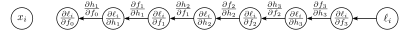

# 第七章

# 梯度与初始化

第六章介绍了迭代优化算法。这些是用于寻找函数最小值的通用方法。在神经网络的背景下，它们通过寻找能最小化损失的参数，使得模型能够准确地从输入预测训练输出。其基本方法是随机选择初始参数，然后进行一系列微小的改变，以平均地减小损失。每一次改变都基于当前位置损失相对于参数的梯度。

本章讨论两个特定于神经网络的问题。首先，我们考虑如何高效地计算梯度。这是一个严峻的挑战，因为在撰写本书时，最大的模型拥有约 $10^{12}$ 个参数，并且在训练算法的每次迭代中，都需要为每个参数计算梯度。其次，我们考虑如何初始化参数。如果做得不仔细，初始的损失及其梯度可能会变得极大或极小。无论哪种情况，这都会阻碍训练过程。

### 7.1 问题定义

考虑一个具有多元输入 $\mathbf{x}$、参数 $\boldsymbol{\phi}$ 和三个隐藏层 $\mathbf{h}_1, \mathbf{h}_2, \mathbf{h}_3$ 的网络 $f[\mathbf{x}, \boldsymbol{\phi}]$：
$$
\begin{aligned}
\mathbf{h}_1 &= a[\boldsymbol{\beta}_0 + \boldsymbol{\Omega}_0 \mathbf{x}] \\
\mathbf{h}_2 &= a[\boldsymbol{\beta}_1 + \boldsymbol{\Omega}_1 \mathbf{h}_1] \\
\mathbf{h}_3 &= a[\boldsymbol{\beta}_2 + \boldsymbol{\Omega}_2 \mathbf{h}_2] \\
f[\mathbf{x}, \boldsymbol{\phi}] &= \boldsymbol{\beta}_3 + \boldsymbol{\Omega}_3 \mathbf{h}_3
\end{aligned} \tag{7.1}
$$

其中函数 $a[\cdot]$ 将激活函数分别应用于输入的每个元素。模型参数 $\boldsymbol{\phi} = \{\boldsymbol{\beta}_0, \boldsymbol{\Omega}_0, \boldsymbol{\beta}_1, \boldsymbol{\Omega}_1, \boldsymbol{\beta}_2, \boldsymbol{\Omega}_2, \boldsymbol{\beta}_3, \boldsymbol{\Omega}_3\}$ 由每层之间的偏置向量 $\boldsymbol{\beta}_k$ 和权重矩阵 $\boldsymbol{\Omega}_k$ 组成（图7.1）。

我们还有单独的损失项 $l_i$，它返回给定模型预测 $f[\mathbf{x}_i, \boldsymbol{\phi}]$ 关于训练输入 $\mathbf{x}_i$ 的真实标签 $\mathbf{y}_i$ 的负对数似然。例如，这可能是最小二乘损失 $l_i = (f[\mathbf{x}_i, \boldsymbol{\phi}] - \mathbf{y}_i)^2$。总损失是这些项在整个训练数据上的总和：
$$
L[\boldsymbol{\phi}] = \sum_{i=1}^I l_i \tag{7.2}
$$

训练神经网络最常用的优化算法是随机梯度下降（SGD），它按如下方式更新参数：
$$
\boldsymbol{\phi}_{t+1} \leftarrow \boldsymbol{\phi}_t - \alpha \sum_{i \in \mathcal{B}_t} \frac{\partial l_i[\boldsymbol{\phi}_t]}{\partial \boldsymbol{\phi}} \tag{7.3}
$$

其中 $\alpha$ 是学习率，$\mathcal{B}_t$ 包含迭代 $t$ 时批次的索引。要计算此更新，我们需要计算导数：
$$
\frac{\partial l_i}{\partial \boldsymbol{\beta}_k} \quad \text{和} \quad \frac{\partial l_i}{\partial \boldsymbol{\Omega}_k} \tag{7.4}
$$

对于每一层 $k \in \{0, 1, \dots, K\}$ 的参数 $\{\boldsymbol{\beta}_k, \boldsymbol{\Omega}_k\}$ 以及批次中的每个索引 $i$。本章的第一部分描述了高效计算这些导数的**反向传播算法**。

在第二部分，我们考虑如何在开始训练前初始化网络参数。我们描述了选择初始权重 $\boldsymbol{\Omega}_k$ 和偏置 $\boldsymbol{\beta}_k$ 的方法，以确保训练的稳定性。参考：问题 7.1

### 7.2 计算导数

损失的导数告诉我们，当我们对参数进行微小改变时，损失会如何变化。优化算法利用这些信息来调整参数，以使损失变小。反向传播算法计算这些导数。其数学细节有些复杂，所以我们首先提出两个观察，以提供一些直观理解。

**观察1：** 每个权重（$\boldsymbol{\Omega}_k$ 的元素）都乘以源隐藏单元的激活值，并将结果加到目标隐藏单元。因此，对权重的任何微小改变所产生的影响，都会被源隐藏单元的激活值所放大或减弱。因此，我们为批次中的每个数据样本运行网络，并存储所有隐藏单元的激活值。这被称为**前向传播**（forward pass）（图7.1）。存储的激活值随后将用于计算梯度。

---


> **图 7.1 反向传播的前向传播过程。** 目标是计算损失 $l$ 相对于每个权重（箭头）和偏置（未显示）的导数。换句话说，我们想知道每个参数的微小改变将如何影响损失。每个权重都乘以其源头的隐藏单元，并将结果贡献给其目标的隐藏单元。因此，对权重的任何微小改变所产生的影响都将按源隐藏单元的激活值进行缩放。例如，蓝色权重被应用于第1层的第二个隐藏单元；如果这个单元的激活值加倍，那么对蓝色权重进行微小改变的影响也将加倍。因此，为了计算权重的导数，我们需要计算并存储隐藏层的激活值。这被称为**前向传播**，因为它涉及到按顺序运行网络方程。
---

**观察2：** 对偏置或权重的微小改变会通过后续网络引起连锁反应。这个改变会修改其目标隐藏单元的值，这又会改变再下一层隐藏单元的值，依此类推，直到对模型输出和最终的损失产生改变。

因此，要知道改变一个参数如何影响损失，我们还需要知道对每个后续隐藏层的改变将如何依次修改它们的后继者。在考虑同一层或更早层的其他参数时，也需要这些相同的量。由此可见，我们可以计算它们一次并重复使用。例如，考虑计算影响隐藏层 $\mathbf{h}_3, \mathbf{h}_2$ 和 $\mathbf{h}_1$ 的权重的微小改变的效果：

-   要计算对输入到隐藏层 $\mathbf{h}_3$ 的权重或偏置的微小改变如何修改损失，我们需要知道 (i) $\mathbf{h}_3$ 层的改变如何改变模型输出 $\mathbf{f}$，以及 (ii) 这个输出的改变如何改变损失 $l$（图7.2a）。
-   要计算对输入到隐藏层 $\mathbf{h}_2$ 的权重或偏置的微小改变如何修改损失，我们需要知道 (i) $\mathbf{h}_2$ 层的改变如何影响 $\mathbf{h}_3$，(ii) $\mathbf{h}_3$ 如何改变模型输出，以及 (iii) 这个输出的改变如何改变损失（图7.2b）。
-   类似地，要计算对输入到隐藏层 $\mathbf{h}_1$ 的权重或偏置的微小改变如何修改损失，我们需要知道 $\mathbf{h}_1$ 如何改变 $\mathbf{h}_2$，以及这些改变如何传播到损失（图7.2c）。

---


> **图 7.2 反向传播的后向传播过程。** a) 为了计算输入到层 $\mathbf{h}_3$ 的权重（蓝色箭头）的变化如何改变损失，我们需要知道 $\mathbf{h}_3$ 中的隐藏单元如何改变模型输出 $\mathbf{f}$ 以及 $\mathbf{f}$ 如何改变损失（橙色箭头）。b) 为了计算对输入到 $\mathbf{h}_2$ 的权重的微小改变（蓝色箭头）如何改变损失，我们需要知道 (i) $\mathbf{h}_2$ 中的隐藏单元如何改变 $\mathbf{h}_3$，(ii) $\mathbf{h}_3$ 如何改变 $\mathbf{f}$，以及 (iii) $\mathbf{f}$ 如何改变损失（橙色箭头）。c) 类似地，为了计算对输入到 $\mathbf{h}_1$ 的权重的微小改变（蓝色箭头）如何改变损失，我们需要知道 $\mathbf{h}_1$ 如何改变 $\mathbf{h}_2$ 以及这些改变如何传播到损失（橙色箭头）。后向传播首先计算网络末端的导数，然后向后工作以利用这些计算的内在冗余性。
---

当我们从网络后向前移动时，我们看到我们需要的许多项都已在前一步中计算过，所以我们不需要重新计算它们。以这种方式从网络后向前计算导数的过程被称为**后向传播**（backward pass）。

反向传播背后的思想相对容易理解。然而，推导过程需要矩阵微积分，因为偏置和权重项分别是向量和矩阵。为了帮助掌握其底层机制，下一节将为一个具有标量参数的更简单的玩具模型推导反向传播。然后我们将在7.4节将相同的方法应用于深度神经网络。

### 7.3 玩具示例

考虑一个具有八个标量参数 $\boldsymbol{\phi} = \{\beta_0, \omega_0, \beta_1, \omega_1, \beta_2, \omega_2, \beta_3, \omega_3\}$ 的模型 $f[x, \boldsymbol{\phi}]$，它由 $\sin[\cdot]$, $\exp[\cdot]$ 和 $\cos[\cdot]$ 函数的复合构成：
$$
f[x, \phi] = \beta_3 + \omega_3 \cdot \cos[\beta_2 + \omega_2 \cdot \exp[\beta_1 + \omega_1 \cdot \sin[\beta_0 + \omega_0 \cdot x]]] \tag{7.5}
$$

以及一个带有单个项的最小二乘损失函数 $L[\boldsymbol{\phi}] = \sum_i l_i$：
$$
l_i = (f[x_i, \boldsymbol{\phi}] - y_i)^2 \tag{7.6}
$$

其中，像往常一样，$x_i$ 是第 $i$ 个训练输入，$y_i$ 是第 $i$ 个训练输出。你可以把这看作一个简单的神经网络，它有一个输入，一个输出，每层一个隐藏单元，以及在各层之间有不同的激活函数 $\sin[\cdot], \exp[\cdot]$ 和 $\cos[\cdot]$。
我们的目标是计算导数：
$$
\frac{\partial l_i}{\partial \beta_0}, \frac{\partial l_i}{\partial \omega_0}, \frac{\partial l_i}{\partial \beta_1}, \frac{\partial l_i}{\partial \omega_1}, \frac{\partial l_i}{\partial \beta_2}, \frac{\partial l_i}{\partial \omega_2}, \frac{\partial l_i}{\partial \beta_3}, \quad \text{和} \quad \frac{\partial l_i}{\partial \omega_3} \tag{7.7}
$$

当然，我们可以手动找到这些导数的表达式并直接计算它们。然而，其中一些表达式相当复杂。例如：
$$
\begin{aligned}
\frac{\partial l_i}{\partial \omega_0}
={}& -2\bigl(\beta_3 + \omega_3\cos[\dots] - y_i\bigr)
   \cdot \omega_1\,\omega_2\,\omega_3
   \cdot x_i \cdot \cos\bigl[\beta_0 + \omega_0 x_i\bigr] \\[6pt]
   &\cdot \exp[\dots]
    \cdot \sin[\dots]
\end{aligned}
\tag{7.8}
$$


这样的表达式推导起来很麻烦，编码时也容易出错，并且没有利用内在的冗余；注意那三个指数项是相同的。

反向传播算法是一次性计算所有这些导数的有效方法。它包括 (i) 一个前向传播过程，我们计算并存储一系列中间值和网络输出，以及 (ii) 一个后向传播过程，我们从网络末端开始计算每个参数的导数，并重用之前的计算结果向起点移动。

**前向传播：** 我们将损失的计算视为一系列计算：
$$
\begin{aligned}
f_0 &= \beta_0 + \omega_0 x_i \\
h_1 &= \sin[f_0] \\
f_1 &= \beta_1 + \omega_1 h_1 \\
h_2 &= \exp[f_1] \\
f_2 &= \beta_2 + \omega_2 h_2 \\
h_3 &= \cos[f_2] \\
f_3 &= \beta_3 + \omega_3 h_3 \\
l_i &= (f_3 - y_i)^2
\end{aligned} \tag{7.9}
$$

我们计算并存储中间变量 $f_k$ 和 $h_k$ 的值（图7.3）。

---


> **图 7.3 反向传播的前向传播过程。** 我们依次计算并存储每个中间变量，直到最终计算出损失。
---

**后向传播 #1：** 我们现在以相反的顺序计算 $l_i$ 相对于这些中间变量的导数：
$$
\frac{\partial l_i}{\partial f_3}, \quad \frac{\partial l_i}{\partial h_3}, \quad \frac{\partial l_i}{\partial f_2}, \quad \frac{\partial l_i}{\partial h_2}, \quad \frac{\partial l_i}{\partial f_1}, \quad \frac{\partial l_i}{\partial h_1}, \quad \text{和} \quad \frac{\partial l_i}{\partial f_0} \tag{7.10}
$$

这些导数中的第一个是直接的：
$$
\frac{\partial l_i}{\partial f_3} = 2(f_3 - y_i) \tag{7.11}
$$

下一个导数可以用链式法则计算：
$$
\frac{\partial l_i}{\partial h_3} = \frac{\partial f_3}{\partial h_3} \frac{\partial l_i}{\partial f_3} \tag{7.12}
$$

左边询问当 $h_3$ 改变时 $l_i$ 如何改变。右边说我们可以将其分解为 (i) 当 $h_3$ 改变时 $f_3$ 如何改变，以及 (ii) 当 $f_3$ 改变时 $l_i$ 如何改变。在原始方程中，$h_3$ 改变 $f_3$，$f_3$ 改变 $l_i$，导数代表了这条链的影响。注意，我们已经计算了这些导数中的第二个，而另一个是 $\beta_3 + \omega_3 h_3$ 相对于 $h_3$ 的导数，即 $\omega_3$。
我们以这种方式继续，计算输出相对于这些中间量的导数（图7.4）：
$$
\begin{aligned}
\frac{\partial l_i}{\partial f_2} &= \frac{\partial h_3}{\partial f_2} \left( \frac{\partial l_i}{\partial h_3} \right) = \frac{\partial h_3}{\partial f_2} \left( \frac{\partial f_3}{\partial h_3} \frac{\partial l_i}{\partial f_3} \right) \\
\frac{\partial l_i}{\partial h_2} &= \frac{\partial f_2}{\partial h_2} \left( \frac{\partial l_i}{\partial f_2} \right) = \frac{\partial f_2}{\partial h_2} \left( \frac{\partial h_3}{\partial f_2} \frac{\partial f_3}{\partial h_3} \frac{\partial l_i}{\partial f_3} \right) \\
\vdots
\end{aligned} \tag{7.13}
$$

在每种情况下，我们都已经计算了前一步中括号内的量，而最后一项有一个简单的表达式。这些方程体现了上一节的观察2（图7.2）；如果我们以相反的顺序计算，就可以重用先前计算的导数。参考：问题 7.2

**后向传播 #2：** 最后，我们考虑当改变参数 $\{\beta_k\}$ 和 $\{\omega_k\}$ 时，损失 $l_i$ 如何变化。我们再次应用链式法则（图7.5）：
$$
\begin{aligned}
\frac{\partial l_i}{\partial \beta_k} &= \frac{\partial f_k}{\partial \beta_k} \frac{\partial l_i}{\partial f_k} \\
\frac{\partial l_i}{\partial \omega_k} &= \frac{\partial f_k}{\partial \omega_k} \frac{\partial l_i}{\partial f_k}
\end{aligned} \tag{7.14}
$$

在每种情况下，右侧的第二项已在方程7.13中计算。当 $k > 0$ 时，我们有 $f_k = \beta_k + \omega_k h_k$，所以：
$$
\frac{\partial f_k}{\partial \beta_k} = 1 \quad \text{和} \quad \frac{\partial f_k}{\partial \omega_k} = h_k \tag{7.15}
$$

这与上一节的观察1一致；权重 $\omega_k$ 变化的影响与源变量 $h_k$ 的值成正比（该值已在前向传播中存储）。来自项 $f_0 = \beta_0 + \omega_0 x_i$ 的最终导数是：
$$
\frac{\partial f_0}{\partial \beta_0} = 1 \quad \text{和} \quad \frac{\partial f_0}{\partial \omega_0} = x_i \tag{7.16}
$$

反向传播比单独计算导数（如方程7.8¹）更简单、更高效。参考：笔记本项目 7.1 玩具模型中的反向传播

---


> **图 7.4 反向传播后向传播 #1。** 我们从函数末端向后计算损失 $l_i$ 相对于中间量 $\partial l_i / \partial f_k$ 和 $\partial l_i / \partial h_k$ 的导数。每个导数都是通过将前一个导数乘以 $\partial f_k / \partial h_k$ 或 $\partial h_k / \partial f_{k-1}$ 形式的项来计算的。
---


> **图 7.5 反向传播后向传播 #2。** 最后，我们计算导数 $\partial l_i / \partial \beta_k$ 和 $\partial l_i / \partial \omega_k$。每个导数都是通过将项 $\partial l_i / \partial f_k$ 乘以 $\partial f_k / \partial \beta_k$ 或 $\partial f_k / \partial \omega_k$ 来计算的。
---

### 7.4 反向传播算法

现在我们为一个三层网络重复这个过程（图7.1）。其直觉和大部分代数运算是相同的。主要区别在于中间变量 $\mathbf{f}_k, \mathbf{h}_k$ 是向量，偏置 $\boldsymbol{\beta}_k$ 是向量，权重 $\boldsymbol{\Omega}_k$ 是矩阵，我们使用的是ReLU函数而不是像 $\cos[\cdot]$ 这样的简单代数函数。

**前向传播：** 我们将网络写成一系列顺序计算：
$$
\begin{aligned}
\mathbf{f}_0 &= \boldsymbol{\beta}_0 + \boldsymbol{\Omega}_0 \mathbf{x}_i \\
\mathbf{h}_k &= a[\mathbf{f}_{k-1}] & k \in \{1, 2, \dots, K\} \\
\mathbf{f}_k &= \boldsymbol{\beta}_k + \boldsymbol{\Omega}_k \mathbf{h}_k & k \in \{1, 2, \dots, K\} \\
l_i &= l[\mathbf{f}_K, \mathbf{y}_i]
\end{aligned} \tag{7.17}
$$

其中 $\mathbf{f}_{k-1}$ 表示第 $k$ 个隐藏层的预激活值（即ReLU函数 $a[\cdot]$ 之前的值），$\mathbf{h}_k$ 包含第 $k$ 个隐藏层的激活值（即ReLU函数之后的值）。项 $l[\mathbf{f}_K, \mathbf{y}_i]$ 表示损失函数（例如，最小二乘或二元交叉熵损失）。在前向传播中，我们完成这些计算并存储所有中间量。

---
¹注意，我们实际上并不需要损失相对于激活值 $\partial l_i / \partial \mathbf{h}_k$ 的导数。在最终的反向传播算法中，我们不会显式计算它们。

---

**后向传播 #1：** 现在让我们考虑当预激活值 $\mathbf{f}_0, \mathbf{f}_1, \mathbf{f}_2$ 改变时，损失如何变化。应用链式法则，损失 $l_i$ 相对于 $\mathbf{f}_2$ 的导数表达式为：参考：附录 B.5 矩阵微积分
$$
\frac{\partial l_i}{\partial \mathbf{f}_2} = \frac{\partial \mathbf{h}_3}{\partial \mathbf{f}_2} \frac{\partial \mathbf{f}_3}{\partial \mathbf{h}_3} \frac{\partial l_i}{\partial \mathbf{f}_3} \tag{7.18}
$$

右侧的三个项的大小分别为 $D_3 \times D_3$, $D_3 \times D_{f}$, 和 $D_{f} \times 1$，其中 $D_3$ 是第三层中隐藏单元的数量，$D_f$ 是模型输出 $\mathbf{f}_3$ 的维度。参考：问题 7.3

类似地，我们可以计算当改变 $\mathbf{f}_1$ 和 $\mathbf{f}_0$ 时损失如何变化：
$$
\begin{aligned}
\frac{\partial l_i}{\partial \mathbf{f}_1} &= \frac{\partial \mathbf{h}_2}{\partial \mathbf{f}_1} \frac{\partial \mathbf{f}_2}{\partial \mathbf{h}_2} \left( \frac{\partial \mathbf{h}_3}{\partial \mathbf{f}_2} \frac{\partial \mathbf{f}_3}{\partial \mathbf{h}_3} \frac{\partial l_i}{\partial \mathbf{f}_3} \right)
\end{aligned} \tag{7.19}
$$
$$
\begin{aligned}
\frac{\partial l_i}{\partial \mathbf{f}_0} &= \frac{\partial \mathbf{h}_1}{\partial \mathbf{f}_0} \frac{\partial \mathbf{f}_1}{\partial \mathbf{h}_1} \left( \frac{\partial \mathbf{h}_2}{\partial \mathbf{f}_1} \frac{\partial \mathbf{f}_2}{\partial \mathbf{h}_2} \frac{\partial \mathbf{h}_3}{\partial \mathbf{f}_2} \frac{\partial \mathbf{f}_3}{\partial \mathbf{h}_3} \frac{\partial l_i}{\partial \mathbf{f}_3} \right)
\end{aligned} \tag{7.20}
$$

注意，在每种情况下，括号中的项都已在前一步中计算过。通过从网络后端向前工作，我们可以重用之前的计算。
而且，这些项本身也很简单。从方程7.18的右侧向后看，我们有：
-   损失 $l_i$ 相对于网络输出 $\mathbf{f}_3$ 的导数 $\partial l_i / \partial \mathbf{f}_3$ 将取决于损失函数，但通常形式简单。参考：问题 7.4-7.5
-   网络输出相对于隐藏层 $\mathbf{h}_3$ 的导数 $\partial \mathbf{f}_3 / \partial \mathbf{h}_3$ 是：
$$
\frac{\partial \mathbf{f}_3}{\partial \mathbf{h}_3} = \frac{\partial}{\partial \mathbf{h}_3}(\boldsymbol{\beta}_3 + \boldsymbol{\Omega}_3 \mathbf{h}_3) = \boldsymbol{\Omega}_3^T \tag{7.21}
$$
如果你不熟悉矩阵微积分，这个结果可能不明显。问题7.6对此进行了探讨。参考：问题 7.6
-   激活函数输出 $\mathbf{h}_3$ 相对于其输入 $\mathbf{f}_2$ 的导数 $\partial \mathbf{h}_3 / \partial \mathbf{f}_2$ 将取决于激活函数。它将是一个对角矩阵，因为每个激活仅依赖于相应的预激活。对于ReLU函数，对角线项在 $\mathbf{f}_2$ 小于零时为零，否则为一（图7.6）。我们不是乘以这个矩阵，而是提取对角线项作为一个向量 $\mathbb{I}[\mathbf{f}_2 > \mathbf{0}]$ 并进行逐点相乘，这样更高效。参考：问题 7.7-7.8

---


> **图 7.6 修正线性单元的导数。** 修正线性单元（橙色曲线）在输入小于零时返回零，否则返回输入。其导数（青色曲线）在输入小于零时返回零（因为此处的斜率为零），在输入大于零时返回一（因为此处的斜率为一）。
---

方程7.19和7.20右侧的项具有相似的形式。当我们向后通过网络时，我们交替地 (i) 乘以权重矩阵 $\boldsymbol{\Omega}_k^T$ 的转置，以及 (ii) 基于输入 $\mathbf{f}_{k-1}$ 进行阈值处理。这些输入已在前向传播中存储。

**后向传播 #2：** 现在我们知道了如何计算 $\partial l_i / \partial \mathbf{f}_k$，我们可以集中计算损失相对于权重和偏置的导数。为了计算损失相对于偏置 $\boldsymbol{\beta}_k$ 的导数，我们再次使用链式法则：
$$
\begin{aligned}
\frac{\partial l_i}{\partial \boldsymbol{\beta}_k} &= \frac{\partial \mathbf{f}_k}{\partial \boldsymbol{\beta}_k} \frac{\partial l_i}{\partial \mathbf{f}_k} \\
&= \frac{\partial}{\partial \boldsymbol{\beta}_k}(\boldsymbol{\beta}_k + \boldsymbol{\Omega}_k \mathbf{h}_k) \frac{\partial l_i}{\partial \mathbf{f}_k} \\
&= \frac{\partial l_i}{\partial \mathbf{f}_k}
\end{aligned} \tag{7.22}
$$
这已在方程7.18和7.19中计算过。
类似地，对于权重矩阵 $\boldsymbol{\Omega}_k$ 的导数为：
$$
\begin{aligned}
\frac{\partial l_i}{\partial \boldsymbol{\Omega}_k} &= \frac{\partial \mathbf{f}_k}{\partial \boldsymbol{\Omega}_k} \frac{\partial l_i}{\partial \mathbf{f}_k} \\
&= \frac{\partial}{\partial \boldsymbol{\Omega}_k}(\boldsymbol{\beta}_k + \boldsymbol{\Omega}_k \mathbf{h}_k) \frac{\partial l_i}{\partial \mathbf{f}_k} \\
&= \frac{\partial l_i}{\partial \mathbf{f}_k} \mathbf{h}_k^T
\end{aligned} \tag{7.23}
$$
同样，从第二行到第三行的推导并不明显，在问题7.9中进行了探讨。然而，结果是合理的。最终的行是一个与 $\boldsymbol{\Omega}_k$ 大小相同的矩阵。它线性地依赖于 $\mathbf{h}_k$，$\mathbf{h}_k$ 在原始表达式中被 $\boldsymbol{\Omega}_k$ 乘。这也与最初的直觉一致，即 $\boldsymbol{\Omega}_k$ 中权重的导数将与它们所乘的隐藏单元 $\mathbf{h}_k$ 的值成正比。回想一下，我们已经在前向传播中计算了这些值。参考：问题 7.9

#### 7.4.1 反向传播算法总结

我们现在简要总结最终的反向传播算法。考虑一个深度神经网络 $f[\mathbf{x}_i, \boldsymbol{\phi}]$，它接收输入 $\mathbf{x}_i$，具有 $K$ 个带ReLU激活的隐藏层，以及单个损失项 $l_i = l[f[\mathbf{x}_i, \boldsymbol{\phi}], \mathbf{y}_i]$。反向传播的目标是计算导数 $\partial l_i / \partial \boldsymbol{\beta}_k$ 和 $\partial l_i / \partial \boldsymbol{\Omega}_k$。

**前向传播：** 我们计算并存储以下量：
$$
\begin{aligned}
\mathbf{f}_0 &= \boldsymbol{\beta}_0 + \boldsymbol{\Omega}_0 \mathbf{x}_i \\
\mathbf{h}_k &= a[\mathbf{f}_{k-1}] & k \in \{1, 2, \dots, K\} \\
\mathbf{f}_k &= \boldsymbol{\beta}_k + \boldsymbol{\Omega}_k \mathbf{h}_k & k \in \{1, 2, \dots, K\}
\end{aligned} \tag{7.24}
$$

**后向传播：** 我们从损失函数 $l_i$ 相对于网络输出 $\mathbf{f}_K$ 的导数 $\partial l_i / \partial \mathbf{f}_K$ 开始，然后向后遍历网络：
$$
\begin{aligned}
\frac{\partial l_i}{\partial \boldsymbol{\beta}_k} &= \frac{\partial l_i}{\partial \mathbf{f}_k} & k \in \{K, K-1, \dots, 1\} \\
\frac{\partial l_i}{\partial \boldsymbol{\Omega}_k} &= \frac{\partial l_i}{\partial \mathbf{f}_k} \mathbf{h}_k^T & k \in \{K, K-1, \dots, 1\} \\
\frac{\partial l_i}{\partial \mathbf{f}_{k-1}} &= \mathbb{I}[\mathbf{f}_{k-1} > \mathbf{0}] \odot \left( \boldsymbol{\Omega}_k^T \frac{\partial l_i}{\partial \mathbf{f}_k} \right) & k \in \{K, K-1, \dots, 1\}
\end{aligned} \tag{7.25}
$$
其中 $\odot$ 表示逐点相乘，$\mathbb{I}[\mathbf{f}_{k-1} > \mathbf{0}]$ 是一个向量，其中 $\mathbf{f}_{k-1}$ 大于零的元素为1，其余为零。最后，我们计算相对于第一组偏置和权重的导数：
$$
\begin{aligned}
\frac{\partial l_i}{\partial \boldsymbol{\beta}_0} &= \frac{\partial l_i}{\partial \mathbf{f}_0} \\
\frac{\partial l_i}{\partial \boldsymbol{\Omega}_0} &= \frac{\partial l_i}{\partial \mathbf{f}_0} \mathbf{x}_i^T
\end{aligned} \tag{7.26}
$$

我们为批次中的每个训练样本计算这些导数，并将它们相加以获得SGD更新的梯度。参考：问题 7.10，笔记本项目 7.2 反向传播

请注意，反向传播算法非常高效；前向和后向传播中要求最高的计算步骤都是矩阵乘法（分别由 $\boldsymbol{\Omega}$ 和 $\boldsymbol{\Omega}^T$），这只需要加法和乘法。然而，它在内存效率上不高；前向传播中的中间值必须全部存储，这会限制我们能训练的模型的大小。

#### 7.4.2 算法微分

尽管理解反向传播算法很重要，但你不太可能需要在实践中编写它。现代深度学习框架，如PyTorch和TensorFlow，会根据模型规范自动计算导数。这被称为**算法微分**。

框架中的每个功能组件（线性变换、ReLU激活、损失函数）都知道如何计算自己的导数。例如，PyTorch的ReLU函数 `z_out = relu[z_in]` 知道如何计算其输出 `z_out` 相对于其输入 `z_in` 的导数。类似地，一个线性函数 `z_out = β + Ωz_in` 知道如何计算其输出 `z_out` 相对于输入 `z_in` 和参数 $\boldsymbol{\beta}, \boldsymbol{\Omega}$ 的导数。算法微分框架也知道网络中的操作序列，因此拥有执行前向和后向传播所需的所有信息。

这些框架利用了现代图形处理单元（GPU）的大规模并行性。矩阵乘法（在前向和后向传播中都有）等计算天然适合并行化。此外，如果模型和前向传播中的中间结果不超过可用内存，就有可能对整个批次并行执行前向和后向传播。参考：问题 7.11

由于训练算法现在是并行处理整个批次，输入变成了一个多维张量。在这种情况下，张量可以被认为是矩阵对任意维度的推广。因此，向量是一维张量，矩阵是二维张量，三维数字网格是三维张量。到目前为止，训练数据是一维的，所以反向传播的输入将是一个二维张量，其中第一维索引批次元素，第二维索引数据维度。在后续章节中，我们将遇到更复杂的结构化输入数据。例如，在输入是RGB图像的模型中，原始数据样本是三维的（高 $\times$ 宽 $\times$ 通道）。在这里，学习框架的输入将是一个四维张量，其中额外的维度索引批次元素。

#### 7.4.3 扩展到任意计算图

我们已经描述了一个天然是序列化的深度神经网络的反向传播；我们依次计算中间量 $\mathbf{f}_0, \mathbf{h}_1, \mathbf{f}_1, \mathbf{h}_2, \dots, \mathbf{f}_k$。然而，模型不必局限于顺序计算。在本书的后面，我们会遇到具有分支结构的模型。例如，我们可能会取一个隐藏层中的值，并通过两个不同的子网络处理它们，然后再重新组合。

幸运的是，如果计算图是无环的，反向传播的思想仍然成立。现代算法微分框架，如PyTorch和TensorFlow，可以处理任意的无环计算图。参考：问题 7.12-7.13

### 7.5 参数初始化

反向传播算法计算由随机梯度下降和Adam用来训练模型的导数。我们现在讨论在开始训练前如何初始化参数。要理解为什么这至关重要，可以考虑在前向传播期间，每组预激活值 $\mathbf{f}_k$ 的计算方式如下：
$$
\begin{aligned}
\mathbf{f}_k &= \boldsymbol{\beta}_k + \boldsymbol{\Omega}_k \mathbf{h}_k \\
&= \boldsymbol{\beta}_k + \boldsymbol{\Omega}_k a[\mathbf{f}_{k-1}]
\end{aligned} \tag{7.27}
$$
其中 $a[\cdot]$ 应用ReLU函数，$\boldsymbol{\Omega}_k$ 和 $\boldsymbol{\beta}_k$ 分别是权重和偏置。想象一下，我们根据均值为零、方差为 $\sigma^2$ 的正态分布，将所有偏置初始化为零，并将 $\boldsymbol{\Omega}_k$ 的元素初始化。考虑两种情况：

-   如果方差 $\sigma^2$ 非常小（例如 $10^{-5}$），那么 $\boldsymbol{\beta}_k + \boldsymbol{\Omega}_k \mathbf{h}_k$ 的每个元素将是权重非常小的 $\mathbf{h}_k$ 的加权和；结果的幅度可能比输入小。此外，ReLU函数会截断小于零的值，所以 $\mathbf{h}_k$ 的范围将是 $\mathbf{f}_{k-1}$ 的一半。因此，随着我们通过网络前进，隐藏层预激活值的幅度将越来越小。
-   如果方差 $\sigma^2$ 非常大（例如 $10^5$），那么 $\boldsymbol{\beta}_k + \boldsymbol{\Omega}_k \mathbf{h}_k$ 的每个元素将是权重非常大的 $\mathbf{h}_k$ 的加权和；结果的幅度可能比输入大得多。ReLU函数将输入的范围减半，但如果 $\sigma^2$ 足够大，预激活值的幅度仍会随着我们通过网络前进越来越大。

在这两种情况下，预激活处的值可能会变得过小或过大，以至于无法用有限精度的浮点数表示。
即使前向传播是可行的，同样的逻辑也适用于后向传播。每个梯度更新（方程7.25）都包括乘以 $\boldsymbol{\Omega}_k^T$。如果 $\boldsymbol{\Omega}$ 的值没有被明智地初始化，那么在后向传播期间，梯度的大小可能会不受控制地减小或增加。这些情况分别被称为**梯度消失**（vanishing gradient）问题和**梯度爆炸**（exploding gradient）问题。在前一种情况下，模型的更新变得微乎其微。在后一种情况下，它们变得不稳定。

#### 7.5.1 前向传播的初始化

我们现在给出相同论证的数学版本。考虑相邻预激活值 $\mathbf{f}$ 和 $\mathbf{f}'$ 之间的计算，其维度分别为 $D_h$ 和 $D_{h'}$：
$$
\begin{aligned}
\mathbf{h} &= a[\mathbf{f}] \\
\mathbf{f}' &= \boldsymbol{\beta} + \boldsymbol{\Omega}\mathbf{h}
\end{aligned} \tag{7.28}
$$
其中 $\mathbf{h}$ 表示激活值，$\boldsymbol{\Omega}$ 和 $\boldsymbol{\beta}$ 表示权重和偏置，$a[\cdot]$ 是激活函数。
假设输入层 $\mathbf{f}$ 中的预激活值 $f_j$ 的方差为 $\sigma_f^2$。考虑将偏置 $\beta_i$ 初始化为零，并将权重 $\Omega_{ij}$ 初始化为均值为零、方差为 $\sigma_\Omega^2$ 的正态分布。现在我们推导后续层中预激活值 $\mathbf{f}'$ 的均值和方差的表达式。

中间值 $f'_i$ 的期望（均值）$E[f'_i]$ 是：
$$
\begin{aligned}
E[f'_i] &= E\left[\beta_i + \sum_{j=1}^{D_h} \Omega_{ij} h_j\right] \\
&= E[\beta_i] + \sum_{j=1}^{D_h} E[\Omega_{ij} h_j] \\
&= E[\beta_i] + \sum_{j=1}^{D_h} E[\Omega_{ij}] E[h_j] \\
&= 0 + \sum_{j=1}^{D_h} 0 \cdot E[h_j] = 0
\end{aligned} \tag{7.29}
$$
其中 $D_h$ 是输入层 $\mathbf{h}$ 的维度。我们使用了处理期望的规则，并假设隐藏单元 $\mathbf{h}_j$ 和网络权重 $\Omega_{ij}$ 上的分布在第二行和第三行之间是独立的。参考：附录 C.2 期望, 附录 C.2.1 期望规则

使用这个结果，我们看到预激活值 $f'_i$ 的方差 $\sigma_{f'}^2$ 是：
$$
\begin{aligned}
\sigma_{f'}^2 &= E[f_i'^2] - E[f'_i]^2 \\
&= E\left[\left(\beta_i + \sum_{j=1}^{D_h} \Omega_{ij}h_j\right)^2\right] - 0 \\
&= E\left[\left(\sum_{j=1}^{D_h} \Omega_{ij}h_j\right)^2\right] \\
&= \sum_{j=1}^{D_h} E[\Omega_{ij}^2] E[h_j^2] = \sigma_\Omega^2 \sum_{j=1}^{D_h} E[h_j^2]
\end{aligned} \tag{7.30}
$$
其中我们使用了方差恒等式 $\sigma^2 = E[(z-E[z])^2] = E[z^2] - E[z]^2$。我们再次假设权重 $\Omega_{ij}$ 和隐藏单元 $h_j$ 的分布在第三行和第四行之间是独立的。参考：附录 C.2.3 方差恒等式

假设前一层预激活值 $f_j$ 的分布关于零对称，那么这些预激活值的一半将被ReLU函数截断，而二阶矩 $E[h_j^2]$ 将是 $f_j$ 方差 $\sigma_f^2$ 的一半（见问题7.14）：参考：问题 7.14
$$
\sigma_{f'}^2 = \sigma_\Omega^2 \sum_{j=1}^{D_h} \frac{\sigma_f^2}{2} = \frac{D_h \sigma_\Omega^2 \sigma_f^2}{2} \tag{7.31}
$$

这反过来意味着，如果我们希望后续预激活值 $\mathbf{f}'$ 的方差 $\sigma_{f'}^2$ 与前向传播期间原始预激活值 $\mathbf{f}$ 的方差 $\sigma_f^2$ 相同，我们应该设置：
$$
\sigma_\Omega^2 = \frac{2}{D_h} \tag{7.32}
$$
其中 $D_h$ 是应用权重的原始层的维度。这被称为 **He 初始化**。

---


> **图 7.7 权重初始化。** 考虑一个具有50个隐藏层、每层 $D_h=100$ 个隐藏单元的深度网络。网络有一个从标准正态分布初始化的100维输入 $\mathbf{x}$，一个单一的固定目标 $y=0$，以及一个最小二乘损失函数。偏置向量 $\boldsymbol{\beta}_k$ 初始化为零，权重矩阵 $\boldsymbol{\Omega}_k$ 以均值为零和五种不同方差 $\sigma_\Omega^2 \in \{0.001, 0.01, 0.02, 0.1, 1.0\}$ 的正态分布初始化。a) 在前向传播中计算的隐藏单元激活值的方差作为网络层的函数。对于He初始化（$\sigma_\Omega^2=2/D_h = 0.02$），方差是稳定的。然而，对于较大的值，它迅速增加；对于较小的值，它迅速减小（注意对数刻度）。b) 后向传播中梯度的方差（实线）延续了这一趋势；如果我们以大于0.02的值初始化，梯度的大小会随着我们向后通过网络而迅速增加。如果我们以较小的值初始化，则大小会减小。这些分别被称为**梯度爆炸**和**梯度消失**问题。
---

#### 7.5.2 后向传播的初始化

类似的论证确定了在后向传播期间梯度 $\partial l / \partial \mathbf{f}_k$ 的方差如何变化。在后向传播期间，我们乘以权重矩阵的转置 $\boldsymbol{\Omega}_k^T$（方程7.25），因此等价的表达式变为：
$$
\sigma_\Omega^2 = \frac{2}{D_{h'}} \tag{7.33}
$$
其中 $D_{h'}$ 是权重所馈入的层的维度。

#### 7.5.3 前向和后向传播的初始化

如果权重矩阵 $\boldsymbol{\Omega}$ 不是方阵（即，两个相邻层中的隐藏单元数不同，因此 $D_h$ 和 $D_{h'}$ 不同），则不可能选择方差同时满足方程7.32和7.33。一种可能的折衷是使用均值 $(D_h + D_{h'})/2$ 作为项数的代理，这给出了：
$$
\sigma_\Omega^2 = \frac{4}{D_h + D_{h'}} \tag{7.34}
$$

图7.7凭经验表明，当参数被适当地初始化时，前向传播中隐藏单元的方差和后向传播中梯度的方差都保持稳定。参考：问题 7.15，笔记本项目 7.3 初始化

### 7.6 示例训练代码

本书的主要焦点是科学性的；它不是实现深度学习模型的指南。尽管如此，在图7.8中，我们展示了实现了本书到目前为止所探讨思想的PyTorch代码。该代码定义了一个神经网络并初始化了权重。它创建了随机的输入和输出数据集，并定义了一个最小二乘损失函数。模型使用带动量的SGD从数据中进行训练，批次大小为10，共100个周期。学习率从0.01开始，每10个周期减半。

要点是，尽管深度学习的底层思想相当复杂，但实现相对简单。例如，反向传播的所有细节都隐藏在单行代码中：`loss.backward()`。参考：问题 7.16-7.17

---
``` python
import torch, torch.nn as nn
from torch.utils.data import TensorDataset, DataLoader
from torch.optim.lr_scheduler import StepLR

# define input size, hidden layer size, output size
D_i, D_k, D_o = 10, 40, 5
# create model with two hidden layers
model = nn.Sequential(
    nn.Linear(D_i, D_k),
    nn.ReLU(),
    nn.Linear(D_k, D_k),
    nn.ReLU(),
    nn.Linear(D_k, D_o))

# He initialization of weights
def weights_init(layer_in):
    if isinstance(layer_in, nn.Linear):
        nn.init.kaiming_normal_(layer_in.weight)
        layer_in.bias.data.fill_(0.0)
model.apply(weights_init)

# choose least squares loss function
criterion = nn.MSELoss()
# construct SGD optimizer and initialize learning rate and momentum
optimizer = torch.optim.SGD(model.parameters(), lr = 0.1, momentum=0.9)
# object that decreases learning rate by half every 10 epochs
scheduler = StepLR(optimizer, step_size=10, gamma=0.5)

# create 100 random data points and store in data loader class
x = torch.randn(100, D_i)
y = torch.randn(100, D_o)
data_loader = DataLoader(TensorDataset(x,y), batch_size=10, shuffle=True)

# loop over the dataset 100 times
for epoch in range(100):
    epoch_loss = 0.0
    # loop over batches
    for i, data in enumerate(data_loader):
        # retrieve inputs and labels for this batch
        x_batch, y_batch = data
        # zero the parameter gradients
        optimizer.zero_grad()
        # forward pass
        pred = model(x_batch)
        loss = criterion(pred, y_batch)
        # backward pass
        loss.backward()
        # SGD update
        optimizer.step()
        # update statistics
        epoch_loss += loss.item()
    # print error
    print(f'Epoch {epoch:5d}, loss {epoch_loss:.3f}')
    # tell scheduler to consider updating learning rate
    scheduler.step()
```

> **图 7.8 用于在随机数据上训练两层网络的示例代码。**
---

### 7.7 总结

前一章介绍了随机梯度下降（SGD），这是一种旨在找到函数最小值的迭代优化算法。在神经网络的背景下，此算法找到最小化损失函数的参数。SGD依赖于损失函数相对于参数的梯度，在优化之前必须对其进行初始化。本章讨论了深度神经网络的这两个问题。

梯度必须为非常大量的参数、批次的每个成员以及在每个SGD迭代中进行评估。因此，梯度计算的高效性至关重要，为此引入了反向传播算法。仔细的参数初始化也至关重要。在前向传播中，隐藏单元激活的幅度可以呈指数级减小或增加。梯度大小在后向传播中也是如此，这些行为被称为梯度消失和梯度爆炸问题。两者都会阻碍训练，但可以通过适当的初始化来避免。

我们现在已经定义了模型和损失函数，我们可以为给定的任务训练一个模型。下一章将讨论如何衡量模型的性能。

### 注释

**反向传播：** 在计算图中计算梯度时高效地重用部分计算的方法已被多次发现，包括Werbos（1974）、Bryson等人（1979）、LeCun（1985）和Parker（1985）。然而，对这个思想最著名的描述是Rumelhart等人（1985）和Rumelhart等人（1986）的研究，他们也创造了“反向传播”这个术语。后一项工作开启了八九十年代神经网络研究的新阶段；它首次使得训练带隐藏层的网络变得可行。然而，由于（现在看来）缺乏训练数据、计算能力有限以及使用sigmoid激活函数，进展停滞了。自然语言处理和计算机视觉等领域直到Krizhevsky等人（2012）取得了非凡的图像分类结果，才开始依赖神经网络模型，从而开启了现代深度学习时代。

现代深度学习框架（如PyTorch和TensorFlow）中反向传播的实现是**反向模式算法微分**的一个例子。这与**前向模式算法微分**不同，后者在链式法则的导数在前向通过计算图时累积（见问题7.13）。关于算法微分的更多信息可以在Griewank & Walther（2008）和Baydin等人（2018）中找到。

**初始化：** He初始化由He等人（2015）首次引入。它与**Glorot**或**Xavier初始化**（Glorot & Bengio，2010）密切相关，后者非常相似，但不考虑ReLU层的影响，因此相差一个因子2。本质上相同的方法很早就由LeCun等人（2012）提出，但动机略有不同；在这种情况下，使用的是sigmoid激活函数，它自然地将每层输出的范围归一化，因此有助于防止隐藏单元的幅度呈指数增长。然而，如果预激活值太大，它们会落入sigmoid函数的平坦区域，导致梯度非常小。因此，明智地初始化权重仍然很重要。Klambauer等人（2017）引入了**缩放指数线性单元**（SeLU），并表明在一定的输入范围内，该激活函数倾向于使网络层中的激活自动收敛到零均值和单位方差。

一个完全不同的方法是让数据通过网络，然后根据经验观察到的方差进行归一化。**层序单元方差初始化**（Mishkin & Matas，2016）是这种方法的一个例子，其中权重矩阵被初始化为正交的。**GradInit**（Zhu等人，2021）随机化初始权重并暂时固定它们，同时为每个权重矩阵学习非负缩放因子。这些因子被选择为在固定学习率下最大化损失的减少，并受最大梯度范数的约束。**激活归一化**或**ActNorm**在每个网络层的每个隐藏单元后添加一个可学习的缩放和偏移参数。他们让一个初始批次通过网络，然后选择偏移和缩放，使得激活的均值为零，方差为一。之后，这些额外的参数作为模型的一部分进行学习。

与这些方法密切相关的是像**BatchNorm**（Ioffe & Szegedy, 2015）这样的方案，其中网络在每一步处理过程中将每个批次的方差归一化。BatchNorm及其变体在第11章中讨论。其他初始化方案已针对特定架构提出，包括用于卷积网络的**ConvolutionOrthogonal初始化器**（Xiao等人，2018a），用于残差网络的**Fixup**（Zhang等人，2019a），以及用于transformer的**TFixup**（Huang等人，2020a）和**DTFixup**（Xu等人，2021b）。

**减少内存需求：** 训练神经网络是内存密集型的。我们必须在前向传播期间存储模型参数和每个批次成员的隐藏单元预激活值。减少内存需求的两种方法是**梯度检查点**（Chen等人，2016a）和**微批处理**（Huang等人，2019）。在梯度检查点中，激活仅在每N层存储一次。在后向传播期间，从最近的检查点重新计算中间缺失的激活。通过这种方式，我们可以以执行两次前向传播的计算成本大幅减少内存需求（问题7.11）。在微批处理中，批次被细分为更小的部分，梯度更新从每个子批次中聚合，然后再应用于网络。一个完全不同的方法是构建一个**可逆网络**（例如，Gomez等人，2017），其中当前层的激活可以从下一层的激活中计算出来，因此在前向传播期间无需缓存任何内容（见第16章）。Sohoni等人（2019）回顾了减少内存需求的方法。

**分布式训练：** 对于足够大的模型，内存需求或所需的总时间可能对于单个处理器来说太多了。在这种情况下，我们必须使用**分布式训练**，即训练在多个处理器上并行进行。有几种并行方法。在**数据并行**中，每个处理器或节点包含模型的完整副本，但运行批次的一个子集（见Xing等人，2015；Li等人，2020b）。来自每个节点的梯度被集中聚合，然后重新分发回每个节点，以确保模型保持一致。这被称为**同步训练**。聚合和重新分发梯度所需的同步可能成为性能瓶颈，这引出了**异步训练**的想法。例如，在**Hogwild!**算法中（Recht等人，2011），来自一个节点的梯度在准备好时就用于更新中央模型。更新后的模型然后被重新分发到该节点。这意味着每个节点在任何给定时间可能拥有模型的略微不同版本，因此梯度更新可能是陈旧的；然而，它在实践中效果很好。其他去中心化方案也已被开发出来。例如，在Zhang等人（2016a）中，各个节点以环形结构相互更新。

数据并行方法仍然假设整个模型可以保存在单个节点的内存中。**流水线模型并行**将网络的不同层存储在不同的节点上，因此没有这个要求。在一个简单的实现中，第一个节点在批次的前几层上运行前向传播，并将结果传递给下一个节点，后者在接下来的几层上运行前向传播，依此类推。在后向传播中，梯度以相反的顺序更新。这种方法的明显缺点是每个机器在周期的大部分时间内都处于空闲状态。已经提出了各种围绕每个节点顺序处理微批次的方案来减少这种低效率（例如，Huang等人，2019；Narayanan等人，2021a）。最后，在**张量模型并行**中，单个网络层的计算被分布在节点之间（例如，Shoeybi等人，2019）。关于分布式训练方法的一个很好的概述可以在Narayanan等人（2021b）中找到，他们结合了张量、流水线和数据并行来在3072个GPU上训练一个具有一万亿参数的语言模型。

### 习题

**问题 7.1** 一个两层网络，每层有两个隐藏单元，可以定义为：
$$
\begin{aligned}
y ={}& \phi_0
    + \phi_1\,a\bigl[\psi_{01}
        + \psi_{11}\,a(\theta_{01} + \theta_{11}x)
        + \psi_{21}\,a(\theta_{02} + \theta_{12}x)
    \bigr] \\[6pt]
     &{}+ \phi_2\,a\bigl[\psi_{02}
        + \psi_{12}\,a(\theta_{01} + \theta_{11}x)
        + \psi_{22}\,a(\theta_{02} + \theta_{12}x)
    \bigr]
\end{aligned}
$$

其中函数 $a[\cdot]$ 是ReLU函数。直接（即不使用反向传播算法）计算输出 $y$ 相对于13个参数 $\phi_\cdot, \theta_{\cdot\cdot}, \psi_{\cdot\cdot}$ 中每一个的导数。ReLU函数相对于其输入的导数 $da[z]/dz$ 是指示函数 $\mathbb{I}[z>0]$，如果参数大于零则返回1，否则返回0（图7.6）。

**思路与解答：**
这是一个应用链式法则的练习。以 $\partial y / \partial \theta_{11}$ 为例：
$\frac{\partial y}{\partial \theta_{11}} = \frac{\partial y}{\partial a[\psi_{\dots}]} \frac{\partial a[\psi_{\dots}]}{\partial \psi_{\dots}} \frac{\partial \psi_{\dots}}{\partial a[\theta_{\dots}]} \frac{\partial a[\theta_{\dots}]}{\partial \theta_{\dots}} \frac{\partial \theta_{\dots}}{\partial \theta_{11}}$
$\frac{\partial y}{\partial \theta_{11}} = \left( \phi_1 \cdot \mathbb{I}[\text{arg}_1>0] \cdot \psi_{11} + \phi_2 \cdot \mathbb{I}[\text{arg}_2>0] \cdot \psi_{12} \right) \cdot \mathbb{I}[\theta_{01}+\theta_{11}x > 0] \cdot x$
其中 $\text{arg}_1$ 和 $\text{arg}_2$ 是第二层ReLU函数的参数。其他参数的导数可以类似地推导出来，但这非常繁琐，正好说明了反向传播的必要性。

**问题 7.2** 找出方程7.13中五个导数链中每一条的最终项的表达式。

**思路与解答：**
链条中的最终项是损失 $l_i$ 相对于最终输出 $f_3$ 的导数，即 $\partial l_i / \partial f_3$。对于最小二乘损失 $l_i = (f_3-y_i)^2$，这个导数是 $2(f_3-y_i)$。

**问题 7.3** 方程7.20中各项的大小是多少？

**思路与解答：**
方程7.20写为 $\frac{\partial l_i}{\partial \mathbf{f}_0} = \frac{\partial \mathbf{h}_1}{\partial \mathbf{f}_0} \frac{\partial \mathbf{f}_1}{\partial \mathbf{h}_1} \frac{\partial l_i}{\partial \mathbf{f}_1}$。
假设 $\mathbf{f}_0, \mathbf{h}_1, \mathbf{f}_1$ 的维度分别是 $D_0, D_1, D_1$。
-   $\partial \mathbf{h}_1 / \partial \mathbf{f}_0$: 这是一个对角矩阵，大小为 $D_1 \times D_1$。
-   $\partial \mathbf{f}_1 / \partial \mathbf{h}_1$: 这是权重矩阵 $\boldsymbol{\Omega}_1^T$，大小为 $D_1 \times D_1$。
-   $\partial l_i / \partial \mathbf{f}_1$: 这是一个列向量，大小为 $D_1 \times 1$。
所以，$\partial l_i / \partial \mathbf{f}_0$ 的大小是 $(D_1 \times D_1) \times (D_1 \times D_1) \times (D_1 \times 1)$，结果是一个 $D_1 \times 1$ 的向量。（注意原文方程可能书写有误，应为 $\frac{\partial l_i}{\partial \mathbf{f}_0} = (\dots) \frac{\partial l_i}{\partial \mathbf{f}_2}$，但思路是相同的，都是向量）。

**问题 7.4** 计算最小二乘损失函数的导数 $\partial l_i / \partial f[\mathbf{x}_i, \boldsymbol{\phi}]$：
$$ l_i = (y_i - f[\mathbf{x}_i, \boldsymbol{\phi}])^2 \tag{7.36} $$

**思路与解答：**
使用链式法则，令 $u = y_i - f[\mathbf{x}_i, \boldsymbol{\phi}]$。
$\frac{\partial l_i}{\partial f[\dots]} = \frac{\partial (u^2)}{\partial u} \frac{\partial u}{\partial f[\dots]} = 2u \cdot (-1) = -2(y_i - f[\mathbf{x}_i, \boldsymbol{\phi}])$。

**问题 7.5** 计算二元分类损失函数的导数 $\partial l_i / \partial f[\mathbf{x}_i, \boldsymbol{\phi}]$：
$$ l_i = -(1-y_i)\log[1-\mathrm{sig}[f[\mathbf{x}_i, \boldsymbol{\phi}]]] - y_i\log[\mathrm{sig}[f[\mathbf{x}_i, \boldsymbol{\phi}]]] \tag{7.37} $$

**思路与解答：**
令 $f=f[\mathbf{x}_i, \boldsymbol{\phi}]$ 且 $p=\mathrm{sig}[f]$。已知 $\frac{dp}{df} = p(1-p)$。
$\frac{\partial l_i}{\partial f} = \frac{\partial l_i}{\partial p} \frac{dp}{df}$。
$\frac{\partial l_i}{\partial p} = -\frac{-(1-y_i)}{1-p} - \frac{y_i}{p} = \frac{1-y_i}{1-p} - \frac{y_i}{p} = \frac{(1-y_i)p - y_i(1-p)}{p(1-p)} = \frac{p - y_i}{p(1-p)}$。
$\frac{\partial l_i}{\partial f} = \frac{p-y_i}{p(1-p)} \cdot p(1-p) = p-y_i = \mathrm{sig}[f[\mathbf{x}_i, \boldsymbol{\phi}]] - y_i$。

**问题 7.6*** 证明对于 $\mathbf{z} = \boldsymbol{\beta} + \boldsymbol{\Omega}\mathbf{h}$，有 $\frac{\partial \mathbf{z}}{\partial \mathbf{h}} = \boldsymbol{\Omega}^T$。

**思路与解答：**
矩阵 $\frac{\partial \mathbf{z}}{\partial \mathbf{h}}$ 的第 $i$ 列 $j$ 行的元素是 $\frac{\partial z_j}{\partial h_i}$。
$z_j = \beta_j + \sum_k \Omega_{jk} h_k$。
$\frac{\partial z_j}{\partial h_i} = \frac{\partial}{\partial h_i} (\beta_j + \sum_k \Omega_{jk} h_k) = \Omega_{ji}$。
这是矩阵 $\boldsymbol{\Omega}$ 的第 $j$ 行第 $i$ 列的元素，也就是其转置矩阵 $\boldsymbol{\Omega}^T$ 的第 $i$ 行第 $j$ 列的元素。因此，$\frac{\partial \mathbf{z}}{\partial \mathbf{h}} = \boldsymbol{\Omega}^T$。

**问题 7.7** 考虑使用logistic sigmoid作为激活函数，$h=\mathrm{sig}[f]$。计算导数 $dh/df$。当输入取(i)大的正值和(ii)大的负值时，导数会发生什么？

**思路与解答：**
导数是 $dh/df = \mathrm{sig}[f](1-\mathrm{sig}[f])$。
(i) 当 $f$ 是大的正值时，$\mathrm{sig}[f] \to 1$，所以导数 $\to 1(1-1)=0$。
(ii) 当 $f$ 是大的负值时，$\mathrm{sig}[f] \to 0$，所以导数 $\to 0(1-0)=0$。
在这两种情况下，梯度都趋近于零，这就是所谓的“梯度消失”问题，会减慢或停止学习。

**问题 7.8** 考虑使用(i) Heaviside函数和(ii)矩形函数作为激活函数。讨论为什么这些函数对于基于梯度的优化方法训练神经网络是有问题的。

**思路与解答：**
(i) Heaviside函数几乎处处导数为零（除了在原点处不可导）。这意味着梯度在几乎所有地方都是零，优化算法无法获得任何关于“下山”方向的信息。
(ii) 矩形函数也几乎处处导数为零，同样会导致梯度消失的问题，使得基于梯度的学习无法进行。

**问题 7.9*** 考虑损失函数 $l[\mathbf{f}]$，其中 $\mathbf{f} = \boldsymbol{\beta} + \boldsymbol{\Omega}\mathbf{h}$。我们想知道当我们改变 $\boldsymbol{\Omega}$ 时损失 $l$ 如何变化。求 $\partial f_i / \partial \Omega_{ij}$ 的表达式，并使用链式法则证明 $\frac{\partial l}{\partial \boldsymbol{\Omega}} = \frac{\partial l}{\partial \mathbf{f}} \mathbf{h}^T$。

**思路与解答：**
$\frac{\partial f_k}{\partial \Omega_{ij}} = \frac{\partial}{\partial \Omega_{ij}}(\beta_k + \sum_{p,q} \Omega_{pq} h_q)$。当 $k=i, p=i, q=j$ 时，导数不为零。
所以 $\frac{\partial f_i}{\partial \Omega_{ij}} = h_j$。
使用链式法则，$\frac{\partial l}{\partial \Omega_{ij}} = \sum_k \frac{\partial l}{\partial f_k} \frac{\partial f_k}{\partial \Omega_{ij}} = \frac{\partial l}{\partial f_i} h_j$。
将此结果写成矩阵形式，$\frac{\partial l}{\partial \boldsymbol{\Omega}}$ 的 $(i,j)$ 元素是 $\frac{\partial l}{\partial f_i} h_j$，这正是列向量 $\frac{\partial l}{\partial \mathbf{f}}$ 和行向量 $\mathbf{h}^T$ 的外积。

**问题 7.10*** 推导使用leaky ReLU激活的网络的反向传播算法的后向传播方程。

**思路与解答：**
Leaky ReLU的导数是：$a'[z]=1$ 如果 $z>0$，$a'[z]=\alpha$ 如果 $z<0$。
后向传播方程（7.25）中的阈值步骤需要修改：
$\frac{\partial l_i}{\partial \mathbf{f}_{k-1}} = \left( \mathbb{I}[\mathbf{f}_{k-1}>\mathbf{0}] + \alpha \cdot \mathbb{I}[\mathbf{f}_{k-1} \le \mathbf{0}] \right) \odot \left( \boldsymbol{\Omega}_k^T \frac{\partial l_i}{\partial \mathbf{f}_k} \right)$。

**问题 7.11** 考虑使用梯度检查点训练一个有五十层的网络。假设我们在前向传播时每十层存储一次预激活值。解释在这种情况下如何计算导数。

**思路与解答：**
在后向传播期间，当我们到达一个没有存储预激活值的层时，我们从最近的一个检查点（例如，第10层、第20层...）开始重新计算前向传播，直到我们得到需要的预激活值。例如，为了计算第12层的梯度，我们需要第11层的激活值。我们会从第10层的检查点开始，重新运行前向传播来计算第11层的激活值，然后用它来计算第12层的梯度，然后丢弃重新计算的值，继续后向传播。这是一种用计算时间换取内存空间的方法。

**问题 7.12*** 这个问题探讨在通用无环计算图上计算导数。考虑函数：
$ y = \exp[\exp[x] + \exp[x]^2] + \sin[\exp[x] + \exp[x]^2] $
将其分解为一系列中间计算。通过反向模式微分计算导数 $\partial y / \partial x$。

**思路与解答：**
按顺序计算：$\partial y / \partial f_5, \partial y / \partial f_4, \dots, \partial y / \partial f_1, \partial y / \partial x$。
- $\partial y / \partial y = 1$
- $\partial y / \partial f_5 = 1$, $\partial y / \partial f_4 = 1$
- $\partial y / \partial f_3 = (\partial y / \partial f_4)(\partial f_4 / \partial f_3) + (\partial y / \partial f_5)(\partial f_5 / \partial f_3) = 1 \cdot \exp[f_3] + 1 \cdot \cos[f_3]$
- $\partial y / \partial f_2 = (\partial y / \partial f_3)(\partial f_3 / \partial f_2) = (\exp[f_3] + \cos[f_3]) \cdot 1$
- $\partial y / \partial f_1 = (\partial y / \partial f_3)(\partial f_3 / \partial f_1) + (\partial y / \partial f_2)(\partial f_2 / \partial f_1) = (\exp[f_3] + \cos[f_3]) \cdot 1 + (\exp[f_3] + \cos[f_3]) \cdot (2f_1)$
- $\partial y / \partial x = (\partial y / \partial f_1)(\partial f_1 / \partial x) = (\dots) \cdot \exp[x]$。
代入所有中间变量即可得到最终答案。

**问题 7.13*** 对于与问题7.12相同的函数，通过前向模式微分计算导数 $\partial y / \partial x$。为什么我们在为深度网络计算参数梯度时不使用前向模式微分？

**思路与解答：**
- **前向计算**: 按顺序计算 $\partial f_1 / \partial x, \partial f_2 / \partial x, \dots, \partial y / \partial x$。
- **不使用的原因**: 前向模式对于计算一个函数相对于**单个**输入的导数是高效的。但在训练神经网络时，我们需要计算一个标量损失函数相对于**许多**参数的导数。反向模式微分对于计算一个标量输出相对于许多输入的导数非常高效。它只需要一次前向传播和一次后向传播，就能得到损失相对于所有参数的梯度。而前向模式需要对每个参数分别进行一次前向传播，计算成本极高。

**问题 7.14** 考虑一个随机变量 $a$，其方差为 $\mathrm{Var}[a]=\sigma^2$，且围绕均值 $E[a]=0$ 对称分布。证明如果我们将这个变量通过ReLU函数，那么转换后变量的二阶矩是 $E[b^2] = \sigma^2/2$。

**思路与解答：**
$E[b^2] = \int_{-\infty}^\infty (\text{ReLU}[a])^2 p(a) da = \int_{-\infty}^0 0^2 p(a) da + \int_0^\infty a^2 p(a) da = \int_0^\infty a^2 p(a) da$。
由于 $p(a)$ 是对称的，$\int_{-\infty}^0 a^2 p(a) da = \int_0^\infty a^2 p(a) da$。
所以 $E[b^2] = \frac{1}{2} \int_{-\infty}^\infty a^2 p(a) da$。
又因为 $E[a]=0$，所以方差 $\sigma^2 = \mathrm{Var}[a] = E[a^2] - (E[a])^2 = E[a^2] = \int_{-\infty}^\infty a^2 p(a) da$。
因此，$E[b^2] = \sigma^2/2$。

**问题 7.15** 如果我们将网络中所有的权重和偏置都初始化为零，你预期会发生什么？

**思路与解答：**
如果所有权重和偏置都为零，那么所有隐藏单元的输出将永远是零（因为 $a[0+0]=0$）。因此，所有神经元的输出将是相同的，它们计算的梯度也将是相同的。网络将无法学习，因为没有对称性破缺。所有参数将以相同的方式更新，神经元将永远不会学习到不同的特征。

**问题 7.16** 在PyTorch中实现图7.8的代码，并绘制训练损失作为周期数的函数。

**思路与解答：**
这是一个编码练习。预期结果是一个图表，显示训练损失随着周期的增加而稳步下降。由于学习率调度，下降速度可能会在每10个周期后发生变化。

**问题 7.17** 修改图7.8中的代码以解决一个二元分类问题。你需要 (i) 更改目标 $y$ 使其为二元的，(ii) 更改网络以预测介于0和1之间的数字，(iii) 适当地更改损失函数。

**思路与解答：**
(i) `y = torch.randint(0, 2, (100, D_o)).float()`
(ii) 在网络末端添加一个 `nn.Sigmoid()` 层。
(iii) 将损失函数更改为 `criterion = nn.BCELoss()`。