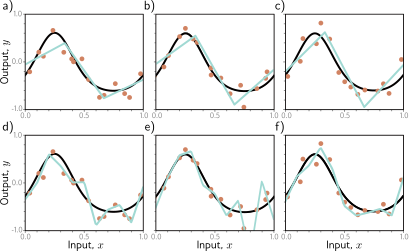

# 第八章

# 衡量性能

前几章描述了神经网络模型、损失函数和训练算法。本章将探讨如何衡量已训练模型的性能。只要有足够的容量（即隐藏单元的数量），神经网络模型通常能在训练数据上表现完美。然而，这并不一定意味着它能很好地泛化到新的测试数据。

我们将看到，测试误差有三个不同的来源，它们的相对贡献取决于 (i) 任务中固有的不确定性，(ii) 训练数据的数量，以及 (iii) 模型的选择。后一种依赖性引出了超参数搜索的问题。我们将讨论如何选择模型超参数（例如，隐藏层的数量和每层中隐藏单元的数量）和学习算法超参数（例如，学习率和批次大小）。

### 8.1 训练一个简单的模型

我们使用 MNIST-1D 数据集（图8.1）来探究模型性能。该数据集包含十个类别 $y \in \{0, 1, \dots, 9\}$，代表数字0-9。数据源自每个数字的一维模板。每个数据样本 $\mathbf{x}$ 都是通过随机变换其中一个模板并添加噪声来创建的。完整的训练数据集 $\{\mathbf{x}_i, y_i\}$ 由 $I=4000$ 个训练样本组成，每个样本包含 $D_i=40$ 个维度，代表在40个位置上的水平偏移量。在数据生成过程中，十个类别被均匀抽取，因此每个类别约有400个样本。

我们使用一个具有 $D_i=40$ 个输入和 $D_o=10$ 个输出的网络，这些输出通过一个 softmax 函数来产生类别概率（见第5.5节）。该网络有两个隐藏层，每层有 $D=100$ 个隐藏单元。它使用随机梯度下降法进行训练，批次大小为100，学习率为0.1，共进行6000步（150个周期），损失函数为多类交叉熵损失（方程5.24）。图8.2显示了训练误差随训练过程的变化。大约4000步后，训练数据被完美分类。训练损失也随之下降，最终接近于零。参考：问题 8.1

然而，这并不意味着分类器是完美的；模型可能已经记住了训练集，但无法预测新的样本。为了评估真实性能，我们需要一个独立的输入/输出对测试集 $\{\mathbf{x}_i, \mathbf{y}_i\}$。为此，我们使用相同的过程生成另外1000个样本。图8.2a也显示了该测试数据的误差随训练步数的变化。这些误差随着训练的进行而减小，但只降到约40%。这比90%的随机错误率要好，但远差于训练集的表现；模型未能很好地泛化到测试数据。

测试损失（图8.2b）在前1500个训练步中下降，但随后又再次上升。此时，测试错误率相当稳定；模型犯了同样的错误，但信心越来越足。这降低了正确答案的概率，从而增加了负对数似然。这种信心的增加是 softmax 函数的一个副作用；为了使训练数据的概率趋近于1，softmax之前的激活值被推向越来越极端的值（见图5.10）。

---

> **图 8.1 MNIST-1D 数据集。** a) 基于数字0-9的10个类别的模板 $y \in \{0, \dots, 9\}$。b) 通过随机变换模板和 c) 添加噪声来创建训练样本 $\mathbf{x}$。d) 然后在40个垂直位置上对变换后模板的水平偏移量进行采样。改编自 (Greydanus, 2020)
---

> **图 8.2 MNIST-1D 结果。** a) 分类错误百分比作为训练步数的函数。训练集误差下降到零，但测试误差没有降到约40%以下。这个模型没有很好地泛化到新的测试数据。b) 损失作为训练步数的函数。训练损失稳定地向零下降。测试损失起初下降，但随后增加，因为模型对其（错误的）预测变得越来越自信。
---

### 8.2 误差来源

现在我们来考虑当一个模型未能泛化时，误差的来源。为了更容易地进行可视化，我们回到一个一维最小二乘回归问题，在这个问题中，我们确切地知道真实数据是如何生成的。图8.3显示了一个准正弦函数；训练和测试数据都是通过在 $[0, 1]$ 范围内采样输入值，将它们通过这个函数，并添加具有固定方差的高斯噪声来生成的。参考：笔记本项目 8.1 MNIST-1D性能

我们用一个简化的浅层神经网络来拟合这些数据（图8.4）。连接输入层和隐藏层的权重和偏置是固定的，这样函数的“结点”在区间上均匀分布。如果有 $D$ 个隐藏单元，那么这些结点将位于 $0, 1/D, 2/D, \dots, (D-1)/D$。这个模型可以表示在 $[0, 1]$ 范围内具有 $D$ 个等宽区域的任何分段线性函数。除了易于理解之外，这个模型还有一个优点，即它可以以封闭形式拟合，而不需要随机优化算法（见问题8.3）。因此，我们可以保证在训练期间找到损失函数的全局最小值。参考：问题 8.2-8.3

---

> **图 8.3 回归函数。** 实心黑线显示了真实函数。为了生成 $I$ 个训练样本 $\{x_i, y_i\}$，将输入空间 $x \in$ 分成 $I$ 个相等的段，并在每个段内从均匀分布中抽取一个样本 $x_i$。相应的值 $y_i$ 是通过在 $x_i$ 处评估函数并添加高斯噪声来创建的（灰色区域显示 $\pm 2$ 标准差）。测试数据以相同的方式生成。
---

> **图 8.4 带有三个隐藏单元的简化神经网络。** a) 输入层和隐藏层之间的权重和偏置是固定的（虚线箭头）。b-d) 它们被选择成使得隐藏单元激活的斜率为1，并且它们的结点在区间上均匀分布，结点分别位于 $x=0, x=1/3$ 和 $x=2/3$。修改其余参数 $\boldsymbol{\phi}=\{\beta, \omega_1, \omega_2, \omega_3\}$ 可以创建在 $x \in$ 上结点位于 $1/3$ 和 $2/3$ 的任何分段线性函数。e-g) 三个具有不同参数 $\boldsymbol{\phi}$ 值的示例函数。
---

#### 8.2.1 噪声、偏置和方差

误差有三种可能的来源，分别称为**噪声**（noise）、**偏置**（bias）和**方差**（variance）（图8.5）：

**噪声** 数据生成过程包括添加噪声，因此对于每个输入 $x$，都有多个可能的有效输出 $y$（图8.5a）。这种误差来源对于测试数据是无法克服的。请注意，它不一定限制训练性能；我们在训练期间很可能永远不会看到相同的输入 $x$ 两次，所以仍然有可能完美地拟合训练数据。

噪声可能因为数据生成过程存在真正的随机因素而产生，因为一些数据被错误标记，或者因为存在未被观察到的其他解释变量。在极少数情况下，可能没有噪声；例如，一个网络可能近似一个确定但需要大量计算来评估的函数。然而，噪声通常是对可能的测试性能的一个基本限制。

**偏置** 第二个潜在的误差来源可能是因为模型不够灵活，无法完美地拟合真实函数。例如，三区域神经网络模型无法精确地描述准正弦函数，即使参数被优化选择（图8.5b）。这被称为**偏置**。

**方差** 我们拥有的训练样本有限，没有办法将底层函数中的系统性变化与底层数据中的噪声区分开来。当我们拟合一个模型时，我们得到的不是对真实底层函数的最接近的近似。实际上，对于不同的训练数据集，结果每次都会略有不同。拟合函数中这种额外的可变性来源被称为**方差**（图8.5c）。在实践中，由于随机学习算法每次不一定收敛到相同的解，可能还会有额外的方差。

---

> **图 8.5 测试误差的来源。** a) **噪声**。数据生成是有噪声的，所以即使模型完全复制了真实的底层函数（黑线），测试数据中的噪声（灰色点）也意味着会存在一些误差（灰色区域代表两个标准差）。b) **偏置**。即使有最佳的参数，三区域模型（青色线）也无法精确地拟合真实函数（黑线）。这种偏置是另一个误差来源（灰色区域代表有符号误差）。c) **方差**。在实践中，我们拥有的训练数据有限且有噪声（橙色点）。当我们拟合模型时，我们恢复的不是面板(b)中的最佳可能函数，而是一个反映了训练数据特性的略有不同的函数（青色线）。这提供了额外的误差来源（灰色区域代表两个标准差）。图8.6显示了这个区域是如何计算的。
---

#### 8.2.2 测试误差的数学公式

现在我们来精确地数学化噪声、偏置和方差的概念。考虑一个一维回归问题，其中数据生成过程具有方差为 $\sigma^2$ 的加性噪声（例如，图8.3）；对于相同的输入 $x$，我们可以观察到不同的输出 $y$，因此对于每个 $x$，都有一个分布 $\mathrm{Pr}(y|x)$，其期望值（均值）为 $\mu[x]$：
$$
\mu[x] = E_{y}[y[x]] = \int y[x]\mathrm{Pr}(y|x)dy \tag{8.1}
$$
和固定的噪声 $\sigma^2 = E_y[(\mu[x]-y[x])^2]$。这里我们使用了符号 $y[x]$ 来指明我们正在考虑在给定输入位置 $x$ 的输出 $y$。参考：附录 C.2 期望

现在考虑在位置 $x$ 的模型预测 $f[x, \boldsymbol{\phi}]$ 和观测值 $y[x]$ 之间的最小二乘损失：
$$
\begin{aligned}
L[x] &= (f[x, \boldsymbol{\phi}]-y[x])^2 \\
&= ((f[x, \boldsymbol{\phi}]-\mu[x]) + (\mu[x]-y[x]))^2 \\
&= (f[x, \boldsymbol{\phi}]-\mu[x])^2 + 2(f[x, \boldsymbol{\phi}]-\mu[x])(\mu[x]-y[x]) + (\mu[x]-y[x])^2
\end{aligned} \tag{8.2}
$$
在第二行中，我们既加上了又减去了底层函数的均值 $\mu[x]$，并在第三行中展开了平方项。

底层函数是随机的，所以这个损失取决于我们观察到的特定 $y[x]$。期望损失是：
$$
\begin{aligned}
E_y[L[x]] &= E_y[(f[x, \boldsymbol{\phi}]-\mu[x])^2 + 2(f[x, \boldsymbol{\phi}]-\mu[x])(\mu[x]-y[x]) + (\mu[x]-y[x])^2] \\
&= (f[x, \boldsymbol{\phi}]-\mu[x])^2 + 2(f[x, \boldsymbol{\phi}]-\mu[x])(\mu[x]-E_y[y[x]]) + E_y[(\mu[x]-y[x])^2] \\
&= (f[x, \boldsymbol{\phi}]-\mu[x])^2 + 2(f[x, \boldsymbol{\phi}]-\mu[x]) \cdot 0 + E_y[(\mu[x]-y[x])^2] \\
&= (f[x, \boldsymbol{\phi}]-\mu[x])^2 + \sigma^2
\end{aligned} \tag{8.3}
$$
这里我们利用了处理期望的规则。在第二行中，我们分布了期望算子，并从不依赖于 $y[x]$ 的项中移除了它。在第三行中，我们注意到第二项为零，因为根据定义 $E_y[y[x]] = \mu[x]$。最后，在第四行中，我们代入了噪声 $\sigma^2$ 的定义。参考：附录 C.2.1 期望规则

我们可以看到，期望损失被分解为两项；第一项是模型与真实函数均值之间的平方偏差，第二项是噪声。

第一项可以进一步划分为偏置和方差。模型 $f[x, \boldsymbol{\phi}]$ 的参数 $\boldsymbol{\phi}$ 依赖于训练数据集 $\mathcal{D}=\{\mathbf{x}_i, y_i\}$，所以更准确地说，我们应该写成 $f[x, \boldsymbol{\phi}[\mathcal{D}]]$。训练数据集是数据生成过程的一个随机样本；对于不同的训练数据样本，我们会学到不同的参数值。相对于所有可能的数据集 $\mathcal{D}$，期望的模型输出 $f_\mu[x]$ 因此是：
$$
f_\mu[x] = E_{\mathcal{D}}[f[x, \boldsymbol{\phi}[\mathcal{D}]]] \tag{8.4}
$$
回到方程8.3的第一项，我们加上并减去 $f_\mu[x]$ 并展开：
$$
\begin{aligned}
(f[x, \boldsymbol{\phi}&[\mathcal{D}]] - \mu[x])^2 \\
&= ((f[x, \boldsymbol{\phi}[\mathcal{D}]] - f_\mu[x]) + (f_\mu[x] - \mu[x]))^2 \\
&= (f[x, \boldsymbol{\phi}[\mathcal{D}]]-f_\mu[x])^2 + 2(f[x, \boldsymbol{\phi}[\mathcal{D}]]-f_\mu[x])(f_\mu[x]-\mu[x]) + (f_\mu[x]-\mu[x])^2
\end{aligned} \tag{8.5}
$$
然后我们取相对于训练数据集 $\mathcal{D}$ 的期望：
$$
E_{\mathcal{D}}[(f[x, \boldsymbol{\phi}[\mathcal{D}]]-\mu[x])^2] = E_{\mathcal{D}}[(f[x, \boldsymbol{\phi}[\mathcal{D}]]-f_\mu[x])^2] + (f_\mu[x]-\mu[x])^2 \tag{8.6}
$$
这里我们使用了与方程8.3类似的简化步骤。最后，我们将这个结果代入方程8.3：
$$
E_{\mathcal{D}}[E_y[L[x]]] = \underbrace{E_{\mathcal{D}}[(f[x, \boldsymbol{\phi}[\mathcal{D}]]-f_\mu[x])^2]}_{\text{方差}} + \underbrace{(f_\mu[x]-\mu[x])^2}_{\text{偏置}} + \underbrace{\sigma^2}_{\text{噪声}} \tag{8.7}
$$

这个方程说明，在考虑了训练数据 $\mathcal{D}$ 和测试数据 $y$ 的不确定性之后，期望损失由三个可加的分量组成。**方差**是我们对特定训练数据集采样导致的拟合模型中的不确定性。**偏置**是模型与我们正在建模的函数均值之间的系统偏差。**噪声**是输入到输出的真实映射中固有的不确定性。这三种误差来源对于任何任务都将存在。对于带有最小二乘损失的回归任务，它们是可加的。然而，对于其他类型的问题，它们的相互作用可能更复杂。

### 8.3 减少误差

在上一节中，我们看到测试误差源于三个来源：噪声、偏置和方差。噪声分量是无法克服的；我们无能为力，它代表了对期望模型性能的一个基本限制。然而，可以减少另外两个项。

#### 8.3.1 减少方差

回想一下，方差源于有限且带噪声的训练数据。将模型拟合到两个不同的训练集会导致参数略有不同。因此，我们可以通过增加训练数据的数量来减少方差。这可以平均掉固有的噪声，并确保输入空间被充分采样。

图8.6显示了用6、10和100个样本进行训练的效果。对于每个数据集大小，我们显示了三种训练数据集的最佳拟合模型。只有六个样本时，拟合的函数每次都大不相同：方差很显著。随着我们增加样本数量，拟合的模型变得非常相似，方差也减小了。总的来说，增加训练数据几乎总是能提高测试性能。

---

> **图 8.6 通过增加训练数据来减少方差。** a-c) 拟合到三个不同的、随机抽样的六点数据集的三区域模型。每次拟合的模型都大不相同。d) 我们多次重复这个实验，并绘制了平均模型预测（青色线）和模型预测的方差（灰色区域显示两个标准差）。e-h) 我们做同样的实验，但这次使用大小为10的数据集。预测的方差减小了。i-l) 我们用大小为100的数据集重复这个实验。现在拟合的模型总是相似的，方差很小。
---

#### 8.3.2 减少偏置

偏置项源于模型无法描述真实的底层函数。这表明我们可以通过使模型更灵活来减少这个误差。这通常通过增加**模型容量**来完成。对于神经网络，这意味着增加更多的隐藏单元和/或隐藏层。

在简化的模型中，增加容量对应于增加更多的隐藏单元，以便将区间 $[0, 1]$ 分成更多的线性区域。图8.7a-c显示，（毫不奇怪）这确实减少了偏置；随着我们将线性区域的数量增加到10个，模型变得足够灵活，可以紧密地拟合真实函数。

---

> **图 8.7 作为模型容量函数的偏置和方差。** a-c) 随着我们增加玩具模型的隐藏单元数量，线性区域的数量增加，模型能够更紧密地拟合真实函数；偏置（灰色区域）减小。d-f) 不幸的是，增加模型容量有增加方差项（灰色区域）的副作用。这被称为**偏置-方差权衡**。
---

#### 8.3.3 偏置-方差权衡

然而，图8.7d-f显示了增加模型容量的一个意想不到的副作用。对于固定大小的训练数据集，方差项通常会随着模型容量的增加而增加。因此，增加模型容量不一定能减少测试误差。这被称为**偏置-方差权衡**。

图8.8探讨了这种现象。在面板a-c中，我们将简化的三区域模型拟合到三个不同的十五点数据集上。尽管数据集不同，但最终模型非常相似；数据中的噪声在每个线性区域大致平均掉。在面板d-f中，我们将一个有十个区域的模型拟合到相同三个数据集上。这个模型有更多的灵活性，但这并不利；模型当然能更好地拟合数据，训练误差会更低，但大部分额外的描述能力都用于建模噪声。这种现象被称为**过拟合**。

我们已经看到，随着我们增加模型的容量，对于固定大小的训练数据集，偏置会减小，但方差会增加。这表明存在一个最优容量，此时偏置不太大，方差仍然相对较小。图8.9显示了当我们在图8.8的数据上增加容量时，这些项在玩具模型中如何数值变化。对于回归模型，总期望误差是偏置和方差的和，当模型容量为四（即，在数据范围内有四个隐藏单元和四个线性区域）时，这个和是最小的。参考：笔记本项目 8.2 偏置-方差权衡

---

> **图 8.8 过拟合。** a-c) 一个具有三个区域的模型被拟合到三个不同的十五点数据集上。结果在所有三种情况下都相似（即方差很低）。d-f) 一个具有十个区域的模型被拟合到相同的数据集上。额外的灵活性不一定能产生更好的预测。虽然这三个模型各自更好地描述了训练数据，但它们不一定更接近真实的底层函数（黑线）。相反，它们**过拟合**了数据并描述了噪声，并且方差（拟合曲线之间的差异）更大了。
---

> **图 8.9 偏置-方差权衡。** 使用图8.8的训练数据，在简化模型中，将方程8.7的偏置和方差项绘制为模型容量（隐藏单元数/数据范围内的线性区域数）的函数。随着容量的增加，偏置（实心橙色线）减小，但方差（实心青色线）增加。这两项的和（虚线灰色线）在容量为四时最小化。
---

### 8.4 双重下降

在上一节中，我们考察了随着模型容量的增加，偏置-方差的权衡。现在让我们回到MNIST-1D数据集，看看这是否在实践中发生。我们使用10,000个训练样本，用另外5,000个样本进行测试，并考察当我们增加模型容量（参数数量）时，训练和测试性能的变化。我们用Adam和0.005的步长训练模型，使用10,000个样本的全批量进行4000步。

图8.10a显示了随着隐藏单元数量的增加，具有两个隐藏层的神经网络的训练和测试误差。训练误差随着容量的增长而减小，并迅速接近于零。垂直虚线代表模型参数数量与训练样本数量相同的容量，但模型在此之前就记住了数据集。测试误差随着我们增加模型容量而减小，但没有像偏置-方差权衡曲线预测的那样增加；它持续减小。

在图8.10b中，我们重复这个实验，但这次我们随机化了15%的训练标签。再一次，训练误差减小到零。这一次，有更多的随机性，模型需要几乎与数据点一样多的参数来记住数据。测试误差确实显示了典型的偏置-方差权衡，即随着我们增加容量到模型恰好拟合训练数据的点，误差会增加。然而，随后它发生了意想不到的事情；它又开始减小了。实际上，如果我们增加足够的容量，测试损失会降到我们曲线第一部分达到的最低水平以下。

这种现象被称为**双重下降**。对于像MNIST这样的某些数据集，它在原始数据中就存在（图8.10c）。对于其他像MNIST-1D和CIFAR-100（图8.10d）这样的数据集，当我们向标签中添加噪声时，它会出现或变得更加突出。曲线的第一部分被称为**经典**或**欠参数化**区域，第二部分被称为**现代**或**过参数化**区域。误差增加的中心部分被称为**临界区域**。参考：笔记本项目 8.3 双重下降

---

> **图 8.10 双重下降。** a) MNIST-1D上两层隐藏层网络的训练和测试误差，随每层隐藏单元数（以及因此的参数数）的增加而变化。随着参数数量接近训练样本数量（垂直虚线），训练误差减小到零。测试误差没有显示预期的偏置-方差权衡，而是在模型记住数据集后继续减小。b) 重复同样的实验，但训练数据更嘈杂。同样，训练误差减小到零，尽管现在需要几乎与训练点一样多的参数来记住数据集。测试误差显示了预测的偏置/方差权衡；它随着容量的增加而减小，但在我们接近训练数据被完全记住的点时再次增加。然而，它随后再次减小，并最终达到更好的性能水平。这被称为双重下降。根据损失函数、模型和数据中的噪声量，双重下降模式在许多数据集中或多或少地可以看到。c) Belkin等人（2019）在MNIST（无标签噪声）上使用浅层神经网络的结果。d) Nakkiran等人（2021）在CIFAR-100上使用ResNet18网络（见第11章）的结果。详见原始论文。
---

#### 8.4.1 解释

双重下降的发现是近期的、出乎意料的，并且有些令人费解。它源于两种现象的相互作用。首先，当模型刚好有足够的容量来记住数据时，测试性能会暂时变差。其次，即使容量超过了训练数据被完全正确分类的点，测试性能仍会随着容量的增加而继续提高。第一种现象与偏置-方差权衡的预测完全一致。第二种现象更令人困惑；不清楚为什么在现在甚至没有足够的训练数据点来唯一地约束模型参数的情况下，性能会变得更好。

为了理解为什么性能会随着我们增加更多参数而继续提高，请注意，一旦模型有足够的容量将训练损失驱动到接近零，模型就几乎完美地拟合了训练数据。这意味着进一步的容量无法帮助模型更好地拟合训练数据；任何改变都必须发生在训练点之间。模型在数据点之间优先选择一种解决方案而不是另一种的倾向被称为其**归纳偏置**。参考：问题 8.4-8.5

模型在数据点之间的行为至关重要，因为在高维空间中，训练数据极其稀疏。MNIST-1D数据集有40个维度，我们用10,000个样本进行训练。如果这看起来像是大量数据，可以考虑一下，如果我们将每个输入维度量化为10个区间会发生什么。总共会有 $10^{40}$ 个区间，却只由 $10^4$ 个样本约束。即使是这种粗略的量化，每 $10^{36}$ 个区间中也只有一个数据点！高维空间体积压倒训练点数量的趋势被称为**维度灾难**。

这意味着高维问题可能更像图8.11a；我们观察到数据的输入空间的小区域之间存在显著的间隙。对双重下降的推测性解释是，随着我们向模型增加容量，它在最近的数据点之间插值越来越平滑。在缺乏关于训练点之间发生什么的信息的情况下，假设平滑是明智的，并且可能合理地泛化到新数据。

这个论点是合理的。随着我们向模型增加更多的容量，它确实有能力创建更平滑的函数。图8.11b-f显示了当我们增加隐藏单元数量时，仍然能通过数据点的最平滑的可能函数。当参数数量非常接近训练数据样本数量时（图8.11b），模型被迫扭曲自己以精确拟合训练数据，导致不稳定的预测。这解释了为什么双重下降曲线的峰值如此明显。随着我们增加更多的隐藏单元，模型有能力构建可能更好地泛化到新数据的更平滑的函数。

然而，这并没有解释为什么过参数化的模型应该产生平滑的函数。图8.12显示了由具有50个隐藏单元的简化模型可以创建的三个函数。在每种情况下，模型都精确地拟合了数据，所以损失为零。如果双重下降的现代区域是由增加的平滑度来解释的，那么究竟是什么在鼓励这种平滑度呢？

这个问题的答案尚不确定，但有两种可能。首先，网络初始化可能鼓励平滑度，并且模型在训练过程中从未偏离平滑函数的子域。其次，训练算法可能以某种方式“偏好”收敛到平滑函数。任何偏向于等效解子集的解决方案的因素都被称为**正则化器**，所以一种可能性是训练算法充当了隐式正则化器（见第9.2节）。

---

> **图 8.11 增加容量（隐藏单元）可以使稀疏数据点之间的插值更平滑。** a) 考虑训练数据（橙色圆圈）稀疏的情况；中心有一个很大的区域，没有数据样本来约束模型模仿真实函数（黑线）。b) 如果我们用刚好足够的容量来拟合训练数据的模型（青色曲线）进行拟合，那么它必须扭曲自己以通过训练数据，并且输出预测不会平滑。c-f) 然而，随着我们增加更多的隐藏单元，模型有能力在这些点之间更平滑地插值（每种情况下绘制了最平滑的可能曲线）。然而，与此图不同的是，它并非必须这样做。
---

> **图 8.12 正则化。** a-c) 三条拟合曲线中的每一条都精确地通过数据点，因此每条的训练损失都为零。然而，我们可能期望面板(a)中的平滑曲线比面板(b)和(c)中的不规则曲线能更好地泛化到新数据。任何偏向于具有相似训练损失的解的子集的因素都被称为**正则化器**。人们认为，神经网络的初始化和/或拟合具有隐式的正则化效果。因此，在过参数化区域，会鼓励像面板(a)中那样的更合理的解。
---

### 8.5 选择超参数

在上一节中，我们讨论了测试性能如何随模型容量变化。不幸的是，在经典区域，我们既无法获得偏置（需要知道真实的底层函数），也无法获得方差（需要多个独立抽样的数据集来估计）。在现代区域，没有办法判断在测试误差停止改善之前应该增加多少容量。这引出了一个问题：在实践中我们究竟应该如何选择模型容量。

对于深度网络，模型容量取决于隐藏层的数量和每层的隐藏单元数，以及我们尚未介绍的其他架构方面。此外，学习算法的选择和任何相关的参数（学习率等）也会影响测试性能。这些元素统称为**超参数**。找到最佳超参数的过程被称为**超参数搜索**，或者（当专注于网络结构时）**神经架构搜索**。

超参数通常是凭经验选择的；我们在相同的训练集上训练多个具有不同超参数的模型，测量它们的性能，并保留最好的模型。然而，我们不在测试集上测量它们的性能；这会带来这些超参数恰好对测试集有效但不能泛化到更远数据的可能性。相反，我们引入第三个数据集，称为**验证集**。对于每一种超参数的选择，我们使用训练集训练相关的模型，并在验证集上评估性能。最后，我们选择在验证集上表现最好的模型，并在测试集上测量其性能。原则上，这应该能给出一个对真实性能的合理估计。

超参数空间通常比参数空间小，但仍然太大，无法穷举尝试每种组合。不幸的是，许多超参数是离散的（例如，隐藏层的数量），其他的可能是相互条件的（例如，我们只需要指定第十个隐藏层中隐藏单元的数量，如果至少有十层）。因此，我们不能像学习模型参数那样依赖梯度下降法。超参数优化算法智能地对超参数空间进行抽样，并根据先前结果进行调整。这个过程在计算上是昂贵的，因为我们必须为每种超参数组合训练一个完整的模型并测量验证性能。

### 8.6 总结

为了衡量性能，我们使用一个独立的测试集。性能在该测试集上得以维持的程度被称为**泛化**。测试误差可以由三个因素来解释：噪声、偏置和方差。在带有最小二乘损失的回归问题中，这些因素是可加的。增加训练数据会降低方差。当模型容量小于训练样本数量时，增加容量会降低偏置但增加方差。这被称为**偏置-方差权衡**，存在一个权衡最优的容量。

然而，这与即使参数超过训练样本，性能仍随容量提高的趋势相平衡。这两个现象共同创造了**双重下降**曲线。据认为，在过参数化的“现代区域”，模型在训练数据点之间插值更平滑，尽管尚不清楚是什么驱动了这一点。为了选择容量以及其他模型和训练算法的超参数，我们拟合多个模型，并使用一个独立的验证集评估它们的性能。

### 注释

**偏置-方差权衡：** 我们表明，对于带有最小二乘损失的回归问题，测试误差分解为噪声、偏置和方差项的和。这些因素对于具有其他损失的模型也都存在，但它们的相互作用通常更复杂（Friedman, 1997; Domingos, 2000）。对于分类问题，存在一些反直觉的预测；例如，如果模型偏向于在输入空间的某个区域选择错误的类别，那么增加方差可以提高分类率，因为这会将一些预测推过阈值以被正确分类。

**交叉验证：** 我们看到，通常将数据分为三部分：训练数据（学习模型参数）、验证数据（选择超参数）和测试数据（估计最终性能）。然而，当数据样本总数有限时，这种划分可能会导致问题；如果训练样本的数量与模型容量相当，那么方差将会很大。

减轻这个问题的一种方法是使用**k折交叉验证**。训练和验证数据被划分为 $K$ 个不相交的子集。例如，我们可能将这些数据分成五部分。我们用四部分进行训练，用第五部分进行验证，对五种排列中的每一种都这样做，并根据平均验证性能选择超参数。最终的测试性能是使用最佳超参数的五个模型在完全不同的测试集上的平均预测来评估的。这个思想有很多变体，但都共享一个共同的目标，即使用更大比例的数据来训练模型，从而减少方差。

**容量：** 我们非正式地使用**容量**这个术语来指代模型中的参数或隐藏单元的数量（并因此间接地指模型拟合日益复杂的函数的能力）。一个模型的**表示容量**描述了当我们考虑所有可能的参数值时，它可以构建的可能函数的空间。当我们考虑到一个优化算法可能无法达到所有这些解时，剩下的就是**有效容量**。

**Vapnik-Chervonenkis (VC) 维度**（Vapnik & Chervonenkis, 1971）是容量的一个更正式的度量。它是一个二元分类器可以任意标记的最大训练样本数。Bartlett等人（2019）根据层数和权重数量推导了VC维度的上下界。容量的另一种度量是**Rademacher复杂度**，它是一个分类模型（使用最优参数）在随机标签数据上的期望经验性能。Neyshabur等人（2017）根据Rademacher复杂度推导了泛化误差的下界。

**双重下降：** “双重下降”这个术语由Belkin等人（2019）创造，他们证明了对于两层神经网络和随机特征，测试误差在过参数化区域再次下降。他们还声称这在决策树中也发生，尽管Buschjäger & Morik（2021）随后提供了相反的证据。Nakkiran等人（2021）表明，双重下降发生在各种现代数据集（CIFAR-10, CIFAR-100, IWSLT’14 de-en）、架构（CNNs, ResNets, transformers）和优化器（SGD, Adam）中。当向目标标签添加噪声时（Nakkiran等人，2021）以及当使用某些正则化技术时（Ishida等人，2020），这种现象更为明显。

Nakkiran等人（2021）还提供了经验证据，表明测试性能取决于**有效模型容量**（给定模型和训练方法可以达到零训练误差的最大样本数）。在这一点上，模型开始致力于平滑地插值。因此，测试性能不仅取决于模型，还取决于训练算法和训练时长。他们观察到当他们研究一个固定容量的模型并增加训练迭代次数时，模式是相同的。他们称之为**周期性双重下降**。Pezeshki等人（2022）从模型中不同特征以不同速度学习的角度对此现象进行了建模。

双重下降做出了一个相当奇怪的预测，即添加训练数据有时会恶化测试性能。考虑曲线第二个下降部分的过参数化模型。如果我们增加训练数据以匹配模型容量，我们现在将处于新测试误差曲线的临界区域，测试损失可能会增加。

Bubeck & Sellke (2021) 证明过参数化是高维空间中平滑插值数据的必要条件。他们展示了参数数量和模型的**Lipschitz常数**（输出对于小的输入变化可以改变的最快速度）之间的权衡。关于过参数化机器学习理论的综述可以在Dar等人（2021）中找到。参考：附录 B.1.1 Lipschitz常数

**维度灾难：** 随着维度的增加，空间的体积增长得如此之快，以至于密集采样所需的数据量呈指数级增长。这种现象被称为**维度灾难**。高维空间有许多意想不到的性质，在尝试基于低维示例进行推理时应保持谨慎。本书在许多方面将深度学习可视化在一维或二维中，但这些可视化应持健康的怀疑态度对待。

高维空间的惊人特性包括：(i) 从标准正态分布中随机抽样的两个数据点以高概率彼此（相对于原点）接近正交。(ii) 从标准正态分布中抽样的样本到原点的距离大致是恒定的。(iii) 高维球体（超球体）的大部分体积都邻近其表面（一个常见的比喻是，高维橙子的大部分体积都在果皮里，而不是果肉里）。(iv) 如果我们将一个单位直径的超球体放在一个单位长度边的超立方体内，那么随着维度的增加，超球体占据立方体体积的比例会减小。由于立方体的体积固定为1，这意味着高维超球体的体积趋近于零。(v) 对于从高维超立方体中的均匀分布中抽取的随机点，最近点和最远点之间的欧几里得距离之比趋近于1。更多信息请参阅Beyer等人（1999）和Aggarwal等人（2001）。参考：问题 8.6-8.9，笔记本项目 8.4 高维空间

**真实世界性能：** 在本章中，我们认为模型性能可以使用一个留出的测试集来评估。然而，如果测试集的统计数据与真实世界数据不匹配，结果将不具指示性。此外，真实世界数据的统计数据可能随时间变化，导致模型变得越来越陈旧，性能下降。这被称为**数据漂移**，意味着部署的模型必须被仔细监控。

真实世界性能可能比测试性能差的主要原因有三个。首先，输入数据 $\mathbf{x}$ 的统计数据可能会改变；我们现在可能正在观察函数中在训练期间被稀疏采样或根本未被采样的部分。这被称为**协变量偏移**。其次，输出数据 $\mathbf{y}$ 的统计数据可能会改变；如果某些输出值在训练期间不常见，那么模型可能学会在模棱两可的情况下不预测它们，如果它们在真实世界中更常见，就会犯错。这被称为**先验偏移**。第三，输入和输出之间的关系可能会改变。这被称为**概念偏移**。这些问题在Moreno-Torres等人（2012）中进行了讨论。

**超参数搜索：** 找到最佳超参数是一项具有挑战性的优化任务。测试单个超参数配置是昂贵的；我们必须训练一个完整的模型并测量其性能。我们没有简单的方法来获取导数（即，当我们对超参数进行微小改变时性能如何变化）。此外，许多超参数是离散的，所以我们不能使用梯度下降法。存在多个局部最小值，没有办法判断我们是否接近全局最小值。噪声水平很高，因为每个训练/验证周期都使用一个随机训练算法；如果我们用相同的超参数训练一个模型两次，我们期望得到不同的结果。最后，一些变量是有条件的，只有在其他变量被设置时才存在。例如，第三个隐藏层中隐藏单元的数量仅在至少有三个隐藏层时才相关。

一个简单的方法是随机抽样空间（Bergstra & Bengio, 2012）。然而，对于连续变量，最好是建立一个性能作为超参数和该函数不确定性的函数模型。这可以被利用来测试不确定性大的地方（探索空间）或专注于性能看起来有希望的区域（利用先前的知识）。**贝叶斯优化**是一个基于高斯过程的框架，它正是这样做的，它在超参数搜索中的应用在Snoek等人（2012）中有所描述。**Beta-Bernoulli bandit**（见Lattimore & Szepesvári, 2020）是一个大致等价的模型，用于描述由于离散变量导致的结果的不确定性。

**序列模型基配置（SMAC）** 算法（Hutter等人，2011）可以处理连续、离散和条件参数。基本方法是使用随机森林来建模目标函数，其中树预测的均值是关于目标函数的最佳猜测，它们的方差代表不确定性。一个可以同样处理连续、离散和条件参数组合的完全不同的方法是**树状Parzen估计器**（Bergstra等人，2011）。先前的方法对给定超参数的模型性能的概率进行建模。相比之下，树状Parzen估计器对给定模型性能的超参数的概率进行建模。

**Hyperband**（Li等人，2017b）是一种用于超参数优化的多臂老虎机策略。它假设有计算上便宜但近似的测量性能的方法（例如，通过不训练到完成），并且这些可以与一个预算相关联（例如，通过训练固定的迭代次数）。采样一定数量的随机配置并运行直到预算用完。然后保留最好的 $\eta$ 分之一的运行，预算乘以 $1/\eta$。重复此过程直到达到最大预算。这种方法具有效率的优势；对于不好的配置，它不需要将实验运行到底。然而，每个样本只是随机选择的，这是低效的。**BOHB**算法（Falkner等人，2018）结合了Hyperband的效率和来自树状Parzen估计器的更明智的超参数选择，以构建一个更好的方法。

### 习题

**问题 8.1** 图8.2中的多类交叉熵训练损失会达到零吗？解释你的理由。

**思路与解答：**
不会。多类交叉熵损失是 $L = -\sum_i \log(\hat{p}_{iy_i})$，其中 $\hat{p}_{iy_i}$ 是模型对第 $i$ 个样本的正确类别 $y_i$ 所预测的概率。要使损失为零，需要 $\log(\hat{p}_{iy_i})$ 为负无穷大，这意味着 $\hat{p}_{iy_i}$ 必须为零。然而，softmax函数的输出总是在 $(0, 1)$ 的开区间内，永远不会达到0或1。因此，对数似然总是一个有限的负数，负对数似然（损失）总是一个有限的正数，永远不会达到零，尽管它可以无限接近零。

**问题 8.2** 我们应该为图8.4a模型第一层中的三个权重和偏置选择什么值，才能使隐藏单元的响应如图8.4b-d所示？

**思路与解答：**
图8.4b-d显示了三个ReLU激活的隐藏单元，它们的“结点”分别在 $x=0, x=1/3, x=2/3$，并且在激活区域的斜率都是1。
- 对于 $h_1$，结点在 $x=0$，即 $\theta_{10} + \theta_{11}(0) = 0 \implies \theta_{10}=0$。激活区的斜率为1，意味着 $\theta_{11}=1$。
- 对于 $h_2$，结点在 $x=1/3$，即 $\theta_{20} + \theta_{21}(1/3) = 0$。激活区的斜率为 $\theta_{21}=1$。因此 $\theta_{20}=-1/3$。
- 对于 $h_3$，结点在 $x=2/3$，即 $\theta_{30} + \theta_{31}(2/3) = 0$。激活区的斜率为 $\theta_{31}=1$。因此 $\theta_{30}=-2/3$。
由于这些参数是固定的，图中没有提到权重，这里可能指的就是 $\theta$ 参数。

**问题 8.3*** 给定一个由 $I$ 个输入/输出对组成的训练数据集 $\{x_i, y_i\}$，证明图8.4a模型的参数 $\{\beta, \omega_1, \omega_2, \omega_3\}$ 如何使用最小二乘损失函数以封闭形式找到。

**思路与解答：**
这是一个线性回归问题。因为第一层是固定的，对于任何输入 $x_i$，我们都可以计算出激活值 $h_{1i}, h_{2i}, h_{3i}$。我们的模型是 $y_i = \beta + \omega_1 h_{1i} + \omega_2 h_{2i} + \omega_3 h_{3i}$。这是一个关于参数 $\{\beta, \omega_1, \omega_2, \omega_3\}$ 的线性模型。
我们可以构建一个设计矩阵 $\mathbf{H}$，其第 $i$ 行是 $[1, h_{1i}, h_{2i}, h_{3i}]$，以及一个参数向量 $\boldsymbol{\omega} = [\beta, \omega_1, \omega_2, \omega_3]^T$。最小二乘解由正规方程给出：$\hat{\boldsymbol{\omega}} = (\mathbf{H}^T\mathbf{H})^{-1}\mathbf{H}^T\mathbf{y}$，其中 $\mathbf{y}$ 是所有 $y_i$ 组成的向量。这是一个封闭形式的解。

**问题 8.4** 考虑图8.10b中，我们训练一个隐藏层大小为200的模型，该模型将有50,410个参数。如果我们将训练样本数量从10,000增加到50,410，你预测训练和测试性能会发生什么变化？

**思路与解答：**
当前情况是参数数量（~50k）远大于训练样本数量（10k），我们处于过参数化区域（现代区域）。当我们将训练样本增加到50,410时，参数数量和样本数量大致相等。这将把我们推向“临界区域”。因此，我们预测测试误差会显著增加，而训练误差仍然会趋近于零（尽管可能需要更长的训练时间）。

**问题 8.5** 考虑模型容量超过训练数据点数量，且模型足够灵活以将训练损失降低到零的情况。这对拟合异方差模型意味着什么？提出一种解决你发现的任何问题的方法。

**思路与解答：**
- **含义**: 在过参数化的情况下，模型可以完美地拟合训练数据，包括数据中的噪声。对于异方差模型，模型不仅学习均值，还学习方差。如果模型完美拟合数据点（即预测值 $f(x_i)=y_i$），那么在这些点上的预测误差为零。模型可能会“认为”这些点的方差也应该为零，从而导致对不确定性的严重低估。
- **问题**: 模型将学会对训练点预测极低的方差（不确定性），但在点之间可能会有很高的不确定性。这导致模型对其预测过于自信，泛化能力差。
- **解决方法**: 正则化。例如，可以对预测的方差施加一个下限，或者在损失函数中添加一个正则化项，惩罚过小的方差预测。另一种方法是使用贝叶斯方法，为方差参数引入一个先验分布，防止其坍缩到零。

**问题 8.6** 证明从一个1000维标准高斯分布中抽取的两个随机点相对于原点有很高的概率是正交的。

**思路与解答：**
令 $\mathbf{x}, \mathbf{y}$ 是两个从 $N(\mathbf{0}, \mathbf{I})$ 中抽取的1000维向量。它们的夹角 $\theta$ 的余弦由 $\cos(\theta) = \frac{\mathbf{x}^T\mathbf{y}}{||\mathbf{x}|| ||\mathbf{y}||}$ 给出。
分子 $\mathbf{x}^T\mathbf{y} = \sum_i x_i y_i$。由于 $x_i, y_i \sim N(0,1)$ 且独立，所以 $E[x_i y_i] = E[x_i]E[y_i]=0$。$\mathrm{Var}(x_i y_i) = E[(x_iy_i)^2] - (E[x_iy_i])^2 = E[x_i^2]E[y_i^2] = 1 \cdot 1 = 1$。根据中心极限定理，当 $D=1000$ 很大时，$\sum x_i y_i$ 的分布近似于均值为0、方差为1000的正态分布。
分母 $||\mathbf{x}||^2 = \sum x_i^2$。$E[x_i^2]=1$，所以 $E[||\mathbf{x}||^2]=1000$。根据大数定律，当 $D$ 很大时，$\frac{1}{D}\sum x_i^2 \to 1$，所以 $||\mathbf{x}|| \approx \sqrt{D}$。
因此，$\cos(\theta) \approx \frac{N(0, D)}{D}$。这个值的期望为0，方差为 $D/D^2 = 1/D$。当 $D=1000$ 时，方差非常小，所以 $\cos(\theta)$ 极有可能接近于0，这意味着 $\theta$ 接近 $\pi/2$（正交）。

**问题 8.7** D维超球体的体积为 $\text{Vol}[r] = \frac{\pi^{D/2}r^D}{\Gamma(D/2+1)}$。使用斯特林公式证明，直径为1（半径r=0.5）的超球体的体积随着维度的增加而变为零。

**思路与解答：**
斯特林公式为 $\Gamma(z+1) \approx \sqrt{2\pi z}(z/e)^z$。
令 $z=D/2$。$\text{Vol}[0.5] = \frac{\pi^{D/2}(0.5)^D}{\Gamma(D/2+1)} \approx \frac{\pi^{D/2}(0.5)^D}{\sqrt{\pi D}(D/2e)^{D/2}} = \frac{(\pi/4)^{D/2}}{\sqrt{\pi D}(D/2e)^{D/2}} = \frac{1}{\sqrt{\pi D}} \left(\frac{2\pi e}{4D}\right)^{D/2} = \frac{1}{\sqrt{\pi D}} \left(\frac{\pi e}{2D}\right)^{D/2}$。
当 $D \to \infty$ 时，括号内的项 $(\pi e / 2D)$ 小于1（因为 $\pi e \approx 8.5$），所以它的 $D/2$ 次方会以指数速度趋近于零，远快于分母 $\sqrt{\pi D}$ 趋近于无穷大的速度。因此，总体积趋近于零。

**问题 8.8*** 考虑一个半径为 $r=1$ 的超球体。找出位于最外层1%半径（即厚度为0.01的最外层球壳）的体积占总体积的比例的表达式。证明随着维度的增加，这个比例趋近于1。

**思路与解答：**
体积比例 $p = \frac{\text{Vol} - \text{Vol}[0.99]}{\text{Vol}} = 1 - \frac{\text{Vol}[0.99]}{\text{Vol}} = 1 - \frac{\pi^{D/2}(0.99)^D/\Gamma(D/2+1)}{\pi^{D/2}(1)^D/\Gamma(D/2+1)} = 1 - 0.99^D$。
当 $D \to \infty$ 时，$0.99^D \to 0$，所以比例 $p \to 1$。

---

**图8.13 典型集合** a) 二维标准正态分布。圆圈是该分布中的四个样本。随着距中心的距离增加，概率降低，但该半径处的空间体积（即相邻等间距圆圈之间的区域）增大。b) 这些因素相互制约，使得样本距中心的距离直方图呈现显著峰值。
c) 在更高维度中，这种效应更为极端，观测到接近均值样本的概率趋近于零。
尽管最可能点位于分布均值处，典型样本却集中分布于相对狭窄的壳层中。

---

**问题 8.9** 图8.13c显示了随着维度增加，标准正态分布样本距离的分布。通过从25、100和500维的标准正态分布中采样并绘制距离中心的直方图来凭经验验证这一发现。什么封闭形式的概率分布描述了这些距离？

**思路与解答：**
这是一个编码和理论问题。
-   **经验验证**: 需要编写代码从高维高斯分布采样，计算每个样本到原点的欧几里得距离，并绘制直方图。结果应显示随着维度增加，直方图变得越来越窄，并且峰值向右移动。
-   **封闭形式分布**: 样本到原点的**平方**距离遵循**卡方分布**（Chi-squared distribution），其自由度等于维度 $D$。因此，距离本身遵循**卡分布**（Chi distribution）。当 $D$ 很大时，根据中心极限定理，卡方分布可以被正态分布很好地近似。
