# 第九章

# 正则化

第八章描述了如何衡量模型性能，并指出了训练数据与测试数据之间可能存在显著的性能差距。造成这种差异的可能原因包括：(i) 模型描述了训练数据中不具代表性的统计特性，未能反映从输入到输出的真实映射（即过拟合），以及 (ii) 在没有训练样本的区域，模型不受约束，导致了次优的预测。

本章讨论**正则化**（regularization）技术。这是一系列旨在缩小训练与测试性能之间泛化差距的方法。严格来说，正则化指的是向损失函数中添加明确的项，以偏好某些参数选择。然而，在机器学习中，这个术语通常泛指任何能改善泛化能力的策略。

我们首先从最严格意义上的正则化开始考虑。然后，我们展示随机梯度下降算法本身如何偏好某些解，这被称为**隐式正则化**。在此之后，我们考虑一系列能改善测试性能的启发式方法，包括早停、集成、丢弃、标签平滑和迁移学习。

### 9.1 显式正则化

考虑使用一个包含输入/输出对的训练集 $\{\mathbf{x}_i, \mathbf{y}_i\}$ 来拟合一个带有参数 $\boldsymbol{\phi}$ 的模型 $f[\mathbf{x}, \boldsymbol{\phi}]$。我们寻求能最小化损失函数 $L[\boldsymbol{\phi}]$ 的参数 $\hat{\boldsymbol{\phi}}$：
$$
\hat{\boldsymbol{\phi}} = \underset{\boldsymbol{\phi}}{\mathrm{argmin}} \left[ L[\boldsymbol{\phi}] \right] = \underset{\boldsymbol{\phi}}{\mathrm{argmin}} \left[ \sum_{i=1}^I l_i[\mathbf{x}_i, \mathbf{y}_i] \right] \tag{9.1}
$$

其中，单个项 $l_i[\mathbf{x}_i, \mathbf{y}_i]$ 用于衡量每个训练对的网络预测值 $f[\mathbf{x}_i, \boldsymbol{\phi}]$ 和输出目标 $\mathbf{y}_i$ 之间的不匹配程度。为了使这种最小化偏向于某些解，我们加入一个附加项：

$$
\hat{\boldsymbol{\phi}} = \underset{\boldsymbol{\phi}}{\mathrm{argmin}} \left[ \sum_{i=1}^I l_i[\mathbf{x}_i, \mathbf{y}_i] + \lambda \cdot g[\boldsymbol{\phi}] \right] \tag{9.2}
$$

其中 $g[\boldsymbol{\phi}]$ 是一个返回标量的函数，当参数不那么受到偏好时，其值较大。项 $\lambda$ 是一个正常数，用于控制原始损失函数和正则化项的相对贡献。正则化后的损失函数的最小值通常与原始的不同，因此训练过程会收敛到不同的参数值（图9.1）。

---
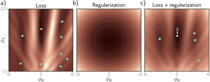

> **图 9.1 显式正则化。** a) Gabor模型的损失函数（见6.1.2节）。青色圆圈代表局部最小值。灰色圆圈代表全局最小值。b) 正则化项通过增加一个随着我们远离该点而增加的惩罚，来偏好接近绘图中心的参数。c) 最终的损失函数是原始损失函数加上正则化项的和。这个曲面有更少的局部最小值，并且全局最小值已经移动到了一个不同的位置（箭头显示了变化）。
---

#### 9.1.1 概率解释

正则化可以从概率的角度来看待。第5.1节展示了如何从最大似然准则构建损失函数：
$$
\hat{\boldsymbol{\phi}} = \underset{\boldsymbol{\phi}}{\mathrm{argmax}} \left[ \prod_{i=1}^I \mathrm{Pr}(\mathbf{y}_i | \mathbf{x}_i, \boldsymbol{\phi}) \right] \tag{9.3}
$$

正则化项可以被视为一个**先验** $\mathrm{Pr}(\boldsymbol{\phi})$，它代表了我们在观察数据之前关于参数的知识，现在我们有了**最大后验**（maximum a posteriori）或MAP准则：
$$
\hat{\boldsymbol{\phi}} = \underset{\boldsymbol{\phi}}{\mathrm{argmax}} \left[ \prod_{i=1}^I \mathrm{Pr}(\mathbf{y}_i | \mathbf{x}_i, \boldsymbol{\phi}) \mathrm{Pr}(\boldsymbol{\phi}) \right] \tag{9.4}
$$
回到负对数似然损失函数，通过取对数并乘以负一，我们看到 $\lambda \cdot g[\boldsymbol{\phi}] = -\log[\mathrm{Pr}(\boldsymbol{\phi})]$。

#### 9.1.2 L2正则化

这个讨论回避了正则化项应该惩罚（或者说，先验应该偏好）哪些解的问题。由于神经网络被用于极其广泛的应用中，这些只能是非常通用的偏好。最常用的正则化项是 **L2范数**，它惩罚参数值的平方和：
$$
\hat{\boldsymbol{\phi}} = \underset{\boldsymbol{\phi}}{\mathrm{argmin}} \left[ \sum_{i=1}^I l_i[\mathbf{x}_i, \mathbf{y}_i] + \lambda \sum_j \phi_j^2 \right] \tag{9.5}
$$
其中 $j$ 对参数进行索引。这也被称为**吉洪诺夫正则化**（Tikhonov regularization）或**岭回归**（ridge regression），或者（当应用于矩阵时）**弗罗贝尼乌斯范数正则化**。参考：问题 9.1-9.2

对于神经网络，L2正则化通常应用于权重，但不应用于偏置，因此被称为**权重衰减**项。其效果是鼓励较小的权重，从而使输出函数更平滑。要理解这一点，可以考虑输出预测是最后一个隐藏层激活值的加权和。如果权重的大小较小，输出的变化就会更小。同样的逻辑也适用于计算最后一个隐藏层的预激活值，依此类推，向后通过网络。在极限情况下，如果我们强制所有权重都为零，网络将产生一个由最终偏置参数决定的恒定输出。参考：笔记本项目 9.1 L2正则化

图9.2展示了用权重衰减和不同的正则化系数 $\lambda$ 值来拟合图8.4中简化网络的效果。当 $\lambda$ 很小时，它几乎没有影响。然而，随着 $\lambda$ 的增加，对数据的拟合变得不那么准确，函数也变得更平滑。这可能出于两个原因改善测试性能：

-   如果网络正在过拟合，那么添加正则化项意味着网络必须在对数据的亦步亦趋和保持平滑的愿望之间进行权衡。一种思考方式是，由于方差而产生的误差减少了（模型不再需要通过每个数据点），但代价是偏置增加了（模型只能描述平滑函数）。
-   当网络是过参数化的，一些额外的模型容量描述了没有训练数据的区域。在这里，正则化项将偏好在邻近点之间平滑插值的函数。在缺乏关于真实函数知识的情况下，这是合理的行为。

---
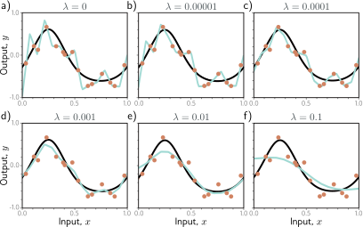

> **图 9.2 在具有14个隐藏单元的简化网络中进行L2正则化（见图8.4）。** a-f) 随着我们增加正则化系数 $\lambda$，拟合函数的变化。黑线是真实函数，橙色圆圈是带噪声的训练数据，青色曲线是拟合的模型。对于小的 $\lambda$（面板a-b），拟合函数精确地通过数据点。对于中等的 $\lambda$（面板c-d），函数更平滑，更接近真实情况。对于大的 $\lambda$（面板e-f），正则化项压倒了似然项，因此拟合函数过于平滑，整体拟合效果更差。
---

### 9.2 隐式正则化

一个有趣的近期发现是，无论是梯度下降还是随机梯度下降，都不会中性地移动到损失函数的最小值；它们都表现出对某些解的偏好。这被称为**隐式正则化**。

#### 9.2.1 梯度下降中的隐式正则化

考虑一个连续版本的梯度下降，其中步长是无穷小的。参数 $\boldsymbol{\phi}$ 的变化将由微分方程控制：
$$
\frac{d\boldsymbol{\phi}}{dt} = -\frac{\partial L}{\partial \boldsymbol{\phi}} \tag{9.6}
$$

梯度下降用一系列大小为 $\alpha$ 的离散步骤来近似这个过程：
$$
\boldsymbol{\phi}_{t+1} = \boldsymbol{\phi}_t - \alpha \frac{\partial L[\boldsymbol{\phi}_t]}{\partial \boldsymbol{\phi}} \tag{9.7}
$$

离散化导致了与连续路径的偏差（图9.3）。
这个偏差可以通过为连续情况推导一个修正的损失项 $\tilde{L}$ 来理解，该修正项会到达与离散化版本在原始损失 $L$ 上相同的位置。可以证明（见本章末尾的注释“梯度下降中的隐式正则化”），这个修正后的损失是：
$$
\tilde{L}_{GD}[\boldsymbol{\phi}] = L[\boldsymbol{\phi}] + \frac{\alpha}{4}\left|\left|\frac{\partial L}{\partial \boldsymbol{\phi}}\right|\right|^2 \tag{9.8}
$$
换句话说，离散轨迹被排斥于梯度范数大的地方（曲面陡峭的地方）。这不会改变梯度为零的最小值的位置。然而，它改变了其他地方的有效损失函数，并修改了优化轨迹，这可能收敛到一个不同的最小值。梯度下降引起的隐式正则化可能是观察到全批量梯度下降在步长较大时泛化得更好的原因（图9.5a）。

---
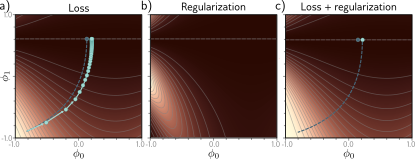

> **图 9.3 梯度下降中的隐式正则化。** a) 在水平线 $\phi_1=0.61$ 上有一族全局最小值的损失函数。蓝色虚线显示了从左下角开始的连续梯度下降路径。青色轨迹显示了步长为0.1的离散梯度下降（前几步用箭头明确显示）。有限的步长导致路径发散并达到不同的最终位置。b) 这种差异可以通过向连续梯度下降损失函数中添加一个惩罚平方梯度大小的正则化项来近似。c) 添加此项后，连续梯度下降路径收敛到与离散版本在原始函数上相同的位置。
---

#### 9.2.2 随机梯度下降中的隐式正则化

类似的分析可以应用于随机梯度下降。现在我们寻求一个修正的损失函数，使得连续版本达到与可能的随机SGD更新的平均值相同的位置。可以证明这是：
$$
\tilde{L}_{SGD}[\boldsymbol{\phi}] = \tilde{L}_{GD}[\boldsymbol{\phi}] + \frac{\alpha}{4B} \sum_{b=1}^B \left|\left|\frac{\partial L_b}{\partial \boldsymbol{\phi}} - \frac{\partial L}{\partial \boldsymbol{\phi}}\right|\right|^2 = L[\boldsymbol{\phi}] + \frac{\alpha}{4}\left|\left|\frac{\partial L}{\partial \boldsymbol{\phi}}\right|\right|^2 + \frac{\alpha}{4B} \sum_{b=1}^B \left|\left|\frac{\partial L_b}{\partial \boldsymbol{\phi}} - \frac{\partial L}{\partial \boldsymbol{\phi}}\right|\right|^2 \tag{9.9}
$$
这里，$L_b$ 是一个周期中 $B$ 个批次中第 $b$ 个批次的损失，而 $L$ 和 $L_b$ 现在分别代表整个数据集中 $I$ 个个体损失和批次中 $|B|$ 个个体损失的均值：
$$
L = \frac{1}{I} \sum_{i=1}^I l_i[\mathbf{x}_i, \mathbf{y}_i] \quad \text{和} \quad L_b = \frac{1}{|\mathcal{B}|} \sum_{i \in \mathcal{B}_b} l_i[\mathbf{x}_i, \mathbf{y}_i] \tag{9.10}
$$
方程9.9揭示了一个额外的正则化项，它对应于批次损失 $L_b$ 梯度的方差。换句话说，SGD隐式地偏好梯度稳定的地方（所有批次在斜率上都一致的地方）。再次，这修改了优化过程的轨迹（图9.4），但不一定改变全局最小值的位置；如果模型是过参数化的，那么它可能会精确地拟合所有训练数据，因此这些梯度项中的每一个在全局最小值处都将为零。参考：笔记本项目 9.2 隐式正则化

SGD比梯度下降泛化得更好，并且较小的批次大小通常比大的批次大小表现得更好（图9.5b）。一种可能的解释是，固有的随机性允许算法到达损失函数的不同部分。然而，这种性能提升的某些或全部也可能是由于隐式正则化；这鼓励了所有数据都拟合得很好的解决方案（因此批次方差很小），而不是一些数据拟合得极好而其他数据拟合得不太好的解决方案（也许总损失相同，但批次方差更大）。前一种解决方案可能更倾向于泛化。

---
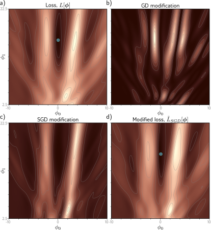

> **图 9.4 随机梯度下降的隐式正则化。** a) Gabor模型（6.1.2节）的原始损失函数。蓝点代表全局最小值。b) 来自梯度下降的隐式正则化项惩罚平方梯度大小。c) 来自随机梯度下降的额外隐式正则化惩罚批次梯度的方差。d) 修正后的损失函数（原始损失加上两个隐式正则化分量的和）。蓝点代表现在可能与面板(a)中位置不同的全局最小值。
---
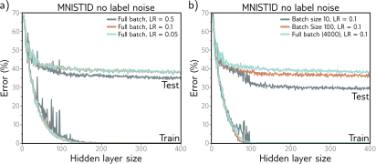

> **图 9.5 学习率（LR）和批次大小对MNIST-1D（见图8.1）的4000个训练和4000个测试样本的影响，用于一个有两层的神经网络。** a) 对于大的学习率，性能比中等或小的要好。在每种情况下，迭代次数为6000/LR，所以每个解都有机会移动相同的距离。b) 性能对于较小的批次大小更优越。在每种情况下，迭代次数的选择是为了让训练数据在模型容量大致相同时被记住。
---

### 9.3 改善性能的启发式方法

我们已经看到，显式正则化通过向损失函数添加额外的项来鼓励训练算法找到一个好的解。这在随机梯度下降中也作为一种意想不到（但似乎有益）的副产品隐式地发生。本节描述了用于改善泛化的其他启发式方法。

#### 9.3.1 早停

**早停**（Early stopping）指的是在训练过程完全收敛之前停止它。如果模型已经捕捉到了底层函数的粗略形状，但还没有时间去过拟合噪声，这可以减少过拟合（图9.6）。一种思考方式是，由于权重被初始化为较小的值（见7.5节），它们根本没有时间变得很大，所以早停具有与显式L2正则化相似的效果。另一种观点是，早停减少了有效模型的复杂性。因此，我们从临界区域沿偏置/方差权衡曲线向后移动，性能得到改善（见图8.9和8.10）。

早停只有一个超参数，即学习终止的步数。像往常一样，这是使用验证集（8.5节）凭经验选择的。然而，对于早停，可以在不需要训练多个模型的情况下选择超参数。模型只训练一次，每 $T$ 次迭代在验证集上监控性能，并存储相关的参数。选择验证性能最佳时存储的参数。

---
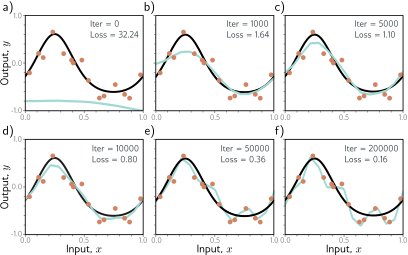

> **图 9.6 早停。** a) 具有14个线性区域的简化浅层网络模型（图8.4）被随机初始化（青色曲线），并使用大小为5的批次和0.05的学习率通过SGD进行训练。b-d) 随着训练的进行，函数首先捕捉到真实函数（黑线）的粗略结构，然后e-f) 过拟合到带噪声的训练数据（橙色点）。尽管训练损失在此过程中持续下降，但面板(c)和(d)中学到的模型最接近真实的底层函数。它们在测试数据上的平均泛化能力将比面板(e)或(f)中的要好。
---

#### 9.3.2 集成

减少训练和测试数据之间泛化差距的另一种方法是构建多个模型并对它们的预测进行平均。一组这样的模型被称为**集成**（ensemble）。这种技术以训练和存储多个模型以及多次执行推理为代价，可靠地提高了测试性能。参考：笔记本项目 9.3 集成

这些模型可以通过取其输出的均值（对于回归问题）或softmax之前激活值的均值（对于分类问题）来组合。其假设是模型误差是独立的，并且会相互抵消。或者，我们可以取输出的中位数（对于回归问题）或最频繁预测的类别（对于分类问题）来使预测更稳健。

训练不同模型的一种方法是只使用不同的随机初始化。这可能有助于在远离训练数据的输入空间区域。在这里，拟合的函数相对不受约束，不同的模型可能会产生不同的预测，因此多个模型的平均值可能比任何单个模型泛化得更好。

第二种方法是通过**有放回地重采样**训练数据来生成几个不同的数据集，并为每个数据集训练一个不同的模型。这被称为**自助法聚合**（bootstrap aggregating）或简称**bagging**（图9.7）。它具有平滑数据的效果；如果一个数据点在某个训练集中不存在，模型将从邻近点进行插值；因此，如果该点是一个异常值，拟合的函数在该区域将更温和。其他方法包括用不同的超参数训练模型或训练完全不同的模型族。

---
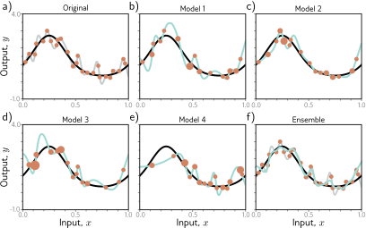

> **图 9.7 集成方法。** a) 将单个模型（灰色曲线）拟合到整个数据集（橙色点）。b-e) 通过对数据进行四次有放回重采样创建的四个模型（橙色点的大小表示数据点被重采样的次数）。f) 当我们对这个集成的预测进行平均时，结果（青色曲线）比完整数据集的结果（灰色曲线）更平滑，并且可能泛化得更好。
---

#### 9.3.3 丢弃

**丢弃**（Dropout）在SGD的每次迭代中将一个随机子集（通常为50%）的隐藏单元设置为零（图9.8）。这使得网络对任何给定的隐藏单元的依赖性降低，并鼓励权重具有较小的幅度，从而减少由于任何特定隐藏单元的存在或缺失而引起的函数变化。

这项技术有一个积极的好处，即它可以消除函数中远离训练数据且不影响损失的不良“扭结”。例如，考虑三个隐藏单元，它们在我们沿曲线移动时相继变为激活状态（图9.9a）。第一个隐藏单元导致斜率大幅增加。第二个隐藏单元减小斜率，使函数回落。最后，第三个单元抵消了这种减少，使曲线回到其原始轨迹。这三个单元合谋在函数中制造了一个不受欢迎的局部变化。这不会改变训练损失，但不太可能很好地泛化。

当几个单元以这种方式合谋时，消除其中一个（就像在dropout中发生的那样）会导致输出函数在其激活的半空间中发生相当大的变化（图9.9b）。随后的梯度下降步骤将试图补偿这种变化所引起的影响，这种依赖性会随着时间的推移而被消除。总体效果是，即使它们对损失没有贡献，训练数据点之间的大而不必要的变化也会被逐渐移除（图9.9）。

在测试时，我们可以像往常一样运行网络，所有隐藏单元都处于激活状态；然而，网络现在比它在任何给定迭代中训练时有更多的隐藏单元，所以我们将权重乘以一减去dropout概率来进行补偿。这被称为**权重缩放推理规则**。另一种推理方法是使用**蒙特卡洛dropout**，我们用不同的随机单元子集被设置为零（如在训练中）多次运行网络，并组合结果。这与集成密切相关，因为网络的每个随机版本都是一个不同的模型；然而，我们不必在这里训练或存储多个网络。

---
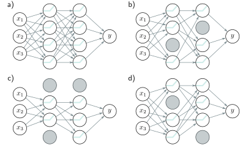

> **图 9.8 丢弃（Dropout）。** a) 原始网络。b-d) 在每次训练迭代中，一个随机的隐藏单元子集被设置为零（灰色节点）。结果是，来自这些单元的输入和输出权重都没有效果，所以我们每次都在用一个略有不同的网络进行训练。
---
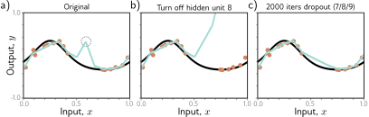

> **图 9.9 Dropout机制。** a) 曲线中的一个不受欢迎的扭结是由斜率的相继增加、斜率的减小（在圆圈连接处），然后再次增加以使曲线回到其原始轨迹引起的。这里我们使用全批量梯度下降，模型（来自图8.4）尽可能地拟合数据，所以进一步的训练不会消除这个扭结。b) 考虑如果我们移除产生圆圈连接的第八个隐藏单元会发生什么，就像在使用dropout时可能发生的那样。没有了斜率的减小，函数的右侧会走上一条向上的轨迹，随后的梯度下降步骤将旨在补偿这种变化。c) 在（i）随机移除导致扭结的三个隐藏单元中的一个和（ii）执行梯度下降步骤2000次迭代后的曲线。扭结不影响损失，但通过dropout机制的这种近似被移除了。
---

#### 9.3.4 应用噪声

Dropout可以解释为对网络激活应用乘性的伯努利噪声。这引出了在训练期间向网络其他部分应用噪声以使最终模型更稳健的想法。

一个选择是向输入数据添加噪声；这会平滑学习到的函数（图9.10）。对于回归问题，可以证明这等同于添加一个惩罚网络输出相对于其输入的导数的正则化项。一个极端的变体是**对抗性训练**，其中优化算法主动搜索导致输出发生大变化的输入的小扰动。这些可以被认为是“最坏情况”的加性噪声向量。参考：问题 9.3

第二个可能性是向权重添加噪声。这鼓励网络即使在权重有小扰动的情况下也能做出明智的预测。结果是训练收敛到宽而平坦区域的局部最小值，在这里改变单个权重无关紧要。

最后，我们可以扰动标签。多类分类的最大似然准则旨在以绝对的确定性预测正确的类别（方程5.24）。为此，最终的网络激活（即softmax函数之前）对于正确的类别被推向非常大的值，对于错误的类别被推向非常小的值。我们可以通过假设一部分训练标签是不正确的，并且以相等的概率属于其他类别来阻止这种过度自信的行为。这可以通过在每次训练迭代中随机更改标签来完成。然而，同样的目的可以通过更改损失函数来实现，以最小化预测分布与一个真实标签概率为 $1-p$、其他类别概率相等的分布之间的交叉熵。这被称为**标签平滑**，并在多种场景中改善了泛化。参考：问题 9.4

---
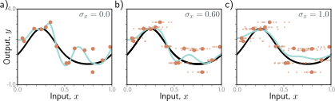

> **图 9.10 向输入添加噪声。** 在SGD的每一步，将方差为 $\sigma_x^2$ 的随机噪声添加到批次数据中。a-c) 使用不同噪声水平拟合的模型（小点代表十个样本）。增加更多的噪声会使拟合函数（青色线）更平滑。
---

#### 9.3.5 贝叶斯推断

最大似然方法通常过于自信；它在训练期间选择最可能的参数，并使用这些参数进行预测。然而，许多参数值可能与数据广泛兼容，并且仅略微不那么可能。**贝叶斯方法**将参数视为未知变量，并计算在训练数据 $\{\mathbf{x}_i, \mathbf{y}_i\}$ 条件下这些参数 $\boldsymbol{\phi}$ 的分布 $\mathrm{Pr}(\boldsymbol{\phi} | \{\mathbf{x}_i, \mathbf{y}_i\})$，使用贝叶斯规则：参考：附录 C.1.4 贝叶斯规则
$$
\mathrm{Pr}(\boldsymbol{\phi}|\{\mathbf{x}_i, \mathbf{y}_i\}) = \frac{\prod_{i=1}^I \mathrm{Pr}(\mathbf{y}_i | \mathbf{x}_i, \boldsymbol{\phi})\mathrm{Pr}(\boldsymbol{\phi})}{\int \prod_{i=1}^I \mathrm{Pr}(\mathbf{y}_i | \mathbf{x}_i, \boldsymbol{\phi})\mathrm{Pr}(\boldsymbol{\phi})d\boldsymbol{\phi}} \tag{9.11}
$$
其中 $\mathrm{Pr}(\boldsymbol{\phi})$ 是参数的先验概率，分母是一个归一化项。因此，每个参数选择都被赋予一个概率（图9.11）。
对新输入 $\mathbf{x}$ 的预测 $\mathbf{y}$ 是每个参数集的预测的无限加权和（即积分），其中权重是相关的概率：
$$
\mathrm{Pr}(\mathbf{y} | \mathbf{x}, \{\mathbf{x}_i, \mathbf{y}_i\}) = \int \mathrm{Pr}(\mathbf{y} | \mathbf{x}, \boldsymbol{\phi}) \mathrm{Pr}(\boldsymbol{\phi} | \{\mathbf{x}_i, \mathbf{y}_i\}) d\boldsymbol{\phi} \tag{9.12}
$$
这实际上是一个无限加权集成，其中权重取决于 (i) 参数的先验概率和 (ii) 它们与数据的一致性。

贝叶斯方法是优雅的，并且可以提供比源自最大似然的预测更稳健的预测。不幸的是，对于像神经网络这样的复杂模型，没有实用的方法来表示参数的完整概率分布或在推理阶段对其进行积分。因此，所有这类当前方法都进行了某种形式的近似，并且这些通常会给学习和推理增加相当大的复杂性。参考：笔记本项目 9.4 贝叶斯方法

---
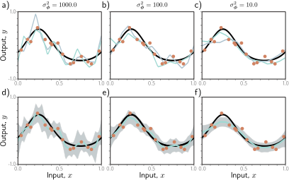

> **图 9.11 简化网络模型的贝叶斯方法（见图8.4）。** 参数被视为不确定的。参数集 $\boldsymbol{\phi}$ 的后验概率 $\mathrm{Pr}(\boldsymbol{\phi}|\{\mathbf{x}_i, \mathbf{y}_i\})$ 由它们与数据 $\{\mathbf{x}_i, \mathbf{y}_i\}$ 的兼容性以及先验分布 $\mathrm{Pr}(\boldsymbol{\phi})$ 决定。a-c) 从使用均值为零和三种方差的正态分布先验的后验中抽样的两组参数（青色和灰色曲线）。当先验方差 $\sigma_\phi^2$ 很小时，参数也倾向于很小，函数更平滑。d-f) 推理通过对所有可能的参数值进行加权求和来进行，其中权重是后验概率。这既产生了均值的预测（青色曲线），也产生了相关的不确定性（灰色区域是两个标准差）。
---

#### 9.3.6 迁移学习和多任务学习

当训练数据有限时，可以利用其他数据集来提高性能。在**迁移学习**中（图9.12a），网络被**预训练**以执行一个有更丰富数据的相关次要任务。然后，得到的模型被调整以适应原始任务。这通常通过移除最后一层并添加一个或多个产生合适输出的新层来完成。主模型可以被固定，只训练新层，或者我们可以**微调**整个模型。

其原理是网络将从次要任务中建立一个对数据的良好内部表示，这随后可以被原始任务利用。等效地，迁移学习可以被看作是在一个可能产生良好解的合理空间，部分初始化最终网络的大部分参数。

**多任务学习**（图9.12b）是一种相关技术，其中网络被训练以同时解决几个问题。例如，网络可能接收一张图像，并同时学习分割场景、估计像素级深度，并预测描述图像的标题。所有这些任务都需要对图像有一定的理解，当同时学习时，每个任务的模型性能都可能提高。

---
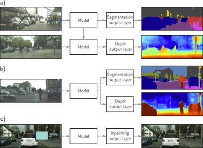

> **图 9.12 迁移、多任务和自监督学习。** a) 当我们对主要任务（此处为深度估计）的标记数据有限，但对次要任务（此处为分割）有丰富数据时，使用**迁移学习**。我们为次要任务训练一个模型，移除最终层，并用适合主要任务的新层替换它们。然后我们只训练新层或为主要任务微调整个网络。网络从次要任务中学习到一个良好的内部表示，然后被主要任务利用。b) 在**多任务学习**中，我们训练一个模型同时执行多个任务，希望每个任务的性能都能提高。c) 在**生成式自监督学习**中，我们移除部分数据并训练网络来完成缺失的信息。这里的任务是填充（修复）图像的被遮蔽部分。这允许在没有标签可用的情况下进行迁移学习。图片来自 Cordts et al. (2016)。
---

#### 9.3.7 自监督学习

上述讨论假设我们有丰富的次要任务数据或多个任务的标签数据可以同时学习。如果没有，我们可以使用**自监督学习**创建大量“免费”的标记数据，并将其用于迁移学习。自监督学习有两种方法：**生成式**和**对比式**。

在**生成式自监督学习**中，每个数据样本的一部分被遮蔽，次要任务是预测缺失的部分（图9.12c）。例如，我们可以使用一个未标记图像的语料库和一个旨在**修复**（填充）图像缺失部分的次要任务（图9.12c）。类似地，我们可以使用一个大的文本语料库并遮蔽一些单词。我们训练网络预测缺失的单词，然后为我们感兴趣的实际语言任务对其进行微调（见第12章）。

在**对比式自监督学习**中，将具有共性的样本对与不相关的对进行比较。对于图像，次要任务可能是识别一对图像是否是彼此的变换版本，或者是不相关的。对于文本，次要任务可能是确定两个句子是否在原始文档中相继出现。有时，必须识别连接对之间的精确关系（例如，找到来自同一图像的两个补丁的相对位置）。

#### 9.3.8 增强

迁移学习通过利用不同的数据集来提高性能。多任务学习使用额外的标签来提高性能。第三种选择是扩充数据集。我们通常可以以一种标签保持不变的方式转换每个输入数据样本。例如，我们可能旨在确定图像中是否有鸟（图9.13）。在这里，我们可以旋转、翻转、模糊或操纵图像的色彩平衡，而标签“鸟”仍然有效。类似地，对于输入是文本的任务，我们可以替换同义词或翻译到另一种语言再翻译回来。对于输入是音频的任务，我们可以放大或减弱不同的频段。参考：笔记本项目 9.5 增强

以这种方式生成额外的训练数据被称为**数据增强**。其目的是教模型对这些不相关的的数据转换保持不变。

---

> **图 9.13 数据增强。** 对于某些问题，每个数据样本都可以被转换以扩充数据集。a) 原始图像。b-h) 该图像的各种几何和光度变换。对于图像分类，所有这些图像仍然具有相同的标签“鸟”。改编自 Wu et al. (2015a)。
---

### 9.4 总结

显式正则化涉及向损失函数中添加一个额外的项，这会改变最小值的位置。这个项可以被解释为参数的先验概率。具有有限步长的随机梯度下降不会中性地下降到损失函数的最小值。这种偏置可以被解释为向损失函数添加额外的项，这被称为隐式正则化。

还有许多用于改善泛化的启发式方法，包括早停、丢弃、集成、贝叶斯方法、添加噪声、迁移学习、多任务学习和数据增强。这些方法背后有四个主要原则（图9.14）。我们可以 (i) 鼓励函数更平滑（例如，L2正则化），(ii) 增加数据量（例如，数据增强），(iii) 组合模型（例如，集成），或 (iv) 搜索更宽的最小值（例如，向网络权重应用噪声）。

改善泛化的另一种方法是选择适合任务的模型架构。例如，在图像分割中，我们可以在模型内共享参数，所以我们不需要在每个图像位置独立地学习树的样子。第10-13章考虑了为不同任务设计的架构变体。

---
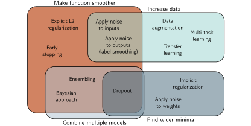

> **图 9.14 正则化方法。** 本章讨论的正则化方法旨在通过四种机制之一来改善泛化。一些方法旨在使建模的函数更平滑。其他方法增加了有效的数据量。第三组方法结合了多个模型，从而减轻了拟合过程中的不确定性。最后，第四组方法鼓励训练过程收敛到一个宽的最小值，在这里估计参数中的小错误不太重要（另见图20.11）。
---

### 注释

**正则化：** 深度学习中的正则化技术概述和分类法可以在Kukačka等人（2017）中找到。本章的讨论中明显缺少的是BatchNorm（Szegedy等人，2016）及其变体，这在第11章中有所描述。

**L2正则化：** L2正则化惩罚网络权重的平方和。这鼓励输出函数缓慢变化（即变得更平滑），是使用最多的正则化项。它有时被称为弗罗贝尼乌斯范数正则化，因为它惩罚权重矩阵的弗罗贝尼乌斯范数。它也经常被错误地称为“权重衰减”，尽管这是由Hanson & Pratt（1988）设计的另一种技术，其中参数更新如下：
$$
\boldsymbol{\phi} \leftarrow (1-\lambda')\boldsymbol{\phi} - \alpha \frac{\partial L}{\partial \boldsymbol{\phi}'} \tag{9.13}
$$
这里，像往常一样，$\alpha$是学习率，$L$是损失。这与梯度下降相同，只是在梯度更新之前，权重被一个因子 $1-\lambda'$ 减少。对于标准SGD，权重衰减等同于系数为 $\lambda = \lambda' / (2\alpha)$ 的L2正则化（方程9.5）。然而，对于Adam，每个参数的学习率 $\alpha$ 是不同的，所以L2正则化和权重衰减是不同的。Loshchilov & Hutter（2019）提出了AdamW，它修改了Adam以正确实现权重衰减，并表明这提高了性能。参考：问题 9.5

其他向量范数的选择鼓励权重中的稀疏性。L0正则化项对每个非零权重施加固定的惩罚。其效果是“修剪”网络。L0正则化也可以用来鼓励组稀疏性；如果对给定隐藏单元有贡献的任何权重非零，这可能会施加一个固定的惩罚。如果它们都为零，我们可以移除该单元，从而减小模型大小并使推理更快。参考：附录 B.3.2 向量范数

不幸的是，L0正则化难以实现，因为正则化项的导数不平滑，需要更复杂的拟合方法（见Louizos等人，2018）。
介于L2和L0正则化之间的是L1正则化或LASSO（最小绝对收缩和选择算子），它对权重的绝对值施加惩罚。L2正则化在某种程度上不鼓励稀疏性，因为平方惩罚的导数随着权重的变小而减小，从而降低了使其变得更小的压力。L1正则化没有这个缺点，因为惩罚的导数是恒定的。这可以产生比L2正则化更稀疏的解，但比L0正则化更容易优化。有时L1和L2正则化项都被使用，这被称为**弹性网络**惩罚（Zou & Hastie, 2005）。

正则化的另一种方法是修改学习算法的梯度，而无需明确地制定新的损失函数（例如，方程9.13）。这种方法已被用于在反向传播期间促进稀疏性（Schwarz等人，2021）。

关于显式正则化有效性的证据是混合的。Zhang等人（2017a）表明，L2正则化对泛化的贡献很小。已经证明，网络的**Lipschitz常数**（当我们修改输入时，函数能改变多快）界定了泛化误差（Bartlett等人，2017；Neyshabur等人，2018）。然而，Lipschitz常数取决于权重矩阵 $\boldsymbol{\Omega}_k$ 的**谱范数**的乘积，这仅间接依赖于单个权重的大小。Bartlett等人（2017）、Neyshabur等人（2018）和Yoshida & Miyato（2017）都添加了间接鼓励谱范数变小的项。Gouk等人（2021）采取了不同的方法，开发了一种算法，将网络的Lipschitz常数约束在特定值以下。参考：附录 B.1.1 Lipschitz常数，附录 B.3.7 谱范数

**梯度下降中的隐式正则化：** 梯度下降步骤是：
$$
\boldsymbol{\phi}_1 = \boldsymbol{\phi}_0 + \alpha \cdot \mathbf{g}[\boldsymbol{\phi}_0] \tag{9.14}
$$
其中 $\mathbf{g}[\boldsymbol{\phi}_0]$ 是损失函数梯度的负数，$\alpha$ 是步长。当 $\alpha \to 0$ 时，梯度下降过程可以由一个微分方程描述：
$$
\frac{d\boldsymbol{\phi}}{dt} = \mathbf{g}[\boldsymbol{\phi}] \tag{9.15}
$$
对于典型的步长 $\alpha$，离散和连续版本收敛到不同的解。我们可以使用**后向误差分析**来为连续版本找到一个修正项 $\mathbf{g}_1[\boldsymbol{\phi}]$：
$$
\frac{d\boldsymbol{\phi}}{dt} \approx \mathbf{g}[\boldsymbol{\phi}] + \alpha \mathbf{g}_1[\boldsymbol{\phi}] + \dots \tag{9.16}
$$
以便它给出与离散版本相同的结果。
考虑修正后的连续解在初始位置 $\boldsymbol{\phi}_0$ 附近的泰勒展开的前两项：
$$
\begin{aligned}
\boldsymbol{\phi}[\alpha] &\approx \boldsymbol{\phi}_0 + \alpha \frac{d\boldsymbol{\phi}}{dt}\bigg|_{\phi=\phi_0} + \frac{\alpha^2}{2} \frac{d^2\boldsymbol{\phi}}{dt^2}\bigg|_{\phi=\phi_0} \\
&\approx \boldsymbol{\phi}_0 + \alpha(\mathbf{g}[\boldsymbol{\phi}] + \alpha\mathbf{g}_1[\boldsymbol{\phi}]) + \frac{\alpha^2}{2} \left( \frac{\partial\mathbf{g}[\boldsymbol{\phi}]}{\partial\boldsymbol{\phi}}\frac{d\boldsymbol{\phi}}{dt} + \alpha\frac{\partial\mathbf{g}_1[\boldsymbol{\phi}]}{\partial\boldsymbol{\phi}}\frac{d\boldsymbol{\phi}}{dt} \right)\bigg|_{\phi=\phi_0} \\
&\approx \boldsymbol{\phi}_0 + \alpha(\mathbf{g}[\boldsymbol{\phi}] + \alpha\mathbf{g}_1[\boldsymbol{\phi}]) + \frac{\alpha^2}{2} \left( \frac{\partial\mathbf{g}[\boldsymbol{\phi}]}{\partial\boldsymbol{\phi}}\mathbf{g}[\boldsymbol{\phi}] + \alpha\frac{\partial\mathbf{g}_1[\boldsymbol{\phi}]}{\partial\boldsymbol{\phi}}\mathbf{g}[\boldsymbol{\phi}] \right)\bigg|_{\phi=\phi_0} \\
&\approx \boldsymbol{\phi}_0 + \alpha\mathbf{g}[\boldsymbol{\phi}] + \alpha^2 \left( \mathbf{g}_1[\boldsymbol{\phi}] + \frac{1}{2}\frac{\partial\mathbf{g}[\boldsymbol{\phi}]}{\partial\boldsymbol{\phi}}\mathbf{g}[\boldsymbol{\phi}] \right)\bigg|_{\phi=\phi_0}
\end{aligned} \tag{9.17}
$$
在第二行中，我们引入了修正项（方程9.16），在最后一行中，我们移除了阶数高于 $\alpha^2$ 的项。
注意右侧的前两项 $\boldsymbol{\phi}_0 + \alpha\mathbf{g}[\boldsymbol{\phi}_0]$ 与离散更新（方程9.14）相同。因此，要使连续和离散版本达到相同的位置，右侧的第三项必须等于零，这允许我们求解 $\mathbf{g}_1[\boldsymbol{\phi}]$：
$$
\mathbf{g}_1[\boldsymbol{\phi}] = -\frac{1}{2}\frac{\partial\mathbf{g}[\boldsymbol{\phi}]}{\partial\boldsymbol{\phi}}\mathbf{g}[\boldsymbol{\phi}] \tag{9.18}
$$
在训练期间，演化函数 $\mathbf{g}[\boldsymbol{\phi}]$ 是损失的负梯度：
$$
\begin{aligned}
\frac{d\boldsymbol{\phi}}{dt} &\approx \mathbf{g}[\boldsymbol{\phi}] + \alpha\mathbf{g}_1[\boldsymbol{\phi}] \\
&= -\frac{\partial L}{\partial\boldsymbol{\phi}} - \frac{\alpha}{2} \frac{\partial}{\partial\boldsymbol{\phi}}\left(-\frac{\partial L}{\partial\boldsymbol{\phi}}\right) \left(-\frac{\partial L}{\partial\boldsymbol{\phi}}\right) = -\frac{\partial L}{\partial\boldsymbol{\phi}} - \frac{\alpha}{2} \left(\frac{\partial^2 L}{\partial\boldsymbol{\phi}^2}\frac{\partial L}{\partial\boldsymbol{\phi}}\right)
\end{aligned} \tag{9.19}
$$
这等同于在损失函数上执行连续梯度下降：
$$
\tilde{L}_{GD}[\boldsymbol{\phi}] = L[\boldsymbol{\phi}] + \frac{\alpha}{4}\left|\left|\frac{\partial L}{\partial \boldsymbol{\phi}}\right|\right|^2 \tag{9.20}
$$
因为方程9.19的右侧是方程9.20的导数。
这种隐式正则化的表述由Barrett & Dherin (2021) 发展，并由Smith等人 (2021) 扩展到随机梯度下降。Smith等人 (2020) 和其他人已经表明，具有小或中等批次大小的随机梯度下降在测试集上的表现优于全批量梯度下降，这可能部分是由于隐式正则化。相关地，Jastrzębski等人 (2021) 和Cohen等人 (2021) 都表明，使用大的学习率会降低典型优化轨迹移动到损失函数“更尖锐”部分的趋势（即至少一个方向具有高曲率的地方）。大学习率的这种隐式正则化效应可以通过惩罚Fisher信息矩阵的迹来近似，这与惩罚方程9.20中的梯度范数密切相关 (Jastrzębski等人，2021)。

**早停：** Bishop (1995) 和 Sjöberg & Ljung (1995) 认为，早停限制了训练过程可以探索的有效解空间；鉴于权重被初始化为较小的值，这个思想引出了早停有助于防止权重变得过大的想法。Goodfellow等人 (2016) 表明，在损失函数的二次近似下，参数初始化为零时，早停等同于梯度下降中的L2正则化。有效正则化权重 $\lambda$ 约等于 $1/(\tau\alpha)$，其中 $\alpha$ 是学习率，$\tau$ 是早停时间。

**集成：** 集成可以使用不同的随机种子（Lakshminarayanan等人，2017）、超参数（Wenzel等人，2020b）甚至完全不同的模型族进行训练。模型可以通过平均它们的预测、加权预测或**堆叠**（Wolpert, 1992）来组合，其中结果使用另一个机器学习模型进行组合。Lakshminarayanan等人（2017）表明，平均独立训练的网络的输出可以提高准确性、校准和鲁棒性。相反，Frankle等人（2020）表明，如果我们平均权重以制作一个模型，网络会失败。Fort等人（2019）比较了由不同初始化产生的集成解与从同一原始模型生成的集成解。例如，在后一种情况下，他们考虑在一个有限的**子空间**中围绕解进行探索以找到其他好的邻近点。他们发现两种技术都提供了互补的好处，但从不同随机起点进行的真正集成提供了更大的改进。参考：附录 B.3.6 子空间

一种有效的集成方法是组合来自训练中间阶段的模型。为此，Izmailov等人（2018）引入了**随机权重平均**，其中模型权重在不同的时间步被采样并平均在一起。顾名思义，**快照集成**（Huang等人，2017a）也存储来自不同时间步的模型并平均它们的预测。通过周期性地增加和减少学习率，可以改善这些模型的多样性。Garipov等人（2018）观察到，损失函数的不同最小值通常由一个低能量路径连接（即，沿途损失都很低的路径）。受此观察的启发，他们开发了一种方法，在初始解周围探索低能量区域，以提供无需重新训练的多样化模型。这被称为**快速几何集成**。集成方法的综述可以在Ganaie等人（2022）中找到。

**丢弃（Dropout）：** Dropout最早由Hinton等人（2012b）和Srivastava等人（2014）引入。Dropout在隐藏单元级别应用。丢弃一个隐藏单元与临时将所有传入和传出的权重以及偏置设置为零具有相同的效果。Wan等人（2013）通过随机将单个权重设置为零来推广了dropout。Gal & Ghahramani（2016）和Kendall & Gal（2017）提出了蒙特卡洛dropout，其中推理是用几个dropout模式计算的，结果被平均在一起。Gal & Ghahramani（2016）认为这可以解释为近似贝叶斯推断。

Dropout等同于向隐藏单元应用乘性的伯努利噪声。使用其他分布也获得了类似的好处，包括正态分布（Srivastava等人，2014；Shen等人，2017）、均匀分布（Shen等人，2017）和beta分布（Liu等人，2019b）。

**添加噪声：** Bishop (1995) 和 An (1996) 向网络输入添加高斯噪声以提高性能。Bishop (1995) 表明这等同于权重衰减。An (1996) 还研究了向权重添加噪声。DeVries & Taylor (2017a) 向隐藏单元添加高斯噪声。随机化ReLU（Xu等人，2015）通过使激活函数随机化以不同的方式应用噪声。

**标签平滑：** 标签平滑由Szegedy等人（2016）为图像分类引入，但后来被证明在语音识别（Chorowski & Jaitly, 2017）、机器翻译（Vaswani等人，2017）和语言建模（Pereyra等人，2017）中都有帮助。标签平滑改善测试性能的确切机制尚不清楚，尽管Müller等人（2019a）表明它改善了预测输出概率的校准。一个密切相关的技术是**DisturbLabel**（Xie等人，2016），其中在每个训练迭代中，每个批次中一定百分比的标签被随机切换。

**寻找更宽的最小值：** 人们认为更宽的最小值泛化得更好（见图20.11）。在这里，权重的确切值不那么重要，所以性能应该对它们的估计误差更稳健。在训练期间向网络部分应用噪声是有效的，原因之一是它鼓励网络对它们的确切值不敏感。
Chaudhari等人（2019）开发了一种SGD的变体，它将优化偏向于平坦的最小值，他们称之为**熵SGD**。其思想是在损失函数中加入局部熵作为一项。在实践中，这采取了在一个SGD-like更新中进行另一个更新的形式。Keskar等人（2017）表明，当批次大小减小时，SGD会找到更宽的最小值。这可能是由于SGD的隐式正则化产生的批次方差项。
Ishida等人（2020）使用一种名为**flooding**的技术，他们有意阻止训练损失变为零。这鼓励解在损失景观上进行随机游走，并漂移到一个具有更好泛化能力的更平坦的区域。

**贝叶斯方法：** 对于某些模型，包括图9.11中的简化神经网络模型，贝叶斯预测分布可以以封闭形式计算（见Bishop, 2006; Prince, 2012）。对于神经网络，参数的后验分布无法以封闭形式表示，必须进行近似。两种主要方法是**变分贝叶斯**（Hinton & van Camp, 1993; MacKay, 1995; Barber & Bishop, 1997; Blundell等人，2015），其中后验被一个更简单的可解分布近似；以及**马尔可夫链蒙特卡洛（MCMC）**方法，它通过抽取一组样本来近似分布（Neal, 1995; Welling & Teh, 2011; Chen等人，2014; Ma等人，2015; Li等人，2016a）。样本的生成可以集成到SGD中，这被称为**随机梯度MCMC**（见Ma等人，2015）。最近发现，“冷却”参数的后验分布（使其更尖锐）可以改善这些模型的预测（Wenzel等人，2020a），但这目前尚未完全理解（见Noci等人，2021）。

**迁移学习：** 视觉任务的迁移学习效果非常好（Sharif Razavian等人，2014），并支持了计算机视觉的快速进展，包括原始的AlexNet结果（Krizhevsky等人，2012）。迁移学习也影响了自然语言处理（NLP），其中许多模型都基于BERT模型（Devlin等人，2019）的预训练特征。更多信息可以在Zhuang等人（2020）和Yang等人（2020b）中找到。

**自监督学习：** 图像的自监督学习技术包括修复被遮蔽的图像区域（Pathak等人，2016），预测图像中补丁的相对位置（Doersch等人，2015），将排列的图像瓦片重新排列回其原始配置（Noroozi & Favaro, 2016），为灰度图像上色（Zhang等人，2016b），以及将旋转的图像变换回其原始方向（Gidaris等人，2018）。在**SimCLR**（Chen等人，2020c）中，学习了一个网络，它将经过光度和几何变换的同一图像的版本映射到相同的表示，同时排斥不同图像的版本，目标是对不相关的图像变换变得不敏感。Jing & Tian（2020）对图像中的自监督学习进行了综述。

NLP中的自监督学习可以基于预测被遮蔽的单词（Devlin等人，2019），预测句子中的下一个单词（Radford等人，2019；Brown等人，2020），或预测两个句子是否相继出现（Devlin等人，2019）。在自动语音识别中，**Wav2Vec**模型（Schneider等人，2019）旨在区分原始音频样本和其中10ms音频已从剪辑中其他地方换出的样本。自监督也已应用于图神经网络（第13章）。任务包括恢复被遮蔽的特征（You等人，2020）和恢复图的邻接结构（Kipf & Welling, 2016）。Liu等人（2023a）对图模型的自监督学习进行了综述。

**数据增强：** 图像的数据增强至少可以追溯到LeCun等人（1998），并为AlexNet的成功做出了贡献（Krizhevsky等人，2012），其中数据集增加了2048倍。图像增强方法包括几何变换、改变或操纵色彩空间、噪声注入和应用空间滤波器。更复杂的技巧包括随机混合图像（Inoue, 2018; Summers & Dinneen, 2019），随机擦除图像部分（Zhong等人，2020），风格迁移（Jackson等人，2019），以及随机交换图像补丁（Kang等人，2017）。此外，许多研究使用生成对抗网络或GANs（见第15章）来产生新颖但可信的数据样本（例如，Calimeri等人，2017）。在其他情况下，数据已通过**对抗性样本**进行增强（Goodfellow等人，2015a），这些是对训练数据的微小扰动，导致样本被错误分类。关于图像数据增强的综述可以在Shorten & Khoshgoftaar（2019）中找到。

声学数据的增强方法包括音高变换、时间拉伸、动态范围压缩和添加随机噪声（例如，Abeßer等人，2017；Salamon & Bello, 2017；Xu等人，2015；Lasseck, 2018），以及混合数据对（Zhang等人，2017c；Yun等人，2019），遮蔽特征（Park等人，2019），以及使用GANs生成新数据（Mun等人，2017）。语音数据的增强包括声道长度扰动（Jaitly & Hinton, 2013；Kanda等人，2013），风格迁移（Gales, 1998；Ye & Young, 2004），添加噪声（Hannun等人，2014），以及合成语音（Gales等人，2009）。

文本的增强方法包括在字符级别添加噪声，通过切换、删除和插入字母（Belinkov & Bisk, 2018；Feng等人，2020），或通过生成对抗性样本（Ebrahimi等人，2018），使用常见的拼写错误（Coulombe, 2018），随机交换或删除单词（Wei & Zou, 2019），使用同义词（Kolomiyets等人，2011），改变形容词（Li等人，2017c），被动化（Min等人，2020），使用生成模型创建新数据（Qiu等人，2020），以及到另一种语言再返回的往返翻译（Aiken & Park, 2010）。文本的增强方法由Bayer等人（2022）综述。

### 习题

**问题 9.1** 考虑一个模型，其中参数的先验分布是均值为零、方差为 $\sigma_\phi^2$ 的正态分布，因此
$$
\mathrm{Pr}(\boldsymbol{\phi}) = \prod_{j=1}^J \mathrm{Norm}_{\phi_j}[0, \sigma_\phi^2] \tag{9.21}
$$
其中 $j$ 对模型参数进行索引。我们现在最大化 $\prod_{i=1}^I \mathrm{Pr}(\mathbf{y}_i|\mathbf{x}_i, \boldsymbol{\phi})\mathrm{Pr}(\boldsymbol{\phi})$。证明该模型的关联损失函数等价于L2正则化。

**思路与解答：**
最大化 $\prod \mathrm{Pr}(\mathbf{y}_i|\mathbf{x}_i, \boldsymbol{\phi})\mathrm{Pr}(\boldsymbol{\phi})$ 等价于最小化其负对数：
$L = -\sum_i \log[\mathrm{Pr}(\mathbf{y}_i|\mathbf{x}_i, \boldsymbol{\phi})] - \log[\mathrm{Pr}(\boldsymbol{\phi})]$。
第二项是 $- \log[\prod_j \mathrm{Norm}_{\phi_j}[0, \sigma_\phi^2]] = -\sum_j \log[\frac{1}{\sqrt{2\pi\sigma_\phi^2}}\exp(-\frac{\phi_j^2}{2\sigma_\phi^2})]$。
化简后得到 $\sum_j \frac{\phi_j^2}{2\sigma_\phi^2} + \text{const}$。这与L2正则化项 $\lambda \sum_j \phi_j^2$ 形式相同，其中 $\lambda = 1/(2\sigma_\phi^2)$。

**问题 9.2** 当添加L2正则化（方程9.5）时，损失函数的梯度如何变化？

**思路与解答：**
新的损失为 $L_{new} = L_{old} + \lambda \sum_j \phi_j^2$。
新的梯度为 $\frac{\partial L_{new}}{\partial \phi_k} = \frac{\partial L_{old}}{\partial \phi_k} + \frac{\partial}{\partial \phi_k}(\lambda \sum_j \phi_j^2) = \frac{\partial L_{old}}{\partial \phi_k} + 2\lambda\phi_k$。
梯度在原有基础上增加了一个与参数自身成正比的项，这会将其“拉”向零。

**问题 9.3*** 考虑一个线性回归模型 $y = \phi_0 + \phi_1 x$。假设我们有 $I$ 个训练样本 $\{x_i, y_i\}$ 并使用最小二乘损失。考虑在每次训练迭代中向输入 $x_i$ 添加均值为零、方差为 $\sigma_\epsilon^2$ 的高斯噪声。推导期望损失的表达式。

**思路与解答：**
有效损失函数现在是：
$L_{eff} = \sum_i (\phi_0 + \phi_1(x_i+\epsilon_i) - y_i)^2 = \sum_i ((\phi_0 + \phi_1 x_i - y_i) + \phi_1\epsilon_i)^2$
展开后为：$L_{eff} = \sum_i ((\phi_0+\phi_1x_i-y_i)^2 + 2\phi_1\epsilon_i(\phi_0+\phi_1x_i-y_i) + \phi_1^2\epsilon_i^2)$。
取期望 $E[\cdot]$，由于 $E[\epsilon_i]=0$ 且 $E[\epsilon_i^2]=\sigma_\epsilon^2$，第二项的期望为零。
$E[L_{eff}] = \sum_i (\phi_0+\phi_1x_i-y_i)^2 + \sum_i \phi_1^2 \sigma_\epsilon^2 = L_{orig} + I\sigma_\epsilon^2\phi_1^2$。
这等价于对斜率 $\phi_1$ 进行L2正则化。

**问题 9.4*** 推导当我们使用标签平滑，使得目标概率分布在正确类别处为0.9，而剩余的0.1概率质量被均分给其余 $D_o-1$ 个类别时，多类分类的损失函数。

**思路与解答：**
新的目标分布 $q_i(k)$ 为：如果 $k=y_i$（正确类别），则 $q_i(k)=0.9$；如果 $k \ne y_i$，则 $q_i(k) = 0.1/(D_o-1)$。
损失是预测分布 $\hat{p}_i$ 和目标分布 $q_i$ 之间的交叉熵：
$L = -\sum_i \sum_k q_i(k) \log(\hat{p}_i(k))$
$L = -\sum_i \left( 0.9 \log(\hat{p}_{iy_i}) + \sum_{k \ne y_i} \frac{0.1}{D_o-1} \log(\hat{p}_{ik}) \right)$。

**问题 9.5** 证明带有衰减率 $\lambda'$ 的权重衰减参数更新：
$ \boldsymbol{\phi} \leftarrow (1-\lambda')\boldsymbol{\phi} - \alpha \frac{\partial L}{\partial \boldsymbol{\phi}'} $
在原始损失函数 $L[\boldsymbol{\phi}]$ 上，等价于使用L2正则化的标准梯度更新，其修正后的损失函数 $\tilde{L}[\boldsymbol{\phi}]$ 为：
$ \tilde{L}[\boldsymbol{\phi}] = L[\boldsymbol{\phi}] + \frac{\lambda}{2\alpha} \sum_k \phi_k^2 $
其中 $\boldsymbol{\phi}$ 是参数，$\alpha$ 是学习率。

**思路与解答：**
标准梯度更新为 $\boldsymbol{\phi} \leftarrow \boldsymbol{\phi} - \alpha \frac{\partial \tilde{L}}{\partial \boldsymbol{\phi}}$。
$\frac{\partial \tilde{L}}{\partial \boldsymbol{\phi}} = \frac{\partial L}{\partial \boldsymbol{\phi}} + \frac{\lambda}{\alpha}\boldsymbol{\phi}$。
所以更新规则为 $\boldsymbol{\phi} \leftarrow \boldsymbol{\phi} - \alpha(\frac{\partial L}{\partial \boldsymbol{\phi}} + \frac{\lambda}{\alpha}\boldsymbol{\phi}) = \boldsymbol{\phi} - \alpha\frac{\partial L}{\partial \boldsymbol{\phi}} - \lambda\boldsymbol{\phi} = (1-\lambda)\boldsymbol{\phi} - \alpha\frac{\partial L}{\partial \boldsymbol{\phi}}$。
如果令 $\lambda'=\lambda$，则两者等价。

**问题 9.6** 考虑一个具有两个参数 $\boldsymbol{\phi}=[\phi_0, \phi_1]^T$ 的模型。以类似于图9.1b的形式绘制L0、L1和L2正则化项。$L_p$ 正则化项是 $\sum_{d=1}^D |\phi_d|^p$。

**思路与解答：**
这是一个绘图题，在 $(\phi_0, \phi_1)$ 平面上绘制等值线。
-   **L2正则化** ($\sum \phi_i^2 = C$): 等值线是以为原点为中心的圆。
-   **L1正则化** ($|\phi_0|+|\phi_1|=C$): 等值线是以为原点为中心的菱形（旋转了45度的正方形）。
-   **L0正则化** ($\sum \mathbb{I}[\phi_i \ne 0]=C$): 等值线是沿着坐标轴的。例如，当$C=1$时，解要么在$\phi_0$轴上，要么在$\phi_1$轴上（不包括原点）。