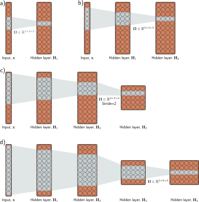

# 第十章

# 卷积网络

第二章至第九章介绍了深度神经网络的监督学习流程。然而，这些章节只考虑了从输入到输出具有单一路径的全连接网络。第十至十三章将介绍具有更稀疏连接、权重共享和并行处理路径的更专业的网络组件。本章描述主要用于处理图像数据的**卷积层**。

图像具有三个特性，这表明需要专门的模型架构。首先，它们是**高维**的。一个典型的分类任务图像包含 $224 \times 224$ 个RGB值（即150,528个输入维度）。全连接网络中的隐藏层通常比输入层更大，因此即使是一个浅层网络，其权重数量也会超过 $150,528^2$，即220亿。这在所需的训练数据、内存和计算方面都带来了明显的实际问题。

其次，图像中**邻近的像素在统计上是相关的**。然而，全连接网络没有“邻近”的概念，并且对每个输入之间的关系一视同仁。如果训练和测试图像的像素以相同的方式被随机置换，网络仍然可以训练，且没有实际差异。第三，**图像的解释在几何变换下是稳定的**。一棵树的图像，如果我们将其向左移动几个像素，它仍然是一棵树的图像。然而，这种平移会改变网络的每一个输入。因此，一个全连接模型必须在每个位置上分别学习表示一棵树的像素模式，这显然是低效的。

卷积层独立地处理每个局部图像区域，并使用在整个图像上共享的参数。它们使用的参数比全连接层少，利用了邻近像素之间的空间关系，并且不必在每个位置重新学习像素的解释。一个主要由卷积层组成的网络被称为**卷积神经网络**或**CNN**。

### 10.1 不变性与等变性

我们上面论证了图像的某些属性（例如，树的纹理）在变换下是稳定的。在本节中，我们使这个想法在数学上更精确。如果一个图像 $\mathbf{x}$ 的函数 $f[\mathbf{x}]$ 满足以下条件，则它对变换 $t[\mathbf{x}]$ 是**不变的**（invariant）：
$$
f[t[\mathbf{x}]] = f[\mathbf{x}] \tag{10.1}
$$
换言之，无论变换 $t[\mathbf{x}]$ 如何，函数 $f[\mathbf{x}]$ 的输出都相同。用于图像分类的网络应该对图像的几何变换具有不变性（图10.1a-b）。网络 $f[\mathbf{x}]$ 应该将一个图像识别为包含相同的物体，即使它被平移、旋转、翻转或扭曲。

如果一个图像 $\mathbf{x}$ 的函数 $f[\mathbf{x}]$ 满足以下条件，则它对变换 $t[\mathbf{x}]$ 是**等变的**（equivariant）或**协变的**（covariant）：
$$
f[t[\mathbf{x}]] = t[f[\mathbf{x}]] \tag{10.2}
$$
换言之，如果 $f[\mathbf{x}]$ 的输出在变换下的变化方式与输入相同，那么它对变换 $t[\mathbf{x}]$ 是等变的。用于逐像素图像分割的网络应该对变换是等变的（图10.1c-f）；如果图像被平移、旋转或翻转，网络 $f[\mathbf{x}]$ 应该返回一个以相同方式变换过的分割结果。

---

> **图 10.1 平移下的不变性与等变性。** a-b) 在图像分类中，目标是将两张图片都归类为“山”，而不管发生的水平位移。换言之，我们要求网络预测对平移具有不变性。c,e) 语义分割的目标是为每个像素关联一个标签。d,f) 当输入图像被平移时，我们希望输出（彩色覆盖层）以相同的方式平移。换言之，我们要求输出对平移具有等变性。面板c-f)改编自 Bousselham et al. (2021)。
---

### 10.2 一维输入的卷积网络

卷积网络由一系列卷积层组成，每一层都对平移具有等变性。它们通常还包括引入部分平移不变性的池化机制。为了清晰阐述，我们首先考虑用于一维数据的卷积网络，它们更容易可视化。在10.3节中，我们将进展到可以应用于图像数据的二维卷积。

#### 10.2.1 一维卷积操作

卷积层是基于**卷积**操作的网络层。在一维中，卷积将输入向量 $\mathbf{x}$ 变换为输出向量 $\mathbf{z}$，使得每个输出 $z_i$ 都是邻近输入的加权和。在每个位置都使用相同的权重，它们被统称为**卷积核**或**滤波器**。输入被组合的区域大小被称为**核大小**。对于大小为3的核，我们有：
$$
z_i = \omega_1 x_{i-1} + \omega_2 x_i + \omega_3 x_{i+1} \tag{10.3}
$$
其中 $\boldsymbol{\omega}=[\omega_1, \omega_2, \omega_3]^T$ 是核（图10.2）。¹请注意，卷积操作对平移是等变的。如果我们平移输入 $\mathbf{x}$，那么相应的输出 $\mathbf{z}$ 也会以相同方式平移。参考：问题10.1

---
¹ 严格来说，这是一种互相关而非卷积，在卷积中权重会相对于输入进行翻转（所以我们会将 $x_{i-1}$ 与 $x_{i+1}$ 交换）。无论如何，这种（不正确的）定义是机器学习中的通常惯例。

---

> **图 10.2 核大小为3的一维卷积。** 每个输出 $z_i$ 都是最近的三个输入 $x_{i-1}, x_i, x_{i+1}$ 的加权和，权重为 $\boldsymbol{\omega}=[\omega_1, \omega_2, \omega_3]$。a) 输出 $z_2$ 计算为 $z_2 = \omega_1 x_1 + \omega_2 x_2 + \omega_3 x_3$。b) 输出 $z_3$ 计算为 $z_3 = \omega_1 x_2 + \omega_2 x_3 + \omega_3 x_4$。c) 在位置 $z_1$ 处，核超出了第一个输入 $x_1$ 的范围。这可以通过**零填充**来处理，即我们假设输入范围外的值为零。最终的输出也类似处理。d) 或者，我们只能计算核在输入范围内完全适用的输出（“有效”卷积）；现在输出会比输入小。
---

#### 10.2.2 填充

方程10.3显示每个输出都是通过取前一个、当前和后一个位置的输入的加权和来计算的。这就引出了如何处理第一个输出（没有前一个输入）和最后一个输出（没有后一个输入）的问题。

有两种常见的方法。第一种是用新值**填充**输入的边缘，然后照常进行。**零填充**假设输入在其有效范围之外为零（图10.2c）。其他可能性包括将输入视为循环的或在边界处反射。第二种方法是丢弃核超出输入位置范围的输出位置。这些**有效卷积**的优点是在输入的边缘不引入额外信息。然而，它们的缺点是表示的大小减小了。

#### 10.2.3 步幅、核大小和扩张率

在上面的例子中，每个输出是最近三个输入的和。然而，这只是更大范围的卷积操作族中的一个，其成员由它们的**步幅**、**核大小**和**扩张率**来区分。当我们在每个位置评估输出时，我们称之为**步幅**为1。然而，也可以以大于1的步幅移动核。如果我们有步幅为2，我们创建的输出数量大约是原来的一半（图10.3a-b）。

**核大小**可以增加以在更大的区域上进行积分（图10.3c）。然而，它通常保持为奇数，以便可以围绕当前位置居中。增加核大小的缺点是需要更多的权重。这引出了**扩张**或**空洞卷积**的思想，其中核的值与零交错。例如，我们可以通过将第二个和第四个元素设置为零，将大小为5的核变成大小为3的扩张核。我们仍然从一个更大的输入区域整合信息，但只需要三个权重来完成（图10.3d）。我们在权重之间穿插的零的数量决定了**扩张率**。

---

> **图 10.3 步幅、核大小和扩张。** a) 步幅为2时，我们在每个其他位置评估核，所以第一个输出 $z_1$ 是以 $x_1$ 为中心的加权和，b) 第二个输出 $z_2$ 是以 $x_3$ 为中心的加权和，依此类推。c) 核大小也可以改变。对于大小为5的核，我们取最近的五个输入的加权和。d) 在**扩张**或**空洞卷积**中（源自法语“à trous”，意为带孔的），我们在权重向量中穿插零，以便用更少的权重组合更大区域的信息。
---

#### 10.2.4 卷积层

一个**卷积层**通过对输入进行卷积、添加一个偏置 $\beta$，并将每个结果通过一个激活函数 $a[\cdot]$ 来计算其输出。对于核大小为3、步幅为1、扩张率为1的情况，第 $i$ 个隐藏单元 $h_i$ 将计算为：
$$
h_i = a[\beta + \omega_1 x_{i-1} + \omega_2 x_i + \omega_3 x_{i+1}] = a\left[\beta + \sum_{j=1}^3 \omega_j x_{i+j-2}\right] \tag{10.4}
$$
其中偏置 $\beta$ 和核权重 $\omega_1, \omega_2, \omega_3$ 是可训练的参数，并且（使用零填充）当输入 $x$ 超出其有效范围时，我们将其视为零。这是一个全连接层的特例，它计算第 $i$ 个隐藏单元为：
$$
h_i = a\left[\beta_i + \sum_{j=1}^D \omega_{ij}x_j\right] \tag{10.5}
$$
如果有 $D$ 个输入 $x_\cdot$ 和 $D$ 个隐藏单元 $h_\cdot$，这个全连接层将有 $D^2$ 个权重 $\omega_{\cdot\cdot}$ 和 $D$ 个偏置 $\beta_\cdot$。卷积层只使用三个权重和一个偏置。一个全连接层可以精确地复现这个，如果大部分权重被设置为零，其他的被约束为相同的话（图10.4）。参考：问题10.2-10.4, 问题10.5

---

> **图 10.4 全连接层与卷积层。** a) 一个全连接层有一个连接每个输入 $x$ 到每个隐藏单元 $h$ 的权重（彩色箭头）和每个隐藏单元的偏置（未显示）。b) 因此，相关的权重矩阵 $\boldsymbol{\Omega}$ 包含36个权重，关联六个输入和六个隐藏单元。c) 一个核大小为3的卷积层将每个隐藏单元计算为三个邻近输入的相同加权和（箭头）加上一个偏置（未显示）。d) 权重矩阵是全连接矩阵的一个特例，其中许多权重为零，其他的重复（相同颜色表示相同的值，白色表示零权重）。e) 一个核大小为3、步幅为2的卷积层在每个其他位置计算一个加权和。f) 这也是一个具有不同稀疏权重结构的全连接网络的特例。
---

#### 10.2.5 通道

如果我们只应用单个卷积，信息很可能会丢失；我们正在平均邻近的输入，而ReLU激活函数会截断小于零的结果。因此，通常的做法是并行计算几个卷积。每个卷积都会产生一组新的隐藏变量，称为一个**特征图**或**通道**。

图10.5a-b用两个大小为3的卷积核和零填充对此进行了说明。第一个核计算最近三个像素的加权和，添加一个偏置，并将结果通过激活函数，以产生隐藏单元 $h_1$ 到 $h_6$。这些构成了第一个通道。第二个核计算最近三个像素的不同加权和，添加一个不同的偏置，并将结果通过激活函数，以创建隐藏单元 $h_7$ 到 $h_{12}$。这些构成了第二个通道。

通常，输入和隐藏层都有多个通道（图10.5c）。如果输入层有 $C_i$ 个通道，我们为每个通道选择一个大小为 $K$ 的核，则每个输出通道中的隐藏单元都使用一个权重矩阵 $\boldsymbol{\Omega} \in \mathbb{R}^{C_i \times K}$ 和一个偏置，作为所有 $C_i$ 个通道和 $K$ 个核条目的加权和来计算。因此，如果下一层有 $C_o$ 个通道，那么我们需要 $n \in \mathbb{R}^{C_i \times C_o \times K}$ 个权重和 $\boldsymbol{\beta} \in \mathbb{R}^{C_o}$ 个偏置。参考：问题10.6-10.8, 笔记本项目10.1 一维卷积

---

> **图 10.5 通道。** 通常，多个卷积被应用于输入 $\mathbf{x}$ 并存储在通道中。a) 应用一个卷积来创建隐藏单元 $h_1$ 到 $h_6$，它们构成第一个通道。b) 应用第二个卷积操作来创建隐藏单元 $h_7$ 到 $h_{12}$，它们构成第二个通道。这些通道被存储在一个二维数组 $\mathbf{H}_1$ 中，该数组包含第一个隐藏层的所有隐藏单元。c) 如果我们添加另一个卷积层，现在每个输入位置都有两个通道。在这里，一维卷积定义了在三个最近位置上对两个输入通道的加权和，以创建每个新的输出通道。
---

#### 10.2.6 卷积网络和感受野

第四章描述了由一系列全连接层组成的深度网络。类似地，卷积网络由一系列卷积层组成。网络中一个隐藏单元的**感受野**是影响它的原始输入的区域。考虑一个每层卷积核大小都为3的卷积网络。第一层中的隐藏单元取最近三个输入的加权和，因此感受野大小为3。第二层中的单元取第一层中三个最近位置的加权和，而这些位置本身是三个输入的加权和。因此，第二层中的隐藏单元的感受野大小为5。通过这种方式，后续层中单元的感受野增加，来自整个输入的信息被逐渐整合（图10.6）。参考：问题10.9-10.11

---

> **图 10.6 核宽度为3的网络的感受野。** a) 一个有11个维度的输入馈入一个有3个通道和大小为3的卷积核的隐藏层。第一个隐藏层 $\mathbf{H}_1$ 中三个高亮显示的隐藏单元的预激活值是最近三个输入的不同加权和，所以 $\mathbf{H}_1$ 中的感受野大小为3。b) 第二层 $\mathbf{H}_2$ 中四个高亮显示的隐藏单元的预激活值各自取第一层 $\mathbf{H}_1$ 中三个最近位置上三个通道的加权和。$\mathbf{H}_1$ 中的每个隐藏单元都对最近的三个输入位置进行加权。因此，$\mathbf{H}_2$ 中的隐藏单元的感受野大小为5。c) 第三层中的隐藏单元（核大小为3，步幅为2）将感受野大小增加到7。d) 当我们添加第四层时，位置三的隐藏单元的感受野已经覆盖了整个输入。
---

#### 10.2.7 示例：MNIST-1D

现在我们将一个卷积网络应用于MNIST-1D数据（见图8.1）。输入 $\mathbf{x}$ 是一个40维向量，输出 $\mathbf{f}$ 是一个10维向量，通过一个softmax层来产生类别概率。我们使用一个有三个隐藏层的网络（图10.7）。第一个隐藏层 $\mathbf{H}_1$ 的十五个通道各自使用大小为3、步幅为2的核和“有效”填充来计算，得到十九个空间位置。第二个隐藏层 $\mathbf{H}_2$ 也使用大小为3、步幅为2和“有效”填充的核来计算。第三个隐藏层也类似计算。在这个阶段，表示有四个空间位置和十五个通道。这些值被重塑为一个大小为60的向量，由一个全连接层映射到十个输出激活。参考：问题10.12

这个网络使用SGD进行了100,000步的训练，没有动量，学习率为0.01，批次大小为100，数据集为4000个样本。我们将其与一个具有相同层数和隐藏单元数（即，三个隐藏层，分别有285、135和60个隐藏单元）的全连接网络进行比较。卷积网络有2,050个参数，全连接网络有59,065个参数。根据图10.4的逻辑，卷积网络是全连接网络的一个特例。后者有足够的灵活性来精确地复制前者。图10.8显示两个模型都完美地拟合了训练数据。然而，卷积网络的测试误差远低于全连接网络。参考：笔记本项目10.2 MNIST-1D的卷积

这种差异可能不是由于参数数量的差异；我们知道过参数化通常会提高性能（8.4.1节）。可能的解释是卷积架构具有更优越的归纳偏置（即，在训练数据之间插值得更好），因为我们在架构中体现了一些先验知识；我们强制网络以相同的方式处理输入中的每个位置。我们知道数据是通过从一个被（除其他操作外）随机平移的模板开始创建的，所以这是合理的。

全连接网络必须学习每个数字模板在每个位置的样子。相比之下，卷积网络在各个位置之间共享信息，因此能更准确地学习识别每个类别。另一种思考方式是，当我们训练卷积网络时，我们在一个更小的、所有映射都合理的输入/输出映射族中进行搜索。或者，卷积结构可以被视为一个正则化器，它对全连接网络可以描述的大多数解施加了无限的惩罚。

---

> **图 10.7 用于分类MNIST-1D数据的卷积网络（见图8.1）。** MNIST-1D输入维度为 $D_i=40$。第一个卷积层有15个通道，核大小为3，步幅为2，并且只保留“有效”位置，以形成一个具有19个位置和15个通道的隐藏层。接下来的两个卷积层具有相同的设置，逐渐减小每个后续隐藏层的表示大小。最后，一个全连接层接收来自第三个隐藏层的所有60个隐藏单元。它输出十个激活，这些激活随后被传递通过一个softmax层以产生十个类别概率。
---

> **图 10.8 MNIST-1D结果。** a) 图10.7的卷积网络最终完美地拟合了训练数据，并有约17%的测试误差。b) 一个具有相同数量隐藏层和每层隐藏单元的全连接网络学习训练数据更快，但泛化效果不佳，测试误差约为40%。后一个模型可以复现卷积模型，但没有这样做。卷积结构将可能的映射限制为那些类似地处理每个位置的映射，这种限制提高了性能。
---

### 10.3 二维输入的卷积网络

上一节描述了用于处理一维数据的卷积网络。这类网络可以应用于金融时间序列、音频和文本。然而，卷积网络更常用于二维图像数据。卷积核现在是一个二维对象。一个应用于由元素 $x_{ij}$ 组成的二维输入的 $3 \times 3$ 核 $\boldsymbol{\Omega} \in \mathbb{R}^{3 \times 3}$，计算单层隐藏单元 $h_{ij}$ 如下：
$$
h_{ij} = a\left[\beta + \sum_{m=1}^3 \sum_{n=1}^3 \omega_{mn} x_{i+m-2, j+n-2}\right] \tag{10.6}
$$
其中 $\omega_{mn}$ 是卷积核的条目。这只是一个在正方形 $3 \times 3$ 输入区域上的加权和。核在二维输入上水平和垂直地平移（图10.9），以在每个位置创建输出。参考：问题10.13

通常输入是RGB图像，被视为具有三个通道的二维信号（图10.10）。在这里，一个 $3 \times 3$ 的核将有 $3 \times 3 \times 3$ 个权重，并应用于三个输入通道在每个 $3 \times 3$ 位置上，以创建一个与输入图像高度和宽度相同的二维输出（假设零填充）。为了生成多个输出通道，我们用不同的核权重重复这个过程，并将结果附加起来形成一个三维张量。如果核大小为 $K \times K$，有 $C_i$ 个输入通道，每个输出通道是 $C_i \times K \times K$ 个量的加权和加上一个偏置。因此，要计算 $C_o$ 个输出通道，我们需要 $C_i \times C_o \times K \times K$ 个权重和 $C_o$ 个偏置。参考：笔记本项目10.3 二维卷积, 问题10.14, 附录B.3 张量

---

> **图 10.9 二维卷积层。** 每个输出 $h_{ij}$ 计算最近的 $3 \times 3$ 输入的加权和，添加一个偏置，并通过一个激活函数。a) 这里，输出 $h_{23}$（阴影输出）是九个位置从 $x_{12}$ 到 $x_{34}$（阴影输入）的加权和。b) 通过在图像网格上二维平移核来计算不同的输出。c-d) 使用零填充时，图像边缘之外的位置被认为是零。
---

> **图 10.10 应用于图像的二维卷积。** 图像被视为一个具有三个对应于红、绿、蓝分量的通道的二维输入。对于一个 $3 \times 3$ 的核，第一个隐藏层中的每个预激活都是通过将 $3 \times 3 \times 3$ 的核权重与以相同位置为中心的 $3 \times 3$ RGB图像块进行逐点相乘、求和并添加偏置来计算的。为了计算隐藏层中的所有预激活，我们在水平和垂直方向上“滑动”核。输出是一个二维的隐藏单元层。为了创建多个输出通道，我们会用多个核重复这个过程，从而在隐藏层 $\mathbf{H}_1$ 产生一个三维张量的隐藏单元。
---

#### 10.4.1 下采样

有三种主要的方法来缩小一个二维表示。在这里，我们考虑最常见的情况，即将两个维度都缩小一半。首先，我们可以对每隔一个位置进行采样。当我们使用步幅为2时，我们有效地将此方法与卷积操作同时应用（图10.11a）。参考：问题10.15

其次，**最大池化**保留 $2 \times 2$ 输入值的最大值（图10.11b）。这引入了一些对平移的不变性；如果输入被一个像素移动，这些最大值中的许多将保持不变。最后，**均值池化**或**平均池化**对输入进行平均。对于所有方法，我们都对每个通道分别应用下采样，所以输出的宽度和高度减半，但通道数相同。

---

> **图 10.11 下采样（downsampling）的表示大小缩减方法。** a) **子采样。** 原始的 $4 \times 4$ 表示（左）通过保留每隔一个输入而减小到 $2 \times 2$ 大小（右）。左侧的颜色表示哪些输入对右侧的输出有贡献。这实际上是步幅为2的核所发生的情况，只是中间值从未被计算。b) **最大池化。** 每个输出包含相应的 $2 \times 2$ 块的最大值。c) **均值池化。** 每个输出是 $2 \times 2$ 块的值的均值。
---

#### 10.4.2 上采样

将网络层放大到双倍分辨率的最简单方法是将每个空间位置的所有通道复制四次（图10.12a）。第二种方法是**最大反池化**；这用于我们之前使用最大池化操作进行下采样的地方，我们将值分配回它们最初来自的位置（图10.12b）。第三种方法使用**双线性插值**来填充我们有样本的点之间的缺失值（图10.12c）。参考：笔记本项目10.4 下采样和上采样

第四种方法大致类似于使用步幅为2的下采样。在该方法中，输出是输入的一半，对于核大小为3，每个输出是最近三个输入的加权和（图10.13a）。在**转置卷积**中，这个图像是反过来的（图10.13c）。输出是输入的两倍，每个输入对三个输出有贡献。当我们考虑这个上采样机制的相关权重矩阵时（图10.13d），我们看到它是下采样机制矩阵的转置（图10.13b）。

---

> **图 10.12 上采样（upsampling）的表示大小放大方法。** a) 将二维层的大小加倍的最简单方法是将每个输入复制四次。b) 在我们之前使用过最大池化操作的网络中（图10.11b），我们可以将值重新分配到它们最初来自的相同位置（即最大值所在的位置）。这被称为**最大反池化**。c) 第三种选择是在我们有样本的点之间使用双线性插值来填充缺失的值。
---

> **图 10.13 一维转置卷积。** a) 核大小为3、步幅为2和零填充的下采样。每个输出是三个输入的加权和（箭头表示权重）。b) 这可以用一个权重矩阵表示（相同颜色表示共享权重）。c) 在转置卷积中，每个输入对输出层的三个值有贡献，输出层的输出是输入的两倍。d) 相关的权重矩阵是面板(b)中矩阵的转置。
---

#### 10.4.3 改变通道数

有时我们想在不进行进一步空间池化的情况下改变一个隐藏层和下一个隐藏层之间的通道数。这通常是为了我们可以将表示与另一个并行计算结合起来（见第11章）。为了实现这一点，我们应用一个核大小为1的卷积。输出层的每个元素都是通过取同一位置所有通道的加权和来计算的（图10.14）。我们可以用不同的权重多次重复这个过程，以生成我们需要的任意数量的输出通道。相关的卷积权重大小为 $1 \times 1 \times C_i \times C_o$。因此，这被称为 **$1 \times 1$ 卷积**。结合偏置和激活函数，它等同于在每个位置对输入通道运行相同的全连接网络。

---

> **图 10.14 $1 \times 1$ 卷积。** 为了在不进行空间池化的情况下改变通道数，我们应用一个 $1 \times 1$ 的核。每个输出通道都是通过取同一位置所有通道的加权和、添加一个偏置并通过一个激活函数来计算的。通过用不同的权重和偏置重复此操作来创建多个输出通道。
---

### 10.5 应用

我们通过描述三个计算机视觉应用来结束本章。我们描述用于图像分类的卷积网络，其目标是将图像分配给预定类别集中的一个。然后我们考虑目标检测，其目标是在图像中识别多个对象并找到每个对象周围的边界框。最后，我们描述一个用于语义分割的早期系统，其目标是根据存在的对象为每个像素分配一个标签。

#### 10.5.1 图像分类

计算机视觉中深度学习的许多开创性工作都集中在使用ImageNet数据集进行图像分类（图10.15）。该数据集包含1,281,167个训练图像、50,000个验证图像和100,000个测试图像，每张图像都被标记为属于1000个可能类别之一。

大多数方法将输入图像重塑为标准尺寸；在一个典型的系统中，网络的输入 $\mathbf{x}$ 是一个 $224 \times 224$ 的RGB图像，输出是关于1000个类别的概率分布。这项任务具有挑战性；类别数量众多，并且它们表现出相当大的变化（图10.15）。在2011年，在深度网络被应用之前，最先进的方法对测试图像的分类，正确类别在前五个建议中的错误率约为25%。五年后，最好的深度学习模型超过了人类的表现。

---

> **图 10.15 ImageNet分类示例图像。** 模型旨在将输入图像分配到1000个类别之一。这项任务具有挑战性，因为图像在不同属性（列）上差异很大。这些包括刚性（猴子 < 独木舟）、图像中实例的数量（蜥蜴 < 草莓）、杂乱程度（指南针 < 钢鼓）、尺寸（蜡烛 < 蜘蛛网）、纹理（螺丝刀 < 豹）、颜色的独特性（杯子 < 红酒）和形状的独特性（岬角 < 铃铛）。改编自 Russakovsky et al. (2015)。
---

2012年，**AlexNet**是第一个在该任务上表现出色的卷积网络。它由八个带ReLU激活的隐藏层组成，其中前五个是卷积层，其余是全连接层（图10.16）。网络首先使用一个 $11 \times 11$ 的核和步幅为4的下采样来创建96个通道。然后它再次使用一个最大池化层进行下采样，然后应用一个 $5 \times 5$ 的核来创建256个通道。接下来是另一个最大池化层，然后是三个 $3 \times 3$ 的卷积层，最终得到一个具有256个通道的 $13 \times 13$ 表示。最后一个最大池化层产生一个具有256个通道的 $6 \times 6$ 表示，它被调整为一个长度为9,216的向量，并通过三个分别包含4096、4096和1000个隐藏单元的全连接层。最后一层通过softmax函数输出关于1000个类别的概率分布。完整的网络包含约6000万个参数，其中大部分在全连接层中。参考：问题 10.16-10.17

数据集的大小通过 (i) 空间变换和 (ii) 修改输入强度，增加了2048倍。在测试时，图像的五个不同的裁剪和镜像版本通过网络运行，它们的预测被平均。系统使用带动量系数为0.9和批次大小为128的SGD进行学习。在全连接层中应用了Dropout，并使用了L2（权重衰减）正则化器。该系统实现了16.4%的top-5错误率和38.1%的top-1错误率。在当时，这对于一个被认为远超当代方法能力的任务来说，是一个巨大的性能飞跃。这一结果揭示了深度学习的潜力，并开启了人工智能研究的现代纪元。

**VGG网络**也针对ImageNet任务中的分类，并取得了相当好的6.8% top-5错误率和23.7% top-1错误率。这个网络类似地由一系列交错的卷积和最大池化层组成，其中表示的空间大小逐渐减小，但通道数量增加。这些之后是三个全连接层（图10.17）。VGG网络也使用数据增强、权重衰减和dropout进行训练。参考：笔记本项目 10.5 MNIST的卷积, 问题 10.18

尽管训练方案存在各种微小差异，但AlexNet和VGG之间最重要的变化是网络的深度。后者使用了19个隐藏层和1.44亿个参数。图10.16和10.17中的网络以相同的比例描绘以进行比较。几年来，这项任务的性能随着网络深度的增加而提高，这是一个普遍趋势，这证明了深度在神经网络中的重要性。

---

> **图 10.16 AlexNet (Krizhevsky et al., 2012)。** 网络将一个 $224 \times 224$ 的彩色图像映射到一个代表类别概率的1000维向量。网络首先用 $11 \times 11$ 的核和步幅为4进行卷积以创建96个通道。它再次使用一个最大池化操作减小分辨率，并应用一个 $5 \times 5$ 的卷积层。另一个最大池化层之后，应用了三个 $3 \times 3$ 的卷积层。在最后一次最大池化操作之后，结果被向量化并通过三个全连接（FC）层，最后是softmax层。
---

> **图 10.17 VGG网络 (Simonyan & Zisserman, 2014)** 以与AlexNet相同的比例描绘（见图10.16）。该网络由一系列卷积层和最大池化操作组成，其中表示的空间尺度逐渐减小，但通道数量逐渐增加。最后一个卷积操作后的隐藏层被调整为一个一维向量，后面跟着三个全连接层。网络输出1000个对应于类别标签的激活，这些激活被传递通过一个softmax函数以创建类别概率。
---

#### 10.5.2 目标检测

在**目标检测**中，目标是在图像内识别和定位多个对象。一种基于卷积网络的早期方法是**You Only Look Once**，或简称**YOLO**。YOLO网络的输入是一个 $448 \times 448$ 的RGB图像。这通过24个卷积层传递，这些层使用最大池化操作逐渐减小表示大小，同时增加通道数量，类似于VGG网络。最后一个卷积层的大小为 $7 \times 7$，有1024个通道。这被重塑为一个向量，一个全连接层将其映射到4096个值。另一个全连接层将此表示映射到输出。

输出值编码了在 $7 \times 7$ 网格的每个位置存在的类别（图10.18a-b）。对于每个位置，输出值还编码了固定数量的边界框。五个参数定义每个框：中心的x和y位置、框的高度和宽度，以及预测的置信度（图10.18c）。置信度估计了预测的和真实的边界框之间的重叠。系统使用动量、权重衰减、dropout和数据增强进行训练。采用了迁移学习；网络最初在ImageNet分类任务上进行训练，然后为目标检测进行微调。

网络运行后，使用启发式过程来移除置信度低的矩形，并抑制对应于同一对象的预测边界框，只保留最自信的一个。

---

> **图 10.18 YOLO目标检测。** a) 输入图像被重塑为 $448 \times 448$ 并划分为一个规则的 $7 \times 7$ 网格。b) 系统在每个网格单元预测最可能的类别。c) 它还预测每个单元两个边界框和一个置信度值（由线的粗细表示）。d) 在推理过程中，保留最可能的边界框，而属于同一对象的置信度较低的框被抑制。改编自 Redmon et al. (2016)。
---

#### 10.5.3 语义分割

语义分割的目标是为每个像素分配一个标签，该标签对应于它所属的对象，或者如果没有像素对应于训练数据库中的任何内容，则不分配标签。一个早期的语义分割网络在图10.19中描绘。输入是一个 $224 \times 224$ 的RGB图像，输出是一个 $224 \times 224 \times 21$ 的数组，包含每个位置21个可能类别的概率。

网络的第一部分是VGG（图10.17）的一个较小版本，它包含13个而不是16个卷积层，并将表示大小下采样到 $14 \times 14$。然后是一个最大池化操作，后面是两个全连接层，映射到两个大小为4096的一维表示。这些层不代表空间位置，而是结合了来自整个图像的信息。

在这里，架构与VGG分道扬镳。另一个全连接层将表示重构为 $7 \times 7$ 的空间位置和512个通道。这之后是一系列最大反池化层（见图10.12b）和反卷积层。这些是转置卷积（见图10.13），但在二维中且没有上采样。最后，有一个 $1 \times 1$ 的卷积来创建代表可能类别的21个通道，以及在每个空间位置的softmax操作，将激活映射为类别概率。网络的下采样部分有时被称为**编码器**，上采样部分被称为**解码器**，因此这类网络有时因其形状被称为**编码器-解码器网络**或**沙漏网络**。

最终的分割是使用一种启发式方法生成的，该方法贪婪地搜索最被代表的类别并推断其区域，既考虑了概率也鼓励了连通性。然后，在剩余的未标记像素中，添加下一个最被代表的类别。这个过程持续进行，直到没有足够的证据来添加更多（图10.20）。

---

> **图 10.19 Noh等人（2015）的语义分割网络。** 输入是一个 $224 \times 224$ 的图像，它通过一个VGG网络的版本，并最终使用一个全连接层转换为一个大小为4096的表示。这包含了关于整个图像的信息。然后使用另一个全连接层将其重塑为一个大小为 $7 \times 7$ 的表示，并且图像在VGG网络的镜像中被上采样和反卷积（没有上采样的转置卷积）。输出是一个 $224 \times 224 \times 21$ 的表示，给出了21个类别在每个位置的输出概率。
---

> **图 10.20 语义分割结果。** 最终结果是通过贪婪地选择最佳类别并使用启发式方法根据概率及其空间邻近性找到一个合理的二元图来创建的。如果有足够的证据，则添加后续的类别，并组合它们的分割图。改编自 Noh et al. (2015)。
---

### 10.6 总结

在卷积层中，每个隐藏单元都是通过取邻近输入的加权和、添加一个偏置并应用一个激活函数来计算的。权重和偏置在每个空间位置都是相同的，所以参数远少于全连接网络，并且参数数量不随输入图像大小增加。为了确保信息不丢失，这个操作用不同的权重和偏置重复进行，以在每个空间位置创建多个通道。

典型的卷积网络由交错的卷积层和以2为因子下采样的层组成。当一个数据样本通过网络时，空间维度通常以2为因子减小，而通道数以2为因子增加。在网络的末端，通常有一个或多个全连接层，它们整合来自整个输入的信息并创建所需的输出。如果输出是一个图像，一个镜像的“解码器”将上采样回原始大小。

卷积层的平移等变性施加了一种有用的归纳偏置，相对于全连接网络，提高了基于图像的任务的性能。我们描述了图像分类、目标检测和语义分割网络。图像分类性能被证明随着网络变深而提高。然而，随后的实验表明，无限增加网络深度并不能持续帮助；在一定深度之后，系统变得难以训练。这是下一章主题——**残差连接**的动机。

### 注释

Dumoulin & Visin (2016) 提出了一个关于卷积数学的综述，它扩展了本章的简要处理。

**卷积网络：** 早期的卷积网络由Fukushima & Miyake (1982)、LeCun等人 (1989a) 和LeCun等人 (1989b) 开发。最初的应用包括手写识别 (LeCun et al., 1989a; Martin, 1993)、人脸识别 (Lawrence et al., 1997)、音素识别 (Waibel et al., 1989)、口语单词识别 (Bottou et al., 1990) 和签名验证 (Bromley et al., 1993)。然而，卷积网络由LeCun等人 (1998) 普及，他们建立了一个名为LeNet的系统，用于对手写数字的 $28 \times 28$ 灰度图像进行分类。这立即被认为是现代网络的前身；它使用一系列卷积层，后跟全连接层，使用sigmoid激活函数而非ReLU，以及平均池化而非最大池化。AlexNet (Krizhevsky et al., 2012) 被广泛认为是现代深度卷积网络的起点。

**ImageNet挑战赛：** Deng等人 (2009) 整理了ImageNet数据库，相关的分类挑战在AlexNet之后多年推动了深度学习的进展。该挑战的著名后续获奖者包括**network-in-network**架构 (Lin et al., 2014)，它将卷积与在每个位置的通道上独立操作的全连接层（即 $1 \times 1$ 卷积）交替进行。Zeiler & Fergus (2014) 和Simonyan & Zisserman (2014) 训练了更大更深、但与AlexNet基本相似的架构。Szegedy等人 (2017) 开发了一种名为GoogLeNet的架构，引入了**inception模块**。这些模块使用具有不同滤波器尺寸的多个并行路径，然后将它们重新组合。这有效地让系统学习滤波器的大小。

趋势是性能随着深度的增加而提高。然而，最终在没有修改的情况下训练更深的网络变得困难；这些修改包括残差连接和归一化层，两者都在下一章中描述。ImageNet挑战的进展在Russakovsky等人 (2015) 中有总结。关于使用卷积网络的图像分类的更一般的调查可以在Rawat & Wang (2017) 中找到。图像分类网络随时间的改进在图10.21中可视化。

---

> **图 10.21 ImageNet性能。** 每个圆圈代表一个已发表的模型。蓝色圆圈代表当时最先进的模型。本书中讨论的模型也被高亮显示。AlexNet和VGG网络在当时是卓越的，但现在远非最先进。ResNet-200和DenseNet在第11章中讨论。ImageGPT, ViT, SWIN和DaViT在第12章中讨论。改编自 https://paperswithcode.com/sota/image-classification-on-imagenet。
---

**卷积层的类型：** 空洞或扩张卷积由Chen等人 (2018c) 和Yu & Koltun (2015) 引入。转置卷积由Long等人 (2015) 引入。Odena等人 (2016) 指出它们可能导致棋盘伪影，应谨慎使用。Lin等人 (2014) 是使用 $1 \times 1$ 滤波器的卷积的早期例子。

标准卷积层的许多变体旨在减少参数数量。这些包括**深度可分离**或**通道可分离卷积** (Howard et al., 2017; Tran et al., 2018)，其中一个不同的滤波器分别对每个通道进行卷积以创建一组新的通道。对于一个 $K \times K$ 的核，有 $C$ 个输入通道和 $C$ 个输出通道，这需要 $K \times K \times C$ 个参数，而不是常规卷积层中的 $K \times K \times C \times C$ 个参数。一个相关的方法是**分组卷积** (Xie et al., 2017)，其中每个卷积核只应用于通道的一个子集，参数也相应减少。实际上，分组卷积在AlexNet中因计算原因被使用；整个网络无法在单个GPU上运行，所以一些通道在一个GPU上处理，另一些在另一个GPU上处理，交互点有限。**可分离卷积**将每个核视为一维向量的外积；它们对 $C$ 个通道中的每一个使用 $C+K+K$ 个参数。**部分卷积** (Liu et al., 2018a) 用于修复缺失像素，并考虑了输入的部分遮蔽。**门控卷积**从前一层学习掩码 (Yu et al., 2019; Chang et al., 2019b)。Hu等人 (2018b) 提出了**挤压和激励网络**，它使用汇集在所有空间位置的信息来重新加权通道。

**下采样和上采样：** 平均池化至少可以追溯到LeCun等人 (1989a)，最大池化可以追溯到Zhou & Chellappa (1988)。Scherer等人 (2010) 比较了这些方法，并得出结论认为最大池化更优越。最大反池化方法由Zeiler等人 (2011) 和Zeiler & Fergus (2014) 引入。最大池化可以被认为是对要池化的隐藏单元应用 $L_\infty$ 范数。这导致应用其他 $L_k$ 范数（Springenberg等人，2015；Sainath等人，2013），尽管这些需要更多的计算并且不被广泛使用。Zhang (2019) 引入了**max-blur-pooling**，其中在下采样之前应用一个低通滤波器以防止混叠，并表明这改善了对输入平移的泛化，并能抵御对抗性攻击（见20.4.6节）。参考：附录 B.3.2 向量范数

Shi等人 (2016) 引入了**PixelShuffle**，它使用步幅为 $1/s$ 的卷积滤波器将一维信号放大 $s$ 倍。只有精确落在位置上的权重被用来创建输出，而落在位置之间的权重被丢弃。这可以通过将核中的通道数乘以因子 $s$ 来实现，其中第 $s^{th}$ 个输出位置仅由第 $s^{th}$ 个通道子集计算。这可以简单地扩展到二维卷积，需要 $s^2$ 个通道。

**一维和三维卷积：** 卷积网络通常应用于图像，但也已应用于一维数据，应用包括语音识别（Abdel-Hamid等人，2012）、句子分类（Zhang等人，2015；Conneau等人，2017）、心电图分类（Kiranyaz等人，2015）和轴承故障诊断（Eren等人，2019）。一维卷积网络的综述可以在Kiranyaz等人（2021）中找到。卷积网络也已应用于三维数据，包括视频（Ji等人，2012；Saha等人，2016；Tran等人，2015）和体积测量（Wu等人，2015b；Maturana & Scherer，2015）。

**不变性和等变性：** 卷积层的部分动机是它们对平移近似等变，而最大池化的部分动机是引导对小范围平移的不变性。Zhang（2019）考虑了卷积网络真正具有这些属性的程度，并提出了 demonstrably 改善它们的max-blur-pooling修改。在使网络对其他类型的变换（如反射、旋转和缩放）等变或不变方面有相当大的兴趣。Sifre & Mallat（2013）构建了一个基于小波的系统，它在图像块中引导了平移和旋转不变性，并将其应用于纹理分类。Kanazawa等人（2014）开发了局部尺度不变的卷积神经网络。Cohen & Welling（2016）利用群论构建了群CNNs，它们对包括反射和旋转在内的更大变换族是等变的。Esteves等人（2018）引入了极坐标变换网络，它们对平移不变，对旋转和缩放等变。Worrall等人（2017）开发了谐波网络，这是对连续旋转等变的群CNN的第一个例子。

**初始化和正则化：** 卷积网络通常使用Xavier初始化（Glorot & Bengio, 2010）或He初始化（He等人, 2015）进行初始化，如7.5节所述。然而，**ConvolutionOrthogonal初始化器**（Xiao等人，2018a）专为卷积网络设计。使用这种初始化可以训练多达10,000层的网络，而无需残差连接。

Dropout对全连接网络有效，但对卷积层效果较差（Park & Kwak, 2016）。这可能是因为相邻的图像像素高度相关，所以如果一个隐藏单元被丢弃，相同的信息会通过相邻位置传递。这是**空间dropout**和**cutout**的动机。在空间dropout中（Tompson等人，2015），整个特征图被丢弃，而不是单个像素。这绕过了相邻像素携带相同信息的问题。类似地，DeVries & Taylor（2017b）提出了cutout，其中在训练时每个输入图像的一个方形补丁被遮蔽。Wu & Gu（2015）修改了dropout层的最大池化，使用一种涉及从组成元素中抽样概率分布而不是总是取最大值的方法。参考：问题 10.19

**自适应核：** Inception模块（Szegedy等人，2017）并行应用不同大小的卷积滤波器，因此，提供了一种粗糙的机制，网络可以通过它学习适当的滤波器大小。其他工作研究了在训练过程中学习卷积的尺度（例如，Pintea等人，2021；Romero等人，2021）或下采样层的步幅（Riad等人，2022）。

在某些系统中，核大小根据数据自适应地改变。这有时是在引导卷积的背景下，其中一个输入用于帮助引导从另一个输入的计算。例如，RGB图像可能用于帮助上采样低分辨率深度图。Jia等人（2016）使用不同的网络分支直接预测滤波器权重。Xiong等人（2020b）自适应地改变核大小。Su等人（2019a）通过从另一种模态学习的函数来调节固定核的权重。Dai等人（2017）学习权重的偏移量，以便它们不必在规则的网格上应用。

**目标检测和语义分割：** 目标检测方法可以分为**基于提议**和**无提议**的方案。在前一种情况下，处理分两个阶段进行。一个卷积网络摄取整个图像并提出可能包含对象的区域。然后，这些提议区域被调整大小，第二个网络分析它们以确定那里是否有对象以及是什么。这种方法的早期例子是**R-CNN**（Girshick等人，2014）。这随后被扩展以允许端到端训练（Girshick, 2015）并降低区域提议的成本（Ren等人，2015）。后续关于特征金字塔网络的工作通过组合跨多个尺度的特征来提高性能和速度（Lin等人，2017b）。相比之下，无提议方案在单次传递中执行所有处理。YOLO（Redmon等人，2016），在10.5.2节中描述，是无提议方案中最著名的例子。在撰写本文时，该框架的最新迭代是YOLOv7（Wang等人，2022a）。对象检测的最新综述可以在Zou等人（2023）中找到。

10.5.3节中描述的语义分割网络由Noh等人（2015）开发。许多后续方法都是U-Net（Ronneberger等人，2015）的变体，这在11.5.3节中描述。语义分割的最新调查可以在Minaee等人（2021）和Ulku & Akagündüz（2022）中找到。

**可视化卷积网络：** 卷积网络的巨大成功引发了一系列努力，以可视化它们从图像中提取的信息（见Qin等人，2018，综述）。Erhan等人（2009）通过从包含噪声的图像开始，然后使用梯度上升优化输入以使隐藏单元最活跃，从而可视化了激活一个隐藏单元的最优刺激。Zeiler & Fergus（2014）训练了一个网络来重构输入，然后将除他们感兴趣的单元外的所有隐藏单元设置为零；重构然后提供了关于是什么驱动该隐藏单元的信息。Mahendran & Vedaldi（2015）可视化了网络的整个层。他们的**网络反演**技术旨在找到一个能导致该层激活的图像，但同时也结合了鼓励该图像具有与自然图像相似统计数据的先验知识。

最后，Bau等人（2017）引入了**网络剖析**。在这里，一系列带有已知像素标签（捕捉颜色、纹理和对象类型）的图像通过网络，并测量隐藏单元与每个属性的相关性。这种方法的优点是它只使用网络的前向传播，并且不需要优化。这些方法确实为网络如何处理图像提供了一些部分见解。例如，Bau等人（2017）表明，较早的层与纹理和颜色更相关，而较晚的层与对象类型更相关。然而，公平地说，完全理解包含数百万参数的网络的处理过程目前是不可能的。

### 习题

**问题 10.1*** 证明方程10.3中的操作对平移是等变的。

**思路与解答：**
令 $t[\cdot]$ 表示将输入信号平移 $\tau$ 个单位的操作，即 $t[x]_i = x_{i+\tau}$。我们需要证明 $f(t[\mathbf{x}]) = t(f(\mathbf{x}))$。
$f(t[\mathbf{x}])_i = \omega_1 t[x]_{i-1} + \omega_2 t[x]_i + \omega_3 t[x]_{i+1} = \omega_1 x_{i-1+\tau} + \omega_2 x_{i+\tau} + \omega_3 x_{i+1+\tau}$。
这正是 $f(\mathbf{x})_{i+\tau}$ 的表达式，即 $t(f(\mathbf{x}))_i$。因此，该操作是等变的。

**问题 10.2** 方程10.3定义了核大小为3、步幅为1、扩张率为1的一维卷积。写出如图10.3a-b所示的核大小为3、步幅为2的一维卷积的等价方程。

**思路与解答：**
输出 $z_i$ 现在是基于以 $x_{2i-1}$ 为中心的输入计算的（假设1-based索引）。
$z_i = \omega_1 x_{2i-2} + \omega_2 x_{2i-1} + \omega_3 x_{2i}$。

**问题 10.3** 写出如图10.3d所示的核大小为3、扩张率为2的一维扩张卷积的方程。

**思路与解答：**
扩张率为2意味着在核的权重之间插入一个零。因此，加权和是在 $x_{i-2}, x_i, x_{i+2}$ 上计算的。
$z_i = \omega_1 x_{i-2} + \omega_2 x_i + \omega_3 x_{i+2}$。

**问题 10.4** 写出一个核大小为7、扩张率为3、步幅为3的一维卷积的方程。

**思路与解答：**
步幅为3意味着输出索引 $i$ 对应于以输入 $x_{3i-2}$ 为中心的区域。扩张率为3意味着权重被应用到间隔为3的位置。核大小为7，中心是第4个权重。
$z_i = \sum_{k=1}^7 \omega_k x_{3(i-1) + (k-4)\times 3 + 1} = \sum_{k=1}^7 \omega_k x_{3i-2 + 3(k-4)}$。

**问题 10.5** 以图10.4d的风格为 (i) 图10.3a-b中的跨步卷积，(ii) 图10.3c中核大小为5的卷积，以及 (iii) 图10.3d中的扩张卷积绘制权重矩阵。

**思路与解答：**
这是一个绘图题，需要描述权重矩阵的结构。
(i) **跨步卷积**: 矩阵将更“稀疏”。权重带将以2的步幅出现，而不是1。
(ii) **核大小为5**: 矩阵的对角带将有5个元素宽，而不是3个。
(iii) **扩张卷积**: 权重带将是稀疏的。例如，对于核 $[\omega_1, \omega_2, \omega_3]$ 和扩张率2，权重矩阵中每行的非零项将是 $\dots, \omega_1, 0, \omega_2, 0, \omega_3, \dots$。

**问题 10.6*** 以图10.4d的风格绘制一个 $12 \times 6$ 的权重矩阵，关联图10.5a-b中描绘的多通道卷积中的输入 $x_1, \dots, x_6$ 到输出 $h_1, \dots, h_{12}$。

**思路与解答：**
这是一个绘图题。矩阵将由两个块组成。上半部分（$6 \times 6$）关联输入到通道1 ($h_1..h_6$)，它将是一个如10.4d所示的带状矩阵。下半部分（$6 \times 6$）关联输入到通道2 ($h_7..h_{12}$)，它将是另一个具有不同权重值的带状矩阵。

**问题 10.7*** 以图10.4d的风格绘制一个 $6 \times 12$ 的权重矩阵，关联图10.5c中描绘的多通道卷积中的输入 $h_1, \dots, h_{12}$ 到输出 $h'_1, \dots, h'_6$。

**思路与解答：**
这是一个绘图题。这是一个从双通道输入到单通道输出的卷积。输出 $h'_i$ 是两个通道中邻近输入的加权和。权重矩阵的每一行将有两个并排的带状结构，一个对应第一个输入通道的权重，另一个对应第二个输入通道的权重。

**问题 10.8** 考虑一个一维卷积网络，其输入有三个通道。第一个隐藏层使用大小为3的核计算，并有四个通道。第二个隐藏层使用大小为5的核计算，并有十个通道。这两个卷积层各需要多少个偏置和多少个权重？

**思路与解答：**
-   **第一层**: 输入通道 $C_i=3$，输出通道 $C_o=4$，核大小 $K=3$。
    -   权重数: $C_o \times C_i \times K = 4 \times 3 \times 3 = 36$。
    -   偏置数: $C_o = 4$。
-   **第二层**: 输入通道 $C_i=4$，输出通道 $C_o=10$，核大小 $K=5$。
    -   权重数: $C_o \times C_i \times K = 10 \times 4 \times 5 = 200$。
    -   偏置数: $C_o = 10$。

**问题 10.9** 一个网络由三个一维卷积层组成。在每一层，都应用一个核大小为3、步幅为1、扩张率为1的零填充卷积。第三层中隐藏单元的感受野大小是多少？

**思路与解答：**
感受野大小 $R_k$ 可以递归计算：$R_k = R_{k-1} + (K_k-1)$ (对于步幅为1)。
-   $R_0 = 1$ (输入)。
-   $R_1 = 1 + (3-1) = 3$。
-   $R_2 = 3 + (3-1) = 5$。
-   $R_3 = 5 + (3-1) = 7$。
第三层的感受野大小为7。

**问题 10.10** 一个网络由三个一维卷积层组成。在每一层，都应用一个核大小为7、步幅为1、扩张率为1的零填充卷积。第三层中隐藏单元的感受野大小是多少？

**思路与解答：**
-   $R_1 = 1 + (7-1) = 7$。
-   $R_2 = 7 + (7-1) = 13$。
-   $R_3 = 13 + (7-1) = 19$。
第三层的感受野大小为19。

**问题 10.11** 考虑一个具有一维输入 $\mathbf{x}$ 的卷积网络。第一隐藏层 $\mathbf{H}_1$ 使用核大小为5、步幅为2、扩张率为1的卷积计算。第二隐藏层 $\mathbf{H}_2$ 使用核大小为3、步幅为1、扩张率为1的卷积计算。第三隐藏层 $\mathbf{H}_3$ 使用核大小为5、步幅为1、扩张率为2的卷积计算。每个隐藏层的感受野大小是多少？

**思路与解答：**
使用公式 $R_k = R_{k-1} + (K_k^{eff}-1) \times \prod_{i=1}^{k-1} S_i$，其中 $K_k^{eff}$ 是有效核大小， $S_i$ 是第 $i$ 层的步幅。
-   **H1**: $K_1=5, S_1=2, D_1=1$. $R_1 = 5$。
-   **H2**: $K_2=3, S_2=1, D_2=1$. $R_2 = R_1 + (K_2-1) \times S_1 = 5 + (3-1)\times 2 = 9$。
-   **H3**: $K_3=5, S_3=1, D_3=2$. 有效核大小 $K_3^{eff}=(5-1)\times 2 + 1 = 9$。$R_3 = R_2 + (K_3^{eff}-1) \times S_1 \times S_2 = 9 + (9-1) \times 2 \times 1 = 9 + 16 = 25$。
所以，感受野大小分别为5，9和25。

**问题 10.12** 图10.7中的一维卷积网络使用随机梯度下降进行训练，学习率为0.01，批次大小为100，在4,000个样本的训练集上进行了100,000步。该网络被训练了多少个周期？

**思路与解答：**
一个周期是对整个数据集的一次遍历。
每个周期需要的迭代（步）数 = 训练集大小 / 批次大小 = $4000 / 100 = 40$ 步。
总训练周期数 = 总步数 / 每周期的步数 = $100,000 / 40 = 2500$ 个周期。

**问题 10.13** 以图10.4d的风格绘制一个权重矩阵，显示图10.9中24个输入和24个输出之间的关系。

**思路与解答：**
这是一个绘图题。由于是二维卷积，权重矩阵将是块循环的（block-circulant）或块Toeplitz矩阵。每一“行”块对应一个输出像素，并包含一个$3 \times 3$的核，该核在输入网格上移位。由于权重共享，所有行块中的核都是相同的，但其位置会移动。

**问题 10.14** 考虑一个2D卷积层，其核大小为 $5 \times 5$，接收3个输入通道，并返回10个输出通道。有多少个卷积权重？有多少个偏置？

**思路与解答：**
-   权重数 = 输出通道数 $\times$ 输入通道数 $\times$ 核高 $\times$ 核宽 = $10 \times 3 \times 5 \times 5 = 750$。
-   偏置数 = 输出通道数 = 10。

**问题 10.15** 以图10.4d的风格绘制一个权重矩阵，对一维输入进行隔点采样（即图10.11a的一维模拟）。证明核大小为3、步幅为2的一维卷积的权重矩阵等价于组合核大小为3、步幅为1的一维卷积矩阵和该采样矩阵。

**思路与解答：**
-   **采样矩阵**: 一个对角线上每隔一个元素为1的矩阵，其余为0。
-   **证明**: 步幅为2的卷积矩阵 $\mathbf{W}_{s2}$ 可以通过取步幅为1的卷积矩阵 $\mathbf{W}_{s1}$ 的每隔一行来构造。这等同于用一个采样矩阵 $\mathbf{S}$ 左乘 $\mathbf{W}_{s1}$，即 $\mathbf{W}_{s2} = \mathbf{S} \mathbf{W}_{s1}$。

**问题 10.16*** 考虑AlexNet网络（图10.16）。每个卷积层和全连接层中使用了多少参数？总参数数量是多少？

**思路与解答：**
基于双GPU模型的计算：
-   **Conv1**: $96 \times (3 \times 11 \times 11) + 96 = 34,944$
-   **Conv2**: $256 \times (96/2 \times 5 \times 5) \times 2 + 256 = 614,656$
-   **Conv3**: $384 \times (256/2 \times 3 \times 3) \times 2 + 384 = 885,120$
-   **Conv4**: $384 \times (384/2 \times 3 \times 3) \times 2 + 384 = 1,327,488$
-   **Conv5**: $256 \times (384/2 \times 3 \times 3) \times 2 + 256 = 884,992$
-   **FC6**: $4096 \times (6 \times 6 \times 256) + 4096 = 37,752,832$
-   **FC7**: $4096 \times 4096 + 4096 = 16,781,312$
-   **FC8**: $1000 \times 4096 + 1000 = 4,097,000$
-   **总计**: 约为 6230万个参数。

**问题 10.17** AlexNet前三层的感受野大小分别是多少？

**思路与解答：**
使用公式 $R_{out} = R_{in} + (K-1) \times S_{prod}$
1.  **Conv1**: $K=11, S=4$. $R_1=11$。
2.  **Pool1**: $K=3, S=2$. $R_2 = R_1 + (3-1)\times 4 = 11+8 = 19$。
3.  **Conv2**: $K=5, S=1$. $R_3 = R_2 + (5-1)\times(4\times 2) = 19+32=51$。
    (注：计算感受野时需累积之前的步幅。这里计算可能略有简化，精确计算需仔细追踪每个像素的来源。)

**问题 10.18** VGG架构中每个卷积层和全连接层有多少权重和偏置？

**思路与解答：**
这是一个繁琐的计算，需要遍历VGG-16或VGG-19的每一层。
-   **例如，VGG16的第一个卷积块 (2层)**:
    -   Conv1_1: $64 \times 3 \times 3 \times 3 + 64$
    -   Conv1_2: $64 \times 64 \times 3 \times 3 + 64$
-   **FC层**:
    -   FC1: $4096 \times (7 \times 7 \times 512) + 4096$
    -   FC2: $4096 \times 4096 + 4096$
    -   FC3: $1000 \times 4096 + 1000$
总参数量巨大，主要集中在全连接层。

**问题 10.19*** 考虑两个大小为 $224 \times 224$ 的隐藏层，分别有 $C_1$ 和 $C_2$ 个通道，由一个 $3 \times 3$ 的卷积层连接。描述如何使用He初始化来初始化权重。

**思路与解答：**
He初始化的方差为 $\sigma^2 = 2/n_{in}$，其中 $n_{in}$ 是输入到一个神经元的连接数。
对于一个位于第二层（有 $C_2$ 个通道）的神经元，它的输入连接数来自于第一层（有 $C_1$ 个通道）的一个 $3 \times 3$ 的区域。
因此，$n_{in} = C_1 \times 3 \times 3 = 9C_1$。
所以，权重应从均值为0、方差为 $\sigma^2 = 2/(9C_1)$ 的正态分布中抽取。