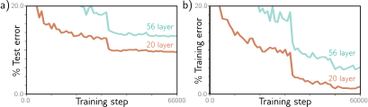
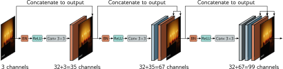

# 第十一章
# 残差网络

前一章描述了随着卷积网络从八层（AlexNet）扩展到十九层（VGG），图像分类性能是如何提升的。这引发了人们对更深层次网络的实验。然而，当层数继续增加时，性能反而再次下降。

本章介绍了**残差块 (residual blocks)**。在残差块中，每个网络层计算的是对当前表示的一种**增量式改变**，而不是直接对其进行变换。这使得更深的网络得以训练，但代价是在初始化时，激活值的量级会呈指数级增长。为了弥补这一点，残差块采用了**批归一化 (batch normalization)**，它能在每一层对激活值进行重新中心化和缩放。

带有批归一化的残差块使得非常深的网络得以训练，并且这些网络在各种任务中都提升了性能。本章将描述那些结合了残差块来解决图像分类、医学图像分割和人体姿态估计等问题的架构。

## 11.1 序列化处理

到目前为止，我们所见过的所有网络都是按顺序处理数据的；每一层接收前一层的输出，并将结果传递给下一层（图11.1）。例如，一个三层网络可以定义为：

$$
\begin{aligned}
\mathbf{h}_1 &= f_1[\mathbf{x}, \boldsymbol{\phi}_1] \\
\mathbf{h}_2 &= f_2[\mathbf{h}_1, \boldsymbol{\phi}_2] \\
\mathbf{h}_3 &= f_3[\mathbf{h}_2, \boldsymbol{\phi}_3] \\
\mathbf{y} &= f_4[\mathbf{h}_3, \boldsymbol{\phi}_4],
\end{aligned}
\tag{11.1}
$$

其中 $\mathbf{h}_1, \mathbf{h}_2$ 和 $\mathbf{h}_3$ 表示中间的隐藏层，$\mathbf{x}$ 是网络输入，$\mathbf{y}$ 是输出，而函数 $f_k[\cdot, \boldsymbol{\phi}_k]$ 执行具体的处理。

在一个标准的神经网络中，每一层都由一个线性变换和一个紧随其后的激活函数组成，参数 $\boldsymbol{\phi}_k$ 则包含了该层的权重和偏置。在卷积网络中，每一层由一组卷积操作和随后的激活函数构成，参数则包含了卷积核和偏置。

由于处理过程是序列化的，我们也可以等效地将这个网络看作一系列的嵌套函数：

$$
\mathbf{y} = f_4\left[f_3\left[f_2\left[f_1[\mathbf{x}, \boldsymbol{\phi}_1], \boldsymbol{\phi}_2\right], \boldsymbol{\phi}_3\right], \boldsymbol{\phi}_4\right].
\tag{11.2}
$$

---

> **图 11.1 序列化处理**
> 标准的神经网络将每一层的输出直接传递给下一层。
---

### 11.1.1 序列化处理的局限性

原则上，我们可以随意增加网络的层数。在上一章中，我们也看到增加卷积网络的层数确实能提升性能；拥有19层的VGG网络（图10.17）就优于拥有8层的AlexNet（图10.16）。然而，当层数进一步增加时，图像分类的性能却再次下降（图11.2）。这令人惊讶，因为通常模型在增加容量后表现会更好（图8.10）。实际上，无论是在训练集还是测试集上，性能下降的现象都存在，这意味着问题出在**训练更深层次网络本身**，而非更深网络泛化能力的不足。

这一现象尚未被完全理解。一种猜想是，在初始化之后，当我们修改网络早期层的参数时，损失函数的梯度会发生不可预测的变化。通过适当的权重初始化（见7.5节），损失相对于这些参数的梯度会是合理的（即没有梯度爆炸或消失）。然而，导数假设的是参数发生了无穷小的变化，而优化算法使用的是有限的步长。任何合理的步长选择都可能将参数更新到一个梯度完全不同且不相关的位置；损失曲面看起来不像一个易于下降的平滑结构，而更像一个由无数微小山脉构成的广阔山峦。因此，算法无法像在梯度变化更缓慢的函数上那样取得进展。

这一猜想得到了对单输入单输出网络的梯度经验观察的支持。对于一个浅层网络，当输入改变时，输出相对于输入的梯度变化相对缓慢（图11.3a）。然而，对于一个深度网络，输入的微小变化会导致梯度发生完全不同的变化（图11.3b）。梯度的**自相关函数 (autocorrelation function)** 捕捉了这一点（图11.3c）。**对于浅层网络，邻近的梯度是相关的，但对于深度网络，这种相关性迅速降至零。这种现象被称为梯度破碎 (shattered gradients)**。参考：Notebook 11.1 Shattered gradients, Appendix B.2.1 Autocorrelation function

---

> **图 11.2 增加更多卷积层后性能下降**
> a) 在CIFAR-10数据集（Krizhevsky & Hinton, 2009）的测试集上，一个20层的卷积网络在图像分类任务中优于一个56层的神经网络。b) 在训练集上也是如此，这表明问题与训练原始网络有关，而非泛化到新数据的能力不足。改编自 He et al. (2016a)。

> **图 11.3 梯度破碎**
> a) 考虑一个有200个隐藏单元的浅层网络，其权重和偏置均采用Glorot初始化（即不带因子2的He初始化）。标量网络输出 $y$ 相对于标量输入 $x$ 的梯度 $\partial y / \partial x$ 随着输入 $x$ 的变化而相对缓慢地改变。b) 对于一个有24层、每层200个隐藏单元的深度网络，这个梯度变化得非常迅速且不可预测。c) 梯度的自相关函数显示，对于深度网络，邻近的梯度变得不相关（自相关接近于零）。这种梯度破碎现象或许可以解释为什么深度网络难以训练。梯度下降算法依赖于损失曲面的相对平滑性，因此在每次更新步骤前后，梯度应该是相关的。改编自 Balduzzi et al. (2017)。
---

梯度破碎现象的出现，大概是因为网络越深，早期网络层的变化对输出的修改方式就越复杂。根据方程11.1，输出 $\mathbf{y}$ 相对于网络第一层 $\mathbf{f}_1$ 的导数是：

$$
\frac{\partial \mathbf{y}}{\partial \mathbf{f}_1} = \frac{\partial \mathbf{f}_2}{\partial \mathbf{f}_1} \frac{\partial \mathbf{f}_3}{\partial \mathbf{f}_2} \frac{\partial \mathbf{f}_4}{\partial \mathbf{f}_3}
\tag{11.3}
$$

当我们改变决定 $\mathbf{f}_1$ 的参数时，由于层 $\mathbf{f}_2, \mathbf{f}_3, \mathbf{f}_4$ 本身也是由 $\mathbf{f}_1$ 计算得出的，这个链式求导中的所有导数项都会在略微不同的位置被评估。因此，每个训练样本上更新后的梯度可能会变得完全不同，导致损失函数的行为变得很差。¹ 参考：Appendix B.5 Matrix calculus

## 11.2 残差连接与残差块

**残差连接 (Residual connections)** 或 **跳跃连接 (skip connections)** 是计算路径中的分支，通过这些分支，每一网络层 $\mathbf{f}[\cdot]$ 的输入会被加回到其输出上（图11.4a）。与方程11.1类比，残差网络的定义如下：

$$
\begin{aligned}
\mathbf{h}_1 &= \mathbf{x} + \mathbf{f}_1[\mathbf{x}, \boldsymbol{\phi}_1] \\
\mathbf{h}_2 &= \mathbf{h}_1 + \mathbf{f}_2[\mathbf{h}_1, \boldsymbol{\phi}_2] \\
\mathbf{h}_3 &= \mathbf{h}_2 + \mathbf{f}_3[\mathbf{h}_2, \boldsymbol{\phi}_3] \\
\mathbf{y} &= \mathbf{h}_3 + \mathbf{f}_4[\mathbf{h}_3, \boldsymbol{\phi}_4],
\end{aligned}
\tag{11.4}
$$

其中每行右侧的第一项就是残差连接。每个函数 $\mathbf{f}_k$ 学习的是对当前表示的一种**增量式改变**。由此可知，它们的输出必须与其输入具有相同的大小。输入和处理后输出的每次相加组合被称为一个**残差块 (residual block)** 或**残差层 (residual layer)**。

同样，我们可以通过代入中间量 $\mathbf{h}_k$ 的表达式，将此写成一个单一的函数：

$$
\mathbf{y} = \mathbf{x} + \mathbf{f}_1[\mathbf{x}] + \mathbf{f}_2[\mathbf{x} + \mathbf{f}_1[\mathbf{x}]] + \mathbf{f}_3[\mathbf{x} + \mathbf{f}_1[\mathbf{x}] + \mathbf{f}_2[\mathbf{x} + \mathbf{f}_1[\mathbf{x}]]] + \mathbf{f}_4[\dots],
\tag{11.5}
$$

为了清晰起见，我们省略了参数 $\boldsymbol{\phi}_k$。我们可以将这个方程看作是对网络的“**解构** (unraveling)”（图11.4b）。我们看到，最终的网络输出是输入与四个较小网络的和，对应于方程的每一行；一种解释是，残差连接将原始网络变成了一个由这些较小网络构成的**集成 (ensemble)**，它们的输出被相加来计算最终结果。

对这个残差网络的另一种补充思考方式是，它在输入和输出之间创建了十六条不同变换数量的路径。例如，第一个函数 $\mathbf{f}_1[\mathbf{x}]$ 出现在这十六条路径中的八条里，包括作为直接的加法项（即路径长度为一），与方程11.3相对应的导数则变为：

$$
\frac{\partial \mathbf{y}}{\partial \mathbf{f}_1} = \mathbf{I} + \frac{\partial \mathbf{f}_2}{\partial \mathbf{f}_1} + \frac{\partial \mathbf{f}_3}{\partial \mathbf{f}_1}\frac{\partial \mathbf{f}_2}{\partial \mathbf{f}_1} + \dots + \left( \frac{\partial \mathbf{f}_4}{\partial \mathbf{f}_1}\frac{\partial \mathbf{f}_2}{\partial \mathbf{f}_1}\frac{\partial \mathbf{f}_3}{\partial \mathbf{f}_1}\frac{\partial \mathbf{f}_2}{\partial \mathbf{f}_1}\frac{\partial \mathbf{f}_3}{\partial \mathbf{f}_1} \right)
\tag{11.6}
$$

这里每一项对应八条路径之一。右侧的**单位矩阵项 $\mathbf{I}$** 表明，第一层 $\mathbf{f}_1[\mathbf{x}, \boldsymbol{\phi}_1]$ 中参数 $\boldsymbol{\phi}_1$ 的变化会**直接贡献**于网络输出 $\mathbf{y}$ 的变化。它们也通过其他不同长度的导数链间接做出贡献。总的来说，通过较短路径的梯度行为会更好。由于单位矩阵项和各种短导数链都会对每一层的导数做出贡献，带有残差连接的网络受梯度破碎现象的影响较小。参考：Problem 11.1, Problem 11.2, Problem 11.3, Notebook 11.2 Residual networks

> ¹在方程11.3和11.6中，我们重载了符号，用 $\mathbf{f}_k$ 来表示函数 $\mathbf{f}_k[\cdot]$ 的输出。

---

> **图 11.4 残差连接**
> a) 每个函数 $\mathbf{f}_k[\mathbf{x}, \boldsymbol{\phi}_k]$ 的输出被加回到其输入上，该输入通过一条并行的、称为残差或跳跃连接的计算路径传递。因此，该函数计算的是对表示的一种增量式改变。b) 将网络方程展开（解构）后，我们发现输出是输入加上四个较小网络（分别用白色、橙色、灰色和青色表示，对应于方程11.5中的项）的和；我们可以将其视为一个网络集成。此外，青色网络的输出本身是另一个集成的变换 $\mathbf{f}_4[\cdot, \boldsymbol{\phi}_4]$，依此类推。或者，我们可以将网络看作是计算图中16条不同路径的组合。一个例子是从输入 $\mathbf{x}$ 到输出 $\mathbf{y}$ 的虚线路径，它在图(a)和(b)中是相同的。

---

### 11.2.1 残差块中的运算顺序

到目前为止，我们暗示了增量函数 $\mathbf{f}[\mathbf{x}]$ 可以是任何有效的网络层（例如，全连接层或卷积层）。这在技术上是正确的，但这些函数中运算的顺序很重要。它们必须包含像ReLU这样的非线性激活函数，否则整个网络将是线性的。然而，在一个典型的网络层中（图11.5a），ReLU函数位于末尾，因此输出是非负的。如果我们采纳这种约定，那么每个残差块只能增加输入值。

因此，通常的做法是改变运算顺序，使得激活函数先被应用，然后是线性变换（图11.5b）。有时在一个残差块内可能有多层处理（图11.5c），但这些通常以线性变换结束。最后，我们注意到，当我们以ReLU运算开始这些块时，如果初始网络输入是负数，它们将什么也不做，因为ReLU会将整个信号截断为零。因此，典型的做法是在网络开始时使用一个线性变换，而不是一个残差块，如图11.5b所示。

---

> **图 11.5 残差块中的运算顺序**
> a) 线性变换或卷积后跟一个ReLU非线性函数的常规顺序，意味着每个残差块只能增加非负的数量。b) 采用相反的顺序，可以添加正数和负数。但是，我们必须在网络开始处添加一个线性变换，以防输入全为负数。c) 在实践中，一个残差块通常包含多个网络层。

---

### 11.2.2 具有残差连接的更深层网络

增加残差连接，大致可以将一个在性能退化前可以实际训练的网络深度翻倍。然而，我们希望进一步增加深度。要理解为什么残差连接不允许我们任意增加深度，我们必须考虑在前向传播过程中激活值的方差如何变化，以及在反向传播过程中梯度的量级如何变化。

## 11.3 残差网络中的梯度爆炸

在7.5节中，我们看到初始化网络参数至关重要。没有仔细的初始化，反向传播的前向传播过程中的中间值的量级可能会呈指数级增加或减少。类似地，在反向传播过程中，当我们向后移动通过网络时，梯度可能会爆炸或消失。

因此，我们初始化网络参数，使得激活值（在前向传播中）和梯度（在反向传播中）的期望方差在层与层之间保持不变。**He初始化**（7.5节）通过将偏置 $\boldsymbol{\beta}$ 初始化为零，并选择均值为零、方差为 $2/D_h$ 的正态分布权重 $\mathbf{\Omega}$（其中 $D_h$ 是前一层隐藏单元的数量）来实现这一点，适用于ReLU激活函数。

现在考虑一个残差网络。我们不必担心中间值或梯度随着网络深度而消失，因为存在一条路径，使得每一层都直接对网络输出做出贡献（方程11.5和图11.4b）。然而，即使我们在残差块内部使用He初始化，前向传播中的值也会随着我们通过网络而呈指数级增长。

要理解为什么，可以考虑我们将残差块中的处理结果加回到输入中。每个分支都有一些（不相关的）可变性。因此，当我们重新组合它们时，总方差会增加。对于ReLU激活和He初始化，期望方差在每个块的处理中保持不变。因此，当我们与输入重新组合时，方差会加倍（图11.6a），随着残差块的数量呈指数级增长。这限制了在超出浮点精度之前可能的网络深度。类似的论点也适用于反向传播算法中的梯度。参考：Problem 11.4

因此，即使使用He初始化，残差网络仍然会遭受不稳定的前向传播和梯度爆炸的困扰。一种可以稳定前向和后向传播的方法是使用He初始化，然后在每个残差块的组合输出上乘以 $1/\sqrt{2}$ 来补偿加倍的方差（图11.6b）。然而，更常用的方法是使用**批归一化**。

---

**图 11.6 残差网络中的方差**
a) He初始化确保了在线性加ReLU层 $\mathbf{f}_k$ 之后期望方差保持不变。不幸的是，在残差网络中，每个块的输入被加回到输出，因此方差在每一层都加倍（灰色数字表示方差）并呈指数级增长。b) 一种方法是在每个残差块之间将信号按 $1/\sqrt{2}$ 重新缩放。c) 第二种方法是在残差块的第一步使用批归一化（BN），并将相关的偏置 $\delta$ 初始化为零，缩放因子 $\gamma$ 初始化为一。这将每一层的输入转换为单位方差，并且使用He初始化，输出方差也将为一。现在方差随着残差块的数量线性增加。一个副作用是，在初始化时，后面的网络层主要由残差连接主导，因此接近于计算恒等函数。

---

## 11.4 批归一化

**批归一化 (Batch normalization)** 或 **Batch Norm** 对每个激活值 $\mathbf{h}$ 进行平移和缩放，使其在一个批次 $\mathcal{B}$ 上的均值和方差成为在训练过程中学习到的值。首先，计算经验均值 $m_h$ 和标准差 $s_h$：

$$
\begin{aligned}
m_h &= \frac{1}{|\mathcal{B}|} \sum_{i \in \mathcal{B}} h_i \\
s_h &= \sqrt{\frac{1}{|\mathcal{B}|} \sum_{i \in \mathcal{B}} (h_i - m_h)^2},
\end{aligned}
\tag{11.7}
$$

其中所有量都是标量。然后我们使用这些统计数据来**标准化 (standardize)** 批次激活值，使其均值为零，方差为一：参考：Appendix C.2.4 Standardization

$$
\hat{h}_i \leftarrow \frac{h_i - m_h}{s_h + \epsilon} \quad \forall i \in \mathcal{B},
\tag{11.8}
$$

其中 $\epsilon$ 是一个很小的数，用于防止在批次中所有 $h_i$ 都相同且 $s_h=0$ 时出现除零错误。

最后，归一化后的变量被一个可学习的参数 $\gamma$ 缩放，并被一个可学习的参数 $\delta$ 平移：

$$
h_i \leftarrow \gamma \hat{h}_i + \delta \quad \forall i \in \mathcal{B}.
\tag{11.9}
$$

经过此操作后，激活值在批次的所有成员中具有均值 $\delta$ 和标准差 $\gamma$。这两个量都是在训练过程中学习的。

批归一化独立地应用于每个隐藏单元。在一个有 $K$ 层、每层包含 $D$ 个隐藏单元的标准神经网络中，将会有 $KD$ 个学习到的偏置 $\delta$ 和 $KD$ 个学习到的缩放因子 $\gamma$。在卷积网络中，归一化统计量是在批次和空间位置上共同计算的。如果有 $K$ 层，每层包含 $C$ 个通道，那么将会有 $KC$ 个偏置和 $KC$ 个缩放因子。在测试时，我们没有批次来收集统计数据。为了解决这个问题，统计量 $m_h$ 和 $s_h$ 是在整个训练数据集上（而不是仅仅一个批次）计算的，并在最终的网络中被冻结。参考：Problem 11.5, Problem 11.6, Notebook 11.3 BatchNorm

### 11.4.1 批归一化的成本与收益

批归一化使得网络对于贡献到每个激活值的权重和偏置的缩放具有不变性；如果这些权重和偏置加倍，那么激活值也加倍，估计的标准差 $s_h$ 也加倍，方程11.8中的归一化会补偿这些变化。² 这对每个隐藏单元都独立发生。因此，将会有大量的权重和偏置组合产生相同的效果。批归一化在每个隐藏单元处也增加了两个参数 $\gamma$ 和 $\delta$，这使得模型略微变大。因此，它既在权重和偏置中创造了冗余，又增加了额外的参数来补偿这种冗余。这显然是低效的，但批归一化也提供了几个好处。

**稳定的前向传播**: 如果我们将偏置 $\delta$ 初始化为零，缩放因子 $\gamma$ 初始化为一，那么每个输出激活值都将具有单位方差。在一个常规网络中，这确保了在前向传播初始化期间方差是稳定的。在一个残差网络中，当我们在每一层为输入增加一个新的变异源时，方差仍然必须增加。然而，它将随着每个残差块线性增加；第 $k$ 层为现有的方差 $k$ 增加一个单位的方差（图11.6c）。
在初始化时，这有一个副作用，即后面的层对总方差的改变比前面的层小。在训练开始时，网络有效地变得更浅，因为后面的层接近于计算恒等函数。随着训练的进行，网络可以增加后面层的缩放因子 $\gamma$，从而控制其自身的有效深度。

**更高的学习率**: 经验研究和理论都表明，批归一化使得损失曲面及其梯度的变化更平滑（即减少了梯度破碎）。这意味着我们可以使用更高的学习率，因为曲面更可预测。我们在9.2节中看到，更高的学习率可以提高测试性能。

**正则化**: 我们在第9章中看到，训练过程中的噪声可以改善泛化。批归一化注入了噪声，因为归一化取决于批次的统计数据。给定训练样本的激活值被一个取决于批次中其他成员的量所归一化，并且在每次训练迭代中这个量都不同。

> ²严格来说，这仅在批归一化操作直接应用于网络层之后才成立。如果残差路径在网络层和归一化之间汇合和再分叉，情况会更复杂一些，如图11.6c所示。然而，论证的精神保持不变。

## 11.5 常见的残差架构

残差连接现在是深度学习流程的标准组成部分。本节回顾了一些包含它们的著名架构。

### 11.5.1 ResNet

残差块最早被用于卷积网络中的图像分类。由此产生的网络被称为**残差网络 (residual networks)**，简称 **ResNets**。在ResNets中，每个残差块包含一个批归一化操作、一个ReLU激活函数和一个卷积层。这个序列在被加回到输入之前会重复一次（图11.7a）。反复试验表明，这种运算顺序对于图像分类效果很好。参考：Problem 11.7

对于非常深的网络，参数数量可能会变得过大。**瓶颈残差块 (Bottleneck residual blocks)** 通过使用三个卷积来更有效地利用参数。第一个是 $1\times1$ 的卷积核，用于减少通道数。第二个是常规的 $3\times3$ 卷积核，第三个是另一个 $1\times1$ 的卷积核，用于将通道数增加回原始数量（图11.7b）。通过这种方式，我们可以在一个 $3\times3$ 的像素区域上整合信息，同时使用更少的参数。参考：Problem 11.8

ResNet-200模型（图11.8）包含200层，曾用于ImageNet数据库（图10.15）上的图像分类。该架构类似于AlexNet和VGG，但使用瓶颈残差块代替了普通的卷积层。与AlexNet和VGG一样，这些块会周期性地穿插着空间分辨率的降低和通道数的增加。相邻ResNet块之间的分辨率通过步长为2的卷积来降低。通道数同样通过在表示后附加零或应用一个额外的 $1\times1$ 卷积来增加。网络开始时是一个 $7\times7$ 的卷积层，然后是一个下采样操作。最后，一个全连接层将块映射到一个长度为1000的向量。这会通过一个softmax层来生成类别概率。

ResNet-200模型取得了显著的成果，前五项预测中包含正确类别的错误率为4.8%，识别正确类别的错误率为20.1%。这与AlexNet（16.4%, 38.1%）和VGG（6.8%, 23.7%）相比表现优异，并且是首批超越人类表现（前五项猜测中5.1%）的网络之一。然而，这个模型诞生于2016年，远非当前最先进的水平。在撰写本文时，这项任务上表现最好的模型在识别正确类别上的错误率为9.0%（见图10.21）。这个模型以及所有其他当前表现顶尖的图像分类模型现在都基于Transformer（见第12章）。

---

**图 11.7 ResNet 块**
a) ResNet架构中的一个标准块包含一个批归一化操作，一个激活函数，以及一个 $3 \times 3$ 的卷积层。然后，这个序列会重复一次。b) 瓶颈ResNet块仍然在一个 $3 \times 3$ 的区域上整合信息，但使用的参数更少。它包含三个卷积。第一个 $1 \times 1$ 卷积减少了通道数。第二个 $3 \times 3$ 卷积应用于较小的表示。最后一个 $1 \times 1$ 卷积再次增加通道数，以便可以将其加回到输入中。

**图 11.8 ResNet-200 模型**
一个标准的 $7 \times 7$ 卷积层，步长为2，后面跟着一个最大池化操作。接着是一系列瓶颈残差块（括号中的数字是第一个 $1 \times 1$ 卷积后的通道数），伴随着周期性的下采样和通道数的增加。网络最后通过对所有空间位置进行平均池化和一个全连接层，将特征映射到softmax前的激活值。

---

### 11.5.2 DenseNet

残差块接收前一层的输出，通过一些网络层对其进行修改，然后将其加回到原始输入中。另一种方法是**拼接 (concatenate)** 修改后的信号和原始信号。这增加了表示的大小（就卷积网络的通道数而言），但一个可选的后续线性变换可以将其映射回原始大小（对于卷积网络来说是 $1\times1$ 的卷积）。这允许模型将表示相加，取加权和，或以更复杂的方式组合它们。

DenseNet架构使用拼接，使得每一层的输入都包含**所有**前面层的拼接输出（图11.9）。这些输出被处理以创建一个新的表示，该表示本身也与之前的表示拼接在一起，并传递给下一层。这种拼接意味着从早期层到输出有直接的贡献，因此损失曲面的行为是合理的。

在实践中，这只能持续几层，因为通道数（以及处理它们所需的参数数量）变得越来越大。通过在下一个 $3\times3$ 卷积之前应用一个 $1\times1$ 的卷积来减少通道数，可以缓解这个问题。在卷积网络中，输入会周期性地被下采样。跨下采样的拼接没有意义，因为表示具有不同的空间大小。因此，拼接链在此时断开，一个较小的表示开始一个新的链。此外，当发生下采样时，可以应用另一个瓶颈 $1\times1$ 卷积来进一步控制表示大小。

该网络在图像分类方面与ResNet模型表现相当（见图10.21）；实际上，在参数数量相当的情况下，它可能表现更好。这大概是因为它可以更灵活地重用来自早期层的处理。

---

> **图 11.9 DenseNet**
> 该架构使用残差连接将早期层的输出拼接到后期层。在这里，三通道的输入图像被处理以形成一个32通道的表示。输入图像被拼接到这个表示上，得到总共35个通道。这个组合表示被处理以创建另一个32通道的表示，然后前面的两个表示都与这个新表示拼接，创建总共67个通道，依此类推。

---

### 11.5.3 U-Nets 和沙漏网络

10.5.3节描述了一个具有编码器-解码器或沙漏结构的语义分割网络。编码器重复地对图像进行下采样，直到感受野变大，信息从整个图像中被整合。然后解码器将其上采样回原始图像的大小。最终输出是每个像素上可能对象类别的概率。这种架构的一个缺点是，网络中间的低分辨率表示必须“记住”高分辨率的细节，才能使最终结果准确。如果残差连接将编码器中的表示传递给解码器中它们的对应部分，这就变得不必要了。

**U-Net**（图11.10）是一个编码器-解码器架构，其中早期的表示被拼接到后期的表示上。原始实现使用了“valid”卷积，因此每次应用 $3\times3$ 的卷积层时，空间大小都会减少两个像素。这意味着上采样后的版本比其在编码器中的对应部分小，必须在拼接前进行裁剪。后续的实现使用了零填充，这样就不需要裁剪了。请注意，U-Net是完全卷积的，因此在训练后，它可以运行在任何大小的图像上。参考：Problem 11.9

U-Net旨在分割医学图像（图11.11），但在计算机图形学和视觉领域也发现了许多其他用途。**沙漏网络 (Hourglass networks)** 与之类似，但在跳跃连接中应用了进一步的卷积层，并将结果加回到解码器中，而不是拼接它。一系列这样的模型形成一个**堆叠沙漏网络 (stacked hourglass network)**，它在局部和全局层面交替考虑图像。这类网络用于姿态估计（图11.12）。该系统被训练来为每个关节预测一个“热图”，估计的位置是每个热图的最大值。

---

> **图 11.10 用于分割HeLa细胞的U-Net**
> U-Net具有编码器-解码器结构，其中表示被下采样（橙色块），然后重新上采样（蓝色块）。编码器使用常规卷积，解码器使用转置卷积。残差连接将编码器中每个尺度的最后一个表示附加到解码器中相同尺度的第一个表示上（橙色箭头）。原始的U-Net使用“valid”卷积，因此即使没有下采样，每层的大小也会略有减小。因此，来自编码器的表示在附加到解码器之前被裁剪（虚线方块）。改编自 Ronneberger et al. (2015)。

> **图 11.11 在3D中使用U-Net进行分割**
> a) 通过扫描电子显微镜拍摄的小鼠皮层3D体积的三个切片。b) 使用单个U-Net将体素分类为神经突内部或外部。连接的区域用不同颜色标识。c) 为了获得更好的结果，训练了五个U-Net的集成，并且只有当所有五个网络都同意时，体素才被分类为属于该细胞。改编自 Falk et al. (2019)。

> **图 11.12 用于姿态估计的堆叠沙漏网络**
> a) 网络输入是一张包含人的图像，输出是一组热图，每个关节一个热图。这被表述为一个回归问题，其中目标是热图图像，在真实的关节位置有小的高亮区域。估计的热图的峰值被用来确定每个最终的关节位置。b) 该架构由初始的卷积和残差层，后面跟着一系列沙漏块组成。c) 每个沙漏块由一个类似于U-Net的编码器-解码器网络组成，只是卷积使用零填充，在残差连接中进行了一些进一步的处理，并且这些连接是相加而不是拼接这个处理后的表示。每个蓝色长方体本身就是一个瓶颈残差块（图11.7b）。改编自 Newell et al. (2016)。

---

## 11.6 为什么带有残差连接的网络表现如此优越？

残差网络使得更深的网络得以训练；将ResNet架构扩展到1000层并仍然有效训练是可能的。图像分类性能的提升最初归因于增加的网络深度，但有两方面的证据与此观点相矛盾。

首先，具有相当参数数量的更浅、更宽的残差网络有时会优于更深、更窄的网络。换句话说，有时可以通过使用层数更少但每层通道数更多的网络来获得更好的性能。其次，有证据表明，在训练过程中，梯度并不能有效地通过解构网络中的非常长的路径传播（图11.4b）。实际上，一个非常深的网络可能更像是一个浅层网络的组合。

目前的观点是，残差连接本身就具有价值，同时也使得更深的网络得以训练。这一观点得到了事实的支持，即在最小值附近的残差网络的损失曲面，往往比移除跳跃连接后的同一网络更平滑、更可预测（图11.13）。这可能使其更容易学习到一个泛化良好的解。

---

> **图 11.13 可视化神经网络损失曲面**
> 每张图都显示了在CIFAR-10数据集上进行图像分类任务时，由SGD找到的最小值周围参数空间中两个随机方向上的损失曲面。这些方向被归一化以便于并排比较。a) 具有56层的残差网络。b) 移除跳跃连接后的同一网络的结果。带有跳跃连接的曲面更平滑。这有助于学习，并使最终的网络性能对参数中的微小误差更具鲁棒性，因此它可能会更好地泛化。改编自 Li et al. (2018b)。

---

## 11.7 总结

无限地增加网络深度会导致图像分类的训练和测试性能都下降。这可能是因为损失相对于网络早期参数的梯度，相对于更新步长而言，变化得既快又不可预测。残差连接将处理后的表示加回到它们自己的输入上。现在每一层都直接和间接地对输出做出贡献，因此通过许多层传播梯度不是强制性的，损失曲面也变得更平滑。

残差网络不会遭受梯度消失的困扰，但在前向传播过程中会引入激活值方差的指数级增长，以及相应的梯度爆炸问题。这通常通过添加批归一化来处理，它补偿了批次的经验均值和方差，然后使用学习到的参数进行平移和缩放。如果这些参数被明智地初始化，非常深的网络就可以被训练。有证据表明，残差连接和批归一化都使损失曲面更平滑，这允许了更大的学习率。此外，批次统计的可变性增加了一个正则化来源。

残差块已被并入卷积网络中。它们允许训练更深的网络，并相应地提升了图像分类性能。残差网络的变化包括DenseNet架构，它将所有先前层的输出拼接起来输入到当前层，以及U-Nets，它将残差连接并入编码器-解码器模型。

### 注释

**残差连接**：残差连接由 He et al. (2016a) 引入，他们构建了一个152层的网络，比VGG（图10.17）大八倍，并在ImageNet分类任务上取得了最先进的性能。每个残差块由一个卷积层、批归一化、ReLU激活、第二个卷积层和第二个批归一化组成。在这个块被加回到主表示之后，应用了第二个ReLU函数。这个架构被称为ResNet v1。He et al. (2016b) 研究了残差架构的不同变体，其中（i）处理也可以沿着跳跃连接应用，或（ii）在两个分支重组后应用。他们得出结论，两者都不是必需的，从而产生了图11.7中的架构，有时被称为**预激活残差块 (pre-activation residual block)**，并且是ResNet v2的主干。他们训练了一个200层的网络，在ImageNet分类任务上取得了进一步的改进（见图11.8）。从那时起，新的正则化、优化和数据增强方法被开发出来，Wightman et al. (2021) 利用这些方法提出了一个更现代的ResNet架构训练流程。

**为什么残差连接有帮助**：残差网络当然允许训练更深的网络。据推测，这与减少训练开始时的梯度破碎（Balduzzi et al., 2017）以及如图11.13所示的最小值附近更平滑的损失曲面（Li et al., 2018b）有关。仅残差连接（即没有批归一化）就能将一个网络的可训练深度大约增加两倍（Sankararaman et al., 2020）。通过批归一化，可以训练非常深的网络，但尚不清楚深度对于性能是否至关重要。Zagoruyko & Komodakis (2016) 表明，只有16层的宽残差网络在当时优于所有残差网络进行图像分类。Orhan & Pitkow (2017) 提出了一个不同的解释，说明为什么残差连接能够改善学习，即通过消除奇异点（损失曲面上Hessian矩阵退化的地方）。

**相关架构**：残差连接是**高速公路网络 (highway networks)**（Srivastava et al., 2015）的一个特例，它也将计算分为两个分支并相加重组。高速公路网络使用一个门控函数，根据数据本身来加权两个分支的输入，而残差网络则以一种直接的方式将数据发送到两个分支。Xie et al. (2017) 引入了ResNeXt架构，它在多个并行的卷积分支周围放置了一个残差连接。

**残差网络作为集成**：Veit et al. (2016) 将残差网络描述为更短网络的集成，并描绘了“解构网络”的解释（图11.4b）。他们通过证明在一个训练好的网络中删除层（从而删除路径的子集）对性能只有温和的影响来提供证据支持这种解释。相反，在一个纯序列网络如VGG中删除一层是灾难性的。他们还观察了不同长度路径上的梯度大小，并表明梯度在更长的路径中会消失。在一个由54个块组成的残差网络中，训练期间几乎所有的梯度更新都来自长度为5到17个块的路径，尽管这些路径仅占总路径的0.45%。似乎增加更多的块有效地增加了更多并行的更短路径，而不是创建一个真正更深的网络。

**残差网络的正则化**：L2权重正则化在普通网络和没有批归一化的残差网络中具有根本不同的效果。在前者中，它鼓励层的输出是一个由偏置决定的常数函数。在后者中，它鼓励残差块计算恒等函数加上一个由偏置决定的常数。
已经开发了几种专门针对残差架构的正则化方法。ResDrop (Yamada et al., 2016)，随机深度 (stochastic depth) (Huang et al., 2016)，和RandomDrop (Yamada et al., 2019) 都通过在训练过程中随机丢弃残差块来对残差网络进行正则化。在后一种情况下，丢弃一个块的倾向由一个伯努利变量决定，其参数在训练过程中线性递减。在测试时，残差块以其期望概率被加回。这些方法实际上是dropout的版本，其中一个块中的所有隐藏单元被同时丢弃。在残差网络的多路径视图中（图11.4b），它们只是在每个训练步骤中移除一些路径。Wu et al. (2018b) 开发了BlockDrop，它分析一个现有网络并决定在运行时使用哪些残差块，以提高推理效率。
其他正则化方法是为残差块内部具有多条路径的网络开发的。Shake-shake (Gastaldi, 2017a,b) 在前向和后向传播过程中随机地重新加权路径。在前向传播中，这可以被看作是合成随机数据，在后向传播中，则是向训练方法注入另一种形式的噪声。ShakeDrop (Yamada et al., 2019) 抽取一个伯努利变量，决定每个块是受Shake-Shake影响，还是像一个标准的残差单元一样在该训练步骤中运行。

**批归一化**：批归一化由 Ioffe & Szegedy (2015) 在残差网络的背景之外引入。他们凭经验表明，它允许更高的学习率，增加了收敛速度，并使sigmoid激活函数更实用（因为输出的分布受到控制，所以样本不太可能落入sigmoid的饱和极端）。Balduzzi et al. (2017) 研究了具有ReLU函数的深度网络后期层中隐藏单元的激活情况。他们表明，许多这样的隐藏单元总是激活或总是不激活，而与输入无关，但批归一化减少了这种趋势。
尽管批归一化有助于稳定通过网络的信号的前向传播，Yang et al. (2019) 表明，在没有跳跃连接的ReLU网络中，它会导致梯度爆炸，每一层都会将梯度的量级增加约 $\sqrt{\pi/(\pi-1)} \approx 1.21$ 倍。这一论点由 Luther (2020) 总结。由于一个残差网络可以被看作是不同长度路径的组合（图11.4），这种效应也必须存在于残差网络中。然而，据推测，在一个有 $K$ 层的网络的前向传播中，消除 $2^K$ 的量级增长的好处，超过了在后向传播中梯度增加 $1.21^K$ 的坏处，所以总体上批归一化使训练更稳定。

**批归一化的变体**：已经提出了几种批归一化的变体（图11.14）。批归一化基于跨批次收集的统计数据分别归一化每个通道。**幽灵批归一化 (Ghost batch normalization)** 或 **GhostNorm** (Hoffer et al., 2017) 仅使用部分批次来计算归一化统计数据，这使得它们更具噪声性，并在批次大小非常大时增加正则化的量（图11.14b）。
当批次大小非常小或批次内波动非常大时（如自然语言处理中常见的情况），批归一化中的统计数据可能变得不可靠。Ioffe (2017) 提出了**批次重归一化 (batch renormalization)**，它保留了批次统计的运行平均值，并修改任何批次的归一化以确保其更具代表性。另一个问题是，批归一化不适用于循环神经网络（用于处理序列的网络，其中前一个输出作为额外输入反馈，如图12.19所示）。在这里，统计数据必须在序列的每个步骤中存储，并且如果测试序列比训练序列长，该怎么做也不清楚。第三个问题是，批归一化需要访问整个批次。然而，当训练分布在多台机器上时，这可能不容易获得。
**层归一化 (Layer normalization)** 或 **LayerNorm** (Ba et al., 2016) 通过分别归一化每个数据样本，使用跨通道和空间位置收集的统计数据来避免使用批次统计（图11.14c）。然而，每个通道仍然保留一个单独的学习到的缩放因子 $\gamma$ 和偏置 $\delta$。**组归一化 (Group normalization)** 或 **GroupNorm** (Wu & He, 2018) 与LayerNorm类似，但将通道分为组，并为每个组分别计算跨组内通道和空间位置的统计数据（图11.14d）。同样，每个通道仍然有单独的缩放和偏置参数。**实例归一化 (Instance normalization)** 或 **InstanceNorm** (Ulyanov et al., 2016) 将此推向极端，其中组的数量与通道的数量相同，因此每个通道被单独归一化（图11.14e），仅使用跨空间位置收集的统计数据。Salimans & Kingma (2016) 研究了归一化网络权重而不是激活值，但这在经验上不太成功。Teye et al. (2018) 引入了**蒙特卡洛批归一化 (Monte Carlo batch normalization)**，它可以提供对神经网络预测不确定性的有意义的估计。Lubana et al. (2021) 中可以找到对不同归一化方案属性的最新比较。

**为什么批归一化有帮助**：批归一化有助于控制残差网络中的初始梯度（图11.6c）。然而，批归一化提高性能的机制尚未被很好地理解。Ioffe & Szegedy (2015) 的既定目标是减少由**内部协变量偏移 (internal covariate shift)** 引起的问题，即在反向传播更新期间，由于更新前面的层而导致一个层的输入分布发生变化。然而，Santurkar et al. (2018) 通过人为地诱导协变量偏移并表明有和没有批归一化的网络表现同样出色，提供了反对这一观点的证据。
受此启发，他们寻找了另一个关于为什么批归一化应该提高性能的解释。他们凭经验表明，对于VGG网络，添加批归一化会减少我们在梯度方向上移动时损失及其梯度的变化。换句话说，损失曲面既更平滑，变化也更慢，这就是为什么可能使用更大的学习率。他们还为这两种现象提供了理论证明，并表明对于任何参数初始化，对于有批归一化的网络，到最近最优点的距离更小。Bjorck et al. (2018) 也认为批归一化改善了损失景观的属性并允许更大的学习率。
关于批归一化提高性能的其他解释包括降低调整学习率的重要性（Ioffe & Szegedy, 2015; Arora et al., 2018）。实际上，Li & Arora (2019) 表明，使用批归一化，可以使用指数级增长的学习率计划。最终，这是因为批归一化使得网络对权重矩阵的尺度不敏感（见 Huszár, 2019，有一个直观的可视化）。
Hoffer et al. (2017) 发现，批归一化由于批次的随机组成产生的统计波动而具有正则化效果。他们建议使用一个幽灵批次大小，其中均值和标准差统计数据是从批次的一个子集中计算出来的。现在可以使用大批次而不会失去较小批次大小中额外噪声的正则化效果。Luo et al. (2018) 研究了批归一化的正则化效果。

**批归一化的替代方案**：尽管批归一化被广泛使用，但它并非训练深度残差网络所必需；还有其他方法可以使损失曲面易于处理。Balduzzi et al. (2017) 提出了图11.6b中的按 $\sqrt{1/2}$ 重新缩放；他们认为这可以防止梯度爆炸，但不能解决梯度破碎的问题。
其他工作研究了在将残差块的函数输出加回到输入之前对其进行重新缩放。例如，De & Smith (2020) 引入了SkipInit，在每个残差分支的末端放置一个可学习的标量乘数。如果这个乘数初始化为小于 $\sqrt{1/K}$（其中 $K$ 是残差块的数量），则会有所帮助。在实践中，他们建议将其初始化为零。类似地，Hayou et al. (2021) 引入了Stable ResNet，它将第 $k$ 个残差块中的函数输出（在添加到主分支之前）按一个常数 $\lambda_k$ 重新缩放。他们证明，在无限宽度的极限下，第一层权重的期望梯度范数的下界是缩放因子 $\lambda_k$ 的平方和。他们研究了将这些设置为一个常数 $\sqrt{1/K}$（其中 $K$ 是残差块的数量），并表明可以训练多达1000个块的网络。
Zhang et al. (2019a) 引入了FixUp，其中每一层都使用He归一化进行初始化，但每个残差块的最后一个线性/卷积层被设置为零。现在初始的前向传播是稳定的（因为每个残差块贡献为零），并且在后向传播中梯度不会爆炸（原因相同）。他们还重新缩放了分支，使得参数的总期望变化幅度与残差块的数量无关。这些方法允许训练深度残差网络，但通常不能达到使用批归一化时的相同测试性能。这可能是因为它们没有从噪声批次统计中诱导的正则化中受益。De & Smith (2020) 修改了他们的方法，通过dropout来诱导正则化，这有助于缩小差距。

**DenseNet和U-Net**：DenseNet最早由 Huang et al. (2017b) 引入，U-Net由 Ronneberger et al. (2015) 开发，堆叠沙漏网络由 Newell et al. (2016) 开发。在这些架构中，U-Net被最广泛地改编。Çiçek et al. (2016) 引入了3D U-Net，Milletari et al. (2016) 引入了V-Net，两者都将U-Net扩展到处理3D数据。Zhou et al. (2018) 在一个既能下采样和上采样图像，又能重复使用中间表示的架构中结合了DenseNet和U-Net的思想。U-Nets常用于医学图像分割（见 Siddique et al., 2021，一篇综述）。然而，它们也被应用于其他领域，包括深度估计（Garg et al., 2016），语义分割（Iglovikov & Shvets, 2018），图像修复（Zeng et al., 2019），全色锐化（Yao et al., 2018），和图像到图像的翻译（Isola et al., 2017）。U-Nets也是扩散模型（第18章）中的一个关键组成部分。

---

> **图 11.14 归一化方案**
> BatchNorm 分别修改每个通道，但根据跨批次和空间位置收集的统计数据，以相同的方式调整每个批次成员。Ghost batch normalization 从部分批次计算这些统计数据，使其更具可变性。LayerNorm 分别计算每个批次成员的统计数据，基于跨通道和空间位置收集的统计数据。它为每个通道保留一个单独的学习到的缩放因子。GroupNorm 在每组通道内进行归一化，并且也为每个通道保留一个单独的缩放和偏置参数。InstanceNorm 分别在每个通道内进行归一化，仅计算跨空间位置的统计数据。改编自 Wu & He (2018)。

---

***

### 习题

**问题 11.1** 从方程11.4中的网络定义推导出方程11.5。

**思路与解答：**

这是一个逐步代入的过程。
从 $\mathbf{y} = \mathbf{h}_3 + \mathbf{f}_4[\mathbf{h}_3, \boldsymbol{\phi}_4]$ 开始。
1.  将 $\mathbf{h}_3 = \mathbf{h}_2 + \mathbf{f}_3[\mathbf{h}_2, \boldsymbol{\phi}_3]$ 代入：
    $\mathbf{y} = (\mathbf{h}_2 + \mathbf{f}_3[\mathbf{h}_2]) + \mathbf{f}_4[\mathbf{h}_2 + \mathbf{f}_3[\mathbf{h}_2]]$
2.  将 $\mathbf{h}_2 = \mathbf{h}_1 + \mathbf{f}_2[\mathbf{h}_1, \boldsymbol{\phi}_2]$ 代入：
    $\mathbf{y} = ((\mathbf{h}_1 + \mathbf{f}_2[\mathbf{h}_1]) + \mathbf{f}_3[\mathbf{h}_1 + \mathbf{f}_2[\mathbf{h}_1]]) + \mathbf{f}_4[(\mathbf{h}_1 + \mathbf{f}_2[\mathbf{h}_1]) + \mathbf{f}_3[\mathbf{h}_1 + \mathbf{f}_2[\mathbf{h}_1]]]$
3.  将 $\mathbf{h}_1 = \mathbf{x} + \mathbf{f}_1[\mathbf{x}, \boldsymbol{\phi}_1]$ 代入，并省略参数 $\boldsymbol{\phi}_k$：
    $\mathbf{y} = \mathbf{x} + \mathbf{f}_1[\mathbf{x}] + \mathbf{f}_2[\mathbf{x} + \mathbf{f}_1[\mathbf{x}]] + \mathbf{f}_3[\mathbf{x} + \mathbf{f}_1[\mathbf{x}] + \mathbf{f}_2[\mathbf{x} + \mathbf{f}_1[\mathbf{x}]]] + \mathbf{f}_4[\dots]$
    这与方程11.5的形式一致，只是最后一项 $\mathbf{f}_4$ 的输入被简写了。

**问题 11.2** 解构图11.4a中的四块网络产生了一条长度为零的路径，四条长度为一的路径，六条长度为二的路径，四条长度为三的路径，和一条长度为四的路径。那么(i)三个残差块和(ii)五个残差块各会产生多少条不同长度的路径？推导出 $K$ 个残差块的规则。

**思路与解答：**

这相当于问从输入到输出，经过 $k$ 个 $\mathbf{f}$ 函数的路径有多少条。在一个有 $K$ 个残差块的网络中，每经过一个块，我们可以选择走“跳跃连接”路径（不经过 $\mathbf{f}$）或“处理”路径（经过 $\mathbf{f}$）。
要形成一条长度为 $k$ 的路径，我们需要在 $K$ 个块中选择 $k$ 个走“处理”路径。因此，长度为 $k$ 的路径数量为组合数 $\binom{K}{k}$。

*   **(i) $K=3$ 个残差块**:
    *   长度0: $\binom{3}{0}=1$
    *   长度1: $\binom{3}{1}=3$
    *   长度2: $\binom{3}{2}=3$
    *   长度3: $\binom{3}{3}=1$
*   **(ii) $K=5$ 个残差块**:
    *   长度0: $\binom{5}{0}=1$
    *   长度1: $\binom{5}{1}=5$
    *   长度2: $\binom{5}{2}=10$
    *   长度3: $\binom{5}{3}=10$
    *   长度4: $\binom{5}{4}=5$
    *   长度5: $\binom{5}{5}=1$
*   **规则**: 对于 $K$ 个残差块，长度为 $k$ ($0 \le k \le K$) 的路径数量为 $\binom{K}{k}$。

**问题 11.3** 证明方程11.5中网络相对于第一层 $\mathbf{f}_1[\mathbf{x}]$ 的导数由方程11.6给出。

**思路与解答：**

方程11.5可以看作是输入 $\mathbf{x}$ 加上多个复合函数的和。$\mathbf{f}_1$ 作为最内层的函数，会通过链式法则影响所有包含它的项。
$\mathbf{y} = \mathbf{h}_3 + \mathbf{f}_4[\mathbf{h}_3]$，其中 $\mathbf{h}_3$ 是 $\mathbf{h}_2$ 的函数，$\mathbf{h}_2$ 是 $\mathbf{h}_1$ 的函数，$\mathbf{h}_1$ 是 $\mathbf{f}_1$ 的函数。
$\frac{\partial \mathbf{y}}{\partial \mathbf{f}_1} = \frac{\partial \mathbf{h}_3}{\partial \mathbf{f}_1} + \frac{\partial \mathbf{f}_4}{\partial \mathbf{h}_3}\frac{\partial \mathbf{h}_3}{\partial \mathbf{f}_1} = (\mathbf{I} + \frac{\partial \mathbf{f}_4}{\partial \mathbf{h}_3})\frac{\partial \mathbf{h}_3}{\partial \mathbf{f}_1}$
展开 $\frac{\partial \mathbf{h}_3}{\partial \mathbf{f}_1}$ 等项，会得到一个包含所有从 $\mathbf{f}_1$ 到 $\mathbf{y}$ 可能路径的导数链的和。
在解构的网络（图11.4b）中，共有 $2^4=16$ 条路径。其中，包含 $\mathbf{f}_1$ 的路径有 $2^3=8$ 条。
这八条路径的导数贡献构成了方程11.6。例如：
*   $\mathbf{x} \to \mathbf{f}_1 \to \text{out}$: 导数为 $\mathbf{I}$。
*   $\mathbf{x} \to \mathbf{f}_1 \to \mathbf{f}_2 \to \text{out}$: 导数为 $\frac{\partial \mathbf{f}_2}{\partial \mathbf{f}_1}$。
... 依此类推，将所有8条路径的导数链相加，即可得到方程11.6。（注：原文方程11.6似乎有误，导数链应为 $\frac{\partial \mathbf{y}}{\partial \mathbf{f}_1} = \frac{\partial \mathbf{f}_1}{\partial \mathbf{f}_1} + \frac{\partial \mathbf{f}_2}{\partial \mathbf{h}_1}\frac{\partial \mathbf{h}_1}{\partial \mathbf{f}_1} + \dots$，但其核心思想是多路径求导之和）。

**问题 11.4*** 解释为什么图11.6a中残差块两个分支中的值是不相关的。证明不相关变量之和的方差等于它们各自方差之和。

**思路与解答：**

1.  **不相关性**:
    *   一个分支是输入 $\mathbf{h}_{k-1}$。
    *   另一个分支是处理结果 $\mathbf{f}_k[\mathbf{h}_{k-1}]$。
    *   在初始化时，$\mathbf{f}_k$ 中的权重是随机初始化的，均值为0。因此，对于给定的输入 $\mathbf{h}_{k-1}$，$\mathbf{f}_k[\mathbf{h}_{k-1}]$ 的期望值也为0。
    *   两个随机变量 $X, Y$ 不相关，意味着 $E[XY] = E[X]E[Y]$。
    *   $E[\mathbf{h}_{k-1} \cdot \mathbf{f}_k[\mathbf{h}_{k-1}]] = \mathbf{h}_{k-1} E[\mathbf{f}_k[\mathbf{h}_{k-1}]] = \mathbf{h}_{k-1} \cdot \mathbf{0} = 0$。
    *   $E[\mathbf{h}_{k-1}]E[\mathbf{f}_k[\mathbf{h}_{k-1}]] = E[\mathbf{h}_{k-1}] \cdot \mathbf{0} = 0$。
    *   因此，在期望意义上它们是不相关的。

2.  **方差之和**:
    *   令 $Z = X+Y$，其中 $X, Y$ 不相关。
    *   $\text{Var}(Z) = E[(Z-E[Z])^2] = E[((X-E[X]) + (Y-E[Y]))^2]$
    *   $= E[(X-E[X])^2 + (Y-E[Y])^2 + 2(X-E[X])(Y-E[Y])]$
    *   $= E[(X-E[X])^2] + E[(Y-E[Y])^2] + 2E[(X-E[X])(Y-E[Y])]$
    *   $= \text{Var}(X) + \text{Var}(Y) + 2 \cdot \text{Cov}(X, Y)$
    *   因为 $X, Y$ 不相关，所以协方差 $\text{Cov}(X, Y) = 0$。
    *   因此，$\text{Var}(X+Y) = \text{Var}(X) + \text{Var}(Y)$。

**问题 11.5*** 批归一化的前向传播... 请写出Python代码实现前向和后向传播。

**思路与解答：**

这是一个编程实现题，这里给出核心算法思路。

*   **前向传播 (Forward Pass)**:
    1.  `f1 = z.mean(axis=0)`: 计算均值
    2.  `f2 = z - f1`: 中心化
    3.  `f3 = f2**2`: 计算平方
    4.  `f4 = f3.mean(axis=0)`: 计算方差
    5.  `f5 = np.sqrt(f4 + epsilon)`: 计算标准差
    6.  `f6 = 1.0 / f5`: 计算标准差的倒数
    7.  `f7 = f2 * f6`: 归一化 (z_hat)
    8.  `z_prime = f7 * gamma + delta`: 缩放和平移

*   **后向传播 (Backward Pass)**:
    这是链式法则的应用，从后往前计算梯度。令 `dL/dz_prime` 为上游传来的梯度。
    1.  `dL/df7 = dL/dz_prime * gamma`
    2.  `dL/d_gamma = (dL/dz_prime * f7).sum(axis=0)`
    3.  `dL/d_delta = dL/dz_prime.sum(axis=0)`
    4.  `dL/df2 = dL/df7 * f6`
    5.  `dL/df6 = (dL/df7 * f2).sum(axis=0)`
    6.  `dL/df5 = dL/df6 * (-1.0 / f5**2)`
    7.  `dL/df4 = dL/df5 * (0.5 / np.sqrt(f4 + epsilon))`
    8.  `dL/df3 = dL/df4 * (1.0 / BATCH_SIZE)` (广播)
    9.  `dL/df2 += dL/df3 * (2 * f2)`
    10. `dL/df1 = -dL/df2.sum(axis=0)`
    11. `dL/dz = dL/df2 + dL/df1 * (1.0 / BATCH_SIZE)`

**问题 11.6** 一个全连接网络... 如果在每个线性变换和ReLU之间加入批归一化，参数会增加多少？

**思路与解答：**

*   **原始网络参数**:
    *   第一层: $(1+1) \times 20 = 40$
    *   中间9层: $9 \times (20+1) \times 20 = 3780$
    *   最后一层: $(20+1) \times 1 = 21$
    *   总计: $40 + 3780 + 21 = 3841$ 个参数。

*   **加入批归一化后**:
    *   BN层在10个隐藏层和一个输出层之前加入（共11个BN层）。
    *   每个BN层为每个神经元增加2个参数 ($\gamma, \delta$)。
    *   10个隐藏层，每层20个单元：$10 \times 20 \times 2 = 400$
    *   1个输出层，1个单元：$1 \times 1 \times 2 = 2$
    *   总增加参数: $400 + 2 = 402$
    *   新总参数: $3841 + 402 = 4243$ 个参数。

**问题 11.7*** 对图11.7a中的卷积层应用L2正则化，但不包括后续BatchNorm层的缩放参数。训练过程中会发生什么？

**思路与解答：**

*   L2正则化会惩罚大的权重，驱使卷积层的权重 $\mathbf{\Omega}$ 变小。
*   批归一化（BN）会对卷积层的输出进行标准化，使其均值为0，方差为1，然后再用 $\gamma$ 和 $\delta$ 进行缩放和平移。
*   BN的一个特性是它对输入的尺度不敏感。如果我们将权重 $\mathbf{\Omega}$ 乘以一个常数 $c$，BN层会通过标准差来抵消这个影响，然后可学习的 $\gamma$ 可以完全恢复原始的缩放。
*   **结论**: L2正则化会努力将权重 $\mathbf{\Omega}$ 拉向0。然而，为了保持网络的表达能力（即不让信号消失），网络会**反向学习一个越来越大的缩放参数 $\gamma$** 来补偿变小的权重。最终，L2正则化对卷积层权重的作用会被BN层的 $\gamma$ **完全抵消**，导致正则化**失效**。权重会变小，$\gamma$ 会变大，但网络的实际函数行为可能几乎不变。

**问题 11.8** 计算图11.7b中标准残差块和瓶颈残差块的参数数量。

**思路与解答：**

假设输入和输出都有512个通道。

*   **标准块 (图11.7a)**:
    *   它有两个 BN-ReLU-Conv(3x3) 序列。
    *   卷积层参数: 2个卷积层 $\times$ ($3 \times 3 \times 512 \times 512 + 512$)。但图中BN是独立的，所以我们只算卷积核。
    *   第一个 $3\times3$ 卷积: $3 \times 3 \times 512 \times 512 = 2,359,296$
    *   第二个 $3\times3$ 卷积: $3 \times 3 \times 512 \times 512 = 2,359,296$
    *   BN参数: 2个BN层 $\times$ 2个参数/通道 $\times$ 512通道 = 2048
    *   总参数 (近似): 约 **4.72 M**

*   **瓶颈块 (图11.7b)**:
    *   第一个 $1\times1$ 卷积 (512 -> 128): $1 \times 1 \times 512 \times 128 = 65,536$
    *   第二个 $3\times3$ 卷积 (128 -> 128): $3 \times 3 \times 128 \times 128 = 147,456$
    *   第三个 $1\times1$ 卷积 (128 -> 512): $1 \times 1 \times 128 \times 512 = 65,536$
    *   BN参数: 3个BN层，通道数分别为 512, 128, 128。$(512+128+128) \times 2 = 1536$
    *   总参数: $65536 + 147456 + 65536 + 1536 = \mathbf{280,064}$ (约 0.28 M)

**结论**: 瓶颈块的参数量远小于标准块。

**问题 11.9** U-Net是全卷积的，训练后可以处理任意尺寸的图像。为什么我们不直接用任意尺寸的图像集合来训练它？

**思路与解答：**

主要原因是为了利用**批处理 (batch processing)** 和 **批归一化 (Batch Normalization)** 的优势。
1.  **批处理效率**: 现代深度学习框架和硬件（GPU）通过并行处理一个批次的图像来获得极高的计算效率。一个批次中的所有图像必须具有相同的尺寸，才能被整合成一个单一的张量（例如，形状为 `[B, C, H, W]`）进行高效的矩阵运算。如果图像尺寸不同，就无法进行这种向量化操作。
2.  **批归一化**: BN层需要在一个批次上计算均值和标准差。如果批次中的图像尺寸不同，那么“空间维度”的含义就不同了，计算出的统计量将没有意义，也无法以一致的方式应用。
3.  **内存管理**: 训练时需要为批次分配固定大小的内存。如果图像尺寸可变，内存管理会变得非常复杂和低效。

因此，在训练阶段，我们通常会将所有图像**调整 (resize/crop/pad)** 到一个固定的尺寸，以实现高效、稳定的训练。而在**推理 (inference)** 阶段，由于一次只处理一张图片，并且BN层的统计量已经固定，全卷积的特性才得以发挥，可以处理任意尺寸的输入。
