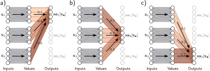
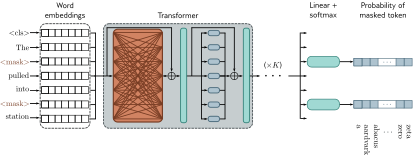

# 第十二章
# Transformer

第十章介绍了卷积网络，它专门用于处理位于规则网格上的数据。它们特别适用于处理图像，因为图像的输入变量数量非常庞大，这使得全连接网络的使用变得不切实际。卷积网络的每一层都采用参数共享，以便在图像的每个位置上都能类似地处理局部图像块。

本章介绍 Transformer。它最初是为自然语言处理（NLP）问题设计的，在这类问题中，网络输入是一系列代表单词或词片段的高维嵌入。语言数据集与图像数据有一些共同的特征：输入变量的数量可能非常大，并且每个位置的统计特性是相似的；在一篇文本中，为单词“狗”在每个可能的位置上都重新学习其含义是不合理的。然而，语言数据集有一个复杂之处，即文本序列的长度是可变的，而且不像图像那样，没有简单的方法可以调整它们的大小。

## 12.1 处理文本数据

为了引出 Transformer，我们来看下面这段话：
> The restaurant refused to serve me a ham sandwich because it only cooks vegetarian food. In the end, they just gave me two slices of bread. Their ambiance was just as good as the food and service.
> （这家餐厅拒绝为我提供火腿三明治，因为它只做素食。最后，他们只给了我两片面包。他们的氛围和食物、服务一样好。）

我们的目标是设计一个网络，将这段文本处理成一个适合下游任务的表示。例如，它可能被用来将这篇评论分类为正面或负面，或者用来回答诸如“这家餐厅提供牛排吗？”这样的问题。

我们可以立即得出三个观察。首先，编码后的输入可能会非常大。在这个例子中，37个单词中的每一个都可能由一个长度为1024的嵌入向量表示，因此即使是这段简短的文字，编码后的输入长度也会达到 $37 \times 1024 = 37888$。一个更现实的文本篇幅可能有数百甚至数千个单词，因此全连接神经网络是不切实际的。

其次，NLP问题的一个决定性特征是每个输入（一个或多个句子）的长度都不同；因此，如何应用全连接网络甚至都不明确。这些观察表明，网络应该在不同输入位置的单词之间共享参数，这与卷积网络在不同图像位置共享参数的方式类似。

第三，语言是模糊的；仅从句法上看，代词“it”指的是餐厅还是火腿三明治并不清楚。为了理解文本，单词“it”应该以某种方式与单词“restaurant”联系起来。用 Transformer 的行话来说，前一个词应该**关注 (pay attention to)** 后一个词。这意味着单词之间必须存在连接，并且这些连接的强度将取决于单词本身。此外，这些连接需要能够跨越很长的文本范围。例如，最后一句话中的单词“their”也指的是餐厅。

## 12.2 点积自注意力

上一节论证了处理文本的模型将 (i) 使用参数共享来应对不同长度的长输入段落，并且 (ii) 包含依赖于单词本身的词表示之间的连接。Transformer 通过使用**点积自注意力 (dot-product self-attention)** 来同时获得这两种特性。

一个标准的神经网络层 $f[\mathbf{x}]$，接收一个 $D \times 1$ 的输入 $\mathbf{x}$，并应用一个线性变换，然后是一个像ReLU这样的激活函数，所以：

$$
f[\mathbf{x}] = \text{ReLU}[\boldsymbol{\beta} + \mathbf{\Omega}\mathbf{x}],
\tag{12.1}
$$

其中 $\boldsymbol{\beta}$ 包含偏置，$\mathbf{\Omega}$ 包含权重。

一个**自注意力块 (self-attention block)** $\text{sa}[\cdot]$ 接收 $N$ 个输入 $\mathbf{x}_1, \dots, \mathbf{x}_N$，每个输入的维度都是 $D \times 1$，并返回 $N$ 个输出，每个输出的大小也是 $D \times 1$。在NLP的背景下，每个输入代表一个单词或词片段。首先，为每个输入计算一组**值 (values)**：

$$
\mathbf{v}_m = \boldsymbol{\beta}_v + \mathbf{\Omega}_v \mathbf{x}_m,
\tag{12.2}
$$

其中 $\boldsymbol{\beta}_v \in \mathbb{R}^{D \times 1}$ 和 $\mathbf{\Omega}_v \in \mathbb{R}^{D \times D}$ 分别代表偏置和权重。

然后，第 $n$ 个输出 $\text{sa}_n[\mathbf{x}_1, \dots, \mathbf{x}_N]$ 是所有值 $\mathbf{v}_1, \dots, \mathbf{v}_N$ 的加权和：

$$
\text{sa}_n[\mathbf{x}_1, \dots, \mathbf{x}_N] = \sum_{m=1}^N a[\mathbf{x}_m, \mathbf{x}_n] \mathbf{v}_m.
\tag{12.3}
$$

标量权重 $a[\mathbf{x}_m, \mathbf{x}_n]$ 是第 $n$ 个输出对输入 $\mathbf{x}_m$ 的**注意力 (attention)**。$N$ 个权重 $a[\cdot, \mathbf{x}_n]$ 是非负的，并且总和为一。因此，自注意力可以被看作是以不同比例**路由 (routing)** 值来创建每个输出（图12.1）。

以下各节将更详细地探讨点积自注意力。首先，我们考虑值的计算及其随后的加权（方程12.3）。然后我们描述如何计算注意力权重 $a[\mathbf{x}_m, \mathbf{x}_n]$ 本身。

---

> **图 12.1 作为路由的自注意力**
> 自注意力机制接收 $N$ 个输入 $\mathbf{x}_1, \dots, \mathbf{x}_N \in \mathbb{R}^D$（这里 $N=3, D=4$），并分别处理每个输入以计算 $N$ 个值向量。第 $n$ 个输出 $\text{sa}_n[\mathbf{x}_1, \dots, \mathbf{x}_N]$（简写为 $\text{sa}_n[\mathbf{x}_\cdot]$）然后被计算为 $N$ 个值向量的加权和，其中权重是正的且总和为一。a) 输出 $\text{sa}_1[\mathbf{x}_\cdot]$ 是由 $a[\mathbf{x}_1, \mathbf{x}_1]=0.1$ 乘以第一个值向量，$a[\mathbf{x}_2, \mathbf{x}_1]=0.3$ 乘以第二个值向量，以及 $a[\mathbf{x}_3, \mathbf{x}_1]=0.6$ 乘以第三个值向量计算得出的。b) 输出 $\text{sa}_2[\mathbf{x}_\cdot]$ 以同样的方式计算，但这次的权重是0.5, 0.2和0.3。c) 输出 $\text{sa}_3[\mathbf{x}_\cdot]$ 的权重又不同了。因此，每个输出可以被看作是 $N$ 个值的不同路由。

---

### 12.2.1 计算和加权值

方程12.2显示，相同的权重 $\mathbf{\Omega}_v \in \mathbb{R}^{D \times D}$ 和偏置 $\boldsymbol{\beta}_v \in \mathbb{R}^D$ 被应用于每个输入 $\mathbf{x}_\cdot \in \mathbb{R}^D$。这个计算与序列长度 $N$ 呈线性关系，因此它比一个关联所有 $DN$ 个输入到所有 $DN$ 个值的全连接网络需要更少的参数。实际上，值的计算可以被看作是一个带有共享参数的稀疏矩阵操作，它关联了这 $DN$ 个量（图12.2b）。

注意力权重 $a[\mathbf{x}_m, \mathbf{x}_n]$ 组合了来自不同输入的值。它们也是稀疏的，因为对于每对有序输入 $(\mathbf{x}_m, \mathbf{x}_n)$ 只有一个权重，而与这些输入的大小无关（图12.2c）。由此可知，注意力权重的数量与序列长度 $N$ 呈二次方关系，但与每个输入的长度 $D$ 无关。

---

> **图 12.2 $N=3$ 个输入、维度 $D=4$ 的自注意力**
> a) 每个输入 $\mathbf{x}_m$ 被相同的权重 $\mathbf{\Omega}_v$（相同颜色等于相同权重）和偏置 $\boldsymbol{\beta}_v$（未显示）独立操作，以形成值 $\boldsymbol{\beta}_v + \mathbf{\Omega}_v \mathbf{x}_m$。每个输出是值的线性组合，其中注意力权重 $a[\mathbf{x}_m, \mathbf{x}_n]$ 定义了第 $m$ 个值对第 $n$ 个输出的贡献。b) 显示输入和值之间线性变换 $\mathbf{\Omega}$ 的块稀疏性的矩阵。c) 显示关联值和输出的注意力权重的稀疏性的矩阵。

---

### 12.2.2 计算注意力权重

在上一节中，我们看到输出是由两个链式线性变换产生的；值向量 $\boldsymbol{\beta}_v + \mathbf{\Omega}_v \mathbf{x}_m$ 是为每个输入 $\mathbf{x}_m$ 独立计算的，这些向量由注意力权重 $a[\mathbf{x}_m, \mathbf{x}_n]$ 进行线性组合。然而，整个自注意力计算是**非线性的**。正如我们马上会看到的，注意力权重本身就是输入的非线性函数。这是一个**超网络 (hypernetwork)** 的例子，其中一个网络分支计算另一个分支的权重。为了计算注意力，我们对输入应用另外两个线性变换：

$$
\begin{aligned}
\mathbf{q}_n &= \boldsymbol{\beta}_q + \mathbf{\Omega}_q \mathbf{x}_n \\
\mathbf{k}_m &= \boldsymbol{\beta}_k + \mathbf{\Omega}_k \mathbf{x}_m,
\end{aligned}
\tag{12.4}
$$

其中 $\{\mathbf{q}_n\}$ 和 $\{\mathbf{k}_m\}$ 分别被称为**查询 (queries)** 和**键 (keys)**。然后我们计算查询和键之间的**点积 (dot products)**，并将结果通过一个softmax函数：参考：Appendix B.3.4 Dot product

$$
a[\mathbf{x}_m, \mathbf{x}_n] = \text{softmax}_m[\mathbf{k}_m^T \mathbf{q}_n] = \frac{\exp[\mathbf{k}_m^T \mathbf{q}_n]}{\sum_{m'=1}^N \exp[\mathbf{k}_{m'}^T \mathbf{q}_n]},
\tag{12.5}
$$

因此对于每个 $\mathbf{x}_n$，它们都是正的且总和为一（图12.3）。出于显而易见的原因，这被称为**点积自注意力**。

“查询”和“键”的名称继承自信息检索领域，并有以下解释：点积操作返回其输入之间的相似性度量，因此权重 $a[\mathbf{x}_\cdot, \mathbf{x}_n]$ 取决于第 $n$ 个查询与所有键之间的相对相似性。Softmax函数意味着键向量相互“竞争”以对最终结果做出贡献。查询和键必须具有相同的维度。然而，这些可以不同于值的维度，后者通常与输入的大小相同，因此表示不会改变大小。

---

> **图 12.3 计算注意力权重**
> a) 为每个输入 $\mathbf{x}_n$ 计算查询向量 $\mathbf{q}_n = \boldsymbol{\beta}_q + \mathbf{\Omega}_q \mathbf{x}_n$ 和键向量 $\mathbf{k}_n = \boldsymbol{\beta}_k + \mathbf{\Omega}_k \mathbf{x}_n$。b) 每个查询和三个键之间的点积通过一个softmax函数，以形成非负且总和为一的注意力。c) 这些注意力通过图12.2c中的稀疏矩阵来路由值向量（图12.1）。

---

### 12.2.3 自注意力总结

第 $n$ 个输出是应用于所有输入的相同线性变换 $\mathbf{v}_\cdot = \boldsymbol{\beta}_v + \mathbf{\Omega}_v \mathbf{x}_\cdot$ 的加权和，其中这些注意力权重是正的且总和为一。权重取决于输入 $\mathbf{x}_n$ 和其他输入之间的相似性度量。没有激活函数，但由于用于计算注意力权重的点积和softmax操作，该机制是非线性的。

请注意，这种机制满足了最初的要求。首先，有一组单一的共享参数 $\boldsymbol{\phi} = \{\boldsymbol{\beta}_v, \mathbf{\Omega}_v, \boldsymbol{\beta}_q, \mathbf{\Omega}_q, \boldsymbol{\beta}_k, \mathbf{\Omega}_k\}$。这与输入的数量 $N$ 无关，因此网络可以应用于不同长度的序列。其次，输入（单词）之间存在连接，这些连接的强度通过注意力权重取决于输入本身。参考：Problems 12.1-12.2

### 12.2.4 矩阵形式

如果 $N$ 个输入 $\mathbf{x}_n$ 构成一个 $D \times N$ 矩阵 $\mathbf{X}$ 的列，则上述计算可以以紧凑的形式写出。值、查询和键可以计算为：

$$
\begin{aligned}
\mathbf{V}[\mathbf{X}] &= \boldsymbol{\beta}_v \mathbf{1}^T + \mathbf{\Omega}_v \mathbf{X} \\
\mathbf{Q}[\mathbf{X}] &= \boldsymbol{\beta}_q \mathbf{1}^T + \mathbf{\Omega}_q \mathbf{X} \\
\mathbf{K}[\mathbf{X}] &= \boldsymbol{\beta}_k \mathbf{1}^T + \mathbf{\Omega}_k \mathbf{X},
\end{aligned}
\tag{12.6}
$$

其中 $\mathbf{1}$ 是一个包含1的 $N \times 1$ 向量。自注意力的输出（也就是 $Y$ 这里记作 $\text{Sa}[\mathbf{X}]$）的计算则为：

$$
\text{Sa}[\mathbf{X}] = \mathbf{V}[\mathbf{X}] \cdot \text{Softmax}[\mathbf{K}[\mathbf{X}]^T \mathbf{Q}[\mathbf{X}]],
\tag{12.7}
$$

其中函数 $\text{Softmax}[\cdot]$ 接收一个矩阵，并独立地对其每一列执行softmax操作（图12.4），这就是**注意力权重矩阵**。在这个公式中，我们明确地包含了值、查询和键对输入 $\mathbf{X}$ 的依赖性，以强调自注意力计算的是一种基于输入的三重积。然而，从现在开始，我们将省略这种依赖性，只写：

$$
\text{Sa}[\mathbf{X}] = \mathbf{V} \cdot \text{Softmax}[\mathbf{K}^T \mathbf{Q}].
\tag{12.8}
$$

> **比喻：** 将 Transformer 与 Google 来对比，$Q$ 可以比作用户的查询内容，$K$ 可以比作 Google 搜索引擎内部索引，$V$ 则比作索引对应的内容，如果我们要得到搜索结果，我们就需要应用 $\text{Softmax}[\mathbf{K}^T \mathbf{Q}]$ 得到搜索结果的排序列表，这就是注意力权重矩阵，然后将注意力应用到 $V$ 上面得到最终的结果 $\text{Sa}[\mathbf{X}]$。将该比喻类比到训练数据上就是 Transformer。

---

> **图 12.4 矩阵形式的自注意力**
> 如果我们将 $N$ 个输入向量 $\mathbf{x}_n$ 存储在 $D \times N$ 矩阵 $\mathbf{X}$ 的列中，自注意力可以被高效地实现。输入 $\mathbf{X}$ 被查询矩阵 $\mathbf{Q}$、键矩阵 $\mathbf{K}$ 和值矩阵 $\mathbf{V}$ 分别操作。然后通过矩阵乘法计算点积，并对结果矩阵的每一列独立应用softmax操作来计算注意力。最后，值后乘以注意力，以创建一个与输入大小相同的输出。

---

## 12.3 点积自注意力的扩展

在上一节中，我们描述了自注意力。在这里，我们介绍三种几乎总是在实践中使用的扩展。

### 12.3.1 位置编码

细心的读者会注意到，自注意力机制忽略了重要的信息：计算没有考虑输入 $\mathbf{x}_n$ 的顺序。更准确地说，它对输入置换是**等变的 (equivariant)**。然而，当输入对应于句子中的单词时，顺序很重要。句子“女人吃了浣熊”与“浣熊吃了女人”的含义不同。有两种主要方法来整合位置信息。

**绝对位置编码 (Absolute positional encodings)**：一个矩阵 $\mathbf{\Pi}$ 被加到输入 $\mathbf{X}$ 上，用于编码位置信息（图12.5）。$\mathbf{\Pi}$ 的每一列都是唯一的，因此包含了关于输入序列中绝对位置的信息。这个矩阵可以手动选择或学习得到。它可以被添加到网络输入或每个网络层。有时它在计算查询和键时被添加到 $\mathbf{X}$，但不在计算值时添加。参考：Problem 12.3

**相对位置编码 (Relative positional encodings)**：自注意力机制的输入可能是一个完整的句子、许多句子，或者只是一个句子的片段，单词的绝对位置远没有两个单词之间的相对位置重要。当然，如果系统知道两者的绝对位置，就可以恢复这个信息，但相对位置编码直接编码了这个信息。注意力矩阵的每个元素对应于键位置 $a$ 和查询位置 $b$ 之间的一个特定偏移。相对位置编码为每个偏移学习一个参数 $\pi_{a,b}$，并用它来修改注意力矩阵，通过加上这些值、乘以它们，或以其他方式改变注意力矩阵。

---

> **图 12.5 位置编码**
> 自注意力架构对输入的置换是等变的。为了确保不同位置的输入被不同地对待，一个位置编码矩阵 $\mathbf{\Pi}$ 可以被加到数据矩阵上。每一列都是不同的，因此可以区分这些位置。这里，位置编码使用一个预定义的程序化正弦模式（如果需要，可以扩展到更大的 $N$ 值）。然而，在其他情况下，它们是学习得到的。

---

### 12.3.2 缩放点积自注意力

注意力计算中的点积可能有很大的量级，并将softmax函数的参数移动到一个最大值完全占主导地位的区域。对softmax函数的输入的微小改变现在对输出影响很小（即梯度非常小），使得模型难以训练。为了防止这种情况，点积由查询和键的维度 $D_q$ 的平方根进行缩放（即 $\mathbf{\Omega}_q$ 和 $\mathbf{\Omega}_k$ 的行数，它们必须相同）：

$$
\text{Sa}[\mathbf{X}] = \mathbf{V} \cdot \text{Softmax}\left[\frac{\mathbf{K}^T \mathbf{Q}}{\sqrt{D_q}}\right].
\tag{12.9}
$$

这被称为**缩放点积自注意力 (scaled dot-product self-attention)**。参考：Problem 12.4

### 12.3.3 多头注意力

多个自注意力机制通常是并行应用的，这被称为**多头自注意力 (multi-head self-attention)**。现在计算 $H$ 组不同的值、键和查询：

$$
\begin{aligned}
\mathbf{V}_h &= \boldsymbol{\beta}_{vh} \mathbf{1}^T + \mathbf{\Omega}_{vh} \mathbf{X} \\
\mathbf{Q}_h &= \boldsymbol{\beta}_{qh} \mathbf{1}^T + \mathbf{\Omega}_{qh} \mathbf{X} \\
\mathbf{K}_h &= \boldsymbol{\beta}_{kh} \mathbf{1}^T + \mathbf{\Omega}_{kh} \mathbf{X}.
\end{aligned}
\tag{12.10}
$$

第 $h$ 个自注意力机制或**头 (head)** 可以写成：

$$
\text{Sa}_h[\mathbf{X}] = \mathbf{V}_h \cdot \text{Softmax}\left[\frac{\mathbf{K}_h^T \mathbf{Q}_h}{\sqrt{D_q}}\right],
\tag{12.11}
$$

其中我们为每个头都有不同的参数 $\{\boldsymbol{\beta}_{vh}, \mathbf{\Omega}_{vh}\}, \{\boldsymbol{\beta}_{qh}, \mathbf{\Omega}_{qh}\}, \{\boldsymbol{\beta}_{kh}, \mathbf{\Omega}_{kh}\}$。通常，如果输入 $\mathbf{x}_m$ 的维度是 $D$，并且有 $H$ 个头，那么值、查询和键都将是 $D/H$ 的大小，因为这允许高效的实现。这些自注意力机制的输出被垂直拼接起来，然后应用另一个线性变换 $\mathbf{\Omega}_c$ 来组合它们（图12.6）：参考：Problem 12.5

$$
\text{MhSa}[\mathbf{X}] = \mathbf{\Omega}_c \begin{bmatrix} \text{Sa}_1[\mathbf{X}]^T, \text{Sa}_2[\mathbf{X}]^T, \dots, \text{Sa}_H[\mathbf{X}]^T \end{bmatrix}^T.
\tag{12.12}
$$

多个头似乎对于使自注意力工作良好是必要的。据推测，它们使自注意力网络对不良初始化更具鲁棒性。参考：Notebook 12.2 Multi-head self-attention

---

> **图 12.6 多头自注意力**
> 自注意力在多个“头”之间并行发生。每个头都有自己的查询、键和值。这里描绘了两个头，分别在青色和橙色的框中。输出被垂直拼接，然后使用另一个线性变换 $\mathbf{\Omega}_c$ 来重新组合它们。

---

## 12.4 Transformer 层

自注意力只是一个更大的 **Transformer 层** 的一部分。它由一个多头自注意力单元（允许词表示相互交互）和紧随其后的一个全连接网络 $\text{mlp}[\mathbf{x}_\cdot]$（对每个词独立操作）组成。这两个单元都是残差网络（即，它们的输出被加回到原始输入）。此外，通常在自注意力和全连接网络之后都添加一个 **LayerNorm** 操作。这类似于 BatchNorm，但它独立地归一化每个批次元素中的每个嵌入，使用的是跨其 $D$ 个嵌入维度计算的统计数据（11.4节和图11.14）。完整的层可以由以下一系列操作来描述（图12.7）：

$$
\begin{aligned}
\mathbf{X} &\leftarrow \mathbf{X} + \text{MhSa}[\mathbf{X}] \\
\mathbf{X} &\leftarrow \text{LayerNorm}[\mathbf{X}] \\
\mathbf{x}_n &\leftarrow \mathbf{x}_n + \text{mlp}[\mathbf{x}_n] \quad \forall n \in \{1, \dots, N\} \\
\mathbf{X} &\leftarrow \text{LayerNorm}[\mathbf{X}],
\end{aligned}
\tag{12.13}
$$

其中列向量 $\mathbf{x}_n$ 是从完整数据矩阵 $\mathbf{X}$ 中分别取出的。在一个真实的网络中，数据会通过一系列这样的 Transformer 层。

---

> **图 12.7 Transformer 层**
> 输入是一个 $D \times N$ 的矩阵，包含 $N$ 个输入词元（token）的 $D$ 维词嵌入。输出是一个相同大小的矩阵。Transformer 层由一系列操作组成。首先，有一个多头注意力块，允许词嵌入相互交互。这形成了一个残差块的处理，因此输入被加回到输出。其次，一个LayerNorm操作被分别应用于每个嵌入。第三，有一个第二个残差层，其中相同的全连接神经网络被分别应用于 $N$ 个词表示（列）。最后，再次应用LayerNorm。

---

## 12.5 用于自然语言处理的 Transformer

上一节描述了 Transformer 层。本节描述了它如何被用于自然语言处理（NLP）任务。一个典型的NLP流程始于一个**分词器 (tokenizer)**，它将文本分割成单词或词片段。然后，这些词元中的每一个都被映射到一个学习到的嵌入。这些嵌入通过一系列的 Transformer 层传递。我们现在依次考虑这些阶段。

### 12.5.1 分词

一个文本处理流程始于一个**分词器**。这将文本从一个可能的词元**词汇表 (vocabulary)** 中分割成更小的组成单元（**词元**）。在上面的讨论中，我们暗示了这些词元代表单词，但有几个困难。
*   不可避免地，一些词（例如，名字）将不在词汇表中。
*   如何处理标点符号尚不清楚，但这很重要。如果一个句子以问号结尾，我们必须编码这个信息。
*   词汇表需要为具有不同后缀的同一单词的不同版本（例如，walk, walks, walked, walking）提供不同的词元，并且没有办法阐明这些变体是相关的。

一种方法是使用字母和标点符号作为词汇表，但这将意味着将文本分割成非常小的部分，并要求后续网络重新学习它们之间的关系。

在实践中，使用了字母和完整单词之间的一种折中方案，最终的词汇表包括常用词和可以用来组合成更大、更不常用词的词片段。词汇表是使用**子词分词器 (sub-word tokenizer)**（如**字节对编码 (byte pair encoding)**，图12.8）计算的，该分词器根据其频率贪婪地合并常见的子字符串。参考：Notebook 12.3 Tokenization

---

> **图 12.8 子词分词**
> a) 一段来自童谣的文本。词元最初只是字符和空白（由下划线表示），它们的频率显示在表格中。b) 在每次迭代中，子词分词器寻找最常出现的相邻词元对（在这种情况下是s和e）并合并它们。这会创建一个新的词元，并减少原始词元s和e的计数。请注意，要合并的第一个词元的最后一个字符不能是空白，这可以防止跨词合并。c) 在第二次迭代中，算法合并e和空白字符。d) 经过22次迭代，词元由字母、词片段和常用词的混合组成。e) 如果我们无限期地继续这个过程，词元最终将代表完整的单词。f) 随着时间的推移，当我们向字母中添加词片段时，词元的数量会增加，然后当我们合并这些片段时又会减少。在真实情况下，会有非常大量的单词，算法将在词汇量（词元数量）达到预定值时终止。标点符号和大写字母也将被视为单独的输入字符。

---

### 12.5.2 嵌入

词汇表 $\mathcal{V}$ 中的每个词元都被映射到一个唯一的词嵌入，整个词汇表的嵌入都存储在一个矩阵 $\mathbf{\Omega}_e \in \mathbb{R}^{D \times |\mathcal{V}|}$ 中。为了实现这一点，$N$ 个输入词元首先被编码在矩阵 $\mathbf{T} \in \mathbb{R}^{|\mathcal{V}| \times N}$ 中，其中第 $n$ 列对应于第 $n$ 个词元，并且是一个 $|\mathcal{V}| \times 1$ 的**独热向量 (one-hot vector)**（即，一个除了对应于该词元的条目为1外，所有条目都为零的向量）。输入嵌入被计算为 $\mathbf{X} = \mathbf{\Omega}_e \mathbf{T}$，并且 $\mathbf{\Omega}_e$ 像任何其他网络参数一样被学习（图12.9）。一个典型的嵌入大小 $D$ 是1024，一个典型的总词汇量大小 $|\mathcal{V}|$ 是30,000，因此即使在主网络之前，$\mathbf{\Omega}_e$ 中也有很多参数需要学习。

---

> **图 12.9 输入嵌入矩阵** $\mathbf{X} \in \mathbb{R}^{D \times N}$ 包含 $N$ 个长度为 $D$ 的嵌入，它是通过将一个包含整个词汇表嵌入的矩阵 $\mathbf{\Omega}_e$ 与一个在其列中包含与单词或子词索引相对应的独热向量的矩阵 $\mathbf{T}$ 相乘来创建的。词汇表矩阵 $\mathbf{\Omega}_e$ 被认为是模型的一个参数，并与其他参数一起学习。请注意，$\mathbf{X}$ 中单词“an”的两个嵌入是相同的。
> 
---

### 12.5.3 Transformer 模型

最后，代表文本的嵌入矩阵 $\mathbf{X}$ 通过一系列 $K$ 个 Transformer 层，称为 **Transformer 模型**。有三种类型的 Transformer 模型。**编码器 (encoder)** 将文本嵌入转换为可以支持各种任务的表示。**解码器 (decoder)** 预测下一个词元以继续输入。**编码器-解码器 (Encoder-decoders)** 用于序列到序列的任务，其中一个文本字符串被转换为另一个（例如，机器翻译）。这些变体将在12.6-12.8节中描述。

## 12.6 编码器模型示例：BERT

**BERT** 是一个编码器模型，它使用一个包含30,000个词元的词汇表。输入词元被转换为1024维的词嵌入，并通过24个 Transformer 层。每个层包含一个有16个头的自注意力机制。每个头的查询、键和值的维度都是64（即矩阵 $\mathbf{\Omega}_{vh}, \mathbf{\Omega}_{qh}, \mathbf{\Omega}_{kh}$ 是 $64 \times 1024$）。全连接网络中单个隐藏层的维度是4096。总参数数量约为3.4亿。在BERT被引入时，这被认为是很大的，但现在它比最先进的模型要小得多。

像BERT这样的编码器模型利用了**迁移学习 (transfer learning)**（9.3.6节）。在**预训练 (pre-training)** 期间，Transformer 架构的参数是使用来自大型文本语料库的**自监督 (self-supervision)** 学习的。这里的目标是让模型学习关于语言统计的通用信息。在**微调 (fine-tuning)** 阶段，得到的网络被用于使用较小的标记训练数据体来解决特定任务。

### 12.6.1 预训练

在预训练阶段，网络是使用自监督进行训练的。这允许使用海量数据而无需手动标签。对于BERT，自监督任务包括从大型互联网语料库的句子中预测缺失的单词（图12.10）。¹ 在训练期间，最大输入长度是512个词元，批次大小是256。该系统训练了一百万步，大约相当于对33亿词语料库的50个周期。参考：Problem 12.6

预测缺失的单词迫使 Transformer 网络理解一些句法。例如，它可能会学到形容词“red”经常出现在像“house”或“car”这样的名词之前，但从不出现在像“shout”这样的动词之前。它还允许模型学习关于世界的一些肤浅的常识。例如，在训练后，模型会为句子“The <mask> pulled into the station”中缺失的单词“train”分配比单词“peanut”更高的概率。然而，这类模型能够拥有的“理解”程度是有限的。

> ¹BERT还使用一个次要任务来预测两个句子在文本中是否最初是相邻的，但这仅略微提高了性能。

---

> **图 12.10 BERT类编码器的预训练**
> 输入词元（以及一个表示序列开始的特殊 `<cls>` 词元）被转换为词嵌入。在这里，这些被表示为行而不是列，因此标记为“word embeddings”的框是 $\mathbf{X}^T$。这些嵌入通过一系列 Transformer 层（橙色连接表示每个词元都关注这些层中的每个其他词元）来创建一组输出嵌入。输入词元的一小部分被随机替换为一个通用的 `<mask>` 词元。在预训练中，目标是从相关的输出嵌入中预测缺失的单词。为此，与掩码词元相对应的输出通过softmax函数，并对每个函数应用一个多类别分类损失（5.24节）。这个任务的优点是它同时使用左右上下文来预测缺失的单词，但缺点是它没有有效地利用数据；在这里，需要处理七个词元才能向损失函数添加两项。

---

### 12.6.2 微调

在微调阶段，模型参数被调整以使网络专门用于特定任务。一个额外的层被附加到 Transformer 网络上，以将输出向量转换为所需的输出格式。例子包括：

**文本分类 (Text classification)**：在BERT中，一个被称为分类或 `<cls>` 的特殊词元在预训练期间被放置在每个字符串的开头。对于像**情感分析 (sentiment analysis)** 这样的文本分类任务（其中段落被标记为具有正面或负面情绪），与 `<cls>` 词元相关联的向量被映射到一个单一的数字，并通过一个 logistic sigmoid 函数（图12.11a）。这贡献了一个标准的二元交叉熵损失（5.4节）。

**词分类 (Word classification)**：**命名实体识别 (named entity recognition)** 的目标是将每个词分类为一个实体类型（例如，人、地点、组织或非实体）。为此，每个输入嵌入 $\mathbf{x}_m$ 被映射到一个 $E \times 1$ 的向量，其中 $E$ 个条目对应于 $E$ 个实体类型。这通过一个softmax函数来为每个类别创建概率，这贡献了一个多类别交叉熵损失（图12.11b）。

**文本段预测 (Text span prediction)**：在SQUAD 1.1问答任务中，问题和包含答案的维基百科段落被拼接并分词。然后使用BERT来预测段落中包含答案的文本段。每个词元映射到两个数字，指示文本段在该位置开始和结束的可能性。得到的两组数字通过两个softmax函数。任何文本段作为答案的可能性可以通过组合在适当位置开始和结束的概率来得出。

---

> **图 12.11 预训练后，编码器使用手动标记的数据进行微调以解决特定任务。**
> 通常，一个线性变换或一个多层感知器（MLP）被附加到编码器上以产生所需的任何输出。a) 示例文本分类任务。在这个情感分类任务中，`<cls>` 词元嵌入被用来预测评论是正面的概率。b) 示例词分类任务。在这个命名实体识别问题中，每个词的嵌入被用来预测该词是对应于一个人、地点、组织，还是不是一个实体。

---

## 12.7 解码器模型示例：GPT-3

本节对GPT-3（一个解码器模型的例子）进行了高层次的描述。其基本架构与编码器模型极其相似，包括一系列在学习到的词嵌入上操作的 Transformer 层。然而，目标是不同的。编码器旨在构建一个可以微调以解决各种更具体的NLP任务的文本表示。相反，解码器只有一个目的：在序列中生成下一个词元。它可以通过将扩展后的序列反馈回模型中来生成连贯的文本段落。

### 12.7.1 语言建模

GPT-3是一个**自回归语言模型 (autoregressive language model)**。通过一个具体的例子最容易理解。考虑句子“It takes great courage to let yourself appear weak.”。为简单起见，我们假设词元是完整的单词。整个句子的概率可以被分解为：

$$
\begin{aligned}
&\text{Pr(It takes great courage to let yourself appear weak)} = \\
&\quad \text{Pr(It)} \times \text{Pr(takes|It)} \times \text{Pr(great|It takes)} \times \text{Pr(courage|It takes great)} \times \\
&\quad \text{Pr(to|It takes great courage)} \times \text{Pr(let|It takes great courage to)} \times \\
&\quad \text{Pr(yourself|It takes great courage to let)} \times \\
&\quad \text{Pr(appear|It takes great courage to let yourself)} \times \\
&\quad \text{Pr(weak|It takes great courage to let yourself appear)}.
\end{aligned}
\tag{12.14}
$$

一个自回归模型预测每个词元在给定所有先前词元的情况下的条件分布 $\text{Pr}(t_n|t_1, \dots, t_{n-1})$，因此间接地计算了所有 $N$ 个词元的联合概率 $\text{Pr}(t_1, t_2, \dots, t_N)$：

$$
\text{Pr}(t_1, t_2, \dots, t_N) = \text{Pr}(t_1) \prod_{n=2}^N \text{Pr}(t_n|t_1, \dots, t_{n-1}).
\tag{12.15}
$$

自回归公式展示了最大化词元联合概率与下一个词元预测任务之间的联系。

### 12.7.2 掩码自注意力

为了训练一个解码器，我们寻求最大化输入文本在自回归模型下的对数概率的参数（即，最大化对数条件概率项的总和）。理想情况下，我们会传入整个句子，并在同一个前向传播中计算所有的对数概率和梯度，而不是为句子中的每个词元都做一次前向传播。然而，如果我们传入完整的句子，计算 $\log[\text{Pr}(\text{great}|\text{It takes})]$ 的项将同时接触到答案“great”和右侧上下文“courage to let yourself appear weak”。因此，系统可以作弊而不是学习预测接下来的单词，将无法正确训练。

幸运的是，词元只在 Transformer 网络的自注意力层中相互作用。因此，可以通过确保对答案和右侧上下文的注意力为零来解决这个问题。这可以通过在自注意力计算（方程12.5）中将相应的点积在通过 $\text{softmax}[\cdot]$ 函数之前设置为负无穷来实现。这被称为**掩码自注意力 (masked self-attention)**。其效果是使图12.1中所有向上倾斜的箭头的权重为零。

整个解码器网络的操作如下。输入文本被分词，词元被转换为嵌入。嵌入被传入 Transformer 网络，但现在 Transformer 层使用掩码自注意力，以便它们只能关注当前和之前的词元。每个输出嵌入都可以被认为是代表一个部分句子，对于每个句子，目标是预测序列中的下一个词元。因此，在 Transformer 层之后，一个单一的线性层将每个输出嵌入映射到词汇表的大小，然后是一个 $\text{softmax}[\cdot]$ 函数将这些值转换为概率。在训练期间，我们的目标是使用一个标准的多类别交叉熵损失，在每个位置上最大化真实序列中下一个词元的对数概率的总和（图12.12）。

### 12.7.3 从解码器生成文本

自回归语言模型是我们在这本书中讨论的第一个**生成模型 (generative model)** 的例子。由于它定义了文本序列上的一个概率模型，它可以被用来采样看似合理的新文本样本。为了从模型中生成，我们从一个输入的文本序列开始（可能只是一个表示序列开始的特殊 `<start>` 词元），并将其输入网络，然后网络输出可能的后续词元的概率。然后我们可以选择最可能的词元或从这个概率分布中采样。新的扩展序列可以被反馈回解码器网络，以产生下一个词元的概率分布。参考：Problem 12.7

通过重复这个过程，我们可以生成大量的文本。由于掩码自注意力的存在，先前的嵌入不依赖于后续的嵌入，因此计算可以变得相当高效。因此，当我们生成后续词元时，许多早期的计算可以被重用。

在实践中，许多策略可以使输出文本更连贯。例如，**集束搜索 (beam search)** 跟踪多个可能的句子补全，以找到整体上最可能的词序列（这不一定是通过在每一步贪婪地选择最可能的词来找到的）。**Top-k 采样**从仅有的前K个最可能的可能性中随机抽取下一个词，以防止系统意外地从低概率词元的长尾中选择，并导致不必要的语言死胡同。参考：Notebook 12.4 Decoding strategies

---

> **图 12.12 训练GPT-3类型的解码器网络**
> 词元被映射到词嵌入，并在序列的开头有一个特殊的 `<start>` 词元。嵌入通过一系列使用掩码自注意力的 Transformer 层。在这里，句子中的每个位置只能关注其自身的嵌入以及序列中较早的词元的嵌入（橙色连接）。每个位置的目标是最大化序列中下一个真实词元的概率。换句话说，在位置一，我们想最大化词元“It”的概率；在位置二，我们想最大化词元“takes”的概率；依此类推。掩码自注意力确保系统不能通过查看后续输入来作弊。自回归任务的优点是它有效地利用了数据，因为每个词都对损失函数贡献了一个项。然而，它只利用了每个词的左侧上下文。

---

### 12.7.4 GPT-3 和少样本学习

像GPT-3这样的大型语言模型在极大的规模上应用了这些思想。在GPT-3中，序列长度是2048个词元，总批次大小是320万个词元。有96个 Transformer 层（其中一些实现了稀疏版本的注意力），每个层处理一个大小为12288的词嵌入。自注意力中有96个头，值、查询和键的维度是128。它用3000亿个词元进行训练，并包含1750亿个参数。

这里有一个从GPT-3模型补全文本的例子，其中提供给模型的文本是橙色的，生成的文本是青色的：
> Understanding Deep Learning is a new textbook from MIT Press by Simon Prince that's designed to offer an accessible, broad introduction to the field. Deep learning is a branch of machine learning that is concerned with algorithms that learn from data that is unstructured or unlabeled. The book is divided into four sections:
> 1. Introduction to deep learning
> 2. Deep learning architecture
> 3. Deep learning algorithms
> 4. Applications of deep learning
>
> The first section offers an introduction to deep learning, including its history and origins. The second section covers deep learning architecture, discussing various types of neural networks and their applications. The third section dives into deep learning algorithms, including supervised and unsupervised learning, reinforcement learning, and more. The fourth section applies deep learning to various domains, such as computer vision, natural language processing, and robotics.

这个续写是看似合理的，尽管只是部分准确。

在这种规模上学习模型的一个令人惊讶的特性是，它们可以无需微调就能执行许多任务。如果我们提供几个正确的问答对的例子，然后再提一个问题，它们通常能通过补全序列来正确地回答最后一个问题。一个例子是纠正英语语法：

> **Poor English input:** I eated the purple berries.  
> **Good English output:** I ate the purple berries.  
> **Poor English input:** Thank you for picking me as your designer. I'd appreciate it.  
> **Good English output:** Thank you for choosing me as your designer. I appreciate it.  
> **Poor English input:** The mentioned changes have done. or I did the alteration that you requested. or I changed things you wanted and did the modifications.  
> **Good English output:** The requested changes have been made. or I made the alteration that you requested. or I changed things you wanted and made the modifications.  
> **Poor English input:** I'd be more than happy to work with you in another project.  
> **Good English output:** I'd be more than happy to work with you on another project.  
> （结果来自 Brown et al., 2020）

这里，包含配对例子的橙色文本是作为GPT-3的上下文提供的，然后系统生成了青色的正确答案。这种现象扩展到许多情况，包括基于自然语言描述生成代码片段、进行算术运算、在语言之间进行翻译，以及回答关于文本段落的问题。因此，有人认为，巨大的语言模型是**少样本学习者 (few-shot learners)**；它们可以基于仅仅几个例子来学习做新颖的任务。然而，在实践中性能是不稳定的，并且它在多大程度上是从学习到的例子中外推，而不仅仅是内插或逐字复制，尚不清楚。

## 12.8 编码器-解码器模型示例：机器翻译

语言之间的翻译是**序列到序列 (sequence-to-sequence)** 任务的一个例子。一种常见的方法是同时使用编码器（用于计算源句子的良好表示）和解码器（用于生成目标语言的句子）。这被恰当地称为**编码器-解码器模型**。

考虑从英语翻译到法语。编码器接收英语句子，并通过一系列 Transformer 层来为每个词元创建一个输出表示。在训练期间，解码器接收真实的法语翻译，并将其通过一系列使用掩码自注意力的 Transformer 层，并在每个位置预测下一个单词。然而，解码器层也关注编码器的输出。因此，每个法语输出词都以先前的输出词和源英语句子为条件（图12.13）。

这是通过修改解码器中的 Transformer 层来实现的。最初，这些层由一个掩码自注意力层和一个分别应用于每个嵌入的神经网络组成（图12.12）。在这两个组件之间添加了一个新的自注意力层，其中解码器嵌入关注编码器嵌入。这使用了一种被称为**编码器-解码器注意力 (encoder-decoder attention)** 或**交叉注意力 (cross-attention)** 的自注意力版本，其中查询是从解码器嵌入计算的，而键和值是从编码器嵌入计算的（图12.14）。

---

> **图 12.13 编码器-解码器架构**
> 两个句子被传入系统，目标是将第一个翻译成第二个。a) 第一个句子通过一个标准的编码器。b) 第二个句子通过一个使用掩码自注意力但也使用交叉注意力（橙色矩形）关注编码器输出嵌入的解码器。损失函数与解码器模型相同；我们希望最大化输出序列中下一个单词的概率。

> **图 12.14 交叉注意力**
> 计算流程与标准自注意力相同，但查询是从解码器嵌入 $\mathbf{X}_{dec}$ 计算的，而键和值是从编码器嵌入 $\mathbf{X}_{enc}$ 计算的。对于翻译任务，编码器包含关于源语言统计的信息，解码器包含关于目标语言统计的信息。

---

## 12.9 用于长序列的 Transformer

由于 Transformer 编码器模型中的每个词元都与每个其他词元相互作用，计算复杂度与序列长度呈二次方关系。对于解码器模型，每个词元只与之前的词元相互作用，因此交互次数大约减半，但复杂度仍然呈二次方关系。这些关系可以被可视化为交互矩阵（图12.15a-b）。

这种计算量的二次方增长最终限制了可以使用的序列的长度。已经开发了许多方法来扩展 Transformer 以应对更长的序列。一种方法是修剪自注意力交互，或者等效地，使交互矩阵稀疏化（图12.15c-h）。例如，这可以被限制为一种卷积结构，使得每个词元只与少数相邻的词元相互作用。跨越多层，随着感受野的扩大，词元仍然可以在更远的距离上相互作用。与图像中的卷积一样，核的大小和扩张率可以变化。

纯卷积方法需要许多层才能整合远距离的信息。加速这一过程的一种方法是允许选定的词元（可能在每个句子的开头）关注所有其他词元（编码器模型）或所有先前的词元（解码器模型）。一个类似的想法是拥有一小组全局词元，它们连接到所有其他词元以及它们自己。像 `<cls>` 词元一样，这些不代表任何单词，而是用于提供长距离连接。

---

> **图 12.15 自注意力的交互矩阵**
> a) 在一个编码器中，每个词元与每个其他词元相互作用，计算量随着词元数量的增加呈二次方增长。b) 在一个解码器中，每个词元只与之前的词元相互作用，但复杂度仍然是二次方的。c) 可以通过使用卷积结构（编码器情况）来降低复杂度。d) 解码器情况的卷积结构。e-f) 扩张率为2和3的卷积结构（解码器情况）。g) 另一种策略是允许选定的词元与所有其他词元（编码器情况）或所有先前的词元（解码器情况，如图）相互作用。h) 或者，可以引入全局词元（左两列和上两行）。这些与所有词元以及它们自己相互作用。

---

## 12.10 用于图像的 Transformer

Transformer 最初是为文本数据开发的。它们在这一领域的巨大成功导致了在图像上的实验。这对于两个原因来说，并非一个明显有前途的想法。首先，图像中的像素远多于句子中的单词，因此自注意力的二次方复杂度构成了一个实际的瓶颈。其次，卷积网络具有良好的**归纳偏置 (inductive bias)**，因为每一层都对空间平移是等变的，并且考虑了图像的二维结构。然而，这必须在 Transformer 网络中学习。

尽管存在这些明显的缺点，用于图像的 Transformer 网络现在已经在图像分类和其他任务上超越了卷积网络的性能。这部分是由于它们可以被构建的巨大规模，以及可以用来预训练网络的大量数据。本节描述了用于图像的 Transformer 模型。

### 12.10.1 ImageGPT

**ImageGPT** 是一个 Transformer 解码器；它构建了一个图像像素的自回归模型，该模型接收部分图像并预测后续的像素值。Transformer 网络的二次方复杂度意味着最大的模型（包含68亿个参数）仍然只能在 $64 \times 64$ 的图像上操作。此外，为了使其易于处理，原始的24位RGB颜色空间必须被量化为一个九位的颜色空间，因此系统在每个位置接收（并预测）512个可能的词元之一。

图像是天然的二维对象，但ImageGPT只是在每个像素处学习一个不同的位置编码。因此，它必须学习到每个像素与其前面的邻居以及上面一行中附近的像素有密切的关系。图12.16显示了示例生成结果。

这个解码器的内部表示被用作图像分类的基础。每个像素的最终嵌入被平均，一个线性层将这些值映射到激活值，这些激活值通过一个softmax层来预测类别概率。该系统在一个大型的网络图像语料库上进行预训练，然后在使用一个既包含图像分类的交叉熵项又包含预测像素的生成损失项的损失函数，在调整为 $48 \times 48$ 像素的ImageNet数据库上进行微调。尽管使用了大量的外部训练数据，该系统在ImageNet上仅取得了27.4%的top-1错误率（图10.15）。这比当时的卷积架构要差（见图10.21），但考虑到输入图像尺寸很小，这仍然是令人印象深刻的；毫不奇怪，当目标对象很小或很薄时，它会失败。

---

> **图 12.16 ImageGPT**
> a) 从自回归ImageGPT模型生成的图像。左上角的像素是从该位置的估计经验分布中抽取的。后续的像素依次生成，以之前的像素为条件，沿着行工作直到图像的右下角。对于每个像素，Transformer解码器生成一个如方程12.15的条件分布，并从中抽取一个样本。然后扩展后的序列被反馈回网络以生成下一个像素，依此类推。b) 图像补全。在每种情况下，图像的下半部分被移除（顶行），ImageGPT逐像素地补全剩余的部分（显示了三种不同的补全）。改编自 https://openai.com/blog/image-gpt/。
---

### 12.10.2 Vision Transformer (ViT)

**Vision Transformer** 通过将图像分割成 $16 \times 16$ 的**块 (patches)** 来解决图像分辨率的问题（图12.17）。每个块通过一个学习到的线性变换映射到一个输入嵌入，这些表示被输入到 Transformer 网络中。再次，学习了标准的1D位置编码。

这是一个带有 `<cls>` 词元的编码器模型（见图12.10-12.11）。然而，与BERT不同，它在一个包含来自18,000个类别的3.03亿张标记图像的大型数据库上使用**监督预训练**。`<cls>` 词元通过一个最终的网络层映射以创建激活值，这些激活值被输入到一个softmax函数来生成类别概率。在预训练之后，系统通过替换这个最终层为一个映射到所需类别数量的层，并进行微调，来应用于最终的分类任务。参考：Problem 12.8

对于ImageNet基准测试，该系统取得了11.45%的top-1错误率。然而，在没有监督预训练的情况下，它的表现不如当时最好的卷积网络。卷积网络的强归纳偏置只能通过使用极其大量的训练数据来超越。

---

> **图 12.17 Vision Transformer (ViT)**
> Vision Transformer (ViT) 将图像分解成一个块的网格（在原始实现中是 $16 \times 16$）。每个块通过一个学习到的线性变换被投射成一个块嵌入。这些块嵌入被输入到一个 Transformer 编码器网络中，`<cls>` 词元被用来预测类别概率。

---

### 12.10.3 多尺度视觉 Transformer

Vision Transformer 与卷积架构的不同之处在于，它在单一尺度上操作，并且具有覆盖整个图像的感受野。已经提出了几种在多个尺度上处理图像的 Transformer 模型。与卷积网络类似，这些通常从小的、高分辨率的块和少数通道开始，并逐渐扩大感受野，降低空间分辨率并增加通道数（嵌入维度）。

一个代表性的多尺度 Transformer 的例子是**移位窗口 (shifted-window)** 或 **SWin Transformer**。这是一个编码器 Transformer，它将图像分割成块，并将这些块分组到一个窗口网格中，在其中独立应用自注意力（图12.18）。这些窗口在相邻的 Transformer 中被移位，因此给定块的有效感受野可以扩展到窗口边界之外。

尺度通过周期性地拼接来自不重叠的 $2 \times 2$ 块的特征，并应用一个线性变换将这些拼接的特征映射到原始通道数的两倍来降低。这种架构没有 `<cls>` 词元，而是在最后一层平均输出特征。然后这些特征通过一个线性层映射到所需的类别数量，并经过一个softmax函数输出类别概率。在撰写本文时，这种架构最复杂的版本在ImageNet数据库上取得了9.89%的top-1错误率。参考：Problem 12.9

一个相关的想法是周期性地整合来自整个图像的信息。**双注意力视觉 Transformer (Dual attention vision transformers, DaViT)** 交替使用两种类型的 Transformer。在第一种中，图像块相互关注，自注意力计算使用所有通道。在第二种中，通道相互关注，自注意力计算使用所有图像块。这种架构在ImageNet上达到了9.60%的top-1错误率，在撰写本文时接近最先进水平。

---

> **图 12.18 移位窗口 (SWin) Transformer**
> (Liu et al., 2021c)。a) 原始图像。b) SWin Transformer 将图像分解成一个窗口网格，每个窗口又分成一个块的子网格。Transformer 网络在每个窗口内独立地对块应用自注意力（即，块只关注同一窗口内的其他块）。c) 每个交替的层都会移动窗口，以便相互作用的块的子集发生变化，信息可以传播到整个图像。d) 经过几层后，$2 \times 2$ 的块表示被拼接以增加有效的块（和窗口）大小。e) 在这个新的较低分辨率下，交替的层使用移位的窗口。f) 最终，分辨率变得只有一个窗口，块跨越整个图像。

---

### 12.11 总结

本章介绍了自注意力和 Transformer 架构。然后描述了编码器、解码器和编码器-解码器模型。Transformer 在高维嵌入集上操作。它每层的计算复杂度较低，并且大部分计算可以以矩阵形式并行执行。由于每个输入嵌入都与每个其他嵌入相互作用，它可以描述文本中的长程依赖关系。最终，计算复杂度与序列长度呈二次方关系；降低复杂度的一种方法是使交互矩阵稀疏化。

使用非常大的未标记数据集训练 Transformer 是本书中**无监督学习**（无标签学习）的第一个例子。编码器通过预测缺失的词元来学习一个可以用于其他任务的表示。解码器在输入上构建一个自回归模型，是本书中**生成模型**的第一个例子。生成解码器可用于创建新的数据样本。

第13章考虑了用于处理图数据的网络。这些与 Transformer 有联系，因为图的节点在每个网络层中相互关注。第14-18章回到无监督学习和生成模型。

### 注释

**自然语言处理 (Natural language processing)**：Transformer 是为自然语言处理（NLP）任务开发的。这是一个涉及文本分析、分类、生成和操作的巨大领域。示例任务包括词性标注、翻译、文本分类、实体识别（人、地点、公司等）、文本摘要、问答、词义消歧和文档聚类。NLP最初是通过利用语法结构和统计的基于规则的方法来解决的。早期方法请参见 Manning & Schutze (1999) 和 Jurafsky & Martin (2000)。

**循环神经网络 (Recurrent neural networks)**：在 Transformer 引入之前，许多最先进的NLP应用都使用循环神经网络，简称RNNs（图12.19）。“循环”一词由 Rumelhart et al. (1985) 引入，但其主要思想至少可以追溯到 Minsky & Papert (1969)。RNNs一次一个地接收一个输入序列（在NLP中是单词）。在每一步，网络都接收新的输入和从上一个时间步计算出的隐藏表示（循环连接）。最终的输出包含关于整个输入的信息。这个表示可以支持像分类或翻译这样的NLP任务。它们也被用在解码环境中，生成的词元被反馈回模型以形成序列的下一个输入。例如，PixelRNN (Van den Oord et al., 2016c) 使用RNNs构建了图像的自回归模型。

**从RNNs到Transformers**：RNNs的一个问题是它们可能会忘记序列中较早的信息。该架构的更复杂版本，如**长短期记忆网络 (long short-term memory networks)** 或 **LSTMs** (Hochreiter & Schmidhuber, 1997b) 和**门控循环单元 (gated recurrent units)** 或 **GRUs** (Cho et al., 2014; Chung et al., 2014) 部分解决了这个问题。然而，在机器翻译中，出现了一种想法，即RNN中的所有中间表示都可以被用来产生输出句子。此外，某些输出词应该根据它们的关系更多地关注某些输入词 (Bahdanau et al., 2015)。这最终导致了放弃循环结构，并用编码器-解码器 Transformer (Vaswani et al., 2017) 取代它。在这里，输入词元相互关注（自注意力），输出词元关注序列中较早的词元（掩码自注意力），输出词元也关注输入词元（交叉注意力）。Transformer 的正式算法描述可以在 Phuong & Hutter (2022) 中找到，相关工作的综述可以在 Lin et al. (2022) 中找到。文献应该谨慎对待，因为许多对 Transformer 的增强在仔细评估的对照实验中并没有带来有意义的性能提升 (Narang et al., 2021)。

---

> **图 12.19 循环神经网络 (RNNs)**
> 词嵌入按顺序通过一系列相同的神经网络。每个网络有两个输出；一个是输出嵌入，另一个（橙色箭头）与下一个词嵌入一起反馈到下一个神经网络。每个输出嵌入包含关于单词本身及其在前面句子片段中上下文的信息。原则上，最终的输出包含关于整个句子的信息，并且可以像 Transformer 编码器模型中的 `<cls>` 词元一样支持分类任务。然而，RNNs有时会逐渐“忘记”时间上更靠前的词元。

---

**应用 (Applications)**：基于自注意力和/或 Transformer 架构的模型已被应用于文本序列 (Vaswani et al., 2017)、图像块 (Dosovitskiy et al., 2021)、蛋白质序列 (Rives et al., 2021)、图 (Veličković et al., 2019)、数据库模式 (Xu et al., 2021b)、语音 (Wang et al., 2020c)、当表述为翻译问题时的数学积分 (Lample & Charton, 2020) 和时间序列 (Wu et al., 2020b)。然而，它们最著名的成功是在构建语言模型方面，以及最近，作为计算机视觉中卷积网络的替代品。

**大型语言模型 (Large language models)**：Vaswani et al. (2017) 针对翻译任务，但 Transformer 现在更常用于构建纯编码器或纯解码器模型，其中最著名的是BERT (Devlin et al., 2019) 和 GPT-2/GPT-3 (Radford et al., 2019; Brown et al., 2020)。这些模型通常针对像GLUE (Wang et al., 2019b)（包括12.6.2节中描述的SQUAD问答任务 (Rajpurkar et al., 2016)）、SuperGLUE (Wang et al., 2019a) 和 BIG-bench (Srivastava et al., 2022) 这样的基准进行测试，这些基准结合了许多NLP任务来创建一个衡量语言能力的综合得分。解码器模型通常不针对这些任务进行微调，但在给定一些问答示例并被要求从下一个问题开始补全文本时，仍然可以表现得很好。这被称为**少样本学习 (few-shot learning)** (Brown et al., 2020)。
自GPT-3以来，许多解码器语言模型已经发布，在少样本结果上取得了稳步的改进。这些包括GLaM (Du et al., 2022)、Gopher (Rae et al., 2021)、Chinchilla (Hoffmann et al., 2023)、Megatron-Turing NLG (Smith et al., 2022) 和LaMDa (Thoppilan et al., 2022)。大部分性能提升归因于增加的模型大小、使用稀疏激活的模块和利用更大的数据集。在撰写本文时，最新的模型是PaLM (Chowdhery et al., 2022)，它有5400亿个参数，并在6144个处理器上用7800亿个词元进行了训练。有趣的是，由于文本是高度可压缩的，这个模型有足够的容量来记住整个训练数据集。这对于许多语言模型都是如此。关于大型语言模型超越人类性能的许多大胆声明已经被做出。这对于某些任务可能是真的，但这样的声明应该谨慎对待（参见 Ribeiro et al., 2021; McCoy et al., 2019; Bowman & Dahl, 2021; 和 Dehghani et al., 2021）。
这些模型具有相当的世界知识。例如，在12.7.4节中，模型知道关于深度学习的关键事实，包括它是一种机器学习，有相关的算法和应用。实际上，这样一个模型曾被错误地认定为有感知能力 (Clark, 2022)。然而，有说服力的论点认为，这类模型能够拥有的“理解”程度是有限的 (Bender & Koller, 2020)。

**分词器 (Tokenizers)**：Schuster & Nakajima (2012) 和 Sennrich et al. (2015) 分别引入了WordPiece和字节对编码（BPE）。这两种方法都根据它们的邻接频率贪婪地合并词元对（图12.8），主要区别在于初始词元是如何选择的。例如，在BPE中，初始词元是字符或标点符号，并有一个特殊的词元来表示空白。合并不能跨越空白。随着算法的进行，通过递归地组合字符形成新的词元，从而出现子词和词词元。一元语言模型 (The unigram language model) (Kudo, 2018) 生成几种可能的候选合并，并根据语言模型中的可能性选择最好的一个。Provilkov et al. (2020) 开发了BPE dropout，通过在计数频率的过程中引入随机性来更有效地生成候选。字节对编码和一元语言模型的版本都包含在SentencePiece库 (Kudo & Richardson, 2018) 中，它直接在Unicode字符上工作，可以与任何语言一起使用。He et al. (2020) 引入了一种方法，将子词分割视为一个潜在变量，应该在学习和推理中被边缘化掉。

**解码算法 (Decoding algorithms)**：Transformer 解码器模型接收一段文本并返回下一个词元的概率。然后这被添加到前面的文本中，模型再次运行。从这些概率分布中选择词元的过程被称为解码。简单的方法是 (i) 贪婪地选择最可能的词元或 (ii) 根据分布随机选择一个词元。然而，这两种方法在实践中都效果不佳。在前一种情况下，结果可能非常通用，后一种情况可能导致质量下降的输出 (Holtzman et al., 2020)。这部分是因为，在训练期间，模型只接触到真实词元的序列（称为**教师强制 (teacher forcing)**），但在部署时却看到自己的输出。
尝试输出序列中所有词元的组合在计算上是不可行的，但可以维护固定数量的并行假设并选择最可能的整体序列。这被称为**集束搜索 (beam search)**。集束搜索倾向于产生许多相似的假设，并已被修改以研究更多样化的序列 (Vijayakumar et al., 2016; Kulikov et al., 2018)。随机抽样的一个可能问题是，有一个非常长的、不太可能的后续单词的长尾，它们共同拥有显著的概率。这导致了**top-K采样 (top-K sampling)** 的发展，其中词元仅从K个最可能的假设中采样 (Fan et al., 2018)。当只有少数高概率选择时，Top-K采样有时仍然允许不合理的词元选择。为了解决这个问题，Holtzman et al. (2020) 提出了**核心采样 (nucleus sampling)**，其中词元从总概率质量的固定比例中采样。El Asri & Prince (2020) 更深入地讨论了解码算法。

**注意力类型 (Types of attention)**：缩放点积注意力 (Vaswani et al., 2017) 只是注意力机制家族中的一种，还包括加性注意力 (additive attention) (Bahdanau et al., 2015)、乘性注意力 (multiplicative attention) (Luong et al., 2015)、键值注意力 (key-value attention) (Daniluk et al., 2017) 和内存压缩注意力 (memory-compressed attention) (Liu et al., 2019c)。Zhai et al. (2021) 构建了“无注意力”的 Transformer，其中词元以一种不具有二次方复杂度的方式相互作用。多头注意力也由 Vaswani et al. (2017) 引入。有趣的是，似乎大多数头在训练后可以被修剪而不会严重影响性能 (Voita et al., 2019)；有人认为它们的作用是防止不良初始化。Hu et al. (2018b) 提出了**挤压-激励网络 (squeeze-and-excitation networks)**，这是一种类似注意力的机制，它根据全局计算的特征重新加权卷积层中的通道。

**自注意力与其他模型的关系 (Relationship of self-attention to other models)**：自注意力计算与其他模型有密切的联系。首先，它是超网络 (Ha et al., 2017) 的一个例子，因为它使用网络的一部分来选择另一部分的权重：注意力矩阵构成了将值映射到输出的稀疏网络层的权重（图12.3）。**合成器 (synthesizer)** (Tay et al., 2021) 通过使用一个神经网络从相应的输入嵌入创建注意力矩阵的每一行来简化这个想法。即使输入词元不再相互作用来创建注意力权重，这仍然出人意料地有效。Wu et al. (2019) 提出了一个类似的系统，它产生一个具有卷积结构的注意力矩阵，因此词元关注它们的邻居。**门控多层感知器 (gated multi-layer perceptron)** (Wu et al., 2019) 计算一个逐点乘以值的矩阵，因此在不混合它们的情况下修改它们。Transformer 也与快速权重记忆系统密切相关，后者是超网络的思想先驱 (Schlag et al., 2021)。
自注意力也可以被认为是路由机制（图12.1），从这个角度来看，它与**胶囊网络 (capsule networks)** (Sabour et al., 2017) 有联系。这些网络捕捉图像中的层次关系；较低的网络级别可能检测面部部分（鼻子、嘴巴），然后这些部分在代表脸部的更高级别的胶囊中被组合（路由）。然而，胶囊网络使用**一致性路由 (routing by agreement)**。在自注意力中，输入相互竞争，看它们对给定输出贡献多少（通过softmax操作）。在胶囊网络中，该层的输出相互竞争，以获取来自较早层的输入。一旦我们将自注意力视为路由网络，我们就可以质疑使这种路由动态（即依赖于数据）是否必要。**随机合成器 (random synthesizer)** (Tay et al., 2021) 完全移除了注意力矩阵对输入的依赖，并要么使用预定的随机值，要么使用学习到的值。这在各种任务中都表现得出人意料地好。
多头自注意力也与图神经网络（第13章）、卷积 (Cordonnier et al., 2020)、循环神经网络 (Choromanski et al., 2020) 和Hopfield网络中的记忆检索 (Ramsauer et al., 2021) 有密切的联系。有关 Transformer 和其他模型之间关系的更多信息，请咨询 Prince (2021a)。

**位置编码 (Positional encoding)**：最初的 Transformer 论文 (Vaswani et al., 2017) 实验了预定义位置编码矩阵 $\mathbf{\Pi}$ 和学习位置编码 $\mathbf{\Pi}$。将位置编码添加到 $D \times N$ 的数据矩阵 $\mathbf{X}$ 而不是拼接它们，可能看起来很奇怪。然而，数据维度 $D$ 通常大于词元数量 $N$，因此位置编码位于一个子空间中。$\mathbf{X}$ 中的词嵌入是学习得到的，所以系统理论上可以将两个组件保持在正交的子空间中，并根据需要检索位置编码。Vaswani et al. (2017) 选择的预定义嵌入是一族具有两个吸引人特性的正弦分量：(i) 使用线性操作很容易恢复两个嵌入的相对位置，并且 (ii) 它们的点积通常随着位置之间距离的增加而减小（更多细节见 Prince, 2021a）。许多系统，如GPT-3和BERT，都学习位置编码。Wang et al. (2020a) 检查了这些模型中位置编码的余弦相似性，并表明它们通常随相对距离的减小而减小，尽管它们也有一个周期性分量。
许多后续工作修改了注意力矩阵，以便在缩放点积自注意力方程中：
$$
\text{Sa}[\mathbf{X}] = \mathbf{V} \cdot \text{Softmax}\left[\frac{\mathbf{K}^T \mathbf{Q}}{\sqrt{D_q}}\right],
\tag{12.16}
$$
只有查询和键包含位置信息：
$$
\begin{aligned}
\mathbf{V} &= \boldsymbol{\beta}_v \mathbf{1}^T + \mathbf{\Omega}_v \mathbf{X} \\
\mathbf{Q} &= \boldsymbol{\beta}_q \mathbf{1}^T + \mathbf{\Omega}_q (\mathbf{X} + \mathbf{\Pi}) \\
\mathbf{K} &= \boldsymbol{\beta}_k \mathbf{1}^T + \mathbf{\Omega}_k (\mathbf{X} + \mathbf{\Pi}).
\end{aligned}
\tag{12.17}
$$
这导致了将方程12.16分子中的二次方分量展开并只保留其中一些项的想法。例如，Ke et al. (2021) 通过只保留内容-内容和位置-位置项，并为每个项使用不同的投影矩阵 $\mathbf{\Omega}_\cdot$，来**解耦 (decouple)** 或**解开 (untie)** 内容和位置信息。
另一个修改是直接注入关于相对位置的信息。这比绝对位置更重要，因为一批文本可以从文档中的任意位置开始。Shaw et al. (2018), Raffel et al. (2020), 和 Huang et al. (2020b) 都开发了系统，其中为每个相对位置偏移学习一个单一的项，并使用这些相对位置编码以各种方式修改注意力矩阵。Wei et al. (2019) 研究了基于预定义正弦嵌入而不是学习值的相对位置编码。DeBERTa (He et al., 2021) 结合了这些想法；它们只保留了二次方展开中的一部分项，对它们应用不同的投影矩阵，并使用相对位置编码。其他工作探索了以更复杂的方式编码绝对和相对位置信息的正弦嵌入 (Su et al., 2021)。
Wang et al. (2020a) 比较了BERT中不同位置编码的 Transformer 的性能。他们发现相对位置编码比绝对位置编码表现得更好，但使用正弦和学习嵌入之间几乎没有区别。关于位置编码的综述可以在 Dufter et al. (2021) 中找到。

**将 Transformer 扩展到更长的序列 (Extending transformers to longer sequences)**：自注意力机制的复杂度与序列长度呈二次方关系。一些任务如摘要或问答可能需要长输入，因此这种二次方依赖性限制了性能。已经有三类工作试图解决这个问题。第一类减小注意力矩阵的大小，第二类使注意力稀疏，第三类修改注意力机制使其更高效。
为了减小注意力矩阵的大小，Liu et al. (2018b) 引入了**内存压缩注意力 (memory-compressed attention)**。这对键和值应用了跨步卷积，这以一种与卷积网络中下采样非常相似的方式减少了位置的数量。现在注意力在相邻位置的加权组合之间应用，其中权重是学习得到的。沿着类似的思路，Wang et al. (2020b) 观察到注意力机制中的量在实践中通常是低秩的，并开发了**LinFormer**，它在计算注意力矩阵之前将键和值投影到一个更小的子空间。
为了使注意力稀疏，Liu et al. (2018b) 提出了**局部注意力 (local attention)**，其中相邻的词元块只相互关注。这创建了一个块对角交互矩阵（见图12.15）。信息不能在块之间传递，因此这样的层通常与全注意力交替。沿着类似的思路，GPT-3 (Brown et al., 2020) 使用一个卷积交互矩阵，并与全注意力交替。Child et al. (2019) 和 Beltagy et al. (2020) 实验了各种交互矩阵，包括具有不同扩张率的卷积结构，但允许一些查询与所有其他键相互作用。Ainslie et al. (2020) 引入了**扩展 Transformer 构造 (extended transformer construction)**（图12.15h），它使用一组与所有其他词元相互作用的全局嵌入。这只能在编码器版本中完成，否则这些会隐式地允许系统“向前看”。当与相对位置编码结合时，该方案需要特殊的编码来映射到、来自以及在这些全局嵌入之间。**BigBird** (Ainslie et al., 2020) 结合了全局嵌入和卷积结构以及对可能连接的随机抽样。其他工作研究了学习注意力矩阵的稀疏模式 (Roy et al., 2021; Kitaev et al., 2020; Tay et al., 2020)。
最后，有人指出，计算注意力的softmax操作的分子和分母中的项具有 $\exp[\mathbf{k}^T \mathbf{q}]$ 的形式。这可以被视为一个核函数，因此可以表示为点积 $\mathbf{g}[\mathbf{k}]^T \mathbf{g}[\mathbf{q}]$，其中 $\mathbf{g}[\cdot]$ 是一个非线性变换。这种公式解耦了查询和键，使得注意力计算更高效。不幸的是，为了复制指数项的形式，变换 $\mathbf{g}[\cdot]$ 必须将输入映射到无限空间。**线性 Transformer** (Katharopoulos et al., 2020) 认识到这一点，并用不同的相似性度量取代了指数项。**Performer** (Choromanski et al., 2020) 用一个有限维的来近似这个无限的映射。有关将 Transformer 扩展到更长序列的更多细节，可以在 Tay et al. (2023) 和 Prince (2021a) 中找到。

**训练 Transformer (Training transformers)**：训练 Transformer 具有挑战性，需要学习率预热 (Goyal et al., 2018) 和Adam (Kingma & Ba, 2015)。实际上，Xiong et al. (2020a) 和 Huang et al. (2020a) 表明，梯度会消失，并且在没有学习率预热的情况下，Adam的更新量级会减小。几个相互作用的因素导致了这个问题。残差连接导致梯度爆炸（图11.6），但归一化层阻止了这种情况。Vaswani et al. (2017) 使用LayerNorm而不是BatchNorm，因为NLP的统计数据在批次之间变化很大，尽管后续工作修改了BatchNorm用于 Transformer (Shen et al., 2020a)。将LayerNorm放置在残差块之外，会导致梯度在通过网络向后传播时收缩 (Xiong et al., 2020a)。此外，随着我们在初始化时通过网络移动，残差连接和主自注意力机制的相对权重会变化（见图11.6c）。还有一个额外的复杂性，即查询和键参数的梯度比值参数的梯度小 (Liu et al., 2020)，这需要使用Adam。这些因素以一种复杂的方式相互作用，使得训练不稳定，并需要学习率预热。参考：Problem 12.10

已经有各种尝试来稳定训练，包括 (i) FixUp的一个变体称为**TFixup** (Huang et al., 2020a)，它允许移除LayerNorm组件，(ii) 改变网络中LayerNorm组件的位置 (Liu et al., 2020)，以及 (iii) 重新加权残差分支中的两条路径 (Liu et al., 2020; Bachlechner et al., 2021)。Xu et al. (2021b) 引入了一种名为**DTFixup**的初始化方案，允许 Transformer 用更小的数据集进行训练。详细的讨论可以在 Prince (2021b) 中找到。

**视觉应用 (Applications in vision)**：ImageGPT (Chen et al., 2020a) 和 Vision Transformer (Dosovitskiy et al., 2021) 都是早期应用于图像的 Transformer 架构。Transformer 已被用于图像分类 (Dosovitskiy et al., 2021; Touvron et al., 2021)、目标检测 (Carion et al., 2020; Zhu et al., 2020b; Fang et al., 2021)、语义分割 (Ye et al., 2019; Xie et al., 2021; Gu et al., 2022)、超分辨率 (Yang et al., 2020a)、动作识别 (Sun et al., 2019; Girdhar et al., 2019)、图像生成 (Chen et al., 2021b; Nash et al., 2021)、视觉问答 (Su et al., 2019b; Tan & Bansal, 2019)、图像修复 (Wan et al., 2021; Zheng et al., 2021; Zhao et al., 2020b; Li et al., 2022)、图像上色 (Kumar et al., 2021) 和许多其他视觉任务 (Khan et al., 2022; Liu et al., 2023b)。

**Transformer 与卷积网络 (Transformers and convolutional networks)**：Transformer 已与卷积神经网络结合用于许多任务，包括图像分类 (Wu et al., 2020a)、目标检测 (Hu et al., 2018a; Carion et al., 2020)、视频处理 (Wang et al., 2018c; Sun et al., 2019)、无监督目标发现 (Locatello et al., 2020) 和各种文本/视觉任务 (Chen et al., 2020d; Lu et al., 2019; Li et al., 2019)。Transformer 在视觉任务上可以超越卷积网络，但通常需要大量数据才能达到优越的性能。通常，它们在像JRT (Sun et al., 2017) 和 LAION (Schuhmann et al., 2021) 这样的巨大数据集上进行预训练。Transformer 没有卷积网络的归纳偏置，但通过使用海量数据，它可以克服这个缺点。

**从像素到视频 (From pixels to video)**：**非局部网络 (Non-local networks)** (Wang et al., 2018c) 是自注意力在图像数据上的早期应用。Transformer 最初应用于局部邻域中的像素 (Parmar et al., 2018; Hu et al., 2019; Parmar et al., 2019; Zhao et al., 2020a)。ImageGPT (Chen et al., 2020a) 将此扩展到在小图像中建模所有像素。Vision Transformer (ViT) (Dosovitskiy et al., 2021) 使用不重叠的块来分析更大的图像。
从那时起，许多多尺度系统被开发出来，包括SWin Transformer (Liu et al., 2021c)、SWinV2 (Liu et al., 2022)、多尺度 Transformer (MViT) (Fan et al., 2021) 和金字塔视觉 Transformer (pyramid vision transformers) (Wang et al., 2021)。**Crossformer** (Wang et al., 2022b) 建模了空间尺度之间的交互。Ali et al. (2021) 引入了**交叉协方差图像 Transformer (cross-covariance image transformers)**，其中通道而不是空间位置相互关注，因此注意力矩阵的大小与图像大小无关。**双注意力视觉 Transformer (dual attention vision transformer, DaViT)** 由 Ding et al. (2022) 开发，它在子窗口内的局部空间注意力和通道之间的空间全局注意力之间交替。Chu et al. (2021) 类似地在子窗口内的局部注意力和通过对空间域进行子采样的全局注意力之间交替。Dong et al. (2022) 调整了图12.15的思想，其中元素之间的交互被稀疏化到二维图像域。
Transformer 随后被应用于视频处理 (Arnab et al., 2021; Bertasius et al., 2021; Liu et al., 2021c; Neimark et al., 2021; Patrick et al., 2021)。关于应用于视频的 Transformer 的综述可以在 Selva et al. (2022) 中找到。

**组合图像和文本 (Combining images and text)**：**CLIP** (Radford et al., 2021) 使用对比预训练任务学习了图像及其标题的联合编码器。系统接收 $N$ 个图像及其标题，并产生一个图像和标题之间兼容性的矩阵。损失函数鼓励正确的配对具有高分，不正确的配对具有低分。Ramesh et al. (2021) 和 Ramesh et al. (2022) 训练了一个扩散解码器来反转CLIP图像编码器，用于文本条件的图像生成（见第18章）。

### 习题

**问题 12.1** 考虑一个自注意力机制，它处理 $N$ 个长度为 $D$ 的输入，以产生 $N$ 个相同大小的输出。计算查询、键和值需要多少权重和偏置？假设这三个量也都是长度为 $D$。会有多少个注意力权重 $a[\cdot, \cdot]$？在一个关联所有 $DN$ 个输入到所有 $DN$ 个输出的全连接浅层网络中，会有多少权重和偏置？

**思路与解答：**

1.  **查询、键、值 (Q, K, V) 的参数**:
    *   每个Q, K, V都是由一个 $D \times D$ 的权重矩阵和一个 $D \times 1$ 的偏置向量生成的。
    *   总权重数: $3 \times (D \times D) = 3D^2$
    *   总偏置数: $3 \times D = 3D$

2.  **注意力权重数**:
    *   注意力权重 $a[\mathbf{x}_m, \mathbf{x}_n]$ 对每对输入 $(\mathbf{x}_m, \mathbf{x}_n)$ 都存在。
    *   总注意力权重数: $N \times N = N^2$

3.  **全连接浅层网络参数**:
    *   输入维度: $DN$
    *   输出维度: $DN$
    *   权重矩阵大小: $(DN) \times (DN) = D^2 N^2$
    *   偏置向量大小: $DN$
    *   总参数: $D^2 N^2 + DN$

**问题 12.2** 为什么我们可能希望确保自注意力机制的输入和输出大小相同？

**思路与解答：**

主要原因是为了能够**堆叠 (stack)** 多个自注意力层。
如果输入和输出大小相同，那么一个自注意力层的输出就可以直接作为下一个自注意力层的输入，这使得构建深度 Transformer 网络成为可能。这种同质化的结构也方便了**残差连接 (residual connections)** 的使用，即 $X_{out} = X_{in} + \text{Attention}(X_{in})$，这对于稳定深度网络的训练至关重要。

**问题 12.3*** 证明自注意力机制（方程12.8）对数据 $\mathbf{X}$ 的置换 $\mathbf{XP}$ 是等变的，其中 $\mathbf{P}$ 是一个置换矩阵。换句话说，证明：$\text{Sa}[\mathbf{XP}] = \text{Sa}[\mathbf{X}]\mathbf{P}$。

**思路与解答：**

1.  令 $\mathbf{X}' = \mathbf{XP}$。
2.  计算新的 Q, K, V:
    *   $\mathbf{Q}' = \mathbf{Q}[\mathbf{XP}] = \boldsymbol{\beta}_q \mathbf{1}^T + \mathbf{\Omega}_q \mathbf{XP} = \mathbf{Q}[\mathbf{X}]\mathbf{P}$ (因为 $\mathbf{1}^T \mathbf{P} = \mathbf{1}^T$)
    *   $\mathbf{K}' = \mathbf{K}[\mathbf{X}]\mathbf{P}$
    *   $\mathbf{V}' = \mathbf{V}[\mathbf{X}]\mathbf{P}$
3.  计算新的注意力矩阵:
    *   $\mathbf{A}' = \text{Softmax}[(\mathbf{K}')^T \mathbf{Q}'] = \text{Softmax}[(\mathbf{P}^T \mathbf{K}^T) (\mathbf{QP})]$
    *   因为 $\mathbf{P}$ 是置换矩阵, $\mathbf{P}^T \mathbf{P} = \mathbf{I}$, 所以 $\mathbf{A}' = \text{Softmax}[\mathbf{P}^T (\mathbf{K}^T \mathbf{Q}) \mathbf{P}]$
    *   Softmax 是逐列操作的，而右乘 $\mathbf{P}$ 是对列进行置换，左乘 $\mathbf{P}^T$ 是对行进行置换。可以证明 $\text{Softmax}[\mathbf{P}^T \mathbf{M} \mathbf{P}] = \mathbf{P}^T \text{Softmax}[\mathbf{M}] \mathbf{P}$。
    *   因此 $\mathbf{A}' = \mathbf{P}^T \text{Softmax}[\mathbf{K}^T \mathbf{Q}] \mathbf{P} = \mathbf{P}^T \mathbf{A} \mathbf{P}$。
4.  计算最终输出:
    *   $\text{Sa}[\mathbf{XP}] = \mathbf{V}' \mathbf{A}' = (\mathbf{VP})(\mathbf{P}^T \mathbf{A} \mathbf{P}) = \mathbf{V}(\mathbf{PP}^T)\mathbf{AP} = \mathbf{V} \mathbf{I} \mathbf{A} \mathbf{P} = (\mathbf{VA})\mathbf{P} = \text{Sa}[\mathbf{X}]\mathbf{P}$。
    *   证明完毕。

**问题 12.4** 考虑 softmax 操作 ... 计算所有25个导数 $\partial y_i / \partial z_j$。你有什么结论？

**思路与解答：**

Softmax 的导数分为两种情况：
1.  $i = j$: $\frac{\partial y_i}{\partial z_i} = y_i (1 - y_i)$
2.  $i \neq j$: $\frac{\partial y_i}{\partial z_j} = -y_i y_j$

*   输入 $z = [-3, 1, 100, 5, -1]$。
*   由于 $z_3=100$ 极大，经过 $\exp$ 后它将完全主导。
*   $y_3 = \frac{e^{100}}{e^{-3} + e^1 + e^{100} + e^5 + e^{-1}} \approx 1$。
*   所有其他的 $y_i$ ($i \neq 3$) 将非常接近于 0。

现在计算导数：
*   当 $i=3, j=3$: $\frac{\partial y_3}{\partial z_3} \approx 1(1-1) = 0$。
*   当 $i \neq 3, j \neq 3, i=j$: $\frac{\partial y_i}{\partial z_i} \approx 0(1-0) = 0$。
*   当 $i \neq j$: $\frac{\partial y_i}{\partial z_j} \approx -y_i y_j \approx 0$。

**结论**: 当 softmax 的一个输入远大于其他输入时，输出概率会趋向于 one-hot 形式，此时**梯度几乎处处为零**。这就是所谓的**梯度饱和 (gradient saturation)**。这意味着，在这种情况下，模型几乎无法通过梯度下降进行学习。这也解释了为什么需要**缩放点积自注意力**来防止点积值过大。

**问题 12.5** 为什么如果 H 个头中的值、查询和键的维度都是 D/H，实现会更高效？

**思路与解答：**

这主要是为了**计算效率**和**保持总计算量不变**。
1.  **总计算量**: 每个头的计算复杂度主要在 QK 点积上，约为 $O(N^2 \cdot D/H)$。H个头并行计算，总复杂度约为 $O(N^2 \cdot D)$。如果每个头的维度仍然是D，总复杂度会变成 $O(H \cdot N^2 \cdot D)$，计算成本会增加H倍。
2.  **参数量**: 同样，如果每个头的维度是D，那么QKV的投影矩阵参数量会增加H倍。
3.  **输出维度**: 将H个 $D/H$ 维的头输出拼接起来，总维度恰好是 $D$，这与输入维度相同，方便了残差连接和层堆叠。
4.  **硬件实现**: 这种方式更容易在GPU上实现高效的并行计算，因为可以将所有头的计算合并到大的矩阵乘法中，通过分组操作完成。

**问题 12.6** BERT 使用两个任务进行预训练... 请判断每个任务是生成式的还是对比式的。你认为他们为什么使用两个任务？

**思路与解答：**

1.  **任务类型**:
    *   **预测缺失（掩码）词 (Masked Language Model, MLM)**: 这是一个**生成式**任务。模型需要从整个词汇表中生成（预测）被掩码的词元。
    *   **下一句预测 (Next Sentence Prediction, NSP)**: 这是一个**对比式**任务。模型需要对一对句子进行分类（是/否相邻），它是在对比两种可能性。

2.  **为什么用两个任务**:
    *   **MLM** 任务迫使模型学习**词汇和语法层面**的知识，以及**句子内部的局部上下文关系**。它关注的是“词与词”之间的关系。
    *   **NSP** 任务则迫使模型学习**句子之间**的逻辑关系和**篇章级别的语义连贯性**。它关注的是“句子与句子”之间的关系。
    *   通过结合这两个任务，BERT 能够同时从微观（词汇、语法）和宏观（篇章）两个层面学习语言的表示，从而获得更全面、更强大的语言理解能力。

3.  **新的对比式任务提议**:
    *   **任务一：语序判断**。给定一个被打乱顺序的句子，判断其原始语序是否正确。这可以训练模型对句子结构和语法的理解。
    *   **任务二：语义替换判断**。将句子中的某个词替换为其同义词或反义词，让模型判断替换后的句子与原句的语义是否基本一致。这可以训练模型更深层次的语义理解能力。

**问题 12.7** 考虑向一个已预计算的、有N个词元的掩码自注意力机制中添加一个新词元。描述为整合这个新词元必须做的额外计算。

**思路与解答：**

在解码器（掩码自注意力）中，计算是自回归的，可以重用过去的计算结果。
假设我们已经为前 $N$ 个词元计算好了它们的键(K)和值(V)矩阵（大小分别为 $D_k \times N$ 和 $D_v \times N$）。

当第 $N+1$ 个新词元 $\mathbf{x}_{N+1}$ 加入时：
1.  **计算新词元的 Q, K, V**:
    *   计算新的查询 $\mathbf{q}_{N+1}$。
    *   计算新的键 $\mathbf{k}_{N+1}$ 并将其附加到K矩阵后面。
    *   计算新的值 $\mathbf{v}_{N+1}$ 并将其附加到V矩阵后面。
    这部分是新增的计算。
2.  **计算新词元的注意力**:
    *   用新的查询 $\mathbf{q}_{N+1}$ 与**所有** $N+1$ 个键（包括旧的和新的）进行点积，得到 $N+1$ 个注意力分数。
    *   对这 $N+1$ 个分数进行 Softmax。
    *   用得到的注意力权重对**所有** $N+1$ 个值进行加权求和，得到新词元的输出 $\mathbf{y}_{N+1}$。
3.  **对旧词元的影响**:
    *   **没有影响！** 因为在掩码自注意力中，旧的词元 $\mathbf{x}_i$ ($i \le N$) **不能关注**新的词元 $\mathbf{x}_{N+1}$。它们的输出 $\mathbf{y}_i$ 只依赖于它们自己和之前的词元，这些计算结果在之前已经缓存，无需重新计算。

**总结**: 只需要为新词元计算其Q, K, V，并计算它对所有历史词元的注意力，而不需要重新计算任何旧词元的输出。

**问题 12.8** 视觉 Transformer 的计算量随图像块数量呈二次方增长。请根据图12.15的原理，设计两种减少计算量的方法。

**思路与解答：**

1.  **方法一：局部注意力（卷积结构）**:
    *   **原理**: 借鉴图12.15c,d。不再让每个图像块关注所有其他块，而是只关注其**空间上的邻近块**。例如，可以定义一个 $k \times k$ 的窗口，块只在这个窗口内进行自注意力计算。
    *   **实现**: 这在效果上类似于卷积操作。为了在多层后获得全局感受野，可以像 Swin Transformer 那样，采用**移位窗口 (shifted window)** 的策略，在不同层交替改变窗口的划分方式。

2.  **方法二：全局+局部注意力（稀疏结构）**:
    *   **原理**: 借鉴图12.15g。大多数块只进行局部注意力，但我们**选定少数几个“全局”块**（或引入新的、可学习的“全局token”），让这些全局块可以关注所有其他块，同时也让所有其他块可以关注这些全局块。
    *   **实现**: 类似于在 CNN 中混合使用小卷积核和大卷积核。这些全局块充当了信息在图像不同远距离区域之间传递的“枢纽”，在保持大部分计算为线性的同时，实现了长距离依赖的建模。

**问题 12.9** 考虑用一个 16x16 的图像块网格来表示一张图片，每个块由一个长度为 512 的嵌入表示。比较 DaViT Transformer 中执行以下两种注意力的计算量：(i) 在所有通道上，块与块之间进行注意力计算；(ii) 在所有块上，通道与通道之间进行注意力计算。

**思路与解答：**

*   块的数量 $N = 16 \times 16 = 256$。
*   通道数（嵌入维度） $D = 512$。

自注意力的主要计算瓶颈是 $QK^T$ 的点积。

1.  **(i) 块间注意力 (Spatial Attention)**:
    *   序列长度是 $N=256$。
    *   计算复杂度约为 $O(N^2 \cdot D) = O(256^2 \cdot 512) = O(65536 \cdot 512) \approx 3.35 \times 10^7$。

2.  **(ii) 通道间注意力 (Channel Attention)**:
    *   在这里，我们将通道视为“序列”，块视为“维度”。
    *   序列长度是 $D=512$。
    *   每个“元素”的维度是 $N=256$。
    *   计算复杂度约为 $O(D^2 \cdot N) = O(512^2 \cdot 256) = O(262144 \cdot 256) \approx 6.71 \times 10^7$。

**比较**: 在这个具体的例子中，**通道间注意力的计算量大约是块间注意力的两倍**。DaViT 通过交替进行这两种计算，可以在不同维度上整合信息。

**问题 12.10*** 注意力权重通常计算为... 考虑将 exp 替换为非线性变换 g 的点积。证明这如何使注意力权重的计算更高效。

**思路与解答：**

*   **原始计算**: $a[\mathbf{x}_m, \mathbf{x}_n] = \frac{\exp(\mathbf{k}_m^T \mathbf{q}_n)}{\sum_{m'=1}^N \exp(\mathbf{k}_{m'}^T \mathbf{q}_n)}$
    *   核心计算是矩阵乘法 $\mathbf{K}^T \mathbf{Q}$，其复杂度为 $O(N^2 \cdot D_k)$。这个 $N^2$ 项是计算瓶颈。

*   **新计算**: $a[\mathbf{x}_m, \mathbf{x}_n] = \frac{\mathbf{g}(\mathbf{k}_m)^T \mathbf{g}(\mathbf{q}_n)}{\sum_{m'=1}^N \mathbf{g}(\mathbf{k}_{m'})^T \mathbf{g}(\mathbf{q}_n)}$
    *   这个公式看起来变化不大，但我们可以利用**矩阵乘法的结合律**来改变计算顺序。
    *   令 $\mathbf{g}(\mathbf{K})$ 和 $\mathbf{g}(\mathbf{Q})$ 分别是 $\mathbf{g}[\cdot]$ 逐行应用于 $\mathbf{K}$ 和 $\mathbf{Q}$ 的结果。
    *   分母可以写作 $\sum_{m'=1}^N \mathbf{g}(\mathbf{k}_{m'})^T \mathbf{g}(\mathbf{q}_n) = (\sum_{m'=1}^N \mathbf{g}(\mathbf{k}_{m'})) \cdot \mathbf{g}(\mathbf{q}_n)$。
    *   **高效计算步骤**:
        1.  计算所有 $\mathbf{g}(\mathbf{k}_{m'})$ 并求和，得到一个向量 $\mathbf{S}_K = \sum_{m'=1}^N \mathbf{g}(\mathbf{k}_{m'})$。这一步的复杂度是 $O(N \cdot D_k')$，其中 $D_k'$ 是 $\mathbf{g}$ 的输出维度。
        2.  对于每一个 $\mathbf{q}_n$，计算其分母 $\mathbf{S}_K^T \mathbf{g}(\mathbf{q}_n)$，复杂度为 $O(D_k')$。对所有N个查询，总复杂度为 $O(N \cdot D_k')$。
        3.  分子 $\mathbf{g}(\mathbf{k}_m)^T \mathbf{g}(\mathbf{q}_n)$ 的计算可以类似地分解。
*   **核心思想**: 通过将 $\mathbf{k}^T \mathbf{q}$ 分解为 $\mathbf{g}(\mathbf{k})^T \mathbf{g}(\mathbf{q})$，我们将 $O(N^2 D_k)$ 的矩阵乘法分解为两个 $O(ND_k')$ 级别的矩阵乘法。当 $N$ 远大于 $D_k'$ 时，这是一个巨大的效率提升。这就是**线性Transformer (Linear Transformer)** 的核心思想。
