# 第十三章
# 图神经网络

第十章介绍了卷积网络，它专门处理规则的数据阵列（例如图像）。第十二章介绍了 Transformer，它专门处理可变长度的序列（例如文本）。本章将介绍> **图神经网络 (graph neural networks)**。顾名思义，这些是处理图（即由边连接的节点集合）的神经网络架构。
> 
处理图带来了三个新的挑战。首先，图的**拓扑结构是可变的**，设计出既有足够表达能力又能应对这种变化的神经网络非常困难。其次，图的**规模可能极其庞大**；一个代表社交网络用户连接的图可能包含十亿个节点。第三，可能**只有一个庞大的图可用**，因此使用多个数据样本进行训练并在新数据上测试的常规协议并非总是适用。

本章首先展示一些现实世界中的图的例子。然后描述如何编码这些图，以及如何为图构建监督学习问题。我们还将讨论处理图的算法要求，这些要求自然地引出了> **图卷积网络 (graph convolutional networks)**，一种特定类型的图神经网络。
> 
## 13.1 什么是图？

图是一种非常通用的结构，由一组**节点 (nodes)** 或**顶点 (vertices)** 组成，其中成对的节点通过**边 (edges)** 或**链接 (links)** 连接。图通常是**稀疏的**；只有一小部分可能的边是存在的。

现实世界中的一些对象天然地呈现为图的形式。例如，道路网络可以被看作是图，其中节点是物理位置，边代表它们之间的道路（图13.1a）。化学分子是小型的图，其中节点代表原子，边代表化学键（图13.1b）。电路是图，其中节点代表元器件和连接点，边是电气连接（图13.1c）。

此外，许多数据集也可以表示为图，即使这并非其显而易见的表面形式。例如：
*   社交网络是图，其中节点是人，边代表他们之间的友谊。
*   科学文献可以被看作是一个图，其中节点是论文，边代表引用关系。
*   维基百科可以被看作是一个图，其中节点是文章，边代表文章之间的超链接。
*   计算机程序可以表示为图，其中节点是语法标记（程序流程中不同点的变量），边代表涉及这些变量的计算。
*   几何点云可以表示为图。这里，每个点是一个节点，边连接着其他邻近的点。
*   细胞内的蛋白质相互作用可以用图来表示，其中节点是蛋白质，如果两种蛋白质相互作用，则它们之间存在一条边。

另外，一个集合（一个无序列表）可以被看作是一个图，其中每个成员都是一个节点，并与其他所有成员相连。一张图像可以被看作是一个具有规则拓扑结构的图，其中每个像素是一个节点，边连接着相邻的像素。

---
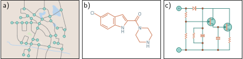

> **图 13.1 现实世界中的图**
> 一些对象，例如 a) 道路网络，b) 分子，和 c) 电路，天然地以图的形式结构化。

---

### 13.1.1 图的类型

图可以以多种方式分类。图13.2a中的社交网络包含**无向边 (undirected edges)**；每对有连接的个体都相互同意成为朋友，因此这种关系没有方向性。相比之下，图13.2b中的引用网络包含**有向边 (directed edges)**。每篇论文引用其他论文，这种关系是单向的。

图13.2c描绘了一个**知识图谱 (knowledge graph)**，它通过定义对象之间的关系来编码一组关于对象的事实。从技术上讲，这是一个**有向异构多重图 (directed heterogeneous multigraph)**。它是**异构的 (heterogeneous)**，因为节点可以代表不同类型的实体（例如，人、国家、公司）。它是**多重图 (multigraph)**，因为任意两个节点之间可以存在多种不同类型的边。

图13.2d中代表飞机的点集可以通过将每个点与其 $K$ 个最近邻连接来转换为图。结果是一个**几何图 (geometric graph)**，其中每个点都关联着一个三维空间中的位置。图13.2e代表了一个**层次图 (hierarchical graph)**。桌子、灯和房间都分别由代表其各自组件邻接关系的图来描述。这三个图本身在另一个表示对象拓扑结构的更大图中充当节点。

所有类型的图都可以使用深度学习进行处理。然而，本章主要关注像图13.2a中的社交网络那样的无向图。

---
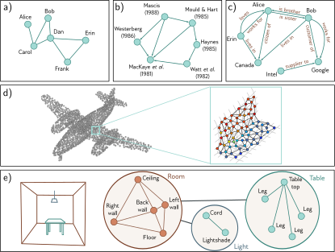

> **图 13.2 图的类型**
> a) 社交网络是一个无向图；人与人之间的连接是对称的。b) 引用网络是一个有向图；一篇出版物引用另一篇，所以关系是不对称的。c) 知识图谱是一个有向异构多重图。节点是异构的，因为它们代表不同类型的对象（人、地点、公司），并且多条边可以代表每个节点之间的不同关系。d) 点集可以通过在邻近点之间形成边来转换为图。每个节点在三维空间中都有一个关联的位置，这被称为几何图（改编自 Hu et al., 2022）。e) 左边的场景可以由一个层次图表示。房间、桌子和灯的拓扑都由图表示。这些图在一个表示对象邻接关系的更大图中形成节点（改编自 Fernández-Madrigal & González, 2002）。

---

## 13.2 图的表示

除了图结构本身，通常还会有信息与每个节点相关联。例如，在社交网络中，每个个体可能由一个表示其兴趣的定长向量来刻画。有时，边也附带有信息。例如，在道路网络的例子中，每条边可能由其长度、车道数、事故频率和速度限制来刻画。节点上的信息存储在**节点嵌入 (node embedding)** 中，边上的信息存储在**边嵌入 (edge embedding)** 中。

更正式地说，一个图由一个包含 $N$ 个节点的集合和 $E$ 条边的集合组成。该图可以通过三个矩阵 $\mathbf{A}, \mathbf{X}$ 和 $\mathbf{E}$ 来编码，分别代表图的结构、节点嵌入和边嵌入（图13.3）。

图的结构由**邻接矩阵 (adjacency matrix)** $\mathbf{A}$ 表示。这是一个 $N \times N$ 的矩阵，如果节点 $m$ 和 $n$ 之间有边，则条目 $(m, n)$ 设置为1，否则为0。对于无向图，这个矩阵总是对称的。对于大型稀疏图，它可以存储为连接列表 $(m, n)$ 以节省内存。

第 $n$ 个节点有一个关联的长度为 $D_X$ 的节点嵌入 $\mathbf{x}^{(n)}$。这些嵌入被连接起来并存储在 $D_X \times N$ 的节点数据矩阵 $\mathbf{X}$ 中。类似地，第 $e$ 条边有一个关联的长度为 $D_E$ 的边嵌入 $\mathbf{e}^{(e)}$。这些边嵌入被收集到 $D_E \times E$ 的矩阵 $\mathbf{E}$ 中。为简单起见，我们最初只考虑带有节点嵌入的图，并在13.9节再回到边嵌入。

---
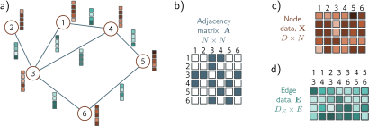

> **图 13.3 图的表示**
> a) 具有六个节点和七条边的示例图。每个节点都有一个关联的长度为五的嵌入（棕色向量）。每条边都有一个关联的长度为四的嵌入（蓝色向量）。这个图可以由三个矩阵表示。b) 邻接矩阵是一个二元矩阵，如果节点 $m$ 连接到节点 $n$，则元素 $(m,n)$ 被设置为1。c) 节点数据矩阵 $\mathbf{X}$ 包含连接起来的节点嵌入。d) 边数据矩阵 $\mathbf{E}$ 包含边嵌入。

---

### 13.2.1 邻接矩阵的性质

邻接矩阵可以用来通过线性代数找到一个节点的邻居。考虑将第 $n$ 个节点的位置编码为一个独热列向量（一个在位置 $n$ 只有一个非零条目，该条目为1的向量）。当我们用邻接矩阵左乘这个向量时，它会提取邻接矩阵的第 $n$ 列，并返回一个在邻居位置上为1的向量（即，我们可以从第 $n$ 个节点一步到达的所有地方）。如果我们重复这个过程（即再次乘以 $\mathbf{A}$），得到的向量将包含从节点 $n$ 到每个节点的长度为2的路径数量（图13.4d-f）。

通常，如果我们将邻接矩阵自乘到 $L$ 次幂，$\mathbf{A}^L$ 在位置 $(m, n)$ 的条目包含了从节点 $m$ 到节点 $n$ 的长度为 $L$ 的唯一**漫步 (walks)** 的数量（图13.4a-c）。这与唯一**路径 (paths)** 的数量不同，因为漫步包含了多次访问同一节点的路线。尽管如此，$\mathbf{A}^L$ 仍然包含了关于图连通性的有价值的信息；位置 $(m, n)$ 上的一个非零条目表明从 $m$ 到 $n$ 的距离必须小于或等于 $L$。参考：Problems 13.1-13.2, Problems 13.3-13.4, Notebook 13.1 Encoding graphs

### 13.2.2 节点索引的置换

图中的节点索引是任意的；对节点索引进行置换会导致节点数据矩阵 $\mathbf{X}$ 的列发生置换，以及邻接矩阵 $\mathbf{A}$ 的行和列都发生置换。然而，底层的图是保持不变的（图13.5）。这与图像形成对比，在图像中置换像素会创建一幅不同的图像；也与文本不同，在文本中置换单词会创建一个不同的句子。

交换节点索引的操作可以用一个**置换矩阵 (permutation matrix)** $\mathbf{P}$ 来数学地表示。这是一个在每行每列中只有一个条目为1，其余值都为0的矩阵。当置换矩阵的位置 $(m, n)$ 为1时，表示节点 $m$ 在置换后将成为节点 $n$。为了从一个索引映射到另一个，我们使用以下操作：

$$
\begin{aligned}
\mathbf{X}' &= \mathbf{X}\mathbf{P} \\
\mathbf{A}' &= \mathbf{P}^T \mathbf{A} \mathbf{P},
\end{aligned}
\tag{13.1}
$$

其中右乘 $\mathbf{P}$ 会置换列，而左乘 $\mathbf{P}^T$ 会置换行。由此可知，应用于图的任何处理都应该对这些置换不敏感。否则，结果将取决于节点索引的选择。参考：Problem 13.5

---
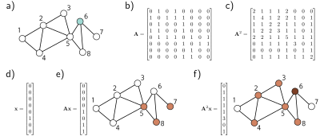

> **图 13.4 邻接矩阵的性质**
> a) 示例图。b) 邻接矩阵 $\mathbf{A}$ 的位置 $(m, n)$ 包含从节点 $m$ 到节点 $n$ 的长度为1的漫步数量。c) 平方邻接矩阵 $\mathbf{A}^2$ 的位置 $(m, n)$ 包含从节点 $m$ 到节点 $n$ 的长度为2的漫步数量。d) 代表节点六的独热向量，该节点在(a)中被高亮显示。e) 当我们用 $\mathbf{A}$ 左乘这个向量时，结果包含了从节点六到每个节点的长度为1的漫步数量；我们可以一步到达节点五、七和八。f) 当我们用 $\mathbf{A}^2$ 左乘这个向量时，得到的向量包含了从节点六到每个节点的长度为2的漫步数量；我们可以在两步内到达节点二、三、四、五和八，并且可以通过三种不同的方式返回到原始节点（通过节点五、七和八）。

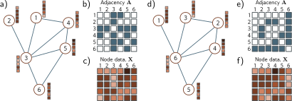

> **图 13.5 节点索引的置换**
> a) 示例图，b) 关联的邻接矩阵和 c) 节点嵌入。d) 索引的（任意）顺序被改变后的同一个图。e) 邻接矩阵和 f) 节点矩阵现在都不同了。因此，任何在图上操作的网络层都应该对节点的排序不敏感。

---

## 13.3 图神经网络、任务和损失函数

图神经网络是一个模型，它接收节点嵌入 $\mathbf{X}$ 和邻接矩阵 $\mathbf{A}$ 作为输入，并通过一系列 $K$ 层来传递它们。节点嵌入在每一层都会被更新，以创建中间的“隐藏”表示 $\mathbf{H}_k$，最后计算输出嵌入 $\mathbf{H}_K$。

在这个网络的开始阶段，输入节点嵌入 $\mathbf{X}$ 的每一列仅包含关于节点自身的信息。在结束时，模型输出 $\mathbf{H}_K$ 的每一列包含了关于该节点及其在图中的上下文信息。这类似于词嵌入通过 Transformer 网络传递。它们开始时代表单词，但结束时代表了单词在句子上下文中的含义。

### 13.3.1 任务和损失函数

在讨论图神经网络模型之前，我们先在13.4节描述这些网络解决的问题类型及其相关的损失函数。监督图问题通常分为三类（图13.6）。

**图级别任务 (Graph-level tasks)**：网络为整个图分配一个标签或估计一个或多个值，同时利用其结构和节点嵌入。例如，我们可能想预测一个分子变成液体的温度（一个回归任务），或者一个分子对人类是否有毒（一个分类任务）。
对于图级别任务，输出节点嵌入被组合（例如，通过平均），得到的向量通过一个线性变换或神经网络映射到一个定长向量。对于回归，结果和真实值之间的不匹配使用最小二乘损失计算。对于二元分类，输出通过一个sigmoid函数，不匹配度使用二元交叉熵损失计算。这里，图属于类别一的概率可能由下式给出：

$$
\text{Pr}(y=1|\mathbf{X}, \mathbf{A}) = \text{sig}[\beta_K + \boldsymbol{\omega}_K \mathbf{H}_K \mathbf{1}/N],
\tag{13.2}
$$

其中标量 $\beta_K$ 和 $1 \times D$ 的向量 $\boldsymbol{\omega}_K$ 是学习的参数。输出嵌入矩阵 $\mathbf{H}_K$ 右乘一个包含1的列向量 $\mathbf{1}$ 的效果是把所有嵌入加在一起，随后除以节点数 $N$ 计算平均值。这被称为**平均池化 (mean pooling)**（见图10.11）。

**节点级别任务 (Node-level tasks)**：网络为图中的每个节点分配一个标签（分类）或一个或多个值（回归），同时使用图结构和节点嵌入。例如，给定一个从类似于图13.2d的三维点云构建的图，目标可能是根据节点是否属于机翼或机身来对节点进行分类。损失函数的定义方式与图级别任务相同，只是现在这是在每个节点 $n$ 上独立完成的：

$$
\text{Pr}(y^{(n)}=1|\mathbf{X}, \mathbf{A}) = \text{sig}[\beta_K + \boldsymbol{\omega}_K \mathbf{h}_K^{(n)}].
\tag{13.3}
$$

**边预测任务 (Edge prediction tasks)**：网络预测节点 $n$ 和 $m$ 之间是否应该存在一条边。例如，在社交网络设置中，网络可能会预测两个人是否认识并喜欢对方，并建议他们连接（如果他们还没有连接的话）。这是一个二元分类任务，其中两个节点嵌入必须被映射到一个表示边存在概率的单一数字。一种可能性是取节点嵌入的点积，并将结果通过一个sigmoid函数来创建概率：

$$
\text{Pr}(y^{(mn)}=1|\mathbf{X}, \mathbf{A}) = \text{sig}[(\mathbf{h}^{(m)})^T \mathbf{h}^{(n)}].
\tag{13.4}
$$

---
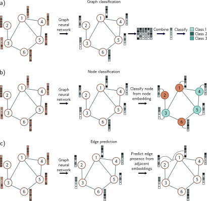

> **图 13.6 图的常见任务**
> 在每种情况下，输入都是一个由其邻接矩阵和节点嵌入表示的图。图神经网络通过一系列层来处理节点嵌入。最后一层的节点嵌入包含了关于节点及其在图中的上下文信息。a) 图分类。节点嵌入被组合（例如，通过平均），然后映射到一个定长向量，该向量通过一个softmax函数来产生类别概率。b) 节点分类。每个节点嵌入被单独用作分类的基础（青色和橙色代表分配的节点类别）。c) 边预测。与边相邻的节点嵌入被组合（例如，通过取点积）以计算一个单一的数字，该数字通过一个sigmoid函数映射，以产生一个缺失边应该存在的概率。

---

## 13.4 图卷积网络

图神经网络有很多类型，但这里我们关注**基于空间的图卷积网络 (spatial-based convolutional graph neural networks)**，或简称**GCNs**。这些模型是卷积的，因为它们通过聚合来自邻近节点的信息来更新每个节点。因此，它们引入了一种**关系归纳偏置 (relational inductive bias)**（即，一种优先考虑来自邻居信息的偏置）。它们是基于空间的，因为它们使用原始的图结构。这与**基于谱的方法 (spectral-based methods)** 形成对比，后者在傅里叶域中应用卷积。

GCN的每一层都是一个函数 $\mathbf{F}[\cdot]$，它带有参数 $\boldsymbol{\phi}$，接收节点嵌入和邻接矩阵，并输出新的节点嵌入。因此，网络可以写成：

$$
\begin{aligned}
\mathbf{H}_1 &= \mathbf{F}[\mathbf{X}, \mathbf{A}, \boldsymbol{\phi}_0] \\
\mathbf{H}_2 &= \mathbf{F}[\mathbf{H}_1, \mathbf{A}, \boldsymbol{\phi}_1] \\
\mathbf{H}_3 &= \mathbf{F}[\mathbf{H}_2, \mathbf{A}, \boldsymbol{\phi}_2] \\
&\vdots \\
\mathbf{H}_K &= \mathbf{F}[\mathbf{H}_{K-1}, \mathbf{A}, \boldsymbol{\phi}_{K-1}],
\end{aligned}
\tag{13.5}
$$

其中 $\mathbf{X}$ 是输入，$\mathbf{A}$ 是邻接矩阵，$\mathbf{H}_k$ 包含第 $k$ 层的修改后的节点嵌入，$\boldsymbol{\phi}_k$ 表示从第 $k$ 层映射到第 $k+1$ 层的参数。

### 13.4.1 等变性与不变性

我们之前注意到，图中节点的索引是任意的，任何对节点索引的置换都不会改变图。因此，任何模型都必须尊重这个属性。由此可知，每一层都必须对节点索引的置换是**等变的 (equivariant)**（见10.1节）。换句话说，如果我们置换节点索引，每个阶段的节点嵌入将以相同的方式被置换。用数学术语来说，如果 $\mathbf{P}$ 是一个置换矩阵，那么我们必须有：

$$
\mathbf{H}_{k+1}\mathbf{P} = \mathbf{F}[\mathbf{H}_k \mathbf{P}, \mathbf{P}^T \mathbf{A} \mathbf{P}, \boldsymbol{\phi}_k].
\tag{13.6}
$$

对于节点分类和边预测任务，输出也应该对节点索引的置换是等变的。然而，对于图级别任务，最后一层会聚合来自整个图的信息，因此输出对节点顺序是**不变的 (invariant)**。事实上，方程13.2的输出层实现了这一点，因为：

$$
y = \text{sig}[\beta_K + \boldsymbol{\omega}_K \mathbf{H}_K \mathbf{1}/N] = \text{sig}[\beta_K + \boldsymbol{\omega}_K (\mathbf{H}_K \mathbf{P}) \mathbf{1}/N],
\tag{13.7}
$$

对于任何置换矩阵 $\mathbf{P}$ 均成立（见问题13.6）。

这反映了图像的情况，其中分割应该对几何变换是等变的，而图像分类应该是 不变的（图10.1）。在这里，卷积层和池化层相对于平移部分地实现了这一点，但没有已知的方法可以为更一般的变换精确地保证这些属性。然而，对于图，可以定义确保对置换的等变性或不变性的网络。

### 13.4.2 参数共享

第十章论证了将全连接网络应用于图像是不明智的，因为这需要网络在每个图像位置上分别学习如何识别一个对象。相反，我们使用了卷积层，它以相同的方式处理图像的每个位置。这减少了参数的数量，并引入了一个归纳偏置，迫使模型以相同的方式对待图像的每个部分。

同样的论点也可以用于图中的节点。我们可以学习一个模型，其中每个节点都有单独的关联参数。然而，现在网络必须独立地学习图中每个位置的连接的含义，并且训练将需要许多具有相同拓扑结构的图。相反，我们构建一个在每个节点上使用相同参数的模型，减少了参数的数量，并在整个图中共享网络在每个节点上学到的东西。

回想一下，卷积（方程10.3）通过取其邻居信息的加权和来更新一个变量。一种思考方式是，每个邻居向感兴趣的变量发送一个**消息 (message)**，该变量聚合这些消息以形成更新。当我们考虑图像时，邻居是来自当前位置周围一个固定大小的正方形区域的像素，因此每个位置的空间关系是相同的。然而，在图中，每个节点可能有不同数量的邻居，并且没有一致的关系；我们没有理由将来自一个“上方”节点的信息与来自一个“下方”节点的信息以不同的方式加权。

### 13.4.3 GCN层示例

这些考虑导致了一个简单的GCN层（图13.7）。在第 $k$ 层的每个节点 $n$ 处，我们通过对邻居节点的节点嵌入 $\mathbf{h}_\cdot$ 求和来聚合信息：

$$
\text{agg}[n, k] = \sum_{m \in \text{ne}[n]} \mathbf{h}_k^{(m)},
\tag{13.8}
$$

其中 $\text{ne}[n]$ 返回节点 $n$ 的邻居索引集合。然后我们对当前节点的嵌入 $\mathbf{h}_k^{(n)}$ 和这个聚合值应用一个线性变换 $\mathbf{\Omega}_k$，加上一个偏置项 $\boldsymbol{\beta}_k$，并将结果通过一个非线性激活函数 $a[\cdot]$，该函数独立地应用于其向量参数的每个成员：

$$
\mathbf{h}_{k+1}^{(n)} = a\left[\boldsymbol{\beta}_k + \mathbf{\Omega}_k^s \mathbf{h}_k^{(n)} + \mathbf{\Omega}_k^a \text{agg}[n, k]\right].
\tag{13.9}
$$

我们可以更简洁地写出这一点，注意到一个矩阵右乘一个向量会返回其列的加权和。邻接矩阵 $\mathbf{A}$ 的第 $n$ 列在邻居的位置上包含1。因此，如果我们将节点嵌入收集到 $D \times N$ 的矩阵 $\mathbf{H}_k$ 中，并右乘邻接矩阵 $\mathbf{A}$，结果的第 $n$ 列就是 $\text{agg}[n, k]$。节点的更新现在是：

$$
\mathbf{H}_{k+1} = a\left[\boldsymbol{\beta}_k \mathbf{1}^T + \mathbf{\Omega}_k^s \mathbf{H}_k + \mathbf{\Omega}_k^a \mathbf{H}_k \mathbf{A}\right] = a\left[\boldsymbol{\beta}_k \mathbf{1}^T + [\mathbf{\Omega}_k^s, \mathbf{\Omega}_k^a] \begin{bmatrix} \mathbf{H}_k \\ \mathbf{H}_k \mathbf{A} \end{bmatrix}\right].
\tag{13.10}
$$

这个公式在实践中被简化了。我们用一个单一的变换 $\mathbf{\Omega}_k$ 替换 $\mathbf{\Omega}_k^s$ 和 $\mathbf{\Omega}_k^a$，并将其应用于当前节点和邻居的总和。这是通过将邻接矩阵 $\mathbf{A}$ 与单位矩阵 $\mathbf{I}$ 相加来实现的，单位矩阵的作用是为每个节点添加一个自连接。然后，该层可以写成：

$$
\mathbf{H}_{k+1} = a\left[\boldsymbol{\beta}_k \mathbf{1}^T + \mathbf{\Omega}_k \mathbf{H}_k (\mathbf{A}+\mathbf{I})\right].
$$

其中 $\mathbf{1}$ 是一个包含1的 $N \times 1$ 向量。这里，非线性激活函数 $a[\cdot]$ 独立地应用于其矩阵参数的每个成员。

这一层满足了设计考虑：它对节点索引的置换是等变的，可以应对任何数量的邻居，利用图结构提供关系归纳偏置，并在整个图中共享参数。参考：Problem 13.7

---
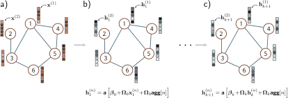

> **图 13.7 简单的图CNN层**
> a) 输入图由结构（体现在图邻接矩阵 $\mathbf{A}$ 中，未显示）和节点嵌入（存储在 $\mathbf{X}$ 的列中）组成。b) 第一个隐藏层中的每个节点都通过 (i) 聚合邻近节点形成一个单一向量，(ii) 对聚合的向量应用一个线性变换 $\mathbf{\Omega}_0^a$，(iii) 对原始节点应用相同的线性变换 $\mathbf{\Omega}_0^s$，(iv) 将它们与一个偏置 $\boldsymbol{\beta}_0$ 相加，最后 (v) 应用一个像ReLU这样的非线性激活函数 $a[\cdot]$ 来更新。c) 这个过程在后续层重复（但每层的参数不同），直到我们产生网络末端的最终嵌入。

---

## 13.5 示例：图分类

我们现在结合这些思想来描述一个将分子分类为有毒或无害的网络。网络输入是邻接矩阵和节点嵌入矩阵 $\mathbf{X}$。邻接矩阵 $\mathbf{A} \in \mathbb{R}^{N \times N}$ 来自于分子结构。节点嵌入矩阵 $\mathbf{X} \in \mathbb{R}^{118 \times N}$ 的列是独热向量，指示元素周期表中的118个元素中的哪一个存在。换句话说，它们是长度为118的向量，其中除了与相关元素对应的位置为1外，所有位置都为零。节点嵌入可以通过第一个权重矩阵 $\mathbf{\Omega}_0 \in \mathbb{R}^{D \times 118}$ 转换为任意大小 $D$。

网络方程是：

$$
\begin{aligned}
\mathbf{H}_1 &= a[\boldsymbol{\beta}_0 \mathbf{1}^T + \mathbf{\Omega}_0 \mathbf{X}(\mathbf{A}+\mathbf{I})] \\
\mathbf{H}_2 &= a[\boldsymbol{\beta}_1 \mathbf{1}^T + \mathbf{\Omega}_1 \mathbf{H}_1(\mathbf{A}+\mathbf{I})] \\
&\vdots \\
\mathbf{H}_K &= a[\boldsymbol{\beta}_{K-1} \mathbf{1}^T + \mathbf{\Omega}_{K-1} \mathbf{H}_{K-1}(\mathbf{A}+\mathbf{I})] \\
f[\mathbf{X}, \mathbf{A}, \mathbf{\Phi}] &= \text{sig}[\beta_K + \boldsymbol{\omega}_K \mathbf{H}_K \mathbf{1}/N],
\end{aligned}
\tag{13.11}
$$

其中网络输出 $f[\mathbf{X}, \mathbf{A}, \mathbf{\Phi}]$ 是一个决定分子是否有毒的单一概率值（见方程13.2）。参考：Notebook 13.2 Graph classification

### 13.5.1 使用批次进行训练

给定 $I$ 个训练图 $\{\mathbf{X}_i, \mathbf{A}_i\}$ 及其标签 $y_i$，参数 $\mathbf{\Phi} = \{\boldsymbol{\beta}_k, \mathbf{\Omega}_k\}_{k=0}^K$ 可以使用SGD和二元交叉熵损失（方程5.19）来学习。全连接网络、卷积网络和 Transformer 都利用现代硬件的并行性来并发处理一整批训练样本。为此，批次元素被连接成一个更高维的张量（7.4.2节）。

然而，每个图可能有不同数量的节点。因此，矩阵 $\mathbf{X}_i$ 和 $\mathbf{A}_i$ 有不同的大小，没有办法将它们连接成三维张量。
幸运的是，一个简单的技巧允许我们并行处理整个批次。批次中的图被视为一个单一的大图的不相交组件。然后网络可以作为网络方程的单个实例来运行。平均池化仅在单个图上进行，以便为每个图生成一个单一的表示，然后可以将其输入到损失函数中。

## 13.6 归纳式与直推式模型

到目前为止，本书中的所有模型都是**归纳式的 (inductive)**：我们利用一个标记数据的训练集来学习输入和输出之间的关系。然后我们将此应用于新的测试数据。一种思考方式是，我们正在学习一个将输入映射到输出的规则，然后在其他地方应用它。

相比之下，**直推式 (transductive)** 模型同时考虑标记和未标记的数据。它不产生一个规则，而仅仅是为未知输出提供一个标签。这有时被称为**半监督学习 (semi-supervised learning)**。它的优点是可以使用未标记数据中的模式来帮助做出决策。然而，它的缺点是当添加额外的未标记数据时，模型需要重新训练。

这两种问题类型在图中都很常见（图13.8）。有时，我们有很多标记的图，并学习图和标签之间的映射。例如，我们可能有许多分子，每个分子都根据其对人类是否有毒而被标记。我们学习一个将图映射到有毒/无毒标签的规则，然后将此规则应用于新的分子。然而，有时只有一个庞大的图。在科学论文引用的图中，我们可能有一些节点的领域标签（物理、生物学等），并希望标记其余的节点。在这里，训练和测试数据是不可撤销地连接在一起的。

图级别任务仅发生在有训练和测试图的归纳设置中。然而，节点级别任务和边预测任务可以在任一设置中发生。在直推式情况下，损失函数最小化了模型输出和已知真实值之间的不匹配。新的预测是通过运行前向传播并检索真实值未知的结果来计算的。

---
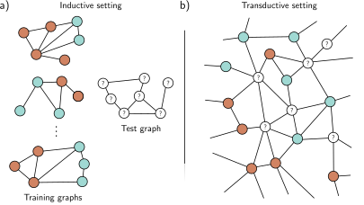

> **图 13.8 归纳式与直推式问题**
> a) 归纳设置中的节点分类任务。我们给定一组 $I$ 个训练图，其中节点标签（橙色和青色）是已知的。训练后，我们给定一个测试图，必须为每个节点分配标签。b) 直推设置中的节点分类。有一个大图，其中一些节点有标签（橙色和青色），其他节点是未知的。我们训练模型以正确预测已知标签，然后检查在未知节点上的预测。

---

## 13.7 示例：节点分类

作为第二个例子，考虑一个在直推设置中的二元节点分类任务。我们从一个有数百万个节点的商业规模的图开始。一些节点有真实的二元标签，目标是标记剩余的未标记节点。网络的主体将与前一个例子相同（方程13.11），但最后一层不同，它产生一个大小为 $1 \times N$ 的输出向量：

$$
\mathbf{f}[\mathbf{X}, \mathbf{A}, \mathbf{\Phi}] = \text{sig}[\boldsymbol{\beta}_K \mathbf{1}^T + \boldsymbol{\omega}_K \mathbf{H}_K],
\tag{13.12}
$$

其中函数 $\text{sig}[\cdot]$ 独立地将其 sigmoid 函数应用于行向量输入的每个元素。像往常一样，我们使用二元交叉熵损失，但现在只在我们知道真实标签 $y$ 的节点上。请注意，方程13.12只是方程13.3中节点分类损失的向量化版本。

训练这个网络会带来两个问题。首先，在后勤上很难训练这么大规模的图神经网络。考虑我们必须在前向传播中存储每个网络层的节点嵌入。这将涉及存储和处理一个比整个图大几倍的结构，这可能不切实际。其次，我们只有一个图，所以如何执行随机梯度下降并不明显。如果只有一个对象，我们如何形成一个批次？

### 13.7.1 选择批次

形成批次的一种方法是在每个训练步骤中选择一个标记节点的随机子集。每个节点都依赖于其在前一层中的邻居。这些邻居又依赖于它们在前一层中的邻居，因此（类似于卷积网络）每个节点都有一个**感受野 (receptive field)**（图13.9）。感受野区域被称为 **k 跳邻域 (k-hop neighborhood)**。因此，我们可以使用构成批次节点 k 跳邻域并集的图来执行一个梯度下降步骤；其余的输入不贡献。

---
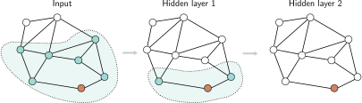

> **图 13.9 图神经网络中的感受野**
> 考虑隐藏层二（右）中的橙色节点。它接收来自隐藏层一（中，阴影区域）中1跳邻域的节点的输入。隐藏层一中的这些节点又接收来自它们的邻居的输入，因此隐藏层二中的橙色节点接收来自2跳邻域（左，阴影区域）中所有输入节点的输入。图的贡献于给定节点的区域等同于卷积神经网络中感受野的概念。

---

不幸的是，如果有很多层并且图是密集连接的，那么每个输入节点可能都在每个输出的感受野内，这可能根本不会减小图的大小。这被称为 **图扩展问题 (graph expansion problem)**。解决这个问题的两种方法是**邻域采样 (neighborhood sampling)** 和**图划分 (graph partitioning)**。
> 
**邻域采样**：输入到节点批次的全图被采样，从而减少了每个网络层的连接（图13.10）。例如，我们可能从批次节点开始，并在前一层中随机采样固定数量的它们的邻居。然后，我们在前一层中随机采样固定数量的它们的邻居，依此类推。图的大小仍然随着每一层而增加，但以一种更可控的方式。这对于每个批次都是重新完成的，因此即使两次抽取相同的批次，贡献的邻居也不同。这也让人联想到dropout（9.3.3节）并增加了一些正则化。

---
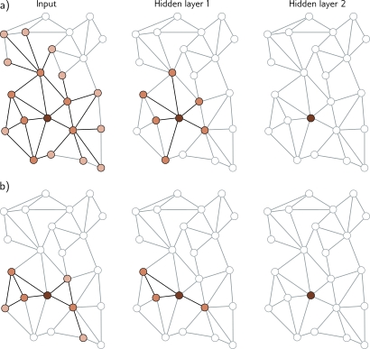

> **图 13.10 邻域采样**
> a) 在大图上形成批次的一种方法是选择输出层中标记节点的子集（这里，第二层右侧只有一个节点），然后向后工作以找到K跳邻域（感受野）中的所有节点。只有这个子图需要用于训练这个批次。不幸的是，如果图是密集连接的，这可能会保留图的很大一部分。b) 一种解决方案是邻域采样。当我们从最后一层向后工作时，我们在前一层中选择一个邻居的子集（这里是三个），以及在前一层中这些邻居的邻居的一个子集。这限制了用于训练批次的图的大小。在所有图中，亮度代表与原始节点的距离。

---

**图划分**：第二种方法是在处理之前将原始图聚类成不相交的节点子集（即，互不连接的小图）（图13.11）。有标准的算法来选择这些子集以最大化内部链接的数量。这些较小的图可以每个都被视为一个批次，或者它们的随机子集可以被组合以形成一个批次（从原始图中恢复它们之间的任何边）。

给定上述形成批次的方法之一，我们现在可以像在归纳设置中一样训练网络参数，根据需要将标记节点划分为训练、测试和验证集；我们有效地将一个直推式问题转换为了一个归纳式问题。为了进行推理，我们基于未知节点的k跳邻域计算它们的预测。与训练不同，这不需要存储中间表示，因此内存效率高得多。

---
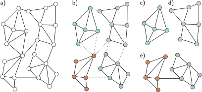

> **图 13.11 图划分**
> a) 输入图。b) 输入图使用一种移除最少边的有原则的方法被划分为更小的子图。c-d) 我们现在可以使用这些子图作为批次在直推设置中进行训练，所以这里有四个可能的批次。e) 或者，我们可以使用子图的组合作为批次，恢复它们之间的边。如果我们使用子图对，这里将有六个可能的批次。

---

## 13.8 图卷积网络的层

在前面的例子中，我们通过将相邻节点的消息与转换后的当前节点相加来组合它们。这是通过将节点嵌入矩阵 $\mathbf{H}$ 右乘邻接矩阵加单位矩阵 $\mathbf{A}+\mathbf{I}$ 来完成的。我们现在考虑处理 (i) 当前嵌入与聚合邻居的组合，以及 (ii) 聚合过程本身的不同方法。

### 13.8.1 组合当前节点和聚合的邻居

在上面的GCN层示例中，我们通过简单地将聚合的邻居 $\mathbf{HA}$ 与当前节点 $\mathbf{H}$ 相加来组合它们：

$$
\mathbf{H}_{k+1} = a[\boldsymbol{\beta}_k\mathbf{1}^T + \mathbf{\Omega}_k\mathbf{H}_k(\mathbf{A}+\mathbf{I})].
\tag{13.13}
$$

在另一个变体中，当前节点在贡献到总和之前乘以一个因子 $(1+\epsilon_k)$，其中 $\epsilon_k$ 是一个为每层学习的、不同的标量：

$$
\mathbf{H}_{k+1} = a[\boldsymbol{\beta}_k\mathbf{1}^T + \mathbf{\Omega}_k\mathbf{H}_k(\mathbf{A}+(1+\epsilon_k)\mathbf{I})].
\tag{13.14}
$$

这被称为**对角增强 (diagonal enhancement)**。一个相关的变体对当前节点应用一个不同的线性变换 $\mathbf{\Psi}_k$：

$$
\begin{aligned}
\mathbf{H}_{k+1} &= a\left[\boldsymbol{\beta}_k\mathbf{1}^T + \mathbf{\Omega}_k\mathbf{H}_k\mathbf{A} + \mathbf{\Psi}_k\mathbf{H}_k\right] \\ &= a\left[\boldsymbol{\beta}_k\mathbf{1}^T + [\mathbf{\Omega}_k, \mathbf{\Psi}_k] \begin{bmatrix} \mathbf{H}_k\mathbf{A} \\ \mathbf{H}_k \end{bmatrix} \right] \\ &= a\left[\boldsymbol{\beta}_k\mathbf{1}^T + \mathbf{\Omega}'_k \begin{bmatrix} \mathbf{H}_k\mathbf{A} \\ \mathbf{H}_k \end{bmatrix} \right], \end{aligned}
\tag{13.15}
$$

其中我们在第三行中定义了 $\mathbf{\Omega}'_k = [\mathbf{\Omega}_k, \mathbf{\Psi}_k]$。

### 13.8.2 残差连接

通过残差连接，来自邻居的聚合表示在与当前节点求和或拼接之前，被转换并通过激活函数。对于后一种情况，相关的网络方程是：

$$
\mathbf{H}_{k+1} = \begin{bmatrix} a[\boldsymbol{\beta}_k\mathbf{1}^T + \mathbf{\Omega}_k\mathbf{H}_k\mathbf{A}] \\ \mathbf{H}_k \end{bmatrix}.
\tag{13.16}
$$

### 13.8.3 均值聚合

上述方法通过对节点嵌入求和来聚合邻居。然而，以不同方式组合嵌入是可能的。有时取邻居的平均值比求和更好；如果嵌入信息更重要而结构信息次要，这可能更优，因为邻域贡献的量级将不依赖于邻居的数量：

$$
\text{agg}[n] = \frac{1}{|\text{ne}[n]|} \sum_{m \in \text{ne}[n]} \mathbf{h}_m,
\tag{13.17}
$$

其中，如前所述，$\text{ne}[n]$ 表示包含第 $n$ 个节点邻居索引的集合。方程13.17可以通过引入对角的 $N \times N$ **度矩阵 (degree matrix)** $\mathbf{D}$ 来方便地以矩阵形式计算。该矩阵的每个非零元素包含关联节点的邻居数量。由此可知，逆矩阵 $\mathbf{D}^{-1}$ 中的每个对角元素包含我们需要用来计算平均值的分母。新的GCN层可以写成：

$$
\mathbf{H}_{k+1} = a[\boldsymbol{\beta}_k\mathbf{1}^T + \mathbf{\Omega}_k\mathbf{H}_k(\mathbf{A}\mathbf{D}^{-1} + \mathbf{I})].
\tag{13.18}
$$

### 13.8.4 Kipf 归一化

基于均值聚合的图神经网络有很多变体。有时，当前节点与它的邻居一起被包含在均值计算中，而不是被分开处理。在**Kipf归一化**中，节点表示的总和被归一化为：

$$
\text{agg}[n] = \sum_{m \in \text{ne}[n]} \frac{\mathbf{h}_m}{\sqrt{|\text{ne}[n]||\text{ne}[m]|}},
\tag{13.19}
$$

其逻辑是，来自具有非常大量邻居的节点的信息应该被降权，因为有很多连接，它们提供的独特信息较少。这也可以用度矩阵以矩阵形式表示：

$$
\mathbf{H}_{k+1} = a[\boldsymbol{\beta}_k\mathbf{1}^T + \mathbf{\Omega}_k\mathbf{H}_k(\mathbf{D}^{-1/2}\mathbf{A}\mathbf{D}^{-1/2} + \mathbf{I})].
\tag{13.20}
$$

### 13.8.5 最大池化聚合

另一种对置换不变的操作是计算一组对象的最大值。**最大池化聚合 (max pooling aggregation)** 算子是：

$$
\text{agg}[n] = \max_{m \in \text{ne}[n]}[\mathbf{h}_m],
\tag{13.21}
$$

其中算子 $\max[\cdot]$ 返回作为当前节点 $n$ 邻居的向量 $\mathbf{h}_m$ 的逐元素最大值。

### 13.8.6 通过注意力进行聚合

到目前为止讨论的聚合方法要么平等地加权邻居的贡献，要么以一种依赖于图拓扑结构的方式加权。相反，在 **图注意力层 (graph attention layers)** 中，权重取决于节点上的数据。一个线性变换被应用于当前节点嵌入，以便：
> 
$$
\mathbf{H}'_k = \boldsymbol{\beta}_k\mathbf{1}^T + \mathbf{\Omega}_k\mathbf{H}_k.
\tag{13.22}
$$

然后，每个转换后的节点嵌入 $\mathbf{h}'_m$ 与转换后的节点嵌入 $\mathbf{h}'_n$ 的相似度 $s_{mn}$ 是通过连接这对，与一个学习参数的列向量 $\boldsymbol{\phi}_k$ 取点积，并应用一个激活函数来计算的：

$$
s_{mn} = a\left[\boldsymbol{\phi}_k^T \begin{bmatrix} \mathbf{h}'_m \\ \mathbf{h}'_n \end{bmatrix} \right].
\tag{13.23}
$$

这些变量存储在一个 $N \times N$ 的矩阵 $\mathbf{S}$ 中，其中每个元素代表每个节点对所有其他节点的相似度。与点积自注意力一样，贡献到每个输出嵌入的注意力权重使用softmax操作被归一化为正数且总和为一。然而，只应有那些对应于当前节点及其邻居的值做出贡献。注意力权重被应用于转换后的嵌入：

$$
\mathbf{H}_{k+1} = a[\mathbf{H}'_k \cdot \text{Softmask}[\mathbf{S}, \mathbf{A}+\mathbf{I}]],
\tag{13.24}
$$

其中 $a[\cdot]$ 是第二个激活函数。函数 $\text{Softmask}[\cdot, \cdot]$ 通过对其第一个参数 $\mathbf{S}$ 的每一列分别应用softmax操作来计算注意力值，但仅在将第二个参数 $\mathbf{A}+\mathbf{I}$ 为零的值设置为负无穷之后，因此它们不贡献。这确保了对非邻近节点的注意力为零。

这与 Transformer 中的点积自注意力计算非常相似（见图13.12），只是 (i) 键、查询和值都是相同的，(ii) 相似性的度量是不同的，以及 (iii) 注意力被掩蔽，使得每个节点只关注其自身及其邻居。与 Transformer 一样，该系统可以扩展为使用并行运行并重新组合的多个头。参考：Notebook 13.4 Graph attention, Problem 13.10

---
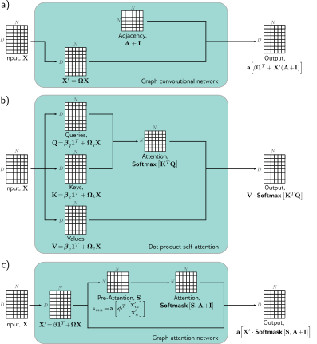

> **图 13.12 图卷积网络、点积注意力与图注意力网络的比较**
> 在每种情况下，机制都将存储在 $D \times N$ 矩阵 $\mathbf{X}$ 中的 $N$ 个大小为 $D$ 的嵌入映射到相同大小的输出。a) 图卷积网络对数据矩阵应用一个线性变换 $\mathbf{X}'=\mathbf{\Omega X}$。然后它计算转换后数据的加权和，其中加权是基于邻接矩阵的。加上一个偏置 $\boldsymbol{\beta}$，结果通过一个激活函数。b) Transformer 中的点积自注意力机制的输出也是转换后输入的加权和，但这次权重通过注意力矩阵取决于数据本身。c) 图注意力网络结合了这两种机制；权重既从数据计算得出，也基于邻接矩阵。

---

## 13.9 边图

到目前为止，我们专注于处理节点嵌入。当它们通过网络时，这些嵌入会演变，以便在网络结束时，它们既代表节点本身，也代表其在图中的上下文。我们现在考虑信息与图的边相关联的情况。

使用**边图 (edge graph)**（也称为**伴随图 (adjoint graph)** 或**线图 (line graph)**），很容易将节点嵌入的机制应用于处理边嵌入。这是一个互补的图，其中原始图中的每条边都成为一个节点，而原始图中具有共同节点的每两条边在新图中创建一条边（图13.13）。通常，一个图可以从其边图中恢复，因此在这两种表示之间进行切换是可能的。参考：Problems 13.11-13.13

为了处理边嵌入，图被转换为其边图。然后我们使用完全相同的技术，在每个新节点处聚合来自其邻居的信息，并将其与当前表示相结合。当节点和边嵌入都存在时，我们可以在两个图之间来回转换。现在有四种可能的更新（节点更新节点，节点更新边，边更新节点，和边更新边），这些可以根据需要交替进行，或者通过微小的修改，节点可以从节点和边同时更新。参考：Problem 13.14

---
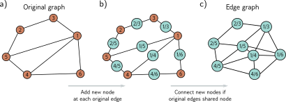

> **图 13.13 边图**
> a) 具有六个节点的图。b) 为了创建边图，我们为每个原始边分配一个节点（青色圆圈），并且 c) 如果它们代表的边在原始图中连接到同一个节点，则连接这些新节点。

---

## 13.10 总结

图由一组节点组成，其中成对的这些节点由边连接。节点和边都可以附加数据，这些分别被称为节点嵌入和边嵌入。许多现实世界的问题可以被框定为图的问题，其中目标是确定整个图的属性、每个节点或边的属性，或图中是否存在额外的边。

图神经网络是应用于图的深度学习模型。由于图中的节点顺序是任意的，图神经网络的层必须对节点索引的置换是等变的。基于空间的卷积网络是一类图神经网络，它聚合来自一个节点的邻居的信息，然后用此来更新节点嵌入。

处理图的一个挑战是它们经常出现在直推设置中，其中只有一个部分标记的图，而不是训练和测试图集。这个图可能非常大，这在训练方面增加了进一步的挑战，并导致了采样和划分算法。边图在原始图中每条边都有一个节点。通过转换为这种表示，图神经网络可以用来更新边嵌入。

### 注释

Sanchez-Lengeling et al. (2021) 和 Daigavane et al. (2021) 提供了关于使用神经网络进行图处理的很好的入门文章。图神经网络研究的最新综述可以在 Zhou et al. (2020a), Wu et al. (2020c), 和 Veličković (2023) 的文章中找到，以及 Hamilton (2020) 和 Ma & Tang (2021) 的书中。GraphEDM (Chami et al., 2020) 将许多现有的图算法统一到一个单一的框架中。在本章中，我们遵循 Bruna et al. (2013) 将图与卷积网络联系起来，但与信念传播 (Dai et al., 2016) 和图同构测试 (Hamilton et al., 2017a) 也有很强的联系。Zhang et al. (2019c) 提供了一篇特别关注图卷积网络的综述。Bronstein et al. (2021) 提供了关于几何深度学习的一般性概述，包括在图上的学习。Loukas (2020) 讨论了图神经网络可以学习什么类型的函数。

**应用**：应用包括图分类 (e.g., Zhang et al., 2018b), 节点分类 (e.g., Kipf & Welling, 2017), 边预测 (e.g., Zhang & Chen, 2018), 图聚类 (e.g., Tsitsulin et al., 2020), 和推荐系统 (e.g., Wu et al., 2023)。节点分类的方法由 Xiao et al. (2022a) 综述，图分类的方法由 Errica et al. (2019) 综述，边预测的方法由 Mutlu et al. (2020) 和 Kumar et al. (2020a) 综述。

**图神经网络**：图神经网络由 Gori et al. (2005) 和 Scarselli et al. (2008) 引入，他们将其表述为递归神经网络的推广。后一个模型使用了迭代更新：
 
$$
\mathbf{h}_n \leftarrow f[\mathbf{x}_n, \{\mathbf{x}_m\}_{m \in \text{ne}[n]}, \{\mathbf{e}_e\}_{e \in \text{nee}[n]}, \{\mathbf{h}_m\}_{m \in \text{ne}[n]}, \boldsymbol{\phi}],
\tag{13.25}
$$

其中每个节点嵌入 $\mathbf{h}_n$ 从初始嵌入 $\mathbf{x}_n$，相邻节点的初始嵌入 $\{\mathbf{x}_m\}_{m \in \text{ne}[n]}$，相邻边的初始嵌入 $\{\mathbf{e}_e\}_{e \in \text{nee}[n]}$，以及相邻节点嵌入 $\{\mathbf{h}_m\}_{m \in \text{ne}[n]}$ 更新。为了收敛，函数 $f[\cdot, \cdot, \cdot, \cdot, \boldsymbol{\phi}]$ 必须是一个**收缩映射 (contraction mapping)**（见图16.9）。如果我们将这个方程在时间上展开 $K$ 步，并允许在每个时间 $K$ 有不同的参数 $\boldsymbol{\phi}_k$，那么方程13.25就变得类似于图卷积网络。后续工作将图神经网络扩展到使用门控循环单元 (Li et al., 2016b) 和长短期记忆网络 (Selsam et al., 2019)。

**谱方法 (Spectral methods)**：Bruna et al. (2013) 在傅里叶域中应用了卷积操作。傅里叶基向量可以通过对图拉普拉斯矩阵 $\mathbf{L}=\mathbf{D}-\mathbf{A}$ 进行特征分解来找到，其中 $\mathbf{D}$ 是度矩阵，$\mathbf{A}$ 是邻接矩阵。这有缺点：滤波器不是局部的，对于大图来说分解的计算成本过高。Henaff et al. (2015) 通过强制傅里叶表示是平滑的（因此空间域是局部的）来解决第一个问题。Defferrard et al. (2016) 引入了ChebNet，它通过使用切比雪夫多项式的递归性质来有效地近似滤波器。这既提供了空间局部化的滤波器，又减少了计算。Kipf & Welling (2017) 将此进一步简化，构建了仅使用1跳邻域的滤波器，从而产生了一个类似于本章描述的空间方法的公式，并在谱方法和空间方法之间架起了一座桥梁。

**空间方法 (Spatial methods)**：谱方法最终基于图拉普拉斯算子，因此如果图发生变化，模型必须重新训练。这个问题刺激了空间方法的发展。Duvenaud et al. (2015) 在空间域中定义了卷积，为每个节点度使用不同的权重矩阵来组合相邻的嵌入。这有一个缺点，即如果一些节点有非常大量的连接，它就会变得不切实际。**扩散卷积神经网络 (Diffusion convolutional neural networks)** (Atwood & Towsley, 2016) 使用归一化邻接矩阵的幂来混合不同尺度的特征，对这些求和，然后逐点乘以权重，并通过一个激活函数来创建节点嵌入。Gilmer et al. (2017) 引入了**消息传递神经网络 (message-passing neural networks)**，它将图上的卷积定义为从空间邻居传播消息。GraphSAGE (Hamilton et al., 2017a) 的“聚合和组合”公式符合这个框架。

**聚合与组合 (Aggregate and combine)**：图卷积网络 (Kipf & Welling, 2017) 取邻居和当前节点的加权平均，然后应用一个线性映射和ReLU。GraphSAGE (Hamilton et al., 2017a) 对每个邻居应用一个神经网络层，取逐元素最大值来聚合。Chiang et al. (2019) 提出了对角增强，其中前一个嵌入比邻居加权更多。Kipf & Welling (2017) 引入了Kipf归一化，它根据当前节点及其邻居的度来归一化邻居嵌入的总和（见方程13.19）。
混合模型网络 (The mixture model network) 或 **MoNet** (Monti et al., 2017) 通过学习一个基于当前节点和邻居度的加权，将此更进了一步。他们将一个伪坐标系与每个节点关联，其中邻居的位置取决于这两个量。然后他们学习一个基于高斯混合的连续函数，并在邻居的伪坐标处采样这个函数以获得权重。通过这种方式，他们可以为具有任意度的节点和邻居学习权重。Pham et al. (2017) 使用节点嵌入和邻居的线性插值，每个维度都有不同的加权组合。这个门控机制的权重是作为数据的函数生成的。

**高阶卷积层 (Higher-order convolutional layers)**：Zhou & Li (2017) 通过用 $\tilde{\mathbf{A}} = \text{Min}[\mathbf{A}^L+\mathbf{I}, \mathbf{1}]$ 替换邻接矩阵 $\mathbf{A}$ 来使用高阶卷积，其中 $L$ 是最大漫步长度，$\mathbf{1}$ 是一个只包含1的矩阵，$\text{Min}[\cdot]$ 取其两个矩阵参数的逐点最小值；现在的更新将任何存在至少一条长度为 $L$ 的漫步的节点的贡献加在一起。Abu-El-Haija et al. (2019) 提出了MixHop，它从邻居（使用邻接矩阵 $\mathbf{A}$）、邻居的邻居（使用 $\mathbf{A}^2$）等计算节点更新。他们在每一层连接这些更新。Lee et al. (2018) 使用几何基序（图中的小型局部几何模式，例如，一个五节点的完全连接团）来组合来自超出直接邻居的节点的信息。

**残差连接 (Residual connections)**：Kipf & Welling (2017) 提出了一个残差连接，其中原始嵌入被添加到更新后的嵌入中。Hamilton et al. (2017b) 将前一个嵌入连接到下一层的输出（见方程13.16）。Rossi et al. (2020) 提出了一个 inception 风格的网络，其中节点嵌入不仅与它的邻居的聚合相连接，还与两步漫步内所有邻居的聚合相连接（通过计算邻接矩阵的幂）。Xu et al. (2018) 引入了**跳跃知识连接 (jump knowledge connections)**，其中每个节点的最终输出由整个网络中的连接节点嵌入组成。Zhang & Meng (2019) 提出了一个称为GResNet的残差嵌入的通用公式，并研究了几种变体，其中添加了前一层的嵌入、输入嵌入，或这些聚合来自其邻居（无需进一步转换）的信息的版本。

**图神经网络中的注意力 (Attention in graph neural networks)**：Veličković et al. (2019) 开发了**图注意力网络 (graph attention network)**（图13.12c）。他们的公式使用多个头，其输出被对称地组合。**门控注意力网络 (Gated Attention Networks)** (Zhang et al., 2018a) 以一种依赖于数据本身的方式加权不同头的输出。**Graph-BERT** (Zhang et al., 2020) 仅使用自注意力进行节点分类；图的结构通过向数据添加位置嵌入来捕获，类似于在 Transformer（第12章）中捕获单词的绝对或相对位置的方式。例如，他们添加了依赖于图中节点之间跳数的位置信息。
 
**置换不变性 (Permutation invariance)**：在DeepSets中，Zaheer et al. (2017) 提出了一个用于处理集合的通用置换不变算子。Janossy pooling (Murphy et al., 2018) 承认许多函数不是置换等变的，而是使用一个置换敏感的函数，并对许多置换的结果进行平均。

**边图 (Edge graphs)**：边图、线图或伴随图的记法可以追溯到 Whitney (1932)。Kearnes et al. (2016) 提出了“编织”层的想法，该层从节点嵌入更新节点嵌入，从边嵌入更新节点嵌入，从边嵌入更新边嵌入，以及从节点嵌入更新边嵌入。然而，在这里，节点-节点和边-边更新不涉及邻居。Monti et al. (2018) 引入了**对偶-原始图CNN (dual-primal graph CNN)**，这是一个在CNN框架中的现代公式，它在原始图和边图中的更新之间交替。

**图神经网络的能力 (Power of graph neural networks)**：Xu et al. (2019) 认为，一个神经网络应该能够区分不同的图结构；如果两个图具有相同的初始节点嵌入但不同的邻接矩阵，将它们映射到相同的输出是不可取的。他们识别了以前的方法如GCNs (Kipf & Welling, 2017) 和GraphSAGE (Hamilton et al., 2017a) 无法区分的图结构。他们开发了一个更强大的架构，其判别能力与**Weisfeiler-Lehman图同构测试** (Weisfeiler & Leman, 1968) 相同，该测试已知可以区分广泛的图。这个结果，即图同构网络，是基于聚合操作：

$$
\mathbf{h}_{k+1}^{(n)} = \text{mlp}\left[(1+\epsilon_k)\mathbf{h}_k^{(n)} + \sum_{m \in \text{ne}[n]} \mathbf{h}_k^{(m)}\right].
\tag{13.26}
$$

**批次 (Batches)**：关于图卷积网络的原始论文 (Kipf & Welling, 2017) 使用了全批量梯度下降。这在训练期间具有与节点数、嵌入大小和层数成正比的内存需求。从那时起，已经提出了三种类型的方法来减少内存需求并在直推设置中为SGD创建批次：节点采样、层采样和子图采样。
**节点采样**方法首先随机选择一个目标节点的子集，然后通过网络向后工作，在每个阶段的感受野中添加节点的子集。GraphSAGE (Hamilton et al., 2017a) 提出了如图13.10b所示的固定数量的邻域样本。Chen et al. (2018b) 引入了一种方差减少技术，但这使用了节点的历史激活，因此仍然有很高的内存需求。PinSAGE (Ying et al., 2018a) 使用从目标节点开始的随机游走，并选择访问次数最高的K个节点。这优先考虑了连接更紧密的祖先。
节点采样仍然需要随着我们通过图向后传递而增加节点数量。**层采样**方法通过在每一层独立地直接采样感受野来解决这个问题。层采样的例子包括FastGCN (Chen et al., 2018a)，自适应采样 (Huang et al., 2018b)，和层依赖的重要性采样 (Zou et al., 2019)。
**子图采样**方法随机抽取子图或将原始图划分为子图。然后将这些作为独立的数据样本进行训练。这些方法的例子包括GraphSAINT (Zeng et al., 2020)，它在训练期间使用随机游走采样了子图，然后在子图上运行一个完整的GCN，同时也校正了minibatch的偏差和方差。Cluster GCN (Chiang et al., 2019) 在预处理阶段将图划分为簇（通过最大化嵌入利用率或批次内边的数量），并随机选择簇来形成minibatch。为了创造更多的随机性，他们训练这些簇的随机子集加上它们之间的边（见图13.11）。
Wolfe et al. (2021) 提出了一种分布式训练方法，它既划分了图，又通过在不同层划分特征空间来并行训练更窄的GCN。关于采样图的更多信息可以在 Rozemberczki et al. (2020) 中找到。

**正则化与归一化 (Regularization and normalization)**：Rong et al. (2020) 提出了DropEdge，它在每次训练迭代中通过掩蔽邻接矩阵来随机地从图中删除边。这可以对整个神经网络进行，也可以在每一层不同地进行（逐层DropEdge）。在某种意义上，这类似于dropout，因为它破坏了数据流中的连接，但也可以被认为是一种增强方法，因为改变图类似于扰动数据。Schlichtkrull et al. (2018), Teru et al. (2020), 和 Veličković et al. (2019) 也提出了从图中随机删除边作为一种类似于dropout的正则化形式。节点采样方法 (Hamilton et al., 2017a; Huang et al., 2018b; Chen et al., 2018a) 也可以被认为是正则化器。Hasanzadeh et al. (2020) 提出了一个名为DropConnect的通用框架，它统一了上述许多方法。
还提出了许多用于图神经网络的归一化方案，包括PairNorm (Zhao & Akoglu, 2020)，权重归一化 (Oono & Suzuki, 2019)，可微组归一化 (Zhou et al., 2020b)，和GraphNorm (Cai et al., 2021)。

**多关系图 (Multi-relational graphs)**：Schlichtkrull et al. (2018) 提出了图卷积网络在多关系图（即具有多种边类型的图）上的一个变体。他们的方案使用不同的参数分别聚合来自每种边类型的信息。如果有很多边类型，参数的数量可能会变得很大，为了解决这个问题，他们建议每种边类型使用一组基参数的不同加权。

**层次化表示与池化 (Hierarchical representations and pooling)**：用于图像分类的CNNs随着网络的进展逐渐减小表示大小但增加通道数。然而，本章中的GCNs用于图分类，直到最后一层都维护整个图，然后组合所有节点来计算最终的预测。Ying et al. (2018b) 提出了DiffPool，它聚类图节点以使图随着深度的增加而逐渐变小，这种方式是可微的，因此可以学习。这可以仅基于图结构进行，也可以自适应地基于图结构和嵌入进行。其他池化方法包括SortPool (Zhang et al., 2018b) 和自注意力图池化 (self-attention graph pooling) (Lee et al., 2019)。图神经网络池化层的比较可以在 Grattarola et al. (2022) 中找到。Gao & Ji (2019) 提出了一个基于U-Net（见图11.10）的图的编码器-解码器结构。

**几何图 (Geometric graphs)**：MoNet模型 (Monti et al., 2017) 可以利用几何信息，因为邻近节点具有明确定义的空间位置。他们学习一个高斯混合函数，并根据邻居的相对坐标从中采样。通过这种方式，他们可以根据邻居的相对位置来加权邻近节点，就像在标准卷积神经网络中一样，即使这些位置不是恒定的。测地线CNN (geodesic CNN) (Masci et al., 2015) 和各向异性CNN (anisotropic CNN) (Boscaini et al., 2016) 都将卷积应用于由三角网格表示的流形（即曲面）。它们在局部将曲面近似为一个平面，并围绕当前节点在该平面上定义一个坐标系。

**过平滑与暂停动画 (Oversmoothing and suspended animation)**：与其他深度学习模型不同，图神经网络直到最近才从增加深度中显著受益。实际上，原始的GCN论文 (Kipf & Welling, 2017) 和GraphSAGE (Hamilton et al., 2017a) 都只使用两层，而 Chiang et al. (2019) 训练了一个五层的Cluster-GCN以在PPI数据集上获得最先进的性能。一种可能的解释是**过平滑 (over-smoothing)** (Li et al., 2018c)；在每一层，网络都从一个更大的邻域中整合信息，这可能最终导致（重要的）局部信息的消解。实际上，(Xu et al., 2018) 证明，一个节点对另一个节点的影响与在K步随机游走中到达该节点的概率成正比。随着K的增加，这接近于图上游走的平稳分布，导致局部邻域被冲淡。
Alon & Yahav (2021) 提出了另一个关于为什么性能不随网络深度提高的解释。他们认为，增加深度允许信息从更长的路径上聚合。然而，在实践中，邻居数量的指数级增长意味着存在一个瓶颈，太多的信息被“挤压”到固定大小的节点嵌入中。
Ying et al. (2018a) 也注意到，当网络深度超过一定限制时，梯度不再向后传播，训练和测试数据的学习都失败了。他们将这种效应称为**暂停动画 (suspended animation)**。这类似于天真地向卷积神经网络添加许多层时的情况（图11.2）。他们提出了一族残差连接，允许训练更深的网络。梯度消失（7.5节）也被 Li et al. (2021b) 确定为一个限制。
最近，使用各种形式的残差连接 (Xu et al., 2018; Li et al., 2020a; Gong et al., 2020; Chen et al., 2020b; Xu et al., 2021a) 训练更深的图神经网络成为可能。Li et al. (2021a) 使用一个可逆网络训练了一个超过1000层的最先进模型，以减少训练的内存需求（见第16章）。

---

***

### 习题

**问题 13.1** 写出图13.14中两个图的邻接矩阵。

**思路与解答：**

为节点编号，例如从顶部开始顺时针。

**图 a**: 节点1-6。
$$
\mathbf{A}_a = \begin{pmatrix}
0 & 1 & 1 & 0 & 1 & 0 \\
1 & 0 & 1 & 0 & 0 & 0 \\
1 & 1 & 0 & 1 & 0 & 0 \\
0 & 0 & 1 & 0 & 1 & 1 \\
1 & 0 & 0 & 1 & 0 & 1 \\
0 & 0 & 0 & 1 & 1 & 0
\end{pmatrix}
$$

**图 b**: 节点1-8。
$$
\mathbf{A}_b = \begin{pmatrix}
0&1&1&0&1&0&1&0 \\
1&0&1&0&0&0&0&0 \\
1&1&0&1&0&0&0&0 \\
0&0&1&0&1&1&0&0 \\
1&0&0&1&0&1&0&1 \\
0&0&0&1&1&0&1&0 \\
1&0&0&0&0&1&0&1 \\
0&0&0&0&1&0&1&0
\end{pmatrix}
$$

**问题 13.2*** 画出与以下邻接矩阵相对应的图。

**思路与解答：**

**对于 $\mathbf{A}_1$**: 这是一个有7个节点的图。根据矩阵中的 '1' 来连接节点。例如，第一行 `[0 1 1 0 0 0 0]` 表示节点1连接到节点2和节点3。以此类推，画出所有连接即可。
**对于 $\mathbf{A}_2$**: 这是一个有7个节点的图。方法同上。

**问题 13.3*** 考虑图13.14中的两个图。从节点1到节点2有多少种方式可以走(i)三步和(ii)七步？

**思路与解答：**

这需要计算邻接矩阵的幂。从节点 $m$ 到节点 $n$ 走 $k$ 步的路径数等于矩阵 $\mathbf{A}^k$ 的第 $(m, n)$ 个元素。

**对于图 a**:
1.  计算 $\mathbf{A}_a^3$ 和 $\mathbf{A}_a^7$。
2.  (i) 找到 $(\mathbf{A}_a^3)_{1,2}$ 的值。
3.  (ii) 找到 $(\mathbf{A}_a^7)_{1,2}$ 的值。

**对于图 b**:
1.  计算 $\mathbf{A}_b^3$ 和 $\mathbf{A}_b^7$。
2.  (i) 找到 $(\mathbf{A}_b^3)_{1,2}$ 的值。
3.  (ii) 找到 $(\mathbf{A}_b^7)_{1,2}$ 的值。
(这需要实际的矩阵计算)

**问题 13.4** 图13.4c中 $\mathbf{A}^2$ 的对角线包含了连接到每个对应节点的边的数量。解释这个现象。

**思路与解答：**

$\mathbf{A}^2$ 的对角线元素 $(\mathbf{A}^2)_{n,n}$ 表示从节点 $n$ 出发，走两步回到节点 $n$ 的路径数量。
一条从 $n$ 出发走两步回到 $n$ 的路径，必然是 $n \to m \to n$ 的形式，其中 $m$ 是 $n$ 的一个邻居。
有多少个这样的邻居 $m$，就有多少条这样的路径。
因此，$(\mathbf{A}^2)_{n,n}$ 的值等于节点 $n$ 的邻居数量，也就是节点 $n$ 的**度 (degree)**。

**问题 13.5** 什么置换矩阵导致了图13.5a-c和图13.5d-f之间的转换？

**思路与解答：**

我们需要找到一个映射关系，将旧索引 {1,2,3,4,5,6} 映射到新索引 {1,3,2,4,6,5}。
置换矩阵 $\mathbf{P}$ 是一个 $6 \times 6$ 的矩阵。如果旧索引 $i$ 变成了新索引 $j$，那么 $\mathbf{P}_{i,j} = 1$。
*   1 -> 1
*   2 -> 3
*   3 -> 2
*   4 -> 4
*   5 -> 6
*   6 -> 5
$$
\mathbf{P} = \begin{pmatrix}
1&0&0&0&0&0 \\
0&0&1&0&0&0 \\
0&1&0&0&0&0 \\
0&0&0&1&0&0 \\
0&0&0&0&0&1 \\
0&0&0&0&1&0
\end{pmatrix}
$$

**问题 13.6** 证明 $\text{sig}[\beta_K + \boldsymbol{\omega}_K \mathbf{H}_K \mathbf{1}] = \text{sig}[\beta_K + \boldsymbol{\omega}_K (\mathbf{H}_K \mathbf{P}) \mathbf{1}]$。

**思路与解答：**

关键在于证明 $\mathbf{H}_K \mathbf{1} = (\mathbf{H}_K \mathbf{P}) \mathbf{1}$。
$\mathbf{P}$ 是一个置换矩阵，$\mathbf{1}$ 是一个全1向量。
$\mathbf{P}\mathbf{1}$ 的结果是什么？$\mathbf{P}$ 的每一行只有一个1，当它乘以全1向量时，每行的结果都是1。所以 $\mathbf{P}\mathbf{1} = \mathbf{1}$。
因此，$(\mathbf{H}_K \mathbf{P}) \mathbf{1} = \mathbf{H}_K (\mathbf{P}\mathbf{1}) = \mathbf{H}_K \mathbf{1}$。
等式两边相等，证明完毕。
这个证明表明，对所有节点的嵌入求和（或求平均）这个操作是**置换不变的**。

**问题 13.7*** 考虑简单的GNN层...

**思路与解答：**

这题原文似乎不完整，但根据上下文，可能是要求证明该层是置换等变的。
**要证明**: $\text{GraphLayer}[\mathbf{H}_k \mathbf{P}, \mathbf{P}^T \mathbf{A} \mathbf{P}] = \text{GraphLayer}[\mathbf{H}_k, \mathbf{A}]\mathbf{P}$
*   RHS: $a[\boldsymbol{\beta}_k \mathbf{1}^T + \mathbf{\Omega}_k \mathbf{H}_k(\mathbf{A}+\mathbf{I})]\mathbf{P}$
*   LHS: $a[\boldsymbol{\beta}_k \mathbf{1}^T + \mathbf{\Omega}_k (\mathbf{H}_k \mathbf{P})(\mathbf{P}^T \mathbf{A} \mathbf{P}+\mathbf{I})]$
    *   $= a[\boldsymbol{\beta}_k \mathbf{1}^T + \mathbf{\Omega}_k (\mathbf{H}_k \mathbf{P} \mathbf{P}^T \mathbf{A} \mathbf{P} + \mathbf{H}_k \mathbf{P})]$
    *   $= a[\boldsymbol{\beta}_k \mathbf{1}^T + \mathbf{\Omega}_k (\mathbf{H}_k \mathbf{A} \mathbf{P} + \mathbf{H}_k \mathbf{P})]$
    *   $= a[(\boldsymbol{\beta}_k \mathbf{1}^T + \mathbf{\Omega}_k \mathbf{H}_k (\mathbf{A}+\mathbf{I}))\mathbf{P}]$ (因为 $\boldsymbol{\beta}_k \mathbf{1}^T \mathbf{P} = \boldsymbol{\beta}_k \mathbf{1}^T$)
*   因为激活函数 $a[\cdot]$ 是逐元素操作的，所以 $a[\mathbf{M}\mathbf{P}] = a[\mathbf{M}]\mathbf{P}$。
*   因此 LHS = RHS，证明了该层是置换等变的。

(注：以上只是其中一种 GNN 层的证明，具体需看题目给出的 `GraphLayer` 定义)

**问题 13.8** 图13.14中每个图的度矩阵D是什么？
**思路与解答:**
度矩阵D是一个对角矩阵，对角线上的元素 $D_{ii}$ 是节点i的度（邻居数量）。

**图 a**:
$$
\mathbf{D}_a = \text{diag}(3, 2, 3, 3, 3, 2)
$$

**图 b**:
$$
\mathbf{D}_b = \text{diag}(4, 2, 3, 3, 4, 3, 3, 2)
$$

**问题 13.9** GraphSAGE的作者提出了一种池化方法...
**思路与解答:**
聚合操作为：$\text{agg}[n] = \frac{1}{1+|\text{ne}[n]|}(\mathbf{h}_n + \sum_{m \in \text{ne}[n]} \mathbf{h}_m)$
用矩阵代数表示：
*   $\sum_{m \in \text{ne}[n]} \mathbf{h}_m$ 可以用 $\mathbf{HA}$ 计算。
*   $|\text{ne}[n]|$ 是度矩阵 $\mathbf{D}$ 的对角线元素。
*   因此，聚合矩阵为 $\mathbf{H}(\mathbf{D}+\mathbf{I})^{-1}(\mathbf{A}+\mathbf{I})$ (这是一个可能的表达形式)。

**问题 13.10*** 设计一个基于点积自注意力的图注意力机制，并以图13.12的风格画出其机制。
**思路与解答:**
1.  **机制设计**:
    *   将节点嵌入 $\mathbf{H}$ 投影到 Q, K, V。
    *   计算注意力分数 $\mathbf{S} = \mathbf{K}^T \mathbf{Q}$。
    *   **关键步骤**：将邻接矩阵 $\mathbf{A}$ 作为掩码，只保留邻居之间的注意力分数。这可以通过 `Softmask(S, A+I)` 实现。
    *   用掩码后的注意力权重 $\mathbf{A}_{attn}$ 加权 V: $\mathbf{H}_{out} = \mathbf{V} \mathbf{A}_{attn}$。
2.  **绘图**:
    *   类似于图13.12c，但Pre-Attention模块 S 的计算方式变为点积 $\mathbf{K}^T \mathbf{Q}$，这部分和图13.12b一样。
    *   Attention模块变为 `Softmask[S, A+I]`。

**问题 13.11*** 画出与图13.15a相关的边图。
**思路与解答:**
1.  图13.15a有6个节点，9条边。
2.  边图将有9个节点。
3.  原始图中共享一个节点的边，在边图中会相连。例如，边(1,2)和边(1,5)在节点1处共享，所以在边图中，代表(1,2)的节点和代表(1,5)的节点是相连的。
4.  根据此规则画出所有连接。

**问题 13.12*** 画出与图13.15b中的边图相对应的节点图。
**思路与解答:**
这是一个逆向过程。边图的每个节点代表原始图的一条边。边图中的边表示原始图中对应的两条边共享一个端点。通过分析边图的连接性，可以重建原始图的拓扑结构。

**问题 13.13** 对于一个通用的无向图，描述其节点图的邻接矩阵与相应边图的邻接矩阵之间的关系。
**思路与解答:**
令 $\mathbf{A}_N$ 为节点图的邻接矩阵，$\mathbf{A}_E$ 为边图的邻接矩阵。
令 $\mathbf{B}$ 为图的关联矩阵 (Incidence Matrix)。
$\mathbf{A}_E$ 的元素 $(\mathbf{A}_E)_{ij}$ 为1，当且仅当边 $i$ 和边 $j$ 共享一个节点。
这可以通过关联矩阵来表达：$\mathbf{A}_E = \mathbf{B}^T\mathbf{B} - 2\mathbf{I}$。

**问题 13.14*** 设计一个更新节点嵌入 $h_n$ 的层，它基于其邻居节点嵌入和邻居边嵌入。
**思路与解答:**
这是一个开放性设计题。一个可行的方案是：
1.  **消息构建**: 对于每个邻居 $m \in \text{ne}[n]$，将邻居节点嵌入 $\mathbf{h}_m$ 和连接它们的边嵌入 $\mathbf{e}_{mn}$ **拼接 (concatenate)** 起来：$[\mathbf{h}_m, \mathbf{e}_{mn}]$。
2.  **消息转换**: 将拼接后的向量通过一个可学习的线性变换（一个神经网络层）$\mathbf{W}_{msg}$，得到消息向量 $\mathbf{m}_{m \to n} = \text{ReLU}(\mathbf{W}_{msg}[\mathbf{h}_m, \mathbf{e}_{mn}])$。
3.  **消息聚合**: 聚合所有来自邻居的消息，例如求和：$\mathbf{agg}_n = \sum_{m \in \text{ne}[n]} \mathbf{m}_{m \to n}$。
4.  **更新**: 将聚合后的消息与当前节点嵌入 $\mathbf{h}_n$ 组合，并通过另一个线性变换 $\mathbf{W}_{update}$ 和激活函数，得到新的节点嵌入 $\mathbf{h}'_n = a(\mathbf{W}_{update}[\mathbf{h}_n, \mathbf{agg}_n])$。
这个设计考虑了边嵌入和节点嵌入可能大小不同的情况（通过拼接和线性变换来统一维度）。
